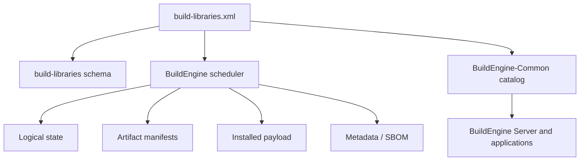
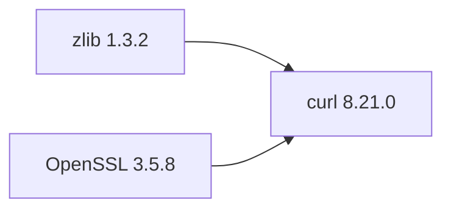
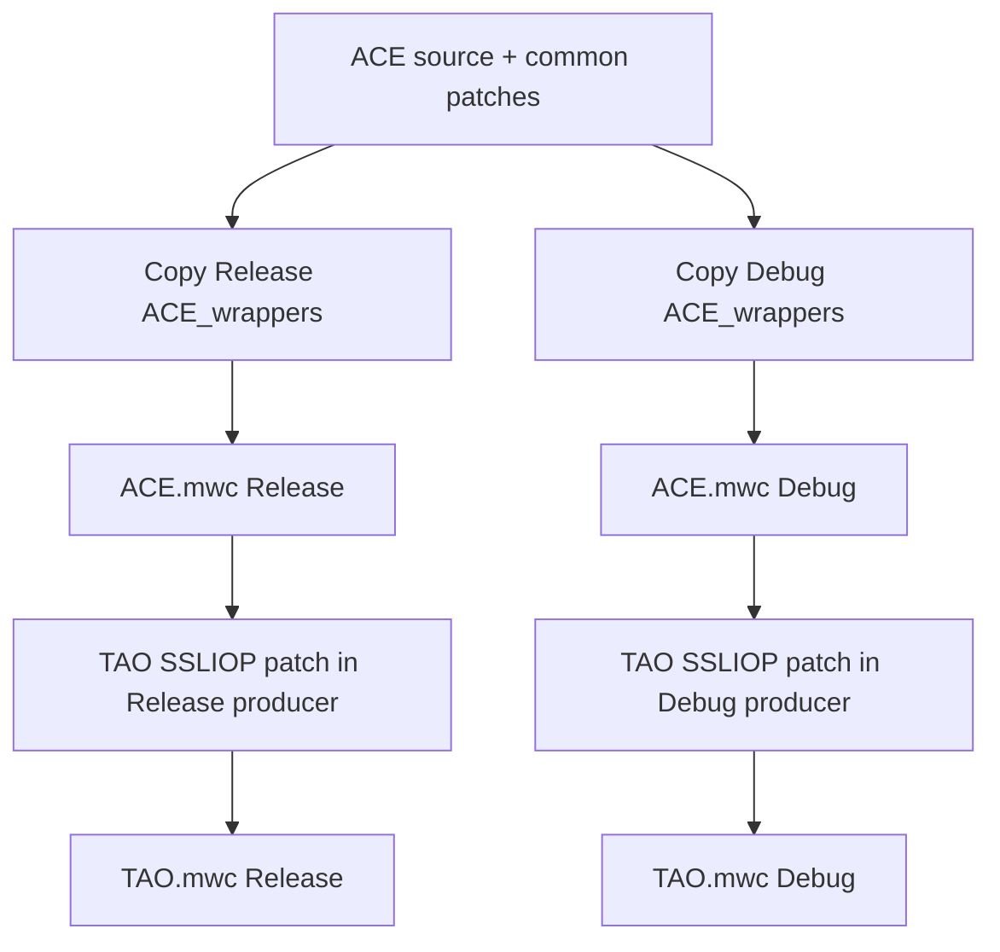
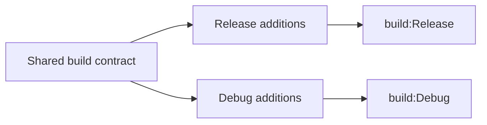
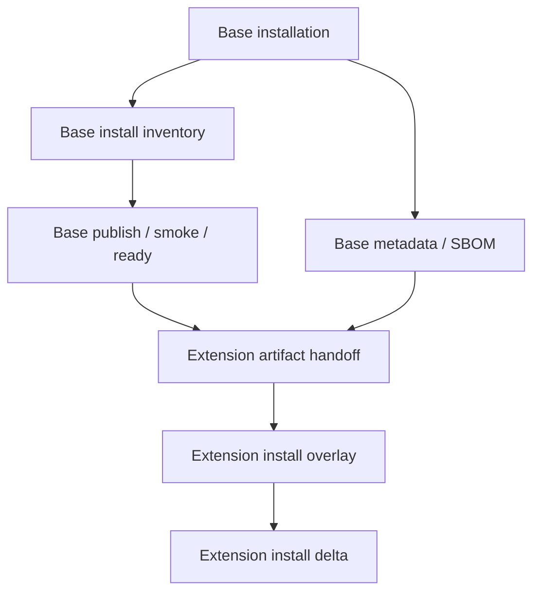
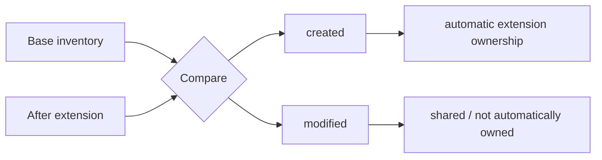
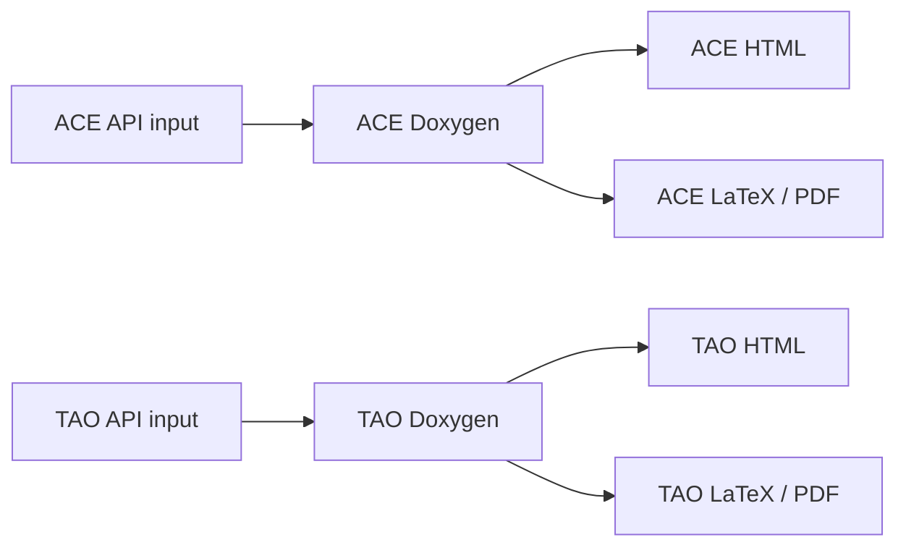
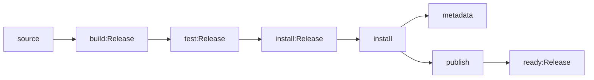

# BuildEngine Contract `build-libraries.xml`

[TOC|Content]

`admin/build-libraries.xml` is the executable declarative contract for the C and C++ libraries managed by BuildEngine. It describes logical library identity, exact versions, dependencies, source acquisition, source and producer preparation, build variants, tests, installation, publication, smoke tests, metadata, security evidence, documentation, and library extensions.

Related documents:

- [Library extensions](library-extensions.md)
- [Integrated third-party libraries](libraries.md)
- [Documentation pipeline](documentation.md)
- [Tool contract](build-tools.md)
- [BuildEngine architecture](buildengine.md)
- [Server](server.md)

The prepared ACE/TAO split uses **schema 15**. Until `admin/ace-tao.xml` has been copied into the production contract, the large active XML can still show schema 14 and the old combined `ace-tao` entry.

## Contract authority

The XML is the source of build knowledge. Runtime code evaluates that contract; it must not contain hidden per-library alternatives.



Common/DLL is the leading shared interpretation. Applications do not reconstruct a second repository model from physical directory scans.

## Basic structure

```xml
<buildLibraries xmlns:xsi="http://www.w3.org/2001/XMLSchema-instance"
                xsi:noNamespaceSchemaLocation="schemas/build-libraries-v15.xsd"
                schemaVersion="15">
   <library id="example"
            version="1.2.3"
            category="network"
            timestamp="2026-09-14T14:38:00Z">
      <dependency library="zlib" version="1.3.2"/>
      <metadata name="Example Library"
                description="One-line statement of the library's purpose."
                supplier="Example Project"/>
      <source>...</source>
      <build>...</build>
      <publish ...>...</publish>
      <smoke .../>
   </library>
</buildLibraries>
```

## `<library>`

| Attribute | Meaning |
| --- | --- |
| `id` | Unique logical library ID used by DAG, state, metadata, documentation and manifests. |
| `version` | Exact logical upstream version. |
| `category` | Stable inventory grouping such as `compression`, `graphics`, `middleware`, `testing`, or `data`. |
| `timestamp` | Library-local contract change token. Change it when that logical library's technical contract changes. |

A logical library normally owns a separate physical package, but this is not mandatory. Upstream software may intentionally share source, producer, or installation areas.

## Metadata and description

```xml
<metadata name="curl"
          description="Client-side URL transfer library with HTTP(S) and related protocol support."
          supplier="curl project"
          homepage="https://curl.se/">
   <license name="curl License" file="COPYING"/>
</metadata>
```

`metadata/@description` is a concise one-line purpose description. It is not a build-status field. It is consumed by metadata/CycloneDX, the Common library catalog, and server presentation.

License declarations remain evidence/override data. Source evidence is preferred where it can be discovered reliably.

## Dependencies

```xml
<dependency library="openssl" version="3.5.8"/>
<dependency library="zlib" version="1.3.2"/>
```

Dependencies define logical graph relationships for ordering, state, package prerequisites, metadata, and SBOM.



Filesystem proximity is not a dependency declaration.

## Library extensions

Schema 15 adds `<extension>` for a logically independent component that deliberately reuses a base library's physical structures.

```xml
<library id="tao" version="4.0.6" category="middleware" timestamp="...">
   <extension library="ace"
              version="8.0.6"
              source="TAO"
              producer="ACE_wrappers"
              install=".">
      <shared path="bin"/>
      <shared path="lib"/>
   </extension>
   ...
</library>
```

The extension edge is the direct ACE relationship; TAO must not repeat ACE as a normal dependency.

| Extension field | Meaning |
| --- | --- |
| `library` | Base logical library ID. |
| `version` | Exact base version. |
| `source` | Extension source subtree below the base source root. |
| `producer` | Shared producer root below the base variant build directory. |
| `install` | Overlay root below the base payload; `.` means the exact base payload. |
| `shared/@path` | Producer subtrees intentionally shared by base and extension. |

See [Library extensions](library-extensions.md) for the full semantics.

## Source contract

Normal source actions can include:

- `download`;
- `extract`;
- `copy`;
- `execute`;
- `target`.

Technical actions remain execution/diagnostic units inside the logical `source` scope. They are not independent persistent state files.

For an extension, source acquisition remains owned by the base. The runtime does not permit the extension to create a second base archive through its own `download`/`extract`.

An extension source block may be used for preparation-only actions where timing is appropriate, but a shared producer introduces an important distinction: changing the base workspace **after** that producer has already been copied does not change the producer. Variant-specific repairs that must affect an existing producer therefore belong in the extension's variant build preparation.

ACE/TAO uses exactly this rule:



The TAO-only SSLIOP patch is therefore applied directly to `{ExtensionProducerRoot}` immediately before `TAO.mwc` for each variant.

## Build variants

Release and Debug are variants of one logical contract. Common parameters live in the common `<build>` node; only differences belong in `<variant>`.



Separate variant directories allow useful parallelism without collisions.

## Tests and validation

Test/validation actions remain enabled unless failures have been investigated and a deliberate contract decision says otherwise. Typical logical scopes are `test:Release`, `test:Debug`, `validation:Release`, and `validation:Debug`.

## Installation

Compiled libraries normally use:

```xml
<install>
   <perVariant>...</perVariant>
   <common>...</common>
</install>
```

`perVariant` handles DLLs/import libraries/tools. `common` handles headers, licenses and other variant-independent files.

Shared/DLL plus import library is the default product shape unless the upstream library is intrinsically header-only or the contract explicitly defines another product.

### Shared physical payloads

A library extension may overlay the base payload. The base must finish consuming its base-only payload before extension installation is released.



The artifact handoff for an extension waits for both base `ready` and base `metadata`. This prevents a shared physical package from being overlaid while the base library still reads it for publication, smoke validation, or metadata generation.

The barrier is generic and does not know the names ACE or TAO.

## Artifact inventory and ownership

BuildEngine records binary evidence after build and installation. The shared manifest model is part of BuildEngine-Common.

Typical tracked types include DLL, EXE, LIB, PDB, BPL, DCP, TDS, and relevant Unix-style library formats.

Each entry stores:

- relative path;
- size;
- SHA-256;
- state/relationship in the generated manifest.

For a normal library this is an inventory. For an extension, the shared producer/payload is compared with the base inventory.



This evidence is also the basis for future safe cleanup. A file from an obsolete version may only be removed automatically if the current file still matches the owned manifest entry. A diverged file is kept and reported.

Artifact jobs use `artifact:*` identities and remain helper/evidence jobs, not a second persistent state hierarchy.

## Publication

`<publish>` creates the consumable SDK view. Publication and ownership are different concepts.

For TAO, a published SDK must be usable and therefore contains the ACE + TAO closure required by consumers. That does **not** make all included ACE files TAO-owned. Artifact manifests remain the ownership evidence.

## Smoke tests

`scope="published"` validates the published SDK. `scope="package"` validates the package/payload directly. TAO uses package scope because the real payload is physically shared with ACE.

The existing TAO consumer smoke continues to prove headers, ACE/TAO import libraries, `tao_idl`, and CORBA usage from the installed shared payload.

## Security metadata

Repository/tag/commit identity and downloaded archive hashes are distinct evidence layers. They should not be conflated.

```xml
<security>
   <repository url="https://github.com/DOCGroup/ACE_TAO.git"
               ref="ACE+TAO-8_0_6"/>
</security>
```

## Documentation

The central `build-documentation.xml` policy and per-library documentation flags form the documentation contract. ACE and TAO now have separate active profiles and separate documentation coordinates.



## Persistent logical state

Persistent state belongs to logical scopes such as:

- `source`;
- `build:Release`, `build:Debug`;
- `test:*`, `validation:*`;
- `install:Release`, `install:Debug`, `install:common`, `install`;
- `publish`;
- `metadata`;
- `doxygen` and collection scopes;
- `ready:*`, `ready`.

Each state stores the library timestamp plus direct upstream references containing upstream library/version/scope/timestamp/`completedAt`.



Technical actions remain observable execution and diagnostic units inside these scopes.

## Prepared ACE/TAO replacement

`admin/ace-tao.xml` is the temporary complete replacement fragment for the current combined `ace-tao` entry.

Activation steps:

1. replace the old `ace-tao` library block with the `ace` and `tao` elements from `ace-tao.xml`;
2. set root `schemaVersion="15"`;
3. set `xsi:noNamespaceSchemaLocation="schemas/build-libraries-v15.xsd"`;
4. add the requested `metadata/@description` values to the remaining libraries;
5. validate the resulting XML;
6. execute the intended BCC64X build/test;
7. delete `ace-tao.xml` after acceptance.

The fragment retains TAO Naming Service, COS Event Service, and RT Event Service.

## BuildEngine variables

Common variables include `{LibraryId}`, `{LibraryVersion}`, `{ProductionRoot}`, `{SourceRoot}`, `{BuildRoot}`, `{InstallRoot}`, `{WorkspaceRoot}`, `{BDS}`, `{Tool:<id>}`, `{ToolVersion:<id>}`, and `{ENV:<name>}`.

Extension contexts additionally provide `{ExtensionLibraryId}`, `{ExtensionLibraryVersion}`, `{ExtensionWorkspace}`, `{ExtensionBaseSourceRoot}`, `{ExtensionSourceRoot}`, `{ExtensionBuildRoot}`, `{ExtensionProducerRoot}`, and `{ExtensionInstallRoot}`.

## Maintenance rules

When changing a library contract:

1. change only that logical library's `timestamp` when its technical contract changes;
2. keep XML, XSD, Runtime, Common, applications and documentation aligned;
3. preserve exact dependency versions;
4. bind local patches to the matching source version;
5. validate XML before the production run;
6. do not substitute another compiler for BCC64X failures;
7. use Mermaid for architecture/process diagrams; text blocks are reserved for literal paths, data formats and filesystem examples;
8. mark implementation **not verified** until the intended BCC64X build/run proves it.
