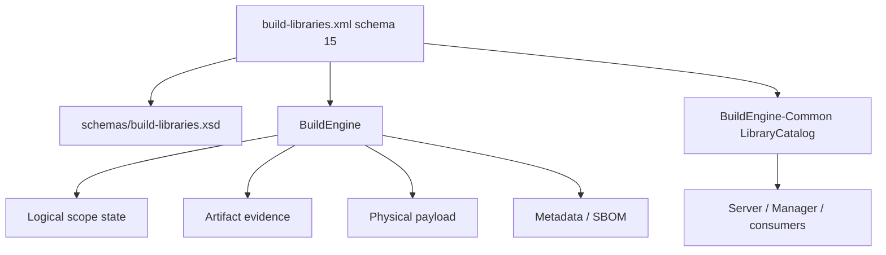
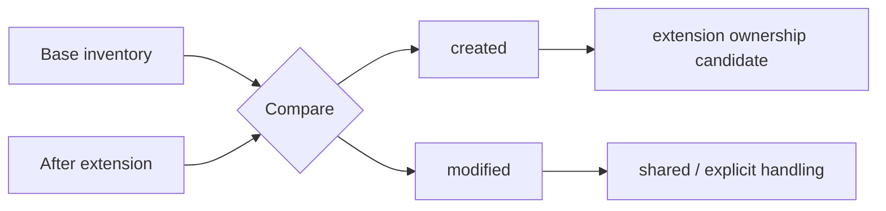

# BuildEngine Contract `build-libraries.xml`

[TOC|Content]

**Status:** current declarative contract as of 15 September 2026. The active `admin/build-libraries.xml` uses **schemaVersion 15** and `schemas/build-libraries.xsd`.

`admin/build-libraries.xml` is the executable declarative contract for C and C++ libraries managed by BuildEngine. It describes logical library identity, exact versions, dependencies, source acquisition/preparation, build variants, tests, installation, publication, smoke tests, metadata/security evidence, documentation and library extensions.

Related documents:

- [Library extensions](library-extensions.md)
- [Documentation pipeline](documentation.md)
- [Integrated libraries](libraries.md)
- [Tool contract](build-tools.md)
- [BuildEngine architecture](buildengine.md)
- [Server](server.md)

## Contract authority

The XML is the source of library/build knowledge. Runtime code evaluates this contract; it must not contain hidden per-library alternatives.



Common/DLL is the leading shared interpretation for logical library/extension repository semantics. Applications do not reconstruct a second catalog from physical package directories.

## Basic structure

```xml
<buildLibraries xmlns:xsi="http://www.w3.org/2001/XMLSchema-instance"
                xsi:noNamespaceSchemaLocation="schemas/build-libraries.xsd"
                schemaVersion="15">
   <library id="example"
            version="1.2.3"
            category="network"
            timestamp="2026-09-15T00:00:00Z">
      <dependency library="zlib" version="1.3.2"/>
      <metadata name="Example Library"
                description="One-line statement of the library purpose."
                supplier="Example Project"/>
      <source>...</source>
      <build>...</build>
      <install>...</install>
      <publish>...</publish>
   </library>
</buildLibraries>
```

## `<library>` identity

| Attribute | Meaning |
| --- | --- |
| `id` | Unique logical library ID used by the Library-FSM, state, metadata, documentation and evidence. |
| `version` | Exact logical upstream version. |
| `category` | Stable inventory grouping. |
| `timestamp` | Logical contract-change token for this library. |

A logical library normally owns a separate physical package, but this is not mandatory. Extension libraries may share source, producer or installation areas.

A physical directory is never itself the logical identity.

## Metadata

`metadata/@description` is a concise one-line purpose description. It is not build status.

Metadata can feed:

- Common library catalog,
- CycloneDX component information,
- Server/Manager presentation,
- generated documentation.

License declarations are evidence/override data; declared upstream license text is not rewritten by BuildEngine.

## Dependencies

```xml
<dependency library="openssl" version="3.5.8"/>
<dependency library="zlib" version="1.3.2"/>
```

Dependencies define logical relationships used by the Library-FSM, persistent scope state, package prerequisites, metadata and SBOM. From `Build` onward the generic runtime rule requires every direct dependency to have completed the same fachlich state before the downstream library can work there.

Filesystem proximity does not create a dependency.

## Library extensions

Schema 15 supports a logically independent component that intentionally reuses a base library's physical structures.

```xml
<library id="tao" version="4.0.6" category="middleware" timestamp="...">
   <extension library="ace"
              version="8.0.6"
              source="TAO"
              producer="ACE_wrappers"
              install=".">
      <shared path="bin"/>
      <shared path="lib"/>
   </extension>
   ...
</library>
```

The extension edge is the direct base relationship and must not be duplicated as an ordinary dependency.

| Field | Meaning |
| --- | --- |
| `library` | exact base logical library ID |
| `version` | exact base version |
| `source` | extension source subtree below base source |
| `producer` | shared producer root below the base variant workspace |
| `install` | overlay root below base payload; `.` means same payload root |
| `shared/@path` | deliberately shared producer areas |

See [Library extensions](library-extensions.md).

## Source contract

Source Actions may include download, extract, copy, execute, target and other generic Actions.

Technical Actions remain execution/diagnostic units inside the logical `source` scope. They are not independent persistent Current-State files.

For an extension, shared source acquisition belongs to the base. An extension must not download/extract a second copy of the same upstream archive.

Variant-specific patches that must affect an already copied shared producer belong to the corresponding producer-preparation/build sequence, not to a late mutation of an unrelated source workspace.

## Build variants

Release, Debug and future configurations are variants of one logical build contract.

Common arguments/environment belong in the common build node. Variant nodes contain only differences.

Separate variant directories permit Release/Debug parallelism without collisions.

Dependency mapping stays variant-correct:

```text
Release -> Release
Debug   -> Debug
```

## Tests and validation

Tests remain enabled unless a technical investigation justifies a deliberate exception.

Typical logical scopes include:

```text
test:Release
test:Debug
validation:Release
validation:Debug
```

## Installation

Compiled libraries typically use variant-specific and common install actions.

Shared DLL + import library is the preferred standard product shape where appropriate.

### Shared extension payloads

Extensions may overlay a base payload. Physical operations need the dependencies/barriers required by the **actual shared resource**, not automatically the strongest global library barrier.

For ACE/TAO this means:

- TAO compilation may proceed once its required ACE producer/artifact prerequisites exist;
- a later ACE global consumer-publish failure does not by itself invalidate the fact that TAO compilation started;
- an extension install/overlay must still not race an operation that is actively reading the same base-only payload.

Do not encode an unconditional `base ready + metadata` rule when only a narrower producer/install evidence dependency is physically required.

## Artifact inventory and ownership

Artifact jobs are Evidence helpers and do not create a second persistent Current-State hierarchy.

The **target contract** for a relevant artifact entry is:

- relative path;
- size;
- SHA-256;
- where needed, relationship/classification such as `present`, `created`, `modified`.

For an extension:



`modified` is not automatically exclusive extension ownership.

### Known current implementation gap

`BuildEngine-Common/src/ArtifactManifest.h` currently stores path and size, but no SHA-256. Same-size content changes are therefore not yet detected correctly.

This implementation gap must be fixed before hash-safe cleanup or authoritative shared-payload ownership can be claimed.

## Publication

`<publish>` creates a consumer view. Publication and ownership are different concepts.

A consumable extension SDK may need files from its base closure, but including a base file in that consumer view does not make the extension its owner.

Publish must consume the central artifact/ownership model.

### Known current implementation gap

Current Publish code still interprets other publish manifests as collision ownership too strongly. Stale publication evidence can block a current producer, especially with shared extension payloads.

Publish manifests are publication Evidence, not an independent ownership authority.

## Smoke tests

Smoke tests validate the intended consumer/package contract. Their scope (`published`, package/payload or another declared contract) must match what is actually being proven.

A shared physical payload does not imply shared logical component identity.

## Security metadata

Repository/tag/commit identity and downloaded archive hashes are distinct evidence layers and remain separate from logical Current-State.

## Documentation

The central `build-documentation.xml` policy controls generated documentation.

A logical Doxygen scope produces HTML and optional LaTeX in one Doxygen run. Consumer publish is not semantically required merely to document an already installed/public API.

For collection libraries such as Boost, the current contract is `1 + N` logical Doxygen scopes:

```text
1 root scope, non-recursive
N first-level module scopes, recursive
```

There is no logical `collection-prepare` scope and no separate logical module-PDF scope.

See [Documentation pipeline](documentation.md).

## Persistent logical state

Persistent state belongs to logical scopes, for example:

```text
source
build:Release
install:Release
install
publish
metadata
doxygen
doxygen:root
doxygen:<module>
ready:Release
ready
```

Canonical state:

```text
timestamp=<library timestamp>
upstream=<library>|<version>|<scope>|<upstream library timestamp>|<upstream completedAt>
...
completedAt=<completion timestamp>
state=completed
```

Fingerprints, technical Action IDs, output hashes and output existence are not Current-State authority.

The active FSM/execution path invalidates a stale scope before its technical job is submitted and commits a new success only after the work, required evidence and expected upstream state are successful.

## Common repository semantics

The XML catalog is consumed by BuildEngine-Common. Extensions can resolve to:

```text
physical payload != logical metadata/SBOM root
```

Known current Common gaps before full extension verification:

- `LibraryExists()` / `VersionExists()` still use physical package paths;
- extension `installed` is inferred too strongly from base payload existence;
- PackageExporter is not yet ownership-safe for shared payloads.

These are Common corrections, not reasons for application-specific workarounds.

## Maintenance rules

When changing a library contract:

1. change only the affected logical library timestamp when its technical contract changes;
2. keep XML, XSD, Runtime, Common, applications and documentation aligned;
3. preserve exact dependency versions;
4. bind local patches to exact source versions;
5. validate XML before production execution;
6. do not substitute another compiler for BCC64X failures;
7. technical Actions do not become persistent State merely because they have IDs;
8. artifact evidence does not become Current-State;
9. physical paths do not define logical identity;
10. mark implementation **not verified** until the intended BCC64X/Common/Server run proves it.

## Current integration gate

The FSM architecture is active. The historical 15 September static no-run gate is no longer the architectural status of this contract.

Verification remains staged: targeted BCC64X runs first, complete Clean-Room evidence as a separate milestone.

For the current BZip2/libarchive transition:

1. build managed `bzip2 1.0.8`;
2. rebuild managed `libarchive 3.8.9` with `ENABLE_BZip2=ON`;
3. refresh the private BuildEngine libarchive runtime;
4. rebuild/relink BuildEngine;
5. verify `[LIBARCHIVE] filter bzip2 : in-proc`;
6. only then restore the pinned Bash `.tar.bz2` tool contract.
