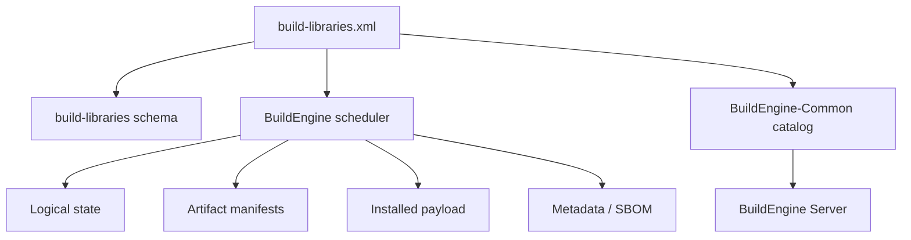
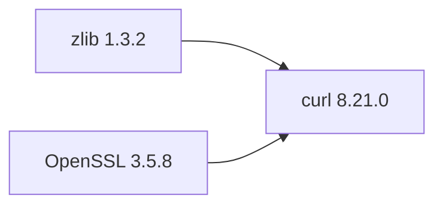
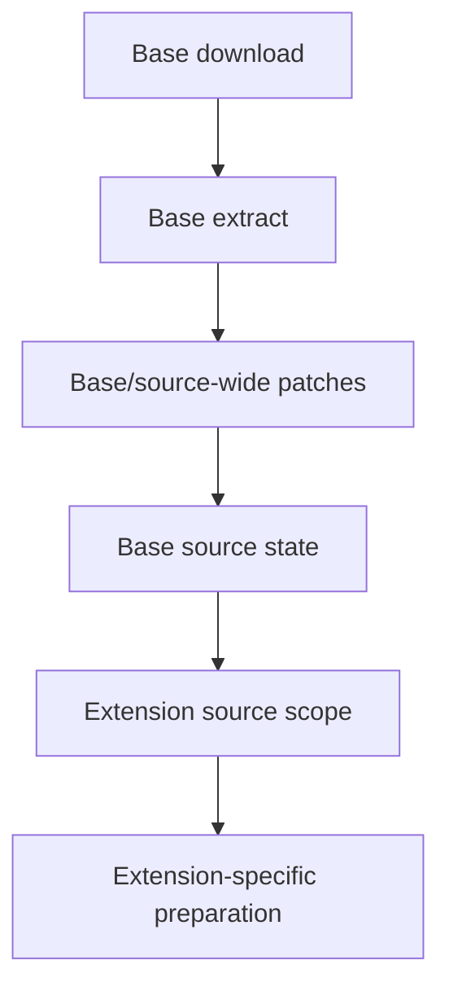
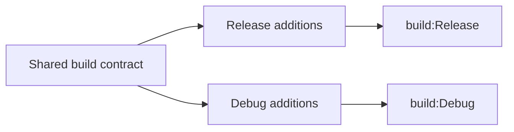
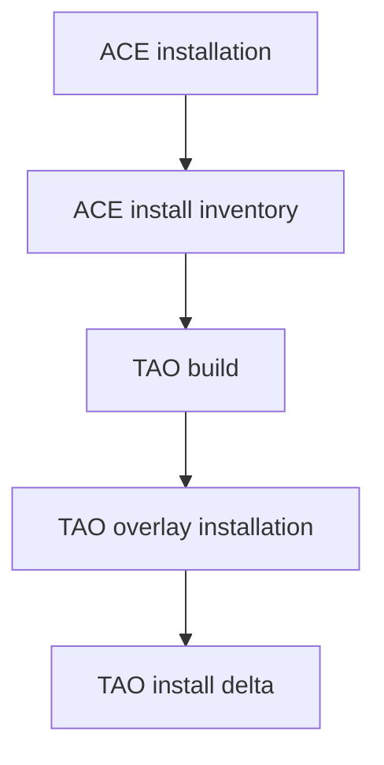
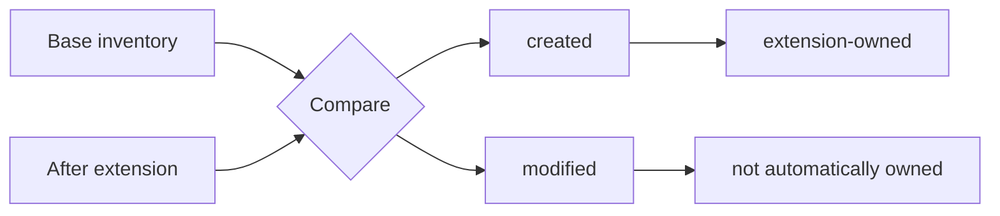
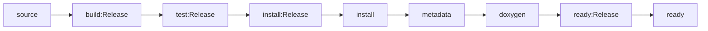
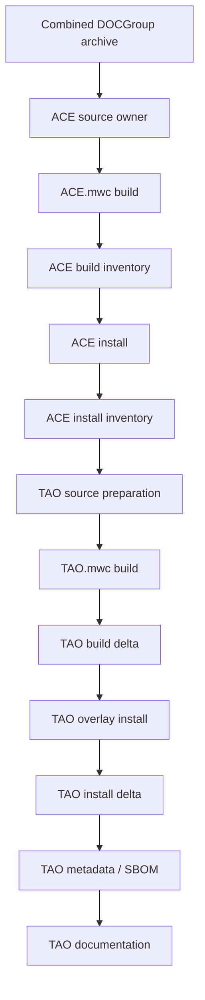

# BuildEngine Contract `build-libraries.xml`

[TOC|Content]

`admin/build-libraries.xml` is the executable declarative contract for the C and C++ libraries managed by BuildEngine. It describes logical library identity, exact versions, dependencies, source acquisition and preparation, build variants, tests, installation, publication, smoke tests, metadata, security evidence, documentation, and library extensions.

Related documents:

- [Library extensions](library-extensions.md)
- [Integrated third-party libraries](libraries.md)
- [Documentation pipeline](documentation.md)
- [Tool contract](build-tools.md)
- [BuildEngine architecture](buildengine.md)
- [Server](server.md)

The prepared ACE/TAO split uses **schema 15**. Until the temporary `admin/ace-tao.xml` fragment has been copied into the production contract, the large production XML can still show schema 14. Activating the split requires both root changes documented in `ace-tao.xml`: `schemaVersion="15"` and `schemas/build-libraries-v15.xsd`.

## Contract authority

The XML contract is the source of build knowledge. The runtime must evaluate this contract rather than contain hidden library-name special cases.



Common/DLL is the leading shared interpretation. Applications consume that interpretation instead of independently scanning the filesystem and constructing a competing view of logical libraries.

## Basic structure

```xml
<buildLibraries xmlns:xsi="http://www.w3.org/2001/XMLSchema-instance"
                xsi:noNamespaceSchemaLocation="schemas/build-libraries-v15.xsd"
                schemaVersion="15">
   <library id="example"
            version="1.2.3"
            category="network"
            timestamp="2026-09-14T14:38:00Z">
      <dependency library="zlib" version="1.3.2"/>
      <metadata name="Example Library"
                description="One-line statement of the library's purpose."
                supplier="Example Project"
                homepage="https://example.invalid/"/>
      <security>...</security>
      <source>...</source>
      <build>...</build>
      <publish ...>...</publish>
      <smoke .../>
   </library>
</buildLibraries>
```

## `<library>`

| Attribute | Meaning |
| --- | --- |
| `id` | Unique logical BuildEngine library ID. Used by dependencies, scheduler jobs, persistent state, metadata, documentation, and artifact manifests. |
| `version` | Exact logical upstream version. |
| `category` | Stable inventory grouping such as `compression`, `graphics`, `middleware`, `testing`, or `data`. |
| `timestamp` | Library-local contract change token. Change it when the technical contract of this logical library changes. |

A logical library normally owns its own physical workspace and package directory, but that is not a requirement. Upstream software may intentionally share a producer or installation layout. The XML must model that fact rather than fabricate a separation that upstream does not have.

## Metadata

```xml
<metadata name="curl"
          description="Client-side URL transfer library with HTTP(S) and related protocol support."
          supplier="curl project"
          homepage="https://curl.se/">
   <license name="curl License" file="COPYING"/>
</metadata>
```

| Field | Purpose |
| --- | --- |
| `name` | Human-readable display name. |
| `description` | Concise one-line purpose description. It says what the library is, not how BuildEngine integrates it. |
| `category` | Optional metadata-level grouping; `library/@category` remains the contract-wide inventory category. |
| `supplier` | Upstream project/vendor/organization. |
| `homepage` | Canonical upstream project page. |
| `license/@name` | Human-readable license name. |
| `license/@spdx` | SPDX identifier where unambiguous. |
| `license/@licensor` | Optional licensor. |
| `license/@file` | License evidence file. |
| `license/summary` | Optional short evidence/summary text. |

`metadata/@description` is consumed by the shared library catalog, server UI, generated documentation, package metadata, and CycloneDX component description where available.

## Dependencies

```xml
<dependency library="openssl" version="3.5.8"/>
<dependency library="zlib" version="1.3.2"/>
```

Dependencies define explicit logical relationships. They drive DAG ordering, package prerequisites, metadata, and SBOM relationships. Host filesystem discovery is not a substitute for a declared dependency.



The scheduler DAG also provides the direct upstream identities used by persistent logical state.

## Library extensions

Schema 15 introduces `<extension>` for a logically independent component that deliberately reuses a base library's source, producer, and optionally payload.

```xml
<library id="tao" version="4.0.6" category="middleware" timestamp="...">
   <extension library="ace"
              version="8.0.6"
              source="TAO"
              producer="ACE_wrappers"
              install=".">
      <shared path="bin"/>
      <shared path="lib"/>
   </extension>
   ...
</library>
```

The extension edge already represents the direct base dependency. The extension must not repeat the same base as a normal `<dependency>`.

### Extension fields

| Field | Meaning |
| --- | --- |
| `library` | Base logical library ID. |
| `version` | Exact required base version. |
| `source` | Extension source subtree below the base source root. |
| `producer` | Producer root below the variant-specific base build directory. |
| `install` | Overlay root below the base payload; `.` means the base package root. |
| `shared/@path` | Producer subtree intentionally shared by base and extension. |

For the complete runtime semantics see [Library extensions](library-extensions.md).

## Source contract

Normal libraries own source acquisition. Supported technical source actions are:

- `download`;
- `extract`;
- `copy`;
- `execute`;
- `target`.

Actions may carry technical DAG metadata with `id` and `dependsOn`. Technical actions are execution/diagnostic units inside one logical `source` scope; they do not become independent persistent state files.

### Extension source preparation

An extension is different. It may omit `<source>` or use `<source>` only to prepare its component subtree after base extraction.

Allowed extension source actions:

- `copy`;
- `execute`;
- `target`.

Disallowed extension source actions:

- `download`;
- `extract`.



ACE/TAO uses this distinction: ACE owns the combined archive and source-wide BCC64X repairs; TAO owns its SSLIOP-specific preparation.

## `<download>`

```xml
<download url="https://example.invalid/example-{LibraryVersion}.tar.xz"
          archive="example-{LibraryVersion}.tar.xz"
          sha256="..."/>
```

A stable upstream SHA-256 should be supplied whenever possible.

## `<extract>`

```xml
<extract format="libarchive" root="example-{LibraryVersion}">
   <require path="CMakeLists.txt"/>
</extract>
```

Supported archive formats are `zip`, `gzip`, `gz`, and `libarchive`. `<require>` proves expected source layout immediately after extraction.

## `<copy>`

```xml
<copy source="..." target="..." recursive="true" overwrite="true">
   <include pattern="**/*.h"/>
   <exclude pattern="**/test/**"/>
</copy>
```

Important attributes include `recursive`, `overwrite`, `flatten`, `cleanTarget`, `singleFile`, `preserveCurrentArtifact`, `test`, and `phase`.

A critical extension rule is that shared physical targets must not be indiscriminately cleaned. `cleanTarget="true"` is appropriate only when the logical library exclusively owns the target being cleaned.

## `<execute>` and `<target>`

`execute` describes a generic process invocation. `target` is the declarative adapter for known driver families such as CMake, Meson, Perl, GNU Make, Python, and BMake.

```xml
<target name="build"
        type="bmake"
        executable="{Tool:embarcadero-make}"
        workingDirectory="{Build}">
   <argument value="-f"/>
   <argument value="Makefile.bmak"/>
</target>
```

The contract holds arguments, environment, temporary files, and success criteria. The C++ runtime evaluates them; it must not hide equivalent library-specific command lines.

## Build and variants

Common arguments belong on the shared `<build>` level. A `<variant>` contains differences only.

```xml
<build>
   <environment name="CC" value="{Tool:bcc64x}"/>
   <argument value="...common..."/>

   <target .../>

   <variant name="Release">
      <argument value="...release..."/>
   </variant>
   <variant name="Debug">
      <argument value="...debug..."/>
   </variant>

   <install>
      <perVariant>...</perVariant>
      <common>...</common>
   </install>
</build>
```

Release and Debug are variants of one logical contract, not two unrelated build contracts. Their physical directories must remain collision-free so independent variants can run in parallel.



### `testsAffectBuild`

`testsAffectBuild="true"` is used only if the enabled/disabled test setting changes the generated build itself. Otherwise tests remain downstream logical test/validation scopes.

## Test and validation phases

Actions can be assigned to `test` or `validation` via `test="true"` and `phase="test|validation"`. Tests are not disabled merely because they fail. The failure is investigated first.

Logical examples:

- `test:Release`;
- `test:Debug`;
- `validation:Release`;
- `validation:Debug`.

## Installation

Compiled libraries normally use:

```xml
<install>
   <perVariant>...</perVariant>
   <common>...</common>
</install>
```

`perVariant` handles configuration-specific DLLs/import libraries/tools. `common` handles headers, licenses, and other configuration-independent files.

Header-only libraries may use a direct `<install>` instead of `<build>`.

Shared/DLL plus import library is the default BuildEngine product shape unless the library is intrinsically header-only or a different shape is explicitly documented.

## Shared physical installations

Logical ownership does not require a physical sibling package. TAO overlays the ACE payload because this matches the upstream product shape.



Common resolves logical metadata independently from the physical payload. The server and other applications must use that Common contract instead of scanning only `install/packages/<id>/<version>`.

## Artifact inventory

Every compiled library can produce build/install artifact inventories. Extensions produce deltas relative to the base inventory.

The inventory is intended for:

- evidence of produced binaries;
- extension ownership;
- detecting changed base files;
- future safe removal of files belonging to an obsolete version;
- preventing blind cleanup of shared directories.

Each entry records relative path, size, and SHA-256. Typical binary extensions include DLL, EXE, LIB, PDB, BPL, DCP, TDS, and Unix-style library formats where relevant.



Artifact helper jobs use `artifact:*` identities but do not create a new persistent state model.

## Publication

`<publish>` builds the consumable SDK view from installed content.

```xml
<publish root="Win64x"
         configuration="Release"
         consumer="{BuildFileDir}\cmake\consumer">
   <tree source="include" target="include"/>
   <files source="lib\win64\{Configuration}" target="lib" extensions=".lib"/>
   <files source="bin\win64\{Configuration}" target="bin" extensions=".dll;.pdb"/>
</publish>
```

Supported operations are `tree`, `files`, and `cmake`. `optional="true"` is only for genuinely optional content, not for masking missing required artifacts.

Publication has its own manifest of published files. This manifest is separate from the new producer/install artifact inventory: publication describes the consumable SDK view; artifact inventory records binary evidence and ownership around build/install boundaries.

## Smoke tests

```xml
<smoke id="consumer"
       scope="package"
       source="smokes\example\consumer"
       configuration="Release"
       cmake="{Tool:cmake}"
       ninja="{Tool:ninja}"
       toolchain="..."
       executable="example-consumer.exe"/>
```

`scope="published"` validates the published SDK. `scope="package"` validates the package/payload directly. Extension packages that intentionally share the base physical payload can use package scope without inventing a sibling physical package.

The TAO consumer smoke continues to validate ACE + TAO together, including `tao_idl` and the required CORBA libraries.

## Security metadata

```xml
<security>
   <repository url="https://github.com/DOCGroup/ACE_TAO.git"
               ref="ACE+TAO-8_0_6"/>
</security>
```

Repository identity/tag/commit and downloaded archive hash are separate evidence layers. They should not be conflated.

## Documentation controls

The optional per-library `<documentation>` element in `build-libraries.xml` coexists with the central `build-documentation.xml` policy. Central Doxygen generation is the primary API documentation pipeline.

When LaTeX is enabled, HTML and LaTeX are generated by the same Doxygen pass. MiKTeX receives the generated LaTeX tree afterward and builds the isolated PDF.

ACE and TAO are separate logical documentation products even though they originate from the same archive and share the physical producer.

## Persistent logical state

BuildEngine persists state per logical scope, not per technical action. Typical scopes include:

- `source`;
- `build:Release`, `build:Debug`;
- `test:*`, `validation:*`;
- `install:Release`, `install:Debug`, `install:common`, `install`;
- `publish`;
- `metadata`;
- `doxygen`;
- `ready:*`, `ready`.

Each state stores the library timestamp plus direct upstream references containing upstream library/version/scope/timestamp/`completedAt`. If either the local contract token or a direct upstream reference changes, the scope is not current.



Technical Actions remain observable execution and diagnostic units inside these scopes.

## ACE / TAO prepared replacement

The temporary `admin/ace-tao.xml` fragment contains the complete two-library replacement for the current combined `ace-tao` block.

The prepared sequence is:



The block retains the Naming Service, COS Event Service, and RT Event Service builds. TAO never removes or recreates the shared ACE producer tree.

## BuildEngine variables

Common variables include:

```text
{LibraryId}
{LibraryVersion}
{ProductionRoot}
{SourceRoot}
{BuildRoot}
{InstallRoot}
{WorkspaceRoot}
{BDS}
{Tool:<id>}
{ToolVersion:<id>}
{ENV:<name>}
```

Extension contexts additionally provide the `Extension*` variables documented in [Library extensions](library-extensions.md).

## Maintenance rules

When changing a library contract:

1. change only that logical library's `timestamp` when its technical contract changes;
2. keep XML, XSD, runtime, Common, server/application consumers, and documentation aligned;
3. preserve exact dependency versions;
4. keep version-bound patches bound to the matching source version;
5. validate the XML before the next production build;
6. do not introduce compiler substitutions for BCC64X failures;
7. use Mermaid for architecture/process diagrams in Markdown;
8. treat code changes as **not verified** until the intended BCC64X build/run proves them.
