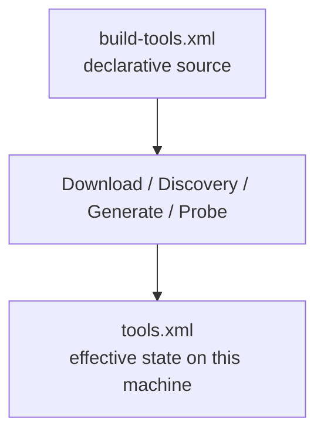

# BuildEngine Contract `build-tools.xml`

[TOC|Content]

`admin/build-tools.xml` describes the tools BuildEngine uses for bootstrap, source acquisition, builds, tests, documentation, and server presentation. The file is a declarative part of the synchronized Admin contract. Tool knowledge therefore belongs here rather than in library-specific C++ special cases.

Related documents:

- [Tool overview](tools.md)
- [Library contract `build-libraries.xml`](build-libraries.md)
- [Documentation contract](documentation.md)
- [BuildEngine configuration](configuration.md)

## Basic structure

```xml
<buildTools xmlns:xsi="http://www.w3.org/2001/XMLSchema-instance"
            xsi:noNamespaceSchemaLocation="schemas/build-tools.xsd"
            schemaVersion="5">
   <tool id="ninja" version="1.13.2" required="always">
      ...
   </tool>
</buildTools>
```

The schema is located at `admin/schemas/build-tools.xsd`.

## `<tool>`

Every tool has at least the following attributes:

| Attribute | Meaning |
| --- | --- |
| `id` | Unique logical tool ID, for example `cmake`, `ninja`, `doxygen`, or `miktex`. |
| `version` | Version expected/provisioned by the contract. |
| `runtimeVersion` | Optional different version registered as the effective runtime version. |
| `required` | `always` or `when-used`. |

### `required="always"`

The tool is part of the general BuildEngine tool set and is resolved and checked during normal tool preparation.

### `required="when-used"`

The tool is provisioned only when an active contract actually requires it. For example, `miktex` is requested only when at least one library effectively produces PDF documentation.

## Exactly one provisioning mode

A `<tool>` contains exactly one of the following alternatives:

```text
managed | generated | bds | discover
```

### `<managed>`

BuildEngine downloads and manages the tool itself.

```xml
<tool id="ninja" version="1.13.2" required="always">
   <managed root="ninja\1.13.2" executable="ninja.exe">
      <download
         url="https://.../ninja-win.zip"
         archive="ninja-1.13.2.zip"
         sha256="..."/>
   </managed>
   <probe contains="1.13.2">
      <argument value="--version"/>
   </probe>
</tool>
```

| Attribute | Meaning |
| --- | --- |
| `root` | Relative destination path below `toolsRoot`. |
| `executable` | Relative entry point inside the managed root. |

#### `<download>`

| Attribute | Meaning |
| --- | --- |
| `url` | Download source; BuildEngine variables may be used. |
| `archive` | File name in the download area. |
| `sha256` | Expected SHA-256 hash. The hash is part of the reproducible delivery contract. |

A download is not trusted merely because a file with the expected name exists; the declared hash is authoritative.

### External installation/extraction with `<extract>`

A managed tool can execute an external installer or extraction process after the verified download:

```xml
<extract executable="{Archive}">
   <argument value="--private"/>
   <argument value="--unattended"/>
</extract>
```

Important additional variables include:

| Variable | Meaning |
| --- | --- |
| `{Archive}` | Full path of the verified download. |
| `{ManagedRoot}` | Resolved destination root of the tool. |
| `{ToolId}` | Tool ID. |
| `{ToolVersion}` | Contract version of the tool. |

MiKTeX uses this path because the official Basic Installer is an executable rather than a normal ZIP archive.

### Native extraction with `<nativeExtract>`

Archives can be extracted through the integrated libarchive path:

```xml
<nativeExtract format="libarchive" root="meson-1.12.0">
   <require path="meson.py"/>
   <require path="mesonbuild\mesonmain.py"/>
</nativeExtract>
```

Optional `<include>` patterns restrict the extracted content. `<require>` defines files that must exist after extraction.

### `<generated>`

BuildEngine can generate a tool artifact from already available files. The current use case is the BCC64X UCRT compatibility library.

```xml
<tool id="bcc64x-ucrt-compat" version="20.1.7-compat1" required="always">
   <generated root="bcc64x-ucrt-compat\20.1.7-compat1"
              entry="libbcc64x-ucrt-compat.a">
      <archive tool="{BDS}\bin64\llvm-ar.exe"
               source="{BDS}\x86_64-w64-mingw32\lib\libucrt.a">
         <member path="..."/>
      </archive>
   </generated>
</tool>
```

The generated state is refreshed only when the declarative contract or its source requires it.

### `<bds>`

Tools that are part of the installed C++Builder/RAD Studio environment are resolved relative to `{BDS}`:

```xml
<tool id="bcc64x" version="20.1.7" required="always">
   <bds executable="bin64\bcc64x.exe"/>
</tool>
```

This is explicitly not an alternative compiler selection: in the BCC64X project, the configured C++Builder toolchain path remains authoritative.

### `<discover>`

Already installed tools can be found through declarative candidates:

```xml
<discover executable="rc.exe" path="true">
   <candidate path="{ProgramFilesX86}\Windows Kits\10\bin\*\x64\rc.exe"/>
</discover>
```

`path="true"` additionally permits lookup through the effective environment. Candidates support BuildEngine variables and wildcards.

## `<launcher>`

A tool can be started through another tool. Meson, for example, is a Python program:

```xml
<launcher tool="python">
   <argument value="{ToolEntry}"/>
</launcher>
```

BuildEngine validates the launcher graph for unknown tools and cycles.

## `<probe>`

After resolution or provisioning, a tool can be checked with a version/function probe:

```xml
<probe contains="cmake version 4.1.1">
   <argument value="--version"/>
</probe>
```

The process must finish successfully and return the expected text. Only then is the tool registered in `admin/tools.xml` as effective tool state.

## Managed tool state

`admin/build-tools.xml` is the desired-state contract. `admin/tools.xml` is generated state. They have different roles:



`tools.xml` must therefore not become a second manually maintained source of tool knowledge.

## Version changes

For a tool update, at least the following must be checked:

1. Version and, where applicable, `runtimeVersion`.
2. Download URL.
3. Archive/installer name.
4. SHA-256.
5. Expected entry point.
6. Probe and expected output.
7. Effects on technical fingerprints of consumers.
8. Documentation in [tools.md](tools.md) if the role or version changes.

A tool update must not invalidate unrelated library builds globally. A version should affect only states whose results actually depend on that tool.

## MiKTeX as a `when-used` example

```xml
<tool id="miktex" version="25.12" required="when-used">
   <managed root="miktex\25.12"
            executable="texmfs\install\miktex\bin\x64\texify.exe">
      ...
   </managed>
</tool>
```

The Doxygen phase resolves the effective documentation profile to determine whether LaTeX is required. Doxygen produces HTML and, when needed, LaTeX in **one run**. MiKTeX is required only for the downstream PDF step. See the [documentation contract](documentation.md) for details.

## Maintenance rule

Changes to the tool contract and changes to its meaning are documented together. `build-tools.xml`, this document, and [tools.md](tools.md) are maintained as one coherent technical unit.
