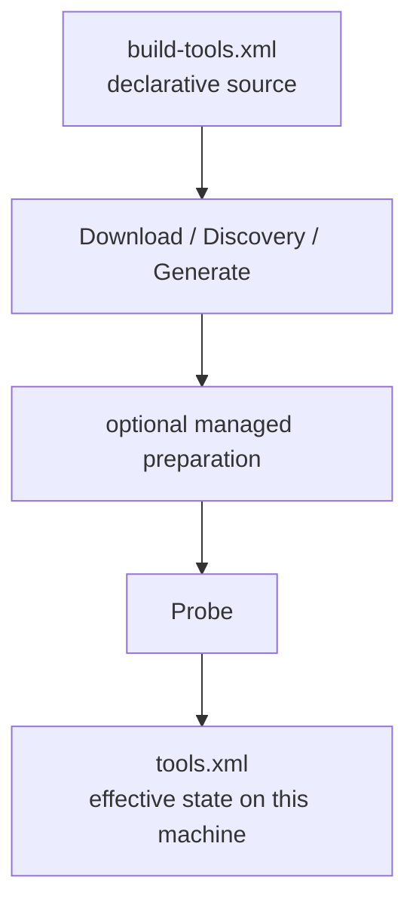

# BuildEngine Contract `build-tools.xml`

[TOC|Content]

`admin/build-tools.xml` describes the tools BuildEngine uses for bootstrap, source acquisition, builds, tests, documentation, and server presentation. The file is a declarative part of the synchronized Admin contract. Tool knowledge therefore belongs here rather than in library-specific C++ special cases.

Related documents:

- [Tool overview](tools.md)
- [Library contract `build-libraries.xml`](build-libraries.md)
- [Documentation contract](documentation.md)
- [BuildEngine configuration](configuration.md)

## Basic structure

```xml
<buildTools xmlns:xsi="http://www.w3.org/2001/XMLSchema-instance"
            xsi:noNamespaceSchemaLocation="schemas/build-tools.xsd"
            schemaVersion="6">
   <tool id="ninja" version="1.13.2" required="always">
      ...
   </tool>
</buildTools>
```

The schema is located at `admin/schemas/build-tools.xsd`.

## `<tool>`

Every tool has at least the following attributes:

| Attribute | Meaning |
| --- | --- |
| `id` | Unique logical tool ID, for example `cmake`, `ninja`, `doxygen`, or `miktex`. |
| `version` | Version expected/provisioned by the contract. |
| `runtimeVersion` | Optional different version registered as the effective runtime version. |
| `required` | `always` or `when-used`. |

### `required="always"`

The tool is part of the general BuildEngine tool set and is resolved and checked during normal tool preparation.

### `required="when-used"`

The tool is provisioned only when an active contract actually requires it. `miktex`, for example, is requested only when at least one library effectively produces PDF documentation.

## Exactly one provisioning mode

A `<tool>` contains exactly one of the following alternatives:

```text
managed | generated | bds | discover
```

### `<managed>`

BuildEngine downloads and manages the tool itself.

```xml
<tool id="ninja" version="1.13.2" required="always">
   <managed root="ninja\1.13.2" executable="ninja.exe">
      <download
         url="https://.../ninja-win.zip"
         archive="ninja-1.13.2.zip"
         sha256="..."/>
   </managed>
   <probe contains="1.13.2">
      <argument value="--version"/>
   </probe>
</tool>
```

| Attribute | Meaning |
| --- | --- |
| `root` | Relative destination path below `toolsRoot`. |
| `executable` | Relative entry point inside the managed root. |

#### `<download>`

| Attribute | Meaning |
| --- | --- |
| `url` | Download source; BuildEngine variables may be used. |
| `archive` | File name in the download area. |
| `sha256` | Expected SHA-256 hash. The hash is part of the reproducible delivery contract. |

A download is not trusted merely because a file with the expected name exists; the declared hash is authoritative.

### External installation/extraction with `<extract>`

A managed tool can execute an external installer or extraction process after the verified download:

```xml
<extract executable="{Archive}">
   <argument value="--unattended"/>
   ...
</extract>
```

Important additional variables include:

| Variable | Meaning |
| --- | --- |
| `{Archive}` | Full path of the verified download. |
| `{ManagedRoot}` | Resolved destination root of the tool. |
| `{ToolId}` | Tool ID. |
| `{ToolVersion}` | Contract version of the tool. |

MiKTeX uses this path because the official Basic Installer is an executable rather than a normal ZIP archive.

### Managed post-provisioning with `<prepare>`

Schema version 6 adds a declarative post-provisioning phase for managed tools. It runs after the managed entry point exists and before the normal tool probe.

```xml
<prepare marker=".buildengine\example-v1.txt">
   <command executable="bin\tool.exe">
      <argument value="prepare"/>
   </command>
   <command executable="bin\tool.exe">
      <argument value="check"/>
      <success code="0"/>
      <success code="100"/>
   </command>
</prepare>
```

The contract has the following semantics:

- `marker` is a relative file below the managed tool root.
- `command/@executable` is a relative executable below the same managed root.
- `<argument>` values are resolved through the normal BuildEngine variables.
- without `<success>`, only exit code `0` is accepted;
- one or more `<success code="...">` entries replace that default, allowing tool-specific non-error result codes;
- each command runs in the strict process-local managed-tool environment rather than inheriting the host `PATH`;
- each command receives its own process log;
- the resolved preparation contract is written to the marker only after every command succeeded.

The marker is not merely a Boolean flag. Its content is the resolved preparation contract. If the version, executable, arguments, accepted exit codes, or command list changes, the stored content no longer matches and preparation runs again. This keeps preparation idempotent without introducing hidden state outside the managed tool root.

`<prepare>` is deliberately generic. MiKTeX package preparation is its first user, but the BuildEngine implementation contains no MiKTeX-specific preparation branch.

### Long-running provisioning feedback

External tool installers and managed preparation can take substantially longer than ordinary archive extraction. MiKTeX is the current important example.

BuildEngine uses the existing tool activity and heartbeat rather than inventing a second progress mechanism. The activity operation changes as provisioning moves through download, extraction, preparation, and probe. Preparation commands are exposed as `prepare-N/M`; individual process logs retain their stdout/stderr and timing information.

A percentage is only shown if the external process actually provides one. BuildEngine does not invent estimated progress for opaque installers or package managers.

### Native extraction with `<nativeExtract>`

Archives can be extracted through the integrated libarchive path:

```xml
<nativeExtract format="libarchive" root="meson-1.12.0">
   <require path="meson.py"/>
   <require path="mesonbuild\mesonmain.py"/>
</nativeExtract>
```

Optional `<include>` patterns restrict the extracted content. `<require>` defines files that must exist after extraction.

### `<generated>`

BuildEngine can generate a tool artifact from already available files. The current use case is the BCC64X UCRT compatibility library.

```xml
<tool id="bcc64x-ucrt-compat" version="20.1.7-compat1" required="always">
   <generated root="bcc64x-ucrt-compat\20.1.7-compat1"
              entry="libbcc64x-ucrt-compat.a">
      <archive tool="{BDS}\bin64\llvm-ar.exe"
               source="{BDS}\x86_64-w64-mingw32\lib\libucrt.a">
         <member path="..."/>
      </archive>
   </generated>
</tool>
```

The generated state is refreshed only when the declarative contract or its source requires it.

### `<bds>`

Tools that are part of the installed C++Builder/RAD Studio environment are resolved relative to `{BDS}`:

```xml
<tool id="bcc64x" version="20.1.7" required="always">
   <bds executable="bin64\bcc64x.exe"/>
</tool>
```

This is explicitly not an alternative compiler selection: in the BCC64X project, the configured C++Builder toolchain path remains authoritative.

### `<discover>`

Already installed tools can be found through declarative candidates:

```xml
<discover executable="rc.exe" path="true">
   <candidate path="{ProgramFilesX86}\Windows Kits\10\bin\*\x64\rc.exe"/>
</discover>
```

`path="true"` additionally permits lookup through the effective environment. Candidates support BuildEngine variables and wildcards.

## `<launcher>`

A tool can be started through another tool. Meson, for example, is a Python program:

```xml
<launcher tool="python">
   <argument value="{ToolEntry}"/>
</launcher>
```

BuildEngine validates the launcher graph for unknown tools and cycles.

## `<probe>`

After resolution, provisioning, and optional managed preparation, a tool can be checked with a version/function probe:

```xml
<probe contains="cmake version 4.1.1">
   <argument value="--version"/>
</probe>
```

The process must finish successfully and return the expected text. Only then is the tool registered in `admin/tools.xml` as effective tool state.

## Managed tool state

`admin/build-tools.xml` is the desired-state contract. `admin/tools.xml` is generated state. They have different roles:



`tools.xml` must therefore not become a second manually maintained source of tool knowledge.

For managed tools, the configured `root` is part of the physical desired state. The preparation marker lives inside that root as well; no preparation state is stored in another user profile or external installation.

## Version changes

For a tool update, at least the following must be checked:

1. Version and, where applicable, `runtimeVersion`.
2. Download URL.
3. Archive/installer name.
4. SHA-256.
5. Expected entry point.
6. Optional preparation contract and marker version.
7. Probe and expected output.
8. Effects on technical fingerprints of consumers.
9. Documentation in [tools.md](tools.md) if the role or version changes.

A tool update must not invalidate unrelated library builds globally. A version should affect only states whose results actually depend on that tool.

## MiKTeX as a `when-used` and `<prepare>` example

MiKTeX must be isolated from any MiKTeX installation already present on the machine. The managed contract uses the official portable installer mode:

```xml
<tool id="miktex" version="25.12" required="when-used">
   <managed root="miktex\25.12-portable"
            executable="texmfs\install\miktex\bin\x64\texify.exe">
      <download .../>
      <extract executable="{Archive}">
         <argument value="--portable={ManagedRoot}"/>
         <argument value="--unattended"/>
         <argument value="--no-registry"/>
         <argument value="--no-additional-roots"/>
         <argument value="--paper-size=A4"/>
      </extract>
      <prepare marker=".buildengine\doxygen-1.18.0-latex-packages-v1.txt">
         ...
      </prepare>
   </managed>
</tool>
```

The portable installer contract intentionally does **not** combine `--portable` with `--user-install`, `--user-config`, or `--user-data`. The managed root itself owns the portable configuration, data, package, and executable trees.

The process environment is isolated as well. BuildEngine does not modify the user or machine `PATH`, does not reuse an external MiKTeX executable tree, and does not require another MiKTeX installation to be changed or removed.

### Doxygen 1.18.0 package contract

The MiKTeX preparation marker is explicitly tied to `Doxygen 1.18.0`. Preparation performs the following steps serially before MiKTeX is registered as ready:

1. update the MiKTeX package database from the configured repository;
2. perform a package update check; exit code `100` is accepted because MiKTeX defines it as "updates available" rather than a technical failure;
3. resolve the dependency warnings emitted by the Basic MiKTeX 25.12 portable installation (`ms`, `showframe`, `sttools`, `thailatex`, `luxi`);
4. install the explicit package surface required by the pinned Doxygen 1.18.0 LaTeX templates and the project's default PDFLaTeX font path;
5. verify the declared Doxygen package set;
6. refresh the MiKTeX file-name database.

The direct Doxygen package set is derived from the pinned upstream `templates/latex/header.tex`, `templates/latex/doxygen.sty`, and the default translator/font configuration. It includes the LaTeX base/tools/graphics families and explicit packages such as `infwarerr`, `float`, `varwidth`, `xcolor`, `colortbl`, `xltabular`, `tabularray`, `fancyvrb`, `multirow`, `hanging`, `ifpdf`, `adjustbox`, `stackengine`, `enumitem`, `alphalph`, `ulem`, `iftex`, `ifxetex`, `wasysym`, `geometry`, `changepage`, `fancyhdr`, `natbib`, `tocloft`, `hyperref`, `caption`, and `etoc`. `psnfss` supplies the default Helvetica/Courier font packages.

MiKTeX resolves transitive dependencies while installing these declared package IDs. This contract is for the project's current default Doxygen/PDFLaTeX path. If a Doxygen language translator that needs an additional TeX package is enabled, that package must be added deliberately to the version-bound contract.

The package repository is explicitly selected instead of being inherited from an unrelated user configuration. The package repository contents themselves are not yet cryptographically pinned package-by-package; if byte-identical TeX package provenance becomes a hard clean-room requirement, the next hardening step is a mirrored or otherwise content-pinned MiKTeX package repository.

The Doxygen phase produces HTML and, when requested, LaTeX in **one run**. The shared runtime preflight remains responsible only for mutable runtime initialization such as creation of `pdflatex.fmt`. It is not the package discovery mechanism. Actual library PDF jobs continue to use:

```text
texify --pdf --batch --max-iterations=5 --tex-option=--disable-installer refman.tex
```

A missing package during a library PDF job therefore means the explicit provisioning contract is incomplete; the build does not silently extend its package set during parallel execution.

## Maintenance rule

Changes to the tool contract and changes to its meaning are documented together. `build-tools.xml`, this document, [tools.md](tools.md), and the relevant pipeline documentation are maintained as one coherent technical unit.
