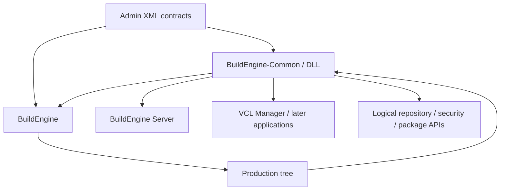
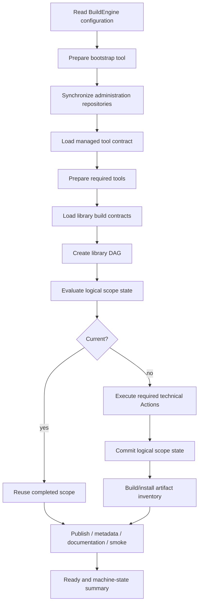
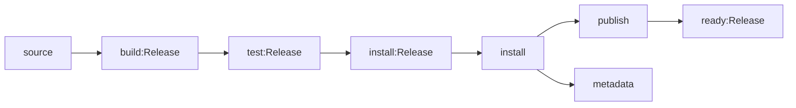
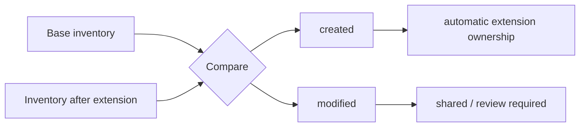
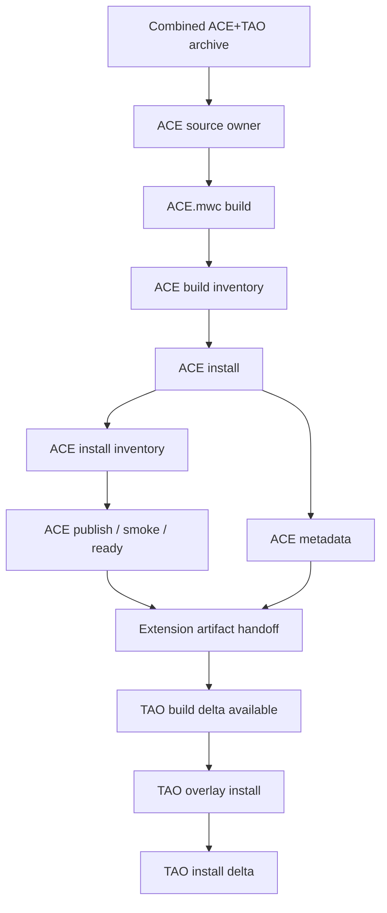
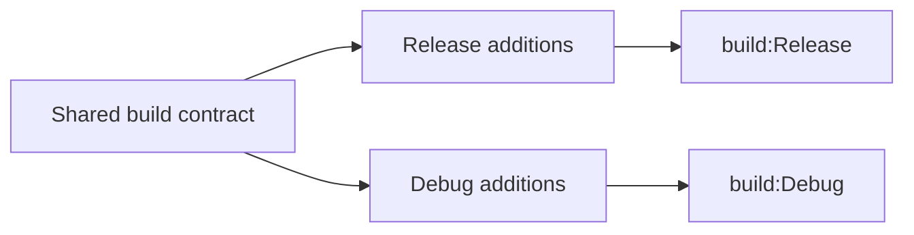
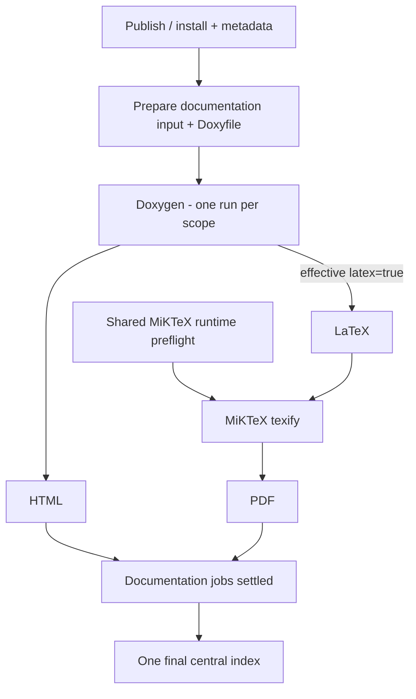
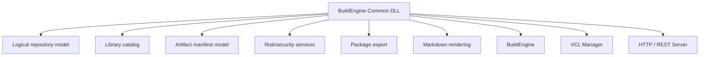

# BuildEngine

[TOC|Content]

BuildEngine is a declarative build orchestration system for reproducible C and C++ third-party library builds. Its current Windows integration is centered on Embarcadero C++Builder and the modern BCC64X toolchain. Library knowledge belongs in synchronized XML contracts; the executable evaluates those contracts, prepares tools, creates a dependency graph, executes technical Actions, records persistent state at logical library-scope granularity, and records artifact evidence for later ownership and lifecycle operations.

Related reference documents:

- [Configuration and command line](configuration.md)
- [Tool contract `build-tools.xml`](build-tools.md)
- [Library contract `build-libraries.xml`](build-libraries.md)
- [Library extensions](library-extensions.md)
- [Documentation contract](documentation.md)
- [Tool overview](tools.md)
- [BuildEngine Server](server.md)

## Main responsibilities

BuildEngine separates configuration, orchestration, execution, evidence, and presentation:

1. **Configuration** resolves production roots, tools, repositories, build contracts, concurrency, tests, and documentation settings.
2. **Repository synchronization** updates the administration content before build evaluation.
3. **Tool preparation** discovers or installs tools described by the administration contract.
4. **Library contracts** define logical identity, dependencies, source acquisition, build variants, installation, publication, smoke tests, metadata, documentation, and extensions.
5. **The process scheduler** executes the dependency graph with a bounded worker count.
6. **Logical library-scope state** is the authoritative persistent incremental state; technical Actions remain execution and diagnostic units inside a scope.
7. **Artifact inventories** record build/install binary evidence and extension deltas without becoming a second state model.
8. **Metadata generation** creates license information and CycloneDX SBOM data.
9. **Documentation generation** publishes one Doxygen invocation per documentation scope producing HTML and optionally LaTeX; MiKTeX compiles generated LaTeX downstream.
10. **Aggregate documentation navigation** is rebuilt after parallel documentation jobs have settled.
11. **BuildEngine-Common/DLL** is the leading shared repository/domain contract consumed by BuildEngine, Server, Manager, and future applications.
12. **The server** presents resulting packages, documentation, SBOMs, usage information, and security evidence without becoming a second build-state authority.

## Contract and application architecture

A shared concept is implemented in Common first. Applications follow that contract rather than reconstructing their own interpretation of XML or physical package directories.



This rule became essential once logical library identity stopped being identical to physical package layout. TAO can be a complete logical component while its payload deliberately overlays ACE.

## Execution flow



## Logical state

Persistent state belongs to a **logical library scope**, not to each technical Action. Typical scopes include:

```text
source
build:Release
build:Debug
test:Release
test:Debug
validation:Release
install:Release
install:Debug
install:common
install
publish
metadata
doxygen
doxygen:collection-prepare
doxygen:<module>
pdf
ready:Release
ready:Debug
ready
```

A completed state stores the library contract timestamp and every direct upstream library scope:

```text
timestamp=<library timestamp>
upstream=<library>|<version>|<scope>|<upstream library timestamp>|<upstream completedAt>
upstream=...
completedAt=<completion timestamp>
state=completed
```

A scope is current only if its own timestamp still matches and every stored direct upstream reference still has the same timestamp and `completedAt`.



Technical Actions remain important for execution order, worker activity, logging, and failure diagnosis. They are not persistent-state authorities.

## Artifact evidence is separate from state

Artifact manifests answer a different question from logical state: **what binary files did this component create or change?**

For normal libraries BuildEngine inventories relevant build/install artifacts. For an extension it compares the shared producer/payload with the base inventory.



Manifest records contain at least relative path, size, and SHA-256. Typical relevant file types include DLL, EXE, LIB, PDB, BPL, DCP, TDS and platform library equivalents.

`artifact:*` jobs are helper/evidence jobs. They deliberately do not create a parallel persistent state hierarchy.

The manifests are also the basis for future safe cleanup of obsolete versions. An owned file may only be removed automatically when the current file still matches the stored ownership evidence.

## Library extensions and shared producers

The extension model separates **logical ownership** from **physical placement**.

ACE/TAO is the reference implementation:

- ACE 8.0.6 and TAO 4.0.6 are separate logical libraries;
- ACE owns the combined DOCGroup archive;
- `ACE.mwc` builds ACE and explicitly excludes TAO;
- `TAO.mwc` builds TAO afterward;
- both variants use the same `ACE_wrappers\bin` and `ACE_wrappers\lib` producer directories;
- TAO overlays the ACE physical package rather than inventing a second native package layout;
- ACE and TAO retain separate state, metadata, SBOM, documentation, and artifact evidence.



TAO's SSLIOP-specific patch is applied to each concrete Release/Debug producer directly before `TAO.mwc`. It is not applied asynchronously to the common workspace after ACE may already have copied that workspace.

The extension artifact handoff waits for both base `ready` and base `metadata` before releasing downstream extension test/install work. This prevents an overlay from mutating the base physical payload while the base is still publishing, smoke-testing, or reading metadata from it.

The mechanism is generic. There is no ACE/TAO name test in the engine.

## Build variants

Release and Debug are variants of one library contract. Common arguments belong to the shared build node; variant nodes contain only differences.



Independent variant directories preserve useful parallelism.

## Heartbeat semantics

The heartbeat separates **active technical worker activity** from **logical job state**. A logical job can remain scheduler-running while its technical Actions transition; therefore logical running/open counts are not worker counts.

Example data format:

```text
[HEARTBEAT] running=4/4, open=32, ready=0, pending=12, current=406, passed=22, failed=0, blocked=0
```

Here all four workers are occupied while 32 logical jobs remain non-terminal.

## Documentation pipeline

Central API documentation is a dependency graph rather than an uncontrolled post-build side effect.



Important rules:

- HTML and LaTeX come from the **same** Doxygen run for a scope.
- MiKTeX consumes generated `refman.tex`; it does not rerun Doxygen.
- portable MiKTeX packages are prepared declaratively;
- runtime package installation during `texify` is disabled;
- one shared preflight initializes mutable MiKTeX runtime state before parallel PDFs;
- a successful preflight does not imply every individual LaTeX document is valid;
- collection libraries such as Boost use root/member documentation scopes discovered from published API structure;
- parallel library jobs do not regenerate the global index; the final index is produced after the documentation tree is stable.

ACE and TAO now have separate documentation profiles and output coordinates even though their native producer is shared.

## Important components

| Component | Responsibility |
| --- | --- |
| `BuildEngine` | Top-level orchestration and build-file processing |
| `BuildEngineConfiguration` | Effective local configuration and paths |
| `RepositorySync` | Synchronization of administration repositories |
| `ToolConfiguration` / `ToolJobs` | Managed tool contracts and preparation |
| `LibraryConfiguration` | Declarative library and extension contracts |
| `LibraryExtensionPaths` | Resolution of base workspace, source, producer, payload and logical metadata roots |
| `LibraryJobBuilder` | Translation of library contracts into executable DAG jobs |
| `LibraryArtifactJob` | Build/install inventories, extension deltas and safe extension handoff |
| `ProcessScheduler` | Bounded concurrent DAG execution |
| `LibraryStepState` | Logical state and direct-upstream timestamp/completion chain |
| `MetadataJob` | License and CycloneDX metadata, including descriptions and extension identities |
| `CentralDocumentationJob` / `DocumentationPipelineJob` / `CollectionDocumentationJob` | Doxygen/LaTeX/PDF and aggregate navigation |
| `SmokeJobBuilder` | Consumer/integration smoke tests |
| `BuildEngine-Common` | Leading shared DLL: library catalog, repository mapping, artifact manifest format, HTTP, security, package, Markdown, and utility services |

## Common/DLL as leading contract

BuildEngine is no longer a single console executable. The console engine, VCL manager, and local HTTP/REST server must not develop separate interpretations of libraries, packages, extensions, SBOMs, security findings, or physical payloads.



Applications follow Common. A change that is genuinely shared is not solved independently in each application.

This is why package/security overview pages now enumerate the logical catalog and resolve logical SBOM paths rather than treating `install/packages/<id>/<version>` as the complete truth. TAO's payload can live below ACE while TAO remains visible to REST, HTML, SBOM, and security consumers.

## Self-documenting project contract

Markdown under `admin/server-docs` is part of the engineering contract. Process and architecture diagrams are maintained as Mermaid. Literal state formats, XML fragments, paths and filesystem trees may remain code/text blocks because they represent data rather than diagrams.

The maintenance rule is:

- configuration changes update [configuration.md](configuration.md);
- tool changes update [build-tools.md](build-tools.md) and [tools.md](tools.md);
- library/XML changes update [build-libraries.md](build-libraries.md) and, where applicable, [library-extensions.md](library-extensions.md);
- documentation changes update [documentation.md](documentation.md);
- HTTP/Common repository behavior updates [server.md](server.md);
- architectural milestones are reflected here and, where they materially change the project narrative, in [story.md](story.md).

## Failure model

Distinguish:

- **technical Action failure**: one concrete execution step failed;
- **dependency failure**: a logical job could not run because a prerequisite failed;
- **current-state miss**: a logical scope cannot be reused because its timestamp/upstream chain changed;
- **state commit failure**: technical work succeeded but state persistence failed;
- **artifact evidence failure**: inventory/delta evidence could not be generated;
- **generated-output failure**: a downstream product such as a PDF is missing although earlier prerequisites may have succeeded.

Concrete exceptions should remain visible rather than being unnecessarily collapsed into generic messages.

## Design principle

The system is deliberately contract-driven. Compiler-specific integration stays explicit and verifiable, while reusable orchestration remains generic. Alternative compiler paths are not silently substituted for BCC64X: compatibility failures remain visible because proving that integration boundary is part of the project itself.
