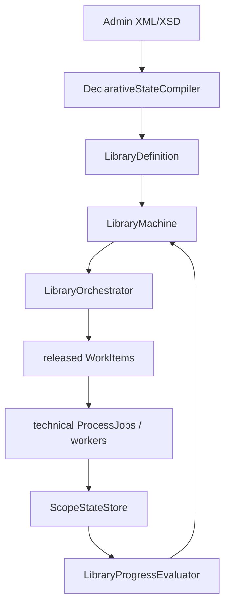

# BuildEngine

[TOC|Content]

**Status:** current architecture contract as of 22 September 2026. The Library-FSM architecture is active; individual integration capabilities can still be marked not verified until their real target-machine run is complete.

BuildEngine is a declarative C++23 orchestration system centered on Embarcadero C++Builder 13 / BCC64X. The current architecture separates the declarative library contract, the runtime Library-FSM, persistent logical scope state, technical WorkItems/Actions, artifact evidence, Common repository semantics and read-only presentation.

## Main principles

1. `admin/build-libraries.xml` and its schemas are the declarative library/dependency contract.
2. BCC64X is the intended toolchain; compiler substitutions are not silently introduced.
3. Every active `Library/Version` is controlled by a runtime state machine.
4. Persistent Current-State belongs to logical library scopes, not to the runtime FSM and not to technical Actions.
5. Technical Actions are execution/ordering/diagnostic units inside already released work.
6. Artifact inventories are evidence/ownership, not Current-State.
7. BuildEngine-Common is the leading shared interpretation for logical libraries, extensions, repository paths, security and package semantics.
8. A physical directory is never automatically a logical library identity.

## From the first DAG to the current FSM

The project started with a task/job model and a global dependency DAG. That model remains historically important and local technical Action graphs are still useful, but the global DAG is no longer the domain model of a library.

The current runtime compiles declarative contracts into one state machine per Library/Version:

```text
Source -> Build -> Test -> Validation -> Install -> Metadata -> Publish -> Documentation -> Ready
```



The FSM decides **whether** a state may progress and which logical scopes need work. The technical execution layer decides **how** that released work runs.

## Dependency hierarchy

Normal XML dependencies are package dependencies. For every consumer state `S >= Build`:

```text
downstream S may run only when dependency Completed(Install)

Completed(Install) <=> dependency.state > Install
```

The shared runtime registry stores, per Library/Version, the current FSM state and whether that machine is still running, finished, stopped or failed.

A requirement evaluates to:

```text
satisfied
waiting
impossible
```

`waiting` means the producer can still reach the required state. `impossible` means it cannot, so the consumer becomes BLOCKED instead of waiting forever.

Normal dependency completion timestamps are **not** part of local consumer Current-State. A dependency re-install therefore does not by itself age a valid consumer build. The explicit temporal cross-library exception is Extension Source inheritance when the extension shares the prepared base Source.

Examples:

```text
TECkit Build requires Expat > Install
ACE Build requires OpenSSL > Install
TAO Build requires ACE > Install
```

After a dependency completed Install, its later Metadata/Publish/Documentation work may proceed in parallel with consumers. The transitive ordering comes from direct XML edges and persisted install evidence; there is no second global runtime dependency DAG.

## Orchestrator and technical workers

`LibraryOrchestrator` is the semantic single writer for Library-FSM state. It advances all machines to a fixpoint, releases work for reached states and consumes technical completions.

The existing ProcessScheduler remains useful as technical queue/worker infrastructure for already released jobs and for tool provisioning. It is not the persistent state authority and no longer defines the library lifecycle.

Local `id`/`dependsOn` graphs are allowed inside WorkItems where technical ordering needs them.


### Variant upper states

Build, Test, Validation and Install are logical upper states. Their selected variant scopes run in parallel and share one exit barrier.

```text
Build
  +-- build:Debug -----------+
  +-- build:Release ---------+
  +-- build:<variant> -------+
                             |
                             +--> Test
```

The FSM leaves Build only when every selected build variant is current. Test and Validation use the same rule.

Install adds two ordered stages after the parallel variant barrier:

```text
install:<variant>* -> install:common -> install -> Metadata
```

The number of variants is not fixed.

## Project import before CMake configure

Schema 16 adds a project-import layer directly to the existing CMake configure action. This is not a new FSM state and not a second build system. It is a technical preparation step inside already released Build work.

Supported input formats are currently:

- `vcxproj`: `ClCompile` and `ResourceCompile`;
- `cbproj`: `CppCompile`, `ResourceCompile` and `RcCompile`.

The imported file is read-only. BuildEngine does not modify `.vcxproj` or `.cbproj` files and does not invoke MSBuild or the C++Builder project system as part of the import.

```text
VCXPROJ / CBPROJ
      -> project inventory import
      -> neutral target model
      -> generated CMakeLists.txt
      -> existing CMake configure
      -> Ninja / BCC64X
```

Toolchain, variant selection, installation paths, dependencies and common CMake arguments remain owned by the surrounding BuildEngine contract. The imported project contributes source/resource inventory and target identity. Explicit `include`, `define` and `link` additions can be declared on the import where BuildEngine must supply target-specific information.

Conditional source inventory is deliberately not guessed. If an imported compile item contains a condition or `ExcludedFromBuild` semantics, the importer fails until that decision is represented explicitly. This keeps the generated build deterministic instead of silently emulating only part of MSBuild or the C++Builder project evaluator.

The implementation exists for both formats, but the capability remains **not verified** until the new BuildEngine source is rebuilt with BCC64X and real VCXPROJ/CBPROJ imports complete successfully. ICU is the first intended VCXPROJ proof.
## Logical scopes and Current-State

Typical scopes include:

```text
source
build:Release
build:Debug
test:Release
validation:Release
install:Release
install:Debug
install
metadata
publish
doxygen
doxygen:root
doxygen:<module>
ready:Release
ready:Debug
ready
```

Canonical state written by the current store:

```text
timestamp=<library timestamp>
completedAt=<completion timestamp>
state=completed
```

Historical `upstream=` and `fingerprint=` records are accepted only for migration compatibility and are not written again.

A scope is current when its own contract timestamp matches and its own temporal predecessor is not newer. Normal package dependencies remain runtime gates in the shared registry and do not become local Evidence timestamps.

Fingerprints, output files, command hashes, tree hashes, technical step markers and runtime FSM state are not Current-State authorities.

## Failure-safe lifecycle

For work that is actually submitted:

```text
evaluate current
-> execute required technical work
-> commit this logical scope atomically on success
```

Old Evidence is never deleted before execution. A failure leaves the previous Evidence record untouched, while the current machine still ends FAILED. Downstream records are not deleted; newer predecessor timestamps make them stale naturally.

## Read-only check

`--check` uses the same declarative definitions and Library-FSM/orchestrator semantics read-only. It does not submit technical library ProcessJobs, invalidate scopes or commit state.

Dynamic collection documentation scopes are materialized through the same discovery when the reached Documentation state requires them.

## Documentation state

Documentation is a first-class Library-FSM state with hierarchical runtime substates.

```text
Documentation
  -> Standard
  -> Collection
  -> Linked
  -> Doxygen/PDF stages as applicable
```

This keeps dynamic Boost collection modules and linked ACE/TAO tagfile relationships inside the library lifecycle without creating a second persistent state hierarchy.

## Native archive capabilities

BuildEngine links a private libarchive runtime for native archive extraction.

The explicit compressed TAR filters are:

```text
gzip  : .tar.gz, .tgz
xz    : .tar.xz, .txz
bzip2 : .tar.bz2, .tbz2, .tbz
```

Only an in-process filter is accepted. `ARCHIVE_WARN` is treated as unavailable so libarchive cannot silently delegate decompression to an external program.

The startup banner exposes the effective runtime:

```text
[LIBARCHIVE] filter gzip       : in-proc ...
[LIBARCHIVE] filter bzip2      : in-proc ...
[LIBARCHIVE] filter xz         : in-proc ...
```

The BZip2 code path and managed libarchive dependency are implemented. The private BuildEngine libarchive world still has to be rebuilt and promoted before this capability is considered verified.

Until then the new pinned Bash `.tar.bz2` tool contract remains intentionally hidden in `build-tools.xml`.

## Library extensions

ACE/TAO remains the reference case for separate logical machines with deliberately shared physical producer/payload structures.

The extension relation supplies physical source/producer/install semantics. State, metadata, SBOM, documentation and ownership remain separate logical identities.

## Artifact evidence and Publish

Artifact evidence records what a logical component created or changed. Publish materializes a consumer view. Neither is a second Current-State system.

A base file included in an extension's consumer closure does not become extension-owned merely because it is published together.

## Common repository model

BuildEngine-Common resolves logical identity separately from physical payload and metadata placement. Server and Manager consume this common model instead of inferring library identity from directory names.

## Heartbeat and telemetry

Interactive output is grouped deliberately:

- `[FSM] activated ...` lists newly released logical scopes as one batch;
- `[HEARTBEAT]` reports FSM totals plus scheduler `running/ready/pending` and active technical actions;
- `[COMPLETED since last heartbeat]` preserves short successful FSM scopes that would otherwise disappear between heartbeats, including their duration;
- failures are printed immediately;
- successful technical substeps stay in detailed logs instead of flooding the console.

Technical queue state remains diagnostic information, not the domain model.

## Verification status

The FSM architecture, WorkItem integration and library-oriented runtime reporting are active source. Individual parts have already been compiled and exercised with BCC64X.

The newly added private-libarchive BZip2 path is **not verified** until the private runtime is rebuilt, linked and reports `filter bzip2 : in-proc` during a real run.


## Projectimport im CMake-Configure-Schritt

Mit Bibliotheksvertrag Schema 16 kann eine CMake-Configure-Action Projektmetadaten aus vorhandenen Projektdateien importieren und daraus vor dem eigentlichen Configure-Lauf eine `CMakeLists.txt` erzeugen.

Unterstützt werden zunächst:

- `vcxproj` mit `ClCompile` und `ResourceCompile`;
- `cbproj` mit `CppCompile`, `ResourceCompile` und `RcCompile`.

Die Projektdatei wird ausschließlich gelesen. BuildEngine verändert weder `.vcxproj` noch `.cbproj`.

Der Ablauf ist:

```text
cmake configure
   -> optionale project imports
   -> neutrales Targetmodell
   -> generiertes CMakeLists.txt
   -> reguläres CMake configure
   -> Ninja / BCC64X
```

Der Importer ist bewusst kein MSBuild- oder C++Builder-Projekt-Interpreter. Toolchain, Plattform, Varianten, Installationspfade, Dependencies und allgemeine Buildargumente bleiben im bestehenden BuildEngine-Vertrag. Der Import liefert Projektinventar und wenige targetbezogene Angaben.

Bedingte Source-Semantik wird nicht geraten. Ein Source-Eintrag mit nicht aufgelöster Condition bzw. `ExcludedFromBuild` führt zum Abbruch des Imports. Dadurch kann der Generator nicht stillschweigend ein anderes Target erzeugen als das Projekt beschreibt.

Mehrere Imports dürfen in derselben Configure-Action zusammengeführt werden. Damit können beispielsweise mehrere Upstream-Windows-Projekte ein gemeinsames generiertes CMake-Projekt bilden.

**Verifikationsstatus:** Implementierung und Schema sind vorhanden; der reale BCC64X-Proof für VCXPROJ und CBPROJ steht noch aus.
