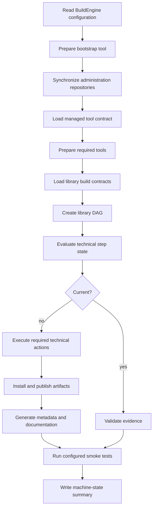
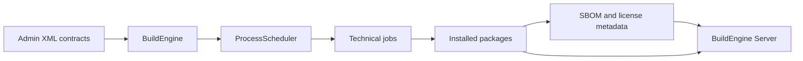
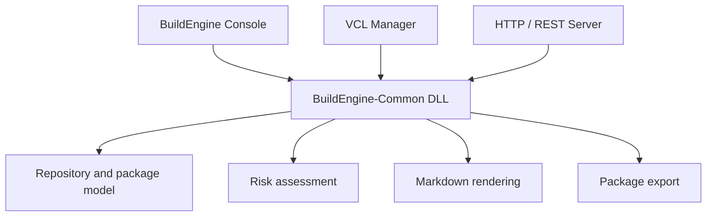

# BuildEngine

BuildEngine is a declarative build orchestration system for reproducible C and C++ third-party library builds. Its current Windows integration is centered on Embarcadero C++Builder and the modern BCC64X toolchain. Library knowledge belongs in synchronized XML contracts, while the executable evaluates those contracts, prepares tools, creates a technical dependency graph, executes technical steps, and records the resulting state.

## Main responsibilities

BuildEngine separates configuration, orchestration, execution, evidence, and presentation:

1. **Configuration** resolves the production root, tools, repositories, build contracts, concurrency, tests, and documentation settings.
2. **Repository synchronization** updates the administration content before build evaluation.
3. **Tool preparation** discovers or installs tools described by the administration contract.
4. **Library contracts** define source acquisition, build variants, installation, publication, smoke tests, metadata, and documentation.
5. **The process scheduler** executes the technical dependency graph with a bounded worker count.
6. **Technical step state** is the authoritative incremental state for library work.
7. **Metadata generation** creates license information and CycloneDX SBOM data.
8. **Documentation generation** publishes library information and, where enabled, Doxygen API documentation.
9. **The server** presents resulting packages, documentation, SBOMs, usage information, and security evidence without becoming a second build-state authority.

## Execution flow



## Dependency relationships



## Core orchestration

The central execution path first prepares Git, synchronizes administration data, prepares the remaining required tools, processes the configured build files, and optionally runs smoke tests.

```cpp
int BuildEngine::Run() {
   PrintConfiguration();
   theEvents.AttachMachineState(theMachineState, theConfiguration.WorkerCount());

   theToolRegistry.Load(theConfiguration.ToolsFile());
   BuildVariables const theVariables { theConfiguration, theEnvironment, theToolRegistry };

   // Bootstrap, administration synchronization, managed tools and library DAGs
   // are evaluated before the final machine-state summary is emitted.

   return 0;
}
```

The production implementation contains the complete error handling, tool preparation, scheduler execution, heartbeat handling, metadata, documentation, and smoke-test logic. The fragment above is deliberately shortened for documentation.

## Modern C++23 direction

BuildEngine prefers modern C++23 facilities over older idioms whenever the compiler and target library support them. Examples include ranges, concepts, `std::span`, `std::string_view`, designated initializers, structured bindings, `std::optional`, `std::format`, and value-oriented APIs.

A small C++23 example:

```cpp
#include <concepts>
#include <functional>
#include <ranges>
#include <span>

template<typename value_ty>
concept integral_value = std::integral<value_ty> && !std::same_as<value_ty, bool>;

template<integral_value value_ty>
[[nodiscard]] value_ty Sum(std::span<value_ty const> const spValues) {
   return std::ranges::fold_left(spValues, value_ty {}, std::plus {});
}
```

## Incremental state

BuildEngine distinguishes technical state from generated evidence. A library is not considered current merely because a file happens to exist. Technical steps are evaluated against their recorded state and fingerprints; output validation is evidence about the result, not an alternative state machine.

> **State rule:** technical step state is authoritative. Evidence validation can reject an otherwise current result, but it does not create a second independent state authority.

This distinction is especially important for large builds because a changed library timestamp, source input, build contract, tool version, or other fingerprint input should invalidate only the work that actually has to run again.

## Build variants

Release and Debug are variants of the same library contract. Common arguments belong to the shared build node, while variant-specific arguments refine optimization level, binary names, installation directories, and other configuration-dependent values.

A typical conceptual shape is:

```xml
<build>
   <argument value="-G"/>
   <argument value="Ninja"/>
   <variant name="Release">
      <argument value="-DCMAKE_BUILD_TYPE:STRING=Release"/>
   </variant>
   <variant name="Debug">
      <argument value="-DCMAKE_BUILD_TYPE:STRING=Debug"/>
   </variant>
</build>
```

## Important components

| Component | Responsibility |
| --- | --- |
| `BuildEngine` | Top-level orchestration and build-file processing |
| `BuildEngineConfiguration` | Effective local configuration and paths |
| `RepositorySync` | Synchronization of administration repositories |
| `ToolConfiguration` / `ToolJobs` | Managed tool contracts and preparation |
| `LibraryConfiguration` | Declarative library contracts |
| `LibraryJobBuilder` | Translation of library contracts into executable jobs |
| `ProcessScheduler` | Bounded concurrent DAG execution |
| `LibraryStepState` | Authoritative technical incremental state |
| `MetadataJob` | License and CycloneDX metadata |
| `CentralDocumentationJob` | Library documentation and Doxygen integration |
| `SmokeJobBuilder` | Consumer/integration smoke tests |
| `BuildEngine-Common` | Shared repository, HTTP, security, package, Markdown, and utility services |

## Shared architecture

BuildEngine is no longer only one console executable. The project now has several presentation surfaces: the command-line application, the VCL-based manager, and the local HTTP/REST server. They must not develop separate interpretations of libraries, packages, security findings, or risk state.

Shared domain and infrastructure functionality therefore belongs in `BuildEngine-Common`. The same classes can be consumed by the console application, the graphical VCL application, and the server. Risk assessment is an important example: the assessment model should have one implementation even though its results can be presented in a console table, a native Windows UI, JSON, or an HTML page.



This separation keeps presentation technology replaceable while the technical interpretation remains consistent.

## Failure model

A useful conceptual distinction is:

- a **technical action failure** means the action itself did not complete successfully;
- a **dependency failure** means the job could not run because a prerequisite failed;
- a **validation failure** means recorded/current technical state exists but required evidence is missing or invalid;
- a **not-current state** means the scheduler must execute the affected technical step again.

Nested example:

- Library
  - Source
    - Download
    - Extract
  - Build
    - Release
    - Debug
  - Install
  - Metadata
  - Documentation

## Design principle

The system is intentionally contract-driven. Compiler-specific integration remains explicit and verifiable, while reusable orchestration logic should stay generic. In the current third-party project, alternative compiler paths are not silently substituted for BCC64X: compatibility problems must remain visible so the integration result is meaningful.
