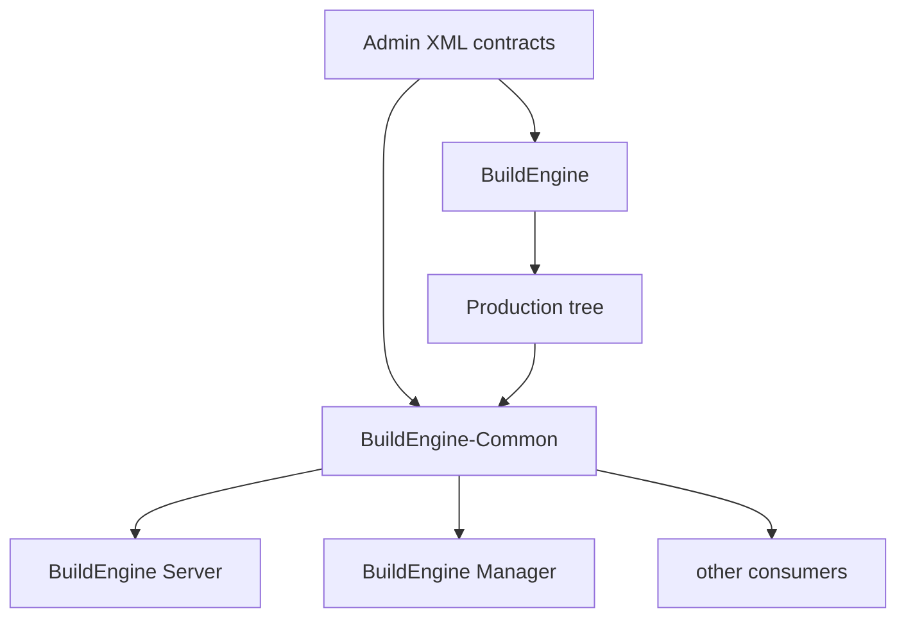
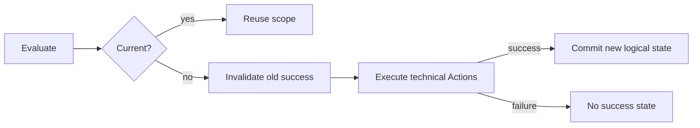
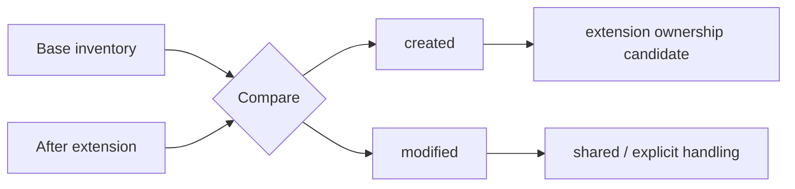
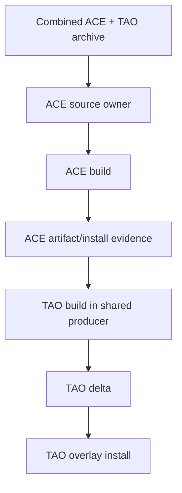

# BuildEngine

[TOC|Content]

**Status:** current architecture contract as of 15 September 2026. Known implementation deviations are explicitly noted; no new full verification run has been performed.

BuildEngine is a declarative C++23 build orchestration system whose current Windows integration is centered on Embarcadero C++Builder 13 / BCC64X. The system separates logical library contracts, technical execution, persistent logical state, artifact evidence, Common repository semantics and read-only presentation.

## Main principles

1. `admin/build-libraries.xml` and the related schemas are the declarative library/dependency contract.
2. BCC64X is the intended toolchain; compiler substitutions are not silently introduced.
3. Technical Actions are execution/ordering/diagnostic units, not persistent state authorities.
4. Persistent Current-State belongs to logical library scopes.
5. Artifact inventories are evidence/ownership, not Current-State.
6. BuildEngine-Common/DLL is the leading shared interpretation for logical libraries, extensions, repository paths, security and package semantics.
7. A physical directory is never automatically a logical library identity.
8. Server and Manager consume Common rather than implementing parallel interpretations.

## Application architecture



BuildEngine is the writer/orchestrator. Common is the shared reader/domain layer. Server is read-only presentation. Manager owns review workflows but uses Common Security/Repository services.

## Logical scopes and technical Actions

Typical logical scopes include:

```text
source
build:Release
build:Debug
test:Release
validation:Release
install:Release
install:Debug
install:common
install
publish
metadata
doxygen
doxygen:root
doxygen:<module>
ready:Release
ready:Debug
ready
```

Collection module scopes are dynamic and must be discovered consistently by execution and `--check`.

Technical Actions underneath a scope may have IDs and dependencies and may run in parallel where safe. They do not receive independent persistent Current-State.

## Logical Current-State

Canonical state:

```text
timestamp=<library timestamp>
upstream=<library>|<version>|<scope>|<upstream library timestamp>|<upstream completedAt>
...
completedAt=<completion timestamp>
state=completed
```

A scope is current only when its own library timestamp and its direct logical upstream completion chain still match.

Fingerprints, output files, command hashes, tree hashes and technical step markers are not Current-State authorities.

The required failure-safe lifecycle is:



**Known current gap:** scheduler invalidation/commit ownership is not yet fully wired for every stale/forced/failure path. This is a P0 repair item before another large run.

## Artifact evidence and ownership

Artifact evidence answers: which files did a logical component create or change?

The target manifest contract requires at least:

```text
relative path
size
SHA-256
```

Extensions additionally distinguish `created` and `modified`.



**Known current gap:** Common `ArtifactManifest` currently stores only path and size, so same-size content changes are not detected. Documentation that previously described SHA-256 as already implemented overstated the current code.

## Publish and ownership

Publish projects selected package files into the shared consumer tree. It must consume the same ownership model as artifact inventory/extension delta.

Publish manifests are publish evidence. They must not become a second independent ownership authority and stale publish evidence must not block a current producer.

**Known current gap:** current Publish code still treats other publish manifests as collision ownership without first establishing that this ownership is logically current. Shared extension payloads make this especially problematic.

## Library extensions

ACE 8.0.6 / TAO 4.0.6 is the reference case.



Important distinctions:

- ACE and TAO are separate logical libraries.
- TAO extends ACE.
- Source archive is acquired once by ACE.
- Native producer directories can be shared.
- Payload can be shared.
- logical state, metadata, SBOM, documentation and ownership remain separate.

TAO compilation may start once its actual ACE producer/install-artifact prerequisites are satisfied. A later ACE consumer-publish failure does not by itself prove that starting TAO compilation was wrong.

Do not add an artificial requirement that every extension build wait for base global publish/ready unless the affected physical operation truly needs that barrier.

## Common repository model

`LibraryCatalog` and `BuildEngineRepository` separate logical identity from physical payload/metadata placement.

For a normal library:

```text
Payload:  install/packages/zlib/1.3.2/
Metadata: install/packages/zlib/1.3.2/
```

For TAO:

```text
Payload:  install/packages/ace/8.0.6/
Metadata: install/packages/ace/8.0.6/.buildengine/extensions/tao/4.0.6/
```

**Known Common gaps discovered by audit:**

- `LibraryExists()` / `VersionExists()` still use physical package directories and may incorrectly reject an extension coordinate.
- extension `installed` can be inferred too early merely because the base payload directory exists.
- `PackageExporter` still copies complete physical package roots per logical component and is not ownership-safe for shared payloads.

These issues belong in Common; Server must not work around them locally.

## Documentation pipeline

Documentation is a reproducible build product.

A logical Doxygen scope performs exactly one Doxygen analysis producing HTML and optionally LaTeX. MiKTeX then compiles generated `refman.tex` when enabled.

The semantic API source is the library's logical installed/public API. Successful global consumer publish is not inherently required to document an already installed API.

**Known current gap:** implementation paths still use publish manifests for Doxygen input/dependencies when publish is configured. This is being removed.

### Collection libraries

Boost uses a simple `1 + N` scope model:

```text
1 root scope, non-recursive
N first-level module scopes, recursive
```

There is no logical `collection-prepare` scope in the current contract and no separate logical PDF scope per Boost module. `texify`/PDF publication are technical Actions within that module's logical Doxygen scope.

Module output is nested under the module root:

```text
documentation/boost/<version>/<module>/html/
documentation/boost/<version>/<module>/latex/
documentation/boost/<version>/<module>/refman.pdf
```

## Ready and consumer semantics

Variant install readiness, global publish, package smoke and aggregate library readiness are related but not identical concepts.

**Known current gap:** `ready:Debug` and `ready:Release` can currently represent different effective prerequisites while sharing the same wording. Ready/consumer semantics must be made symmetric and messages corrected before the next large run.

## Heartbeat and telemetry

Telemetry is evidence, not state.

**Known current gap:** the current `current=` heartbeat count mixes logical Current scopes with artifact-evidence no-op results. These counters must be separated.

## No-run gate

The current project phase explicitly avoids another long full build/make/check/clean-room run until the static P0/P1 repair list is complete.

The repair order is:

1. scheduler state lifecycle;
2. artifact/ownership model;
3. Common extension repository semantics;
4. Publish;
5. PackageExporter;
6. documentation input and collection migration/check;
7. ready/heartbeat semantics;
8. only then targeted verification.

## Documentation maintenance rule

The maintained project documentation is part of the architecture contract.

- BuildEngine core rules: `BuildEngine/CONTRACT-RULE.md`, `CONTRACTS.md`
- selfassessment/audit: BuildEngine `docs/SELFASSESSMENT_2026-09-15.md` and `docs/REPOSITORY_AUDIT_2026-09-15.md`
- public documentation: this `admin/server-docs` tree

Historical descriptions may be kept as provenance only when clearly marked historical. They must not look like active architecture instructions.

## Verification status

The repository cleanup and the identified implementation corrections are **not verified** until later explicitly approved BCC64X/Common/Server/Manager tests are performed.
