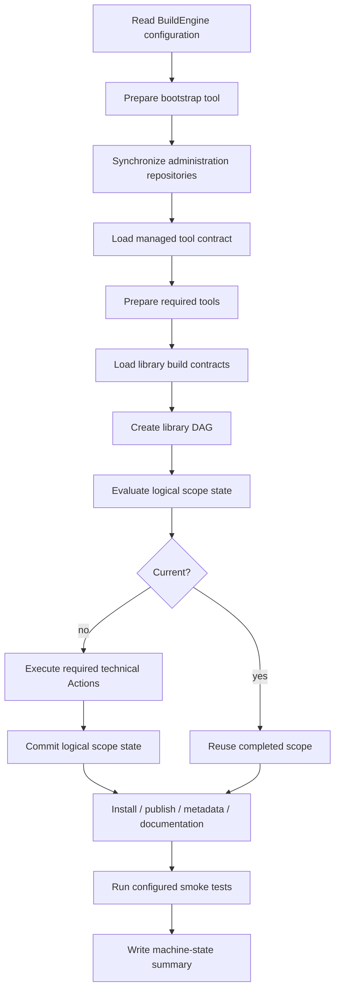
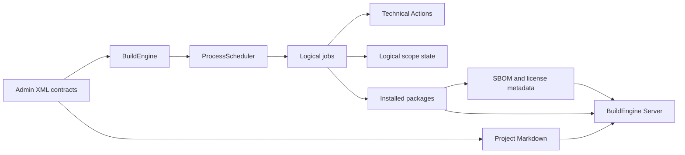
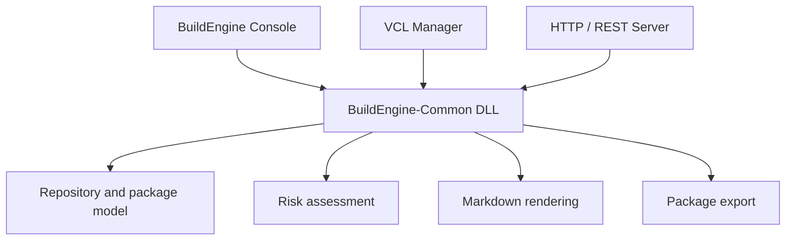

# BuildEngine

[TOC|Content]

BuildEngine is a declarative build orchestration system for reproducible C and C++ third-party library builds. Its current Windows integration is centered on Embarcadero C++Builder and the modern BCC64X toolchain. Library knowledge belongs in synchronized XML contracts, while the executable evaluates those contracts, prepares tools, creates a dependency graph, executes technical Actions, and records persistent state at logical library-scope granularity.

Related reference documents:

- [Configuration and command line](configuration.md)
- [Tool contract `build-tools.xml`](build-tools.md)
- [Library contract `build-libraries.xml`](build-libraries.md)
- [Documentation contract](documentation.md)
- [Tool overview](tools.md)
- [BuildEngine Server](server.md)

## Main responsibilities

BuildEngine separates configuration, orchestration, execution, evidence, and presentation:

1. **Configuration** resolves the production root, tools, repositories, build contracts, concurrency, tests, and documentation settings.
2. **Repository synchronization** updates the administration content before build evaluation.
3. **Tool preparation** discovers or installs tools described by the administration contract.
4. **Library contracts** define source acquisition, build variants, installation, publication, smoke tests, metadata, and documentation.
5. **The process scheduler** executes the dependency graph with a bounded worker count.
6. **Logical library-scope state** is the authoritative persistent incremental state for library work; technical Actions remain execution and diagnostic units inside a scope.
7. **Metadata generation** creates license information and CycloneDX SBOM data.
8. **Documentation generation** publishes library information and, where enabled, one Doxygen invocation per documentation scope that produces HTML and optionally LaTeX; MiKTeX compiles the generated LaTeX tree to PDF downstream.
9. **Aggregate documentation navigation** is rebuilt from the stable documentation tree after parallel documentation jobs have settled rather than from transient per-job snapshots.
10. **The server** presents resulting packages, documentation, SBOMs, usage information, and security evidence without becoming a second build-state authority.
11. **Project Markdown documentation** is maintained together with the code and XML contracts and is rendered live from the synchronized Admin repository.

## Execution flow



## Dependency relationships



## Core orchestration

The central execution path first prepares Git, synchronizes administration data, prepares the remaining required tools, processes the configured build files, and optionally runs smoke tests.

```cpp
int BuildEngine::Run() {
   PrintConfiguration();
   theEvents.AttachMachineState(theMachineState, theConfiguration.WorkerCount());

   theToolRegistry.Load(theConfiguration.ToolsFile());
   BuildVariables const theVariables { theConfiguration, theEnvironment, theToolRegistry };

   // Bootstrap, administration synchronization, managed tools and library DAGs
   // are evaluated before the final machine-state summary is emitted.

   return 0;
}
```

The production implementation contains the complete error handling, tool preparation, scheduler execution, heartbeat handling, metadata, documentation, and smoke-test logic. The fragment above is deliberately shortened for documentation.

## Heartbeat semantics

The heartbeat deliberately separates **worker utilization** from **logical job state**. A logical job can remain in the scheduler's `running` state while its technical Actions move through transitions; that job-state count is therefore not a worker count and may legitimately be larger than the configured worker pool.

The first heartbeat field instead counts active technical `:action:` activities, which correspond to worker-executed Actions. It is therefore bounded by the configured scheduler worker count. `open` is the separate count of all non-terminal logical jobs (`pending + ready + job-running`).

For example:

```text
[HEARTBEAT] running=4/4, open=32, ready=0, pending=12, current=406, passed=22, failed=0, blocked=0
```

means that all four workers are currently occupied while 32 logical jobs have not yet reached a terminal state. `open` and `running` intentionally answer different questions and must not be derived from the same counter.

The following activity lines identify the actual worker operations and retain elapsed time, latest activity age, and process-reported progress where available.

## Modern C++23 direction

BuildEngine prefers modern C++23 facilities over older idioms whenever the compiler and target library support them. Examples include ranges, concepts, `std::span`, `std::string_view`, designated initializers, structured bindings, `std::optional`, `std::format`, and value-oriented APIs.

A small C++23 example:

```cpp
#include <concepts>
#include <functional>
#include <ranges>
#include <span>

template<typename value_ty>
concept integral_value = std::integral<value_ty> && !std::same_as<value_ty, bool>;

template<integral_value value_ty>
[[nodiscard]] value_ty Sum(std::span<value_ty const> const spValues) {
   return std::ranges::fold_left(spValues, value_ty {}, std::plus {});
}
```

## Incremental state

BuildEngine distinguishes a **logical scope** from the technical Actions that implement it. Persistent state belongs to the logical library scope, for example:

```text
source
build:Release
build:Debug
test:Release
install:Release
install:common
install
publish
metadata
doxygen
doxygen:collection-prepare
doxygen:asio
pdf
```

Technical Actions remain important: they define execution order, worker activity, process logging, failure location, and diagnostics. They do not each create a second persistent state authority.

A completed logical state records the library contract timestamp and the state of every direct upstream **library** scope:

```text
timestamp=<library timestamp>
upstream=<library>|<version>|<scope>|<upstream library timestamp>|<upstream completedAt>
upstream=...
completedAt=<completion timestamp of this scope>
state=completed
```

A scope is current only when its own timestamp still matches and every stored upstream reference still resolves to the same upstream library timestamp and the same upstream `completedAt`. If one direct predecessor is rebuilt, its new completion time invalidates the downstream scope without requiring a global aggregate fingerprint.

This has several consequences:

- an existing output file cannot invent current state;
- a changed library contract timestamp invalidates only the affected logical chain;
- Release and Debug remain separate logical variants;
- technical Action count or layout can be used for one-time legacy-state migration, but new state is not persisted per Action;
- output hashes and fingerprints are not the persistent state authority;
- `--build` deliberately bypasses state reuse.

Legacy per-Action markers remain migration evidence only. The current state model expresses the dependency chain that the scheduler already executes rather than maintaining a second, partially independent dependency model.

## Build variants

Release and Debug are variants of the same library contract. Common arguments belong to the shared build node, while variant-specific arguments refine optimization level, binary names, installation directories, and other configuration-dependent values.

A typical conceptual shape is:

```xml
<build>
   <argument value="-G"/>
   <argument value="Ninja"/>
   <variant name="Release">
      <argument value="-DCMAKE_BUILD_TYPE:STRING=Release"/>
   </variant>
   <variant name="Debug">
      <argument value="-DCMAKE_BUILD_TYPE:STRING=Debug"/>
   </variant>
</build>
```

## Documentation pipeline

Central API documentation is itself a dependency graph rather than a post-build side effect:


The key distinctions are:

- HTML is always requested for a Doxygen-enabled scope.
- LaTeX is an additional output of the **same Doxygen invocation** when the effective `latex` setting is true.
- MiKTeX does not rerun Doxygen; it consumes the generated `refman.tex` tree.
- MiKTeX is a managed portable `when-used` tool with an explicit Doxygen-bound package preparation contract.
- Before per-library PDF jobs can run, one shared MiKTeX preflight initializes mutable common runtime state such as the `pdflatex` format.
- After the preflight succeeds, independent PDF jobs remain parallel.
- Collection libraries such as Boost are split from their published first-level directory structure into one root Doxygen scope plus one Doxygen scope per discovered module.
- `collection-prepare` is a real logical prerequisite for those collection scopes and therefore participates in persistent state.
- Parallel library jobs do not regenerate the global documentation index. The final aggregate index is generated after the documentation tree is stable.

The broad diagnostic run that established this design also demonstrated an important operational distinction: the managed MiKTeX runtime and package preparation can be valid while an individual document still fails in `texify`. Several libraries produced PDFs successfully in the same run in which other document scopes exposed LaTeX-specific errors. PDF failures are therefore diagnosed per document from their own MiKTeX logs after the shared runtime prerequisite has succeeded.

The complete contract is documented in [documentation.md](documentation.md).

## Important components

| Component | Responsibility |
| --- | --- |
| `BuildEngine` | Top-level orchestration and build-file processing |
| `BuildEngineConfiguration` | Effective local configuration and paths |
| `RepositorySync` | Synchronization of administration repositories |
| `ToolConfiguration` / `ToolJobs` | Managed tool contracts and preparation |
| `LibraryConfiguration` | Declarative library contracts |
| `LibraryJobBuilder` | Translation of library contracts into executable jobs |
| `ProcessScheduler` | Bounded concurrent DAG execution of logical jobs and technical Actions |
| `LibraryStepState` | Logical library-scope state and direct-upstream timestamp/completion chain |
| `MetadataJob` | License and CycloneDX metadata |
| `CentralDocumentationJob` / `DocumentationPipelineJob` / `CollectionDocumentationJob` | Documentation profiles, single-pass HTML/LaTeX Doxygen, collection scopes, downstream PDF jobs, and aggregate navigation |
| `SmokeJobBuilder` | Consumer/integration smoke tests |
| `BuildEngine-Common` | Shared repository, HTTP, security, package, Markdown, and utility services |

## Shared architecture

BuildEngine is no longer only one console executable. The project now has several presentation surfaces: the command-line application, the VCL-based manager, and the local HTTP/REST server. They must not develop separate interpretations of libraries, packages, security findings, or risk state.

Shared domain and infrastructure functionality therefore belongs in `BuildEngine-Common`. The same classes can be consumed by the console application, the graphical VCL application, and the server. Risk assessment is an important example: the assessment model should have one implementation even though its results can be presented in a console table, a native Windows UI, JSON, or an HTML page.



This separation keeps presentation technology replaceable while the technical interpretation remains consistent.

## Self-documenting project contract

The Markdown files under `admin/server-docs` are part of the engineering contract, not an after-the-fact manual. They are synchronized with the Admin repository and rendered directly by the server.

The maintenance rule is therefore:

- changes to local configuration semantics update [configuration.md](configuration.md),
- changes to `build-tools.xml` update [build-tools.md](build-tools.md) and, when tools or roles change, [tools.md](tools.md),
- changes to `build-libraries.xml` update [build-libraries.md](build-libraries.md),
- changes to documentation generation update [documentation.md](documentation.md),
- changes to HTTP/Markdown behavior update [server.md](server.md),
- architectural consequences are reflected in this document and in [story.md](story.md) where they materially change the project narrative.

Relative links between these Markdown files are used so the documentation remains navigable inside the server's `/manual/` namespace. Live project documents use `[TOC|Content]` after the document title so the renderer can generate consistent in-document navigation.

## Failure model

A useful conceptual distinction is:

- a **technical Action failure** means one concrete execution step did not complete successfully;
- a **dependency failure** means the logical job could not run because a prerequisite failed;
- a **state/current failure** means the logical scope cannot be reused because its own or a direct upstream timestamp/completion reference no longer matches;
- a **state commit failure** means the logical scope completed technically but its persistent state could not be committed;
- a **generated-output failure** means a required downstream product such as a PDF was not produced even though earlier prerequisites may have succeeded.

Nested example:

- Library
  - Source
    - Download
    - Extract
  - Build
    - Release
    - Debug
  - Install
  - Metadata
  - Documentation
    - Doxygen HTML + optional LaTeX
    - collection preparation/root/module scopes where applicable
    - shared MiKTeX runtime preflight when PDF is required
    - optional per-scope MiKTeX PDF
    - one final aggregate documentation index

## Design principle

The system is intentionally contract-driven. Compiler-specific integration remains explicit and verifiable, while reusable orchestration logic should stay generic. In the current third-party project, alternative compiler paths are not silently substituted for BCC64X: compatibility problems must remain visible so the integration result is meaningful.
