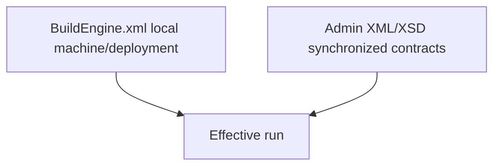

# BuildEngine Configuration and Command Line

[TOC|Content]

**Status:** current configuration contract as of 19 September 2026. The Library-FSM architecture is active. The current `build-libraries.xml` declares schemaVersion 15, while `schemas/build-libraries.xsd` still declares fixed version 14; this mismatch is a known contract defect and must be resolved before schema validation can be considered current.

BuildEngine combines one local machine/deployment configuration with synchronized administration contracts.

- `BuildEngine.xml` selects production root, concurrency, repository synchronization, feature switches and server endpoint.
- `admin/build-tools.xml` describes managed tools.
- `admin/build-libraries.xml` describes logical libraries, versions, dependencies and build contracts.
- `admin/build-documentation.xml` describes shared documentation policy and library/collection overrides.
- generated `tools.xml` / `machine-state.xml` are runtime evidence, not library knowledge.

Related documents:

- [BuildEngine architecture](buildengine.md)
- [Library contract](build-libraries.md)
- [Library extensions](library-extensions.md)
- [Documentation contract](documentation.md)
- [Server and REST interface](server.md)
- [Tool contract](build-tools.md)

## Local `BuildEngine.xml`

Unless explicitly supplied, BuildEngine uses the configuration file next to the executable according to the current CLI contract.

Representative structure:

```xml
<buildEngine schemaVersion="5">
   <parameters
      companyName="adecc Systemhaus GmbH"
      rsvars="C:\Program Files (x86)\Embarcadero\Studio\37.0\bin\rsvars.bat"
      root="D:\local\embarcadero\test_v3"
      heartbeatSeconds="20"
      workers="4"
      queueLength="8"
      testJobs="4"
      serverLanguage="en"
      serverAddress="127.0.0.1"
      serverName="localhost"
      serverPort="8765"
      managerLanguage="en"
      WithTests="true"
      WithSmokeTests="true"
      WithDoc="true"
      WithDoxygen="true"
      WithLatex="true"
      configurations="All"
      buildTools="admin\build-tools.xml"
      toolsState="admin\tools.xml"
      machineState="admin\machine-state.xml"
      toolsRoot="tools"
      sourceRoot="src"
      buildRoot="build"
      installRoot="install"
      repositoriesRoot="repositories"
      logsRoot="logs\buildengine"/>

   <repository id="admin"
               url="https://github.com/adeccscholar/BuildEngine-Admin.git"
               branch="main"
               checkout="BuildEngine-Admin">
      <sync source="admin" target="admin"/>
   </repository>

   <build file="admin\build-libraries.xml"/>
</buildEngine>
```

Exact worker counts, local paths and endpoint values are deployment choices and not synchronized library knowledge.

## Important parameters

| Parameter | Meaning |
| --- | --- |
| `root` | central BuildEngine production root |
| `rsvars` | C++Builder environment initialization |
| `workers` | technical ProcessScheduler/worker limit for released jobs |
| `queueLength` | technical execution queue capacity |
| `testJobs` | parallelism supplied to supported test runners |
| `heartbeatSeconds` | heartbeat interval |
| `WithTests` | enable upstream/library tests |
| `WithSmokeTests` | enable consumer/package smoke tests |
| `WithDoc` | enable generated project/library information |
| `WithDoxygen` | enable generic Doxygen API documentation |
| `WithLatex` | local default for LaTeX/PDF; synchronized policy may override it |
| `configurations` | selected build variants, for example `All` |
| `serverAddress` | concrete bind interface, default `127.0.0.1` |
| `serverName` | accepted server/Host identity, default `localhost` |
| `serverPort` | TCP port, default `8765` |
| `buildTools` | synchronized managed-tool contract |
| `toolsState` | generated effective tool evidence |
| `machineState` | generated execution summary; not library Current-State authority |
| `sourceRoot` | source workspace |
| `buildRoot` | build/generated workspace |
| `installRoot` | package/payload root |
| `repositoriesRoot` | repository checkouts |
| `logsRoot` | BuildEngine logs |

## Local versus synchronized authority



| Concern | Local | Admin contract |
| --- | ---: | ---: |
| Production root | yes | no |
| Server endpoint | yes | no |
| Worker/queue count | yes | no |
| Repository checkout locations | yes | repository content is synchronized |
| Tool definitions/versions | no | yes |
| Library identities/versions/build contracts | no | yes |
| Direct library dependencies / FSM requirements | no | yes |
| Documentation defaults/capability | local feature switch | project/library/module policy |
| Security identity | no | yes |

A local setting must not become hidden alternative library/build knowledge.

## Server endpoint

Example:

```xml
serverAddress="10.20.30.15"
serverName="buildengine.intern.example"
serverPort="8765"
```

`serverAddress` is intentionally one concrete interface. `common::HttpServer` rejects unspecified/multicast addresses such as `0.0.0.0` or `::`.

`serverName` is used for Host validation. Loopback remains the safe default. Non-loopback operation requires the intended protected network/firewall boundary.

The standalone Server reads the same `BuildEngine.xml`; invocation options such as `--root`, `--address`, `--name` and `--port` are one-run overrides, not a second persistent configuration store.

## Concurrency

The global invariant is:

$$
N_{active} \leq N_{workers}
$$

Technical WorkItems released by independent Library-FSMs can execute concurrently when their local dependencies and physical resources allow it. The worker limit bounds technical execution; it does not define the fachlich library lifecycle.

There are no separate architectural worker pools for Build, Test or Documentation. A future resource-slot contract must remain generic.

Shared mutable prerequisites are explicit. Example: one managed MiKTeX runtime preflight can initialize shared runtime state before independent document `texify` actions run.

## `admin/build-tools.xml`

Defines reproducible tools and browser assets. Tools can be discovered or provisioned through managed download/extract/generate/prepare/probe workflows.

MiKTeX is provisioned when effective documentation configuration requires LaTeX/PDF. Runtime package installation during individual `texify` calls remains disabled.

See [build-tools.md](build-tools.md).

## `admin/build-libraries.xml`

This is the primary declarative library contract.

A library can describe:

- metadata/licenses/security identity,
- source acquisition and validation,
- build arguments and variants,
- tests/validation,
- installation,
- publish/consumer view,
- smoke tests,
- extension relationships.

The library `timestamp` is the logical contract-change token used by persistent logical scope state.

Technical Actions inside these phases do not become independent persistent Current-State entries.

See [build-libraries.md](build-libraries.md).

## `admin/build-documentation.xml`

Defines shared documentation policy and overrides.

Effective settings can be inherited in this order:

```text
BuildEngine.xml feature/default
-> build-documentation.xml root/default
-> library override
-> collection module override
```

`WithDoxygen=false` is a hard local stop for Doxygen generation. `WithLatex` is a local default that synchronized policy may refine.

### One Doxygen run per logical scope

When LaTeX is effective, BuildEngine does not start a second Doxygen analysis. The same Doxygen invocation emits HTML and LaTeX; MiKTeX compiles `refman.tex` afterward.

### Collection libraries

`collection="true"` means the library is documented as one root scope plus one recursive scope per discovered first-level module.

The discovery source is the library's **logical public/install API view**, not a requirement that global consumer publish already succeeded.

Current logical topology:

```text
doxygen:root
doxygen:<module-1>
doxygen:<module-2>
...
```

There is no current logical `collection-prepare` scope and no separate logical module-PDF scope.

`--check` uses the same discovery/scope source and the same Library-FSM/orchestrator semantics as execution, but remains read-only and submits no technical library jobs.

See [documentation.md](documentation.md).

## Generated state/evidence files

### `admin/tools.xml`

Generated effective managed-tool state.

### `admin/machine-state.xml`

Generated broader execution/machine summary. It is **not** the persistent per-library Current-State authority.

### logical library state

Persistent logical scope state lives below:

```text
<ProductionRoot>/.buildengine/libraries/<library>/<version>/<safe-scope>.state
```

Canonical content:

```text
timestamp=<library timestamp>
upstream=<library>|<version>|<scope>|<upstream library timestamp>|<upstream completedAt>
...
completedAt=<completion timestamp>
state=completed
```

Fingerprints, command hashes, output files and technical Step markers are not Current-State authority.

## Commands

General form:

```text
BuildEngine [command] [options] [configuration-file]
BuildEngine --help
BuildEngine --version
```

### `--make`

Default incremental command. The declarative contract is compiled into Library-FSM definitions; current scopes transition without technical work and stale scopes release WorkItems for execution.

### `--build`

Forces selected logical work while keeping the same Library-FSM architecture. A scope is invalidated before its technical execution so a failed forced build cannot leave old success behind.

### `--check`

Read-only evaluation through the same declarative definitions and Library-FSM/orchestrator semantics used by execution. It submits no technical library jobs and changes no persistent state. Dynamic collection documentation scopes use the same discovery as execution.

Examples after the active library IDs are confirmed from the current synchronized catalog:

```text
BuildEngine --check --lib=<library> --libversion=<version>
```

Do not hard-code historical combined IDs such as `ace-tao` into documentation when the active catalog uses separated logical components.

### `--show`

Displays effective configuration.

### `--monitor`

Synchronizes administration data and performs the configured security-monitoring workflow.

### `--parse`

Reserved/recognized according to the current CLI implementation; if not implemented by the current source, it must report that explicitly rather than silently performing another action.

## Selection

`--lib` / `--libversion` identify logical library coordinates and are case-sensitive according to the current contract.

Any command that does not yet support library selection must reject it rather than silently operating on an unintended graph.

## Current verification boundary

The historical static no-run gate from the 15 September repair phase has been superseded by the active Library-FSM implementation.

Verification remains staged: architecture changes are checked statically and with targeted BCC64X runs first; a complete Clean-Room run remains a separate evidence milestone.

The current BZip2/libarchive capability has its own explicit gate: the BuildEngine-private libarchive runtime must be rebuilt and must report `filter bzip2 : in-proc` before the hidden Bash `.tar.bz2` tool contract is restored.

There is also a current schema-version mismatch: `build-libraries.xml` declares version 15, while `schemas/build-libraries.xsd` still fixes version 14. Until this is corrected, schema validation must not be described as current.

## Validation checklist

- [ ] Production root is the intended central tree.
- [ ] Server endpoint matches the intended network boundary.
- [ ] Admin synchronization is configured.
- [ ] `build-libraries.xml` and `schemas/build-libraries.xsd` agree on the schema version.
- [ ] worker/queue/test parallelism is intentional.
- [ ] Library-FSM state and persistent logical scope state remain separate.
- [ ] technical ProcessJobs/Actions are not treated as library-state authority.
- [ ] tests/documentation feature switches are explicit.
- [ ] documentation inheritance/collection settings are intentional.
- [ ] generated `tools.xml`/`machine-state.xml` are not hand-authored library knowledge.
- [ ] physical package paths are not used as logical library identity.
- [ ] private libarchive capability banner matches the archive formats used by active tool contracts.
- [ ] contract and maintained Markdown pages are updated together.
