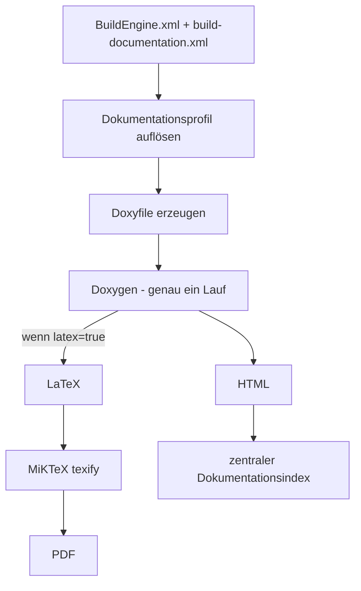
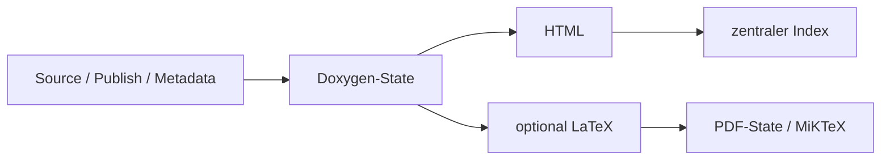

# BuildEngine-Dokumentationsvertrag

BuildEngine behandelt Dokumentation als reproduzierbares Buildprodukt. Die Dokumentationspipeline trennt lokale Grundeinstellungen, synchronisierte Projektregeln, Doxygen-Erzeugung, PDF-Kompilierung und die reine Serverdarstellung.

Zentrale Dateien:

- `BuildEngine.xml` – lokale Grundeinstellungen
- `admin/build-documentation.xml` – synchronisierter Dokumentationsvertrag
- `admin/schemas/build-documentation.xsd` – XML-Schema
- `admin/build-tools.xml` – Doxygen, Graphviz, MiKTeX und Browser-Ressourcen

Verwandte Dokumente:

- [BuildEngine-Konfiguration](configuration.md)
- [Werkzeugvertrag `build-tools.xml`](build-tools.md)
- [Werkzeugübersicht](tools.md)
- [Bibliotheksvertrag `build-libraries.xml`](build-libraries.md)

## Grundprinzip

Die zentrale API-Dokumentation folgt diesem Ablauf:



**Wesentliche Regel:** Wenn LaTeX benötigt wird, erzeugt derselbe Doxygen-Lauf gleichzeitig HTML und LaTeX. Es gibt keinen zweiten Doxygen-Durchlauf für PDF.

MiKTeX ist ein eigener nachgelagerter technischer Schritt, weil eine Änderung der MiKTeX-Version nur die PDF-Kompilierung und nicht die Doxygen-Analyse erneut ausführen soll.

## Konfigurationsebenen

Die effektive Dokumentationskonfiguration wird aus mehreren Ebenen gebildet:

```text
BuildEngine.xml
   WithDoc
   WithDoxygen
   WithLatex          = lokale LaTeX-Grundeinstellung
        ↓
build-documentation.xml
   Rootprofil         = synchronisierte Defaults/Overrides
        ↓
<library ...>         = konkrete Library-Overrides
```

Eine Library benötigt keinen eigenen `<library>`-Eintrag. Ohne Override erbt sie das Rootprofil.

## `BuildEngine.xml`

Beispiel:

```xml
<parameters
   WithDoc="true"
   WithDoxygen="true"
   WithLatex="true"
   ... />
```

### `WithDoc`

Aktiviert BuildEngine-generierte Informationsdokumentation wie Übersichtsseiten, Projekttexte, Lizenzinformationen und SBOM-Verknüpfungen.

Standard: `false`.

### `WithDoxygen`

Erlaubt die zentrale Doxygen-API-Dokumentation.

Standard: `false`.

Ist `WithDoxygen="false"`, gibt es weder zentral erzeugtes Doxygen-HTML noch Doxygen-LaTeX/PDF.

### `WithLatex`

`WithLatex` ist die **lokale Grundeinstellung** für LaTeX/PDF, kein absoluter Master-Schalter.

Standard: `true`.

Die Auflösung ist:

1. Startwert ist `BuildEngine.xml/@WithLatex`.
2. Ein optionales `buildDocumentation/@latex` überschreibt diesen Default projektweit.
3. Ein optionales `<library latex="...">` überschreibt den Wert für genau diese Library.

Beispiel – global normalerweise PDF, Boost aber nicht:

```xml
<!-- BuildEngine.xml -->
WithLatex="true"
```

```xml
<!-- build-documentation.xml -->
<library id="boost" latex="false"/>
```

Beispiel – global normalerweise kein PDF, pugiXML aber ausdrücklich doch:

```xml
<!-- BuildEngine.xml -->
WithLatex="false"
```

```xml
<!-- build-documentation.xml -->
<library id="pugixml" latex="true"/>
```

`WithDoxygen=false` kann durch `latex=true` nicht überwunden werden, weil LaTeX aus Doxygen erzeugt wird.

## `build-documentation.xml`

Grundform:

```xml
<buildDocumentation
   schemaVersion="1"
   doxygen="true"
   source="false"
   inlineSource="false"
   publicOnly="false">

   <option name="USE_MATHJAX" value="YES"/>
   <option name="MATHJAX_VERSION" value="MathJax_3"/>
   <option name="MATHJAX_FORMAT" value="SVG"/>
   <option name="MATHJAX_RELPATH" value="/js/mathjax/es5"/>

   <library id="boost" publicOnly="true" latex="false">
      ...
   </library>
</buildDocumentation>
```

`latex` am Root ist optional. Fehlt das Attribut, wird `WithLatex` aus `BuildEngine.xml` als Default verwendet.

## Root- und Library-Attribute

| Attribut | Standard/Vererbung | Bedeutung |
| --- | --- | --- |
| `schemaVersion` | erforderlich, aktuell `1` | Vertragsversion. |
| `doxygen` | Root: `true` | Aktiviert Doxygen für das Profil. |
| `latex` | Root: erbt `WithLatex` | Aktiviert die zusätzliche LaTeX-Ausgabe im selben Doxygen-Lauf. |
| `source` | Root: `false` | Doxygen Source Browser. |
| `inlineSource` | Root: `false` | Quelltext inline; impliziert `source=true`. |
| `publicOnly` | Root: `false` | Reduziert API-Sicht auf öffentliche Bereiche und ergänzt Standard-Excludes. |

Library-Attribute überschreiben jeweils den geerbten Wert.

## `<define>`

`define` beschreibt Präprozessor-Makros ausschließlich für die Doxygen-Sicht.

```xml
<define name="__cplusplus" value="202302L"/>
<define name="BOOST_NOEXCEPT" value="noexcept"/>
<define name="DOXYGEN_INVOKED"/>
```

Semantik:

- fehlendes `value` → normales vordefiniertes Makro; Doxygen behandelt es wie einen gesetzten Define,
- `value=""` → explizit leere Ersetzung,
- nichtleerer Wert → exakte Ersetzung,
- function-like Makros werden unterstützt.

Diese Definitionen ändern **nicht** Compiler, ABI oder den Library-Build. Sie sind ausschließlich Dokumentationswissen.

## `<option>`

`option` setzt einen Doxygen-Konfigurationswert nach Erzeugung des generischen Doxyfiles und überschreibt daher bewusst dessen Default.

```xml
<option name="SHOW_INCLUDE_FILES" value="NO"/>
<option name="CALL_GRAPH" value="YES"/>
```

Der Name darf nur Buchstaben, Ziffern und `_` enthalten. Zeilenumbrüche in Namen oder Werten sind nicht zulässig.

Library-spezifische Doxygen-Optionen sollten nur dort gesetzt werden, wo sich die Library tatsächlich vom gemeinsamen Profil unterscheidet.

## `<exclude>`

```xml
<exclude pattern="*/tests/*"/>
<exclude pattern="*/examples/*"/>
<exclude pattern="*/detail/*"/>
```

Excludes filtern publizierte Doxygen-Eingaben. Bei `publicOnly=true` ergänzt BuildEngine typische interne Bereiche wie `detail`, `impl`, `preprocessed`, `aux_` und `cpp03`.

## Gemeinsames Doxyfile

BuildEngine generiert genau ein Doxyfile für die zentrale API-Dokumentation einer Library.

Wenn LaTeX **nicht** aktiv ist:

```text
GENERATE_HTML = YES
GENERATE_LATEX = NO
```

Wenn LaTeX aktiv ist:

```text
GENERATE_HTML = YES
GENERATE_LATEX = YES
LATEX_OUTPUT = latex
USE_PDFLATEX = YES
PDF_HYPERLINKS = YES
LATEX_BATCHMODE = YES
PAPER_TYPE = a4
```

Danach wird Doxygen **einmal** ausgeführt und erzeugt in diesem Lauf:

```text
<DocumentationRoot>/<library>/<version>/html/
<DocumentationRoot>/<library>/<version>/latex/   # nur wenn aktiviert
```

Damit stammen HTML und LaTeX aus exakt derselben Analyse und demselben Quellzustand.

## Doxygen-HTML

Das gemeinsame Profil erzeugt unter anderem:

- HTML-Suche,
- Tree View,
- Source Browser nach Profil,
- Klassen- und Kollaborationsgraphen,
- Include-/Included-by-Graphen,
- Verzeichnishierarchie,
- Graphviz-SVG,
- zentrale Projekt-/Lizenz-/SBOM-Seiten.

Call- und Caller-Graphen bleiben standardmäßig aus, weil sie bei großen Third-Party-Projekten sehr teuer und häufig wenig hilfreich sind. Sie können gezielt über `<option>` aktiviert werden.

## MathJax

Doxygen-HTML verwendet den von BuildEngine verwalteten MathJax-3-Bestand:

```xml
<option name="USE_MATHJAX" value="YES"/>
<option name="MATHJAX_VERSION" value="MathJax_3"/>
<option name="MATHJAX_FORMAT" value="SVG"/>
<option name="MATHJAX_RELPATH" value="/js/mathjax/es5"/>
```

Damit greift die zentrale Dokumentation nicht auf ein externes CDN zu. Der BuildEngine Server stellt `/js/mathjax/...` aus dem Managed Tool `web-mathjax` bereit.

## Graphviz

Graphviz ist Teil der reproduzierbaren Dokumentationswerkzeugkette. Seine Version beeinflusst den Doxygen-State, weil sich erzeugte Diagramme mit einer Graphviz-Version ändern können.

Die aktuell verwalteten Werkzeuge stehen in [tools.md](tools.md).

## MiKTeX und PDF

MiKTeX ist in `build-tools.xml` als `required="when-used"` definiert. Es wird nur benötigt, wenn mindestens eine Library effektiv `latex=true` hat.

Der Doxygen-Lauf hat zu diesem Zeitpunkt den LaTeX-Baum bereits erzeugt. MiKTeX führt **keinen Doxygen-Aufruf** aus, sondern kompiliert ausschließlich `refman.tex`:

```text
texify --pdf --batch --max-iterations=5 --tex-option=--disable-installer refman.tex
```

Automatische Paketinstallation ist während des PDF-Builds deaktiviert. Fehlt ein benötigtes TeX-Paket, ist das ein reproduzierbarer Tool-Provisionierungsfehler und wird nicht durch einen stillen Download im Build verdeckt.

Das veröffentlichte PDF liegt unter:

```text
<DocumentationRoot>/<library>/<version>/pdf/<library>-<version>.pdf
```

## Technische States

Es gibt **keinen eigenen LaTeX-Doxygen-State mehr**. HTML und LaTeX gehören zum selben Doxygen-Erzeugungsschritt.



### Doxygen-State

Der Doxygen-State berücksichtigt insbesondere:

- Library-ID, Version und Timestamp,
- Doxygen-Version,
- Graphviz-Version,
- effektives Doxygen-Profil,
- ob zusätzlich LaTeX benötigt wird,
- Publish-Manifest,
- Lizenzinformationen,
- SBOM-Eingaben.

Eine Änderung `latex=false -> true` muss den Doxygen-State invalidieren, weil derselbe Lauf nun einen zusätzlichen Output erzeugen muss.

Eine MiKTeX-Versionsänderung darf den Doxygen-State dagegen **nicht** invalidieren.

### PDF-State

Der PDF-State berücksichtigt:

- die von Doxygen erzeugten stabilen LaTeX-Quelldateien,
- die MiKTeX-Version.

MiKTeX-Ausgaben wie `.aux`, `.log` oder das erzeugte `refman.pdf` sind nicht Teil des eigenen Input-Fingerprints. Der PDF-Schritt darf sich nicht durch seine eigene Ausgabe selbst invalidieren.

## Zentraler Dokumentationsindex

`documentation/index.html` ist eine aggregierte Sicht und kein Beweis für die Aktualität einer einzelnen Library-Dokumentation.

Der Index wird deshalb billig aus bereits vorhandenen Library-Dokumentationen rekonstruiert. Ein fehlender zentraler Index darf nicht alle teuren Doxygen-Schritte invalidieren.

## Markdown-Dokumentation des Projekts

Projekt-Markdowns liegen synchronisiert unter:

```text
admin/server-docs/
```

Der Server liest sie bei jeder HTTP-Anfrage direkt aus diesem synchronisierten Verzeichnis. Es gibt keine Kopie und keinen Markdown-Cache, der nach einer Repository-Synchronisation aktualisiert werden müsste.

Relative Markdown-Links werden bewusst verwendet:

```markdown
[Werkzeuge](tools.md)
[Tool-Vertrag](build-tools.md)
[Bibliotheksvertrag](build-libraries.md)
```

Wird beispielsweise `documentation.md` als `/manual/documentation.md` angezeigt, löst der Browser `tools.md` zu `/manual/tools.md` auf. Der Server rendert das Ziel wieder live als Markdown.

## Aktuelle Projekt-Markdowns

Die Dokumentation besteht mindestens aus:

- `story.md` – Projektgeschichte und Zielsetzung,
- `buildengine.md` – Architektur und BuildEngine-Konzept,
- `server.md` – HTTP/REST-Server,
- `configuration.md` – lokale Konfiguration und CLI,
- `documentation.md` – dieser Dokumentationsvertrag,
- `build-tools.md` – XML-Vertrag der Werkzeuge,
- `build-libraries.md` – XML-Vertrag der Libraries,
- `tools.md` – Übersicht der tatsächlich verwendeten Werkzeuge.

## Beispiele

### HTML und PDF standardmäßig aktiv

```xml
<!-- BuildEngine.xml -->
WithDoxygen="true"
WithLatex="true"
```

```xml
<!-- build-documentation.xml -->
<buildDocumentation schemaVersion="1" doxygen="true">
   ...
</buildDocumentation>
```

Ergebnis: ein Doxygen-Lauf erzeugt HTML und LaTeX; MiKTeX erzeugt danach PDF.

### Nur HTML für Boost

```xml
<library id="boost" publicOnly="true" latex="false">
   ...
</library>
```

Ergebnis: derselbe zentrale Doxygen-Pfad erzeugt für Boost nur HTML; MiKTeX wird für Boost nicht ausgeführt.

### PDF nur für ausgewählte Library trotz lokalem Default `false`

```xml
<!-- BuildEngine.xml -->
WithDoxygen="true"
WithLatex="false"
```

```xml
<library id="pugixml" latex="true"/>
```

Ergebnis: pugiXML erzeugt HTML + LaTeX in einem Doxygen-Lauf und anschließend PDF; andere Libraries erben `false`, sofern der Root-Vertrag nichts anderes vorgibt.

## Pflegegrundsatz

Die Markdown-Dokumentation ist Teil des Projekts und wird zusammen mit Code und XML-Verträgen gepflegt.

Daraus folgt:

1. Neue XML-Parameter werden in der zugehörigen Markdown-Referenz dokumentiert.
2. Neue Werkzeuge oder Versions-/Rollenänderungen werden in [tools.md](tools.md) nachgeführt.
3. Änderungen an `build-tools.xml` werden in [build-tools.md](build-tools.md) berücksichtigt.
4. Änderungen am Library-Vertrag werden in [build-libraries.md](build-libraries.md) berücksichtigt.
5. Änderungen an Dokumentationspipeline, Serverdarstellung oder Linkverhalten werden hier bzw. in [server.md](server.md) beschrieben.
6. Die Dokumentation wird nicht erst nachträglich als separate Aufgabe betrachtet, sondern ist Bestandteil derselben Änderung.
