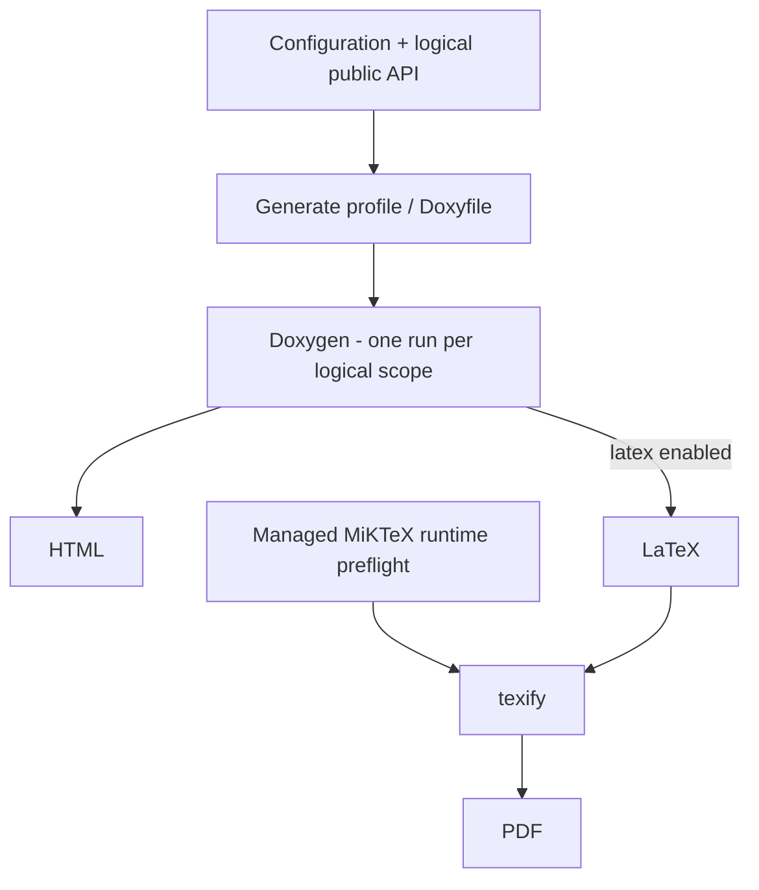
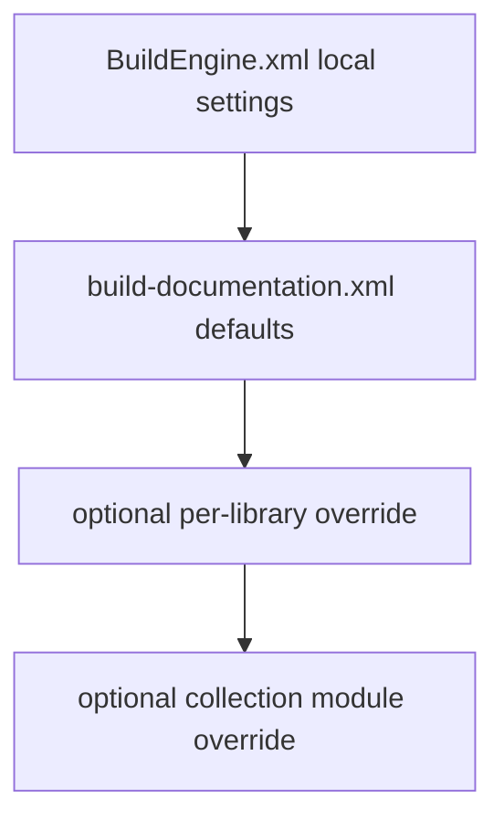
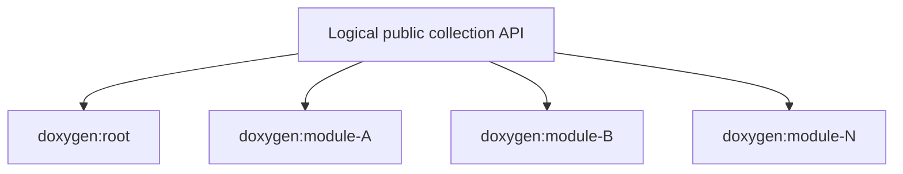

# BuildEngine Documentation Contract

[TOC|Content]

**Status:** current contract as of 25 September 2026. Documentation is integrated into the active Library-FSM architecture. Individual end-to-end documentation paths remain subject to targeted BCC64X/runtime verification.

BuildEngine treats documentation as a reproducible build product. `Documentation` is a first-class Library-FSM state; below it, hierarchical runtime substates select standard, collection or linked documentation and the applicable Doxygen/PDF stages. Persistent Current-State remains attached to logical documentation scopes, not to those runtime substates.

Central files:

- `BuildEngine.xml` – local base settings
- `admin/build-documentation.xml` – synchronized documentation contract
- `admin/schemas/build-documentation.xsd` – XML schema
- `admin/build-tools.xml` – Doxygen, Graphviz, MiKTeX and browser resources

## Fundamental rule

A logical Doxygen scope owns one Doxygen analysis. That one Doxygen run produces:

- HTML,
- optional LaTeX.

MiKTeX may subsequently compile the generated `refman.tex`. It must not trigger a second Doxygen analysis.



Technical actions are execution units. They are not independent persistent Current-State authorities.

## Logical documentation state

Persistent state belongs to the logical library scope, not to Doxygen/MiKTeX technical steps.

Canonical state:

```text
timestamp=<library timestamp>
upstream=<library>|<version>|<scope>|<upstream library timestamp>|<upstream completedAt>
...
completedAt=<completion timestamp>
state=completed
```

Fingerprints, output existence, command hashes and technical step markers are not documentation Current-State authorities.

## Documentation input

The documented API is selected by the effective documentation contract. Standard/collection documentation normally uses the logical public/install API view; extension documentation can explicitly use `input="source"` when the logical API is defined by an extension source subtree.

A successful global consumer publish is not a semantic prerequisite for documentation.

```text
logical documentation input != ownership of the global consumer tree
```

For TAO, `input="source"` resolves from the extension SourceRoot (`ACE_wrappers/TAO`), while references to ACE are connected through the explicit Doxygen tagfile relationship.

## Configuration layers

Effective documentation settings are resolved from:



A library does not require an explicit `<library>` entry when defaults are sufficient.

## Main settings

`WithDoxygen` enables central Doxygen documentation.

`WithLatex` supplies the local default for LaTeX/PDF and may be refined by synchronized project/library policy.

`source`, `inlineSource`, `publicOnly`, `<define>`, `<option>` and `<exclude>` remain presentation/input-policy controls. They do not change compiler ABI or library build semantics.

## Normal library output

Target layout:

```text
<DocumentationRoot>/<library>/<version>/
   html/
      index.html
   latex/          # when enabled
      refman.tex
   refman.pdf      # when enabled
   metadata/
```

HTML and LaTeX come from the same Doxygen invocation.

## Collection libraries

Some libraries are collections of many first-level APIs. Boost is the reference/stress case.

The current contract is deliberately simple: **1 + N logical Doxygen scopes**.

1. one root scope;
2. one scope for every discovered first-level directory.

### Root scope

- non-recursive;
- documents files directly in the common collection root.

### Module scope

- exactly one per first-level directory;
- recursive within that module;
- independent output root.



There is **no logical `collection-prepare` scope** in the current contract.

There is **no separate logical PDF scope for every collection module**. When PDF is enabled, the module's technical chain remains inside the same logical Doxygen scope:

```text
prepare -> clean -> doxygen -> texify -> publish-pdf
```

## Collection output layout

Root:

```text
<DocumentationRoot>/<library>/<version>/html/
<DocumentationRoot>/<library>/<version>/latex/
<DocumentationRoot>/<library>/<version>/refman.pdf
```

Module:

```text
<DocumentationRoot>/<library>/<version>/<module>/html/
<DocumentationRoot>/<library>/<version>/<module>/latex/
<DocumentationRoot>/<library>/<version>/<module>/refman.pdf
```

Historical layouts such as `html/<module>`, `latex/<module>` or a central `pdf/<module>.pdf` directory are not the current collection contract.

## Collection discovery and `--check`

Execution and `--check` use the same collection discovery. The declarative compiler initially marks a collection as dynamically scoped; when the Documentation state is reached, the discovery materializes:

```text
doxygen:root
doxygen:<module>
...
```

The read-only check uses the same Library-FSM/orchestrator semantics and materializes these scopes only when the reached Documentation state requires them. It submits no technical documentation jobs and does not mutate persistent state.

## State migration

State migration must preserve completed work whenever semantic equivalence can be proven.

A migration may retain an existing `completedAt` only when library timestamp and the exact direct logical upstream chain remain equivalent.

The earlier destructive collection-state migration path has been removed. Dynamic collection scopes are materialized from current discovery instead of deleting prior state merely because the technical topology changed.

## Extensions

Logical documentation identity is independent of physical payload layout.

ACE and TAO may share a physical payload while retaining separate documentation coordinates:

```text
documentation/ace/8.0.6/...
documentation/tao/4.0.6/...
```

Documentation must therefore use logical library identity and logical public API selection, not assume every logical library has its own `install/packages/<id>/<version>` tree.

## Project texts, licenses and dependencies

BuildEngine-generated documentation may include recognized project texts such as README, BUILD, INSTALL, CHANGELOG, SECURITY and CONTRIBUTING content.

Declared license text is preserved, not rewritten.

Dependency pages follow logical dependency/extension relationships rather than physical directory proximity.

## Doxygen features

The project intentionally supports:

- Doxygen HTML,
- optional Doxygen LaTeX,
- Graphviz,
- MathJax,
- Markdown project pages,
- Mermaid in maintained project/server Markdown.

Library-specific Doxygen definitions/options are allowed where required by the upstream API view, but should not become hidden build knowledge.

## MiKTeX

MiKTeX is managed as a portable BuildEngine tool. Runtime package installation during `texify` remains disabled.

One shared runtime preflight may initialize mutable MiKTeX runtime state. After that, a failure in one document is a document-scope failure and is not automatically evidence that the whole managed MiKTeX installation is unusable.

The current process layer still lacks a generic timeout/inactivity cancellation contract. This is a separate robustness item; it must not be solved with a MiKTeX-only watchdog.

## Aggregate index

The central documentation index is an aggregate product and is generated once after relevant documentation jobs have settled. Parallel library jobs must not race while rewriting the same central index.

## Explicitly obsolete models

Do not reintroduce:

- technical step/fingerprint state as the library Current-State authority;
- a second Doxygen run for PDF;
- logical `collection-prepare` for Boost;
- separate logical module PDF scopes for Boost;
- old `html/<module>` / `latex/<module>` output nesting;
- consumer publish manifests as mandatory documentation-input authority;
- physical payload paths as logical library identity.

## Library-catalog scale

The active library contract currently contains 44 logical libraries. Documentation generation therefore spans not only the original compression/network/graphics/middleware set but also PostgreSQL clients, test frameworks, Unicode/text engines, XML processing and the PDF/document stack.

Documentation status follows the logical library identity. New package extensions such as libpqxx/libpq and shared-producer extensions such as TAO/ACE therefore remain separate documentation identities even when their physical integration models differ.

## Verification status

The hierarchical Documentation FSM, standard/collection/linked modes, dynamic collection-scope materialization and explicit Doxygen tagfile relationships are implemented in the active source.

Targeted BCC64X compilation has been performed for major parts of this path. A complete fresh documentation/clean-room run across all library profiles remains **[nicht verifiziert]** until separately executed and recorded.
