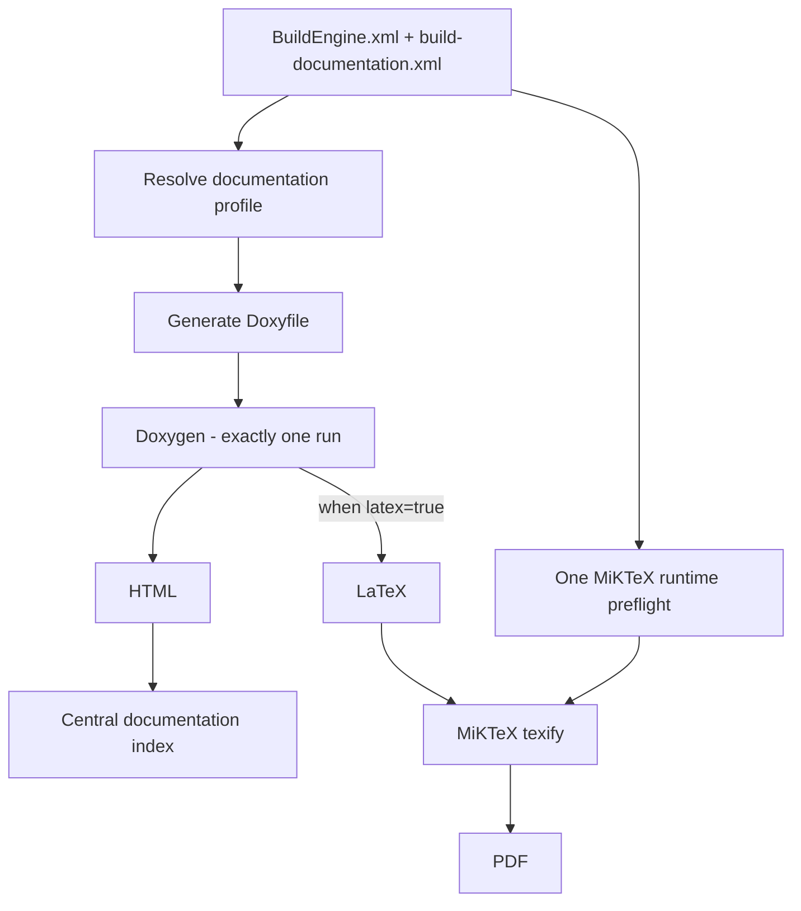
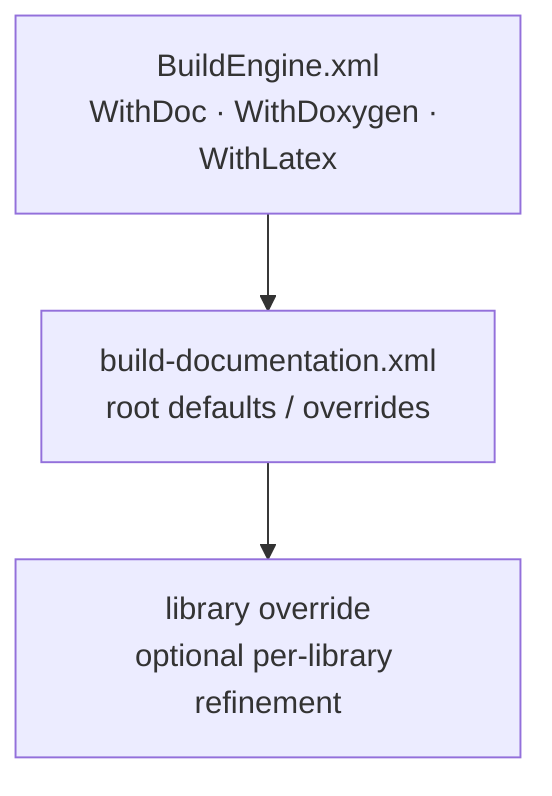
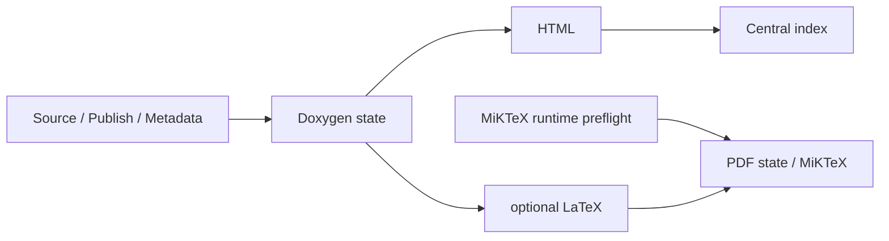

# BuildEngine Documentation Contract

[TOC|Content]

BuildEngine treats documentation as a reproducible build product. The documentation pipeline separates local base settings, synchronized project rules, Doxygen generation, PDF compilation, and read-only server presentation.

Central files:

- `BuildEngine.xml` – local base settings
- `admin/build-documentation.xml` – synchronized documentation contract
- `admin/schemas/build-documentation.xsd` – XML schema
- `admin/build-tools.xml` – Doxygen, Graphviz, MiKTeX, and browser resources

Related documents:

- [BuildEngine configuration](configuration.md)
- [Tool contract `build-tools.xml`](build-tools.md)
- [Tool overview](tools.md)
- [Library contract `build-libraries.xml`](build-libraries.md)

## Basic principle

Central API documentation follows this pipeline:



**Essential rule:** when LaTeX is required, the same Doxygen run produces HTML and LaTeX. There is no second Doxygen run for PDF.

MiKTeX is a separate downstream technical step so a MiKTeX version change reruns only PDF compilation and not Doxygen analysis. A single shared MiKTeX runtime preflight runs before any per-library PDF compiler job; after that prerequisite succeeds, independent library PDF jobs may execute in parallel.

## Configuration layers

The effective documentation configuration is resolved from several layers:



A library does not require its own `<library>` entry. Without an override, it inherits the root profile.

## `BuildEngine.xml`

Example:

```xml
<parameters
   WithDoc="true"
   WithDoxygen="true"
   WithLatex="true"
   ... />
```

### `WithDoc`

Enables BuildEngine-generated information documentation such as overview pages, project texts, license information, and SBOM links.

Default: `false`.

### `WithDoxygen`

Permits central Doxygen API documentation.

Default: `false`.

If `WithDoxygen="false"`, neither central Doxygen HTML nor Doxygen LaTeX/PDF is generated.

### `WithLatex`

`WithLatex` is the **local base setting** for LaTeX/PDF, not an absolute master switch.

Default: `true`.

Resolution order:

1. Start with `BuildEngine.xml/@WithLatex`.
2. Optional `buildDocumentation/@latex` overrides this default for the synchronized project.
3. Optional `<library latex="...">` overrides the value for exactly that library.

Example – PDF normally enabled, but disabled for Boost:

```xml
<!-- BuildEngine.xml -->
WithLatex="true"
```

```xml
<!-- build-documentation.xml -->
<library id="boost" latex="false"/>
```

Example – PDF normally disabled, but explicitly enabled for pugiXML:

```xml
<!-- BuildEngine.xml -->
WithLatex="false"
```

```xml
<!-- build-documentation.xml -->
<library id="pugixml" latex="true"/>
```

`WithDoxygen=false` cannot be overridden by `latex=true`, because the LaTeX tree is produced by Doxygen.

## `build-documentation.xml`

Basic form:

```xml
<buildDocumentation
   schemaVersion="1"
   doxygen="true"
   source="false"
   inlineSource="false"
   publicOnly="false">

   <option name="USE_MATHJAX" value="YES"/>
   <option name="MATHJAX_VERSION" value="MathJax_3"/>
   <option name="MATHJAX_FORMAT" value="SVG"/>
   <option name="MATHJAX_RELPATH" value="/js/mathjax/es5"/>

   <library id="boost" publicOnly="true" latex="false">
      ...
   </library>
</buildDocumentation>
```

The root `latex` attribute is optional. If it is absent, `WithLatex` from `BuildEngine.xml` is used as the default.

## Root and library attributes

| Attribute | Default / inheritance | Meaning |
| --- | --- | --- |
| `schemaVersion` | required, currently `1` | Contract version. |
| `doxygen` | root: `true` | Enables Doxygen for the profile. |
| `latex` | root: inherits `WithLatex` | Enables additional LaTeX output in the same Doxygen run. |
| `source` | root: `false` | Enables the Doxygen source browser. |
| `inlineSource` | root: `false` | Shows source inline; implies `source=true`. |
| `publicOnly` | root: `false` | Reduces the API view to public areas and adds standard exclusions. |

Library attributes override the inherited value individually.

## `<define>`

`define` describes preprocessor macros for the Doxygen view only.

```xml
<define name="__cplusplus" value="202302L"/>
<define name="BOOST_NOEXCEPT" value="noexcept"/>
<define name="DOXYGEN_INVOKED"/>
```

Semantics:

- missing `value` → ordinary predefined macro; Doxygen treats it as defined,
- `value=""` → explicitly empty replacement,
- non-empty value → exact replacement,
- function-like macros are supported.

These definitions do **not** change the compiler, ABI, or library build. They are documentation knowledge only.

## `<option>`

`option` sets a Doxygen configuration value after the generic Doxyfile is generated and therefore deliberately overrides its default.

```xml
<option name="SHOW_INCLUDE_FILES" value="NO"/>
<option name="CALL_GRAPH" value="YES"/>
```

The name may contain only letters, digits, and `_`. Line breaks are not permitted in names or values.

Library-specific Doxygen options should be used only where a library actually differs from the shared profile.

## `<exclude>`

```xml
<exclude pattern="*/tests/*"/>
<exclude pattern="*/examples/*"/>
<exclude pattern="*/detail/*"/>
```

Exclusions filter published Doxygen inputs. When `publicOnly=true`, BuildEngine also adds typical internal areas such as `detail`, `impl`, `preprocessed`, `aux_`, and `cpp03`.

## Shared Doxyfile

BuildEngine generates exactly one Doxyfile for a library's central API documentation.

When LaTeX is **not** active:

```text
GENERATE_HTML = YES
GENERATE_LATEX = NO
```

When LaTeX is active:

```text
GENERATE_HTML = YES
GENERATE_LATEX = YES
LATEX_OUTPUT = latex
USE_PDFLATEX = YES
PDF_HYPERLINKS = YES
LATEX_BATCHMODE = YES
PAPER_TYPE = a4
```

Doxygen is then run **once**, producing in that run:

```text
<DocumentationRoot>/<library>/<version>/html/
<DocumentationRoot>/<library>/<version>/latex/   # only when enabled
```

HTML and LaTeX therefore originate from exactly the same analysis and source state.

## Doxygen HTML

The shared profile produces, among other things:

- HTML search,
- tree view,
- source browser according to profile,
- class and collaboration graphs,
- include and included-by graphs,
- directory hierarchy,
- Graphviz SVG,
- central project/license/SBOM pages.

Call and caller graphs remain disabled by default because they can be very expensive for large third-party projects and are often of limited value. They can be enabled deliberately through `<option>`.

## MathJax

Doxygen HTML uses the MathJax 3 distribution managed by BuildEngine:

```xml
<option name="USE_MATHJAX" value="YES"/>
<option name="MATHJAX_VERSION" value="MathJax_3"/>
<option name="MATHJAX_FORMAT" value="SVG"/>
<option name="MATHJAX_RELPATH" value="/js/mathjax/es5"/>
```

This keeps central documentation independent of an external CDN. BuildEngine Server serves `/js/mathjax/...` from the managed `web-mathjax` tool.

## Graphviz

Graphviz is part of the reproducible documentation toolchain. Its version affects Doxygen state because generated diagrams can change with the Graphviz version.

The currently managed tools are listed in [tools.md](tools.md).

## MiKTeX and PDF

MiKTeX is defined in `build-tools.xml` as `required="when-used"`. It is required only if at least one library effectively has `latex=true`.

MiKTeX has process-global/user-profile runtime state in addition to the managed executable tree. In particular, a first `pdflatex` use may need to create the shared `pdflatex.fmt` format file. Multiple first-use `texify` processes must not race while creating that common file.

BuildEngine therefore schedules exactly one shared job named:

```text
documentation:miktex-runtime
```

The job writes a minimal `preflight.tex` below the BuildEngine documentation work area and compiles it once with `texify`. Every per-library PDF job depends on this runtime preflight as well as on its own Doxygen job. This deliberately serializes only MiKTeX runtime initialization; after the preflight succeeds, independent library PDF jobs remain parallel.

The runtime preflight also makes a broken MiKTeX/pdflatex installation fail at one explicit prerequisite instead of producing a nondeterministic cascade across several library PDF jobs.

At that point Doxygen has generated each library's LaTeX tree. MiKTeX performs **no Doxygen invocation**; it only compiles `refman.tex`:

```text
texify --pdf --batch --max-iterations=5 --tex-option=--disable-installer refman.tex
```

Automatic package installation is disabled during PDF generation. A missing TeX package is therefore a reproducible tool-provisioning error rather than a hidden download during the build.

The published PDF is written below:

```text
<DocumentationRoot>/<library>/<version>/pdf/<library>-<version>.pdf
```

## Technical states

There is **no separate LaTeX-Doxygen state**. HTML and LaTeX belong to the same Doxygen generation step.



The MiKTeX runtime preflight is a shared DAG prerequisite, not a per-library technical-state marker. The per-library PDF state remains tied to the stable LaTeX inputs and MiKTeX version.

### Doxygen state

The Doxygen state includes, among other things:

- library ID, version, and timestamp,
- Doxygen version,
- Graphviz version,
- effective Doxygen profile,
- whether additional LaTeX output is required,
- publish manifest,
- license information,
- SBOM inputs.

Changing `latex=false -> true` must invalidate Doxygen state because the same Doxygen run now has to produce an additional output.

A MiKTeX version change, on the other hand, must **not** invalidate Doxygen state.

### PDF state

The PDF state includes:

- stable LaTeX source files generated by Doxygen,
- MiKTeX version.

MiKTeX outputs such as `.aux`, `.log`, or the generated `refman.pdf` are not part of their own input fingerprint. The PDF step must not invalidate itself through its own output.

## Central documentation index

`documentation/index.html` is an aggregate view and is not evidence that one library's documentation is current.

The index is therefore reconstructed cheaply from existing library documentation. A missing central index must not invalidate all expensive Doxygen steps.

The generated central index is English and provides compact navigation actions for library documentation, license information, and CycloneDX SBOMs.

## Project Markdown documentation

Project Markdown files are synchronized below:

```text
admin/server-docs/
```

The server reads them directly from this synchronized directory on every HTTP request. There is no copied Markdown tree and no Markdown cache that must be refreshed after repository synchronization.

Relative Markdown links are deliberately used:

```markdown
[Tools](tools.md)
[Tool contract](build-tools.md)
[Library contract](build-libraries.md)
```

For example, when `documentation.md` is displayed as `/manual/documentation.md`, the browser resolves `tools.md` to `/manual/tools.md`. The normal server fallback then renders that synchronized Markdown source live.

### Table of contents directive

The BuildEngine Markdown prereader supports a project-specific table-of-contents directive:

```markdown
[TOC|Content]
```

The text after `TOC|` is the visible TOC title and can be changed, for example:

```markdown
[TOC|Overview]
[TOC|Table of Contents]
```

The directive is evaluated only outside fenced code blocks. When present, the prereader:

1. creates a dedicated anchor immediately before the generated table of contents,
2. collects ATX headings (`#` through `######`) following the directive,
3. gives every collected heading a deterministic document-unique anchor,
4. creates a nested list that follows the heading hierarchy,
5. inserts a `Back to <TOC title>` link before every heading on the shallowest section level following the directive.

Our project documents place `[TOC|Content]` immediately after the document's initial `#` title. The document title therefore stays outside the TOC, while the `##` sections form its top level and receive `Back to Content` links.

Anchors are generated by the renderer rather than authored manually in Markdown. This keeps navigation stable within one document state, prevents duplicate heading text from colliding, and avoids enabling unsafe raw HTML in cmark-gfm merely for anchor generation.

## Current project Markdown files

The live project documentation consists of:

- `story.md` – project story and engineering motivation,
- `buildengine.md` – architecture and BuildEngine concept,
- `server.md` – HTTP/REST server,
- `configuration.md` – local configuration and CLI,
- `documentation.md` – this documentation contract,
- `build-tools.md` – XML tool contract,
- `build-libraries.md` – XML library contract,
- `tools.md` – overview of the tools actually used.

The public project documentation is maintained in English. Original titles of referenced works may additionally be shown in their original language where useful.

## Examples

### HTML and PDF enabled by default

```xml
<!-- BuildEngine.xml -->
WithDoxygen="true"
WithLatex="true"
```

```xml
<!-- build-documentation.xml -->
<buildDocumentation schemaVersion="1" doxygen="true">
   ...
</buildDocumentation>
```

Result: one Doxygen run generates HTML and LaTeX; the shared MiKTeX preflight initializes the PDF runtime once, then MiKTeX generates library PDFs.

### HTML only for Boost

```xml
<library id="boost" publicOnly="true" latex="false">
   ...
</library>
```

Result: the same central Doxygen path generates HTML only for Boost; MiKTeX is not run for Boost.

### PDF only for a selected library despite a local default of `false`

```xml
<!-- BuildEngine.xml -->
WithDoxygen="true"
WithLatex="false"
```

```xml
<library id="pugixml" latex="true"/>
```

Result: pugiXML produces HTML + LaTeX in one Doxygen run and then a PDF; other libraries inherit `false` unless the root contract specifies otherwise.

## Maintenance rule

Markdown documentation is part of the project and is maintained together with code and XML contracts.

Therefore:

1. New XML parameters are documented in the corresponding Markdown reference.
2. New tools or version/role changes are reflected in [tools.md](tools.md).
3. Changes to `build-tools.xml` are reflected in [build-tools.md](build-tools.md).
4. Changes to the library contract are reflected in [build-libraries.md](build-libraries.md).
5. Changes to documentation generation, Markdown preprocessing, server presentation, or link behavior are reflected here and, where appropriate, in [server.md](server.md).
6. Public-facing project Markdown remains English unless a document explicitly serves another language audience.
