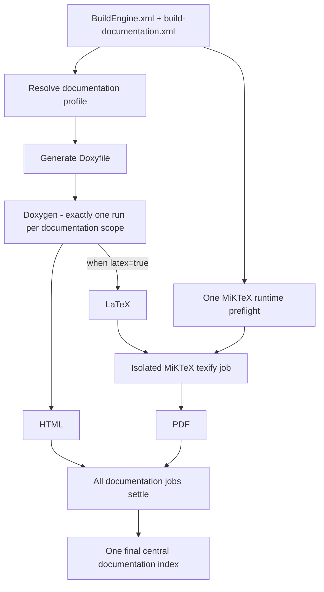
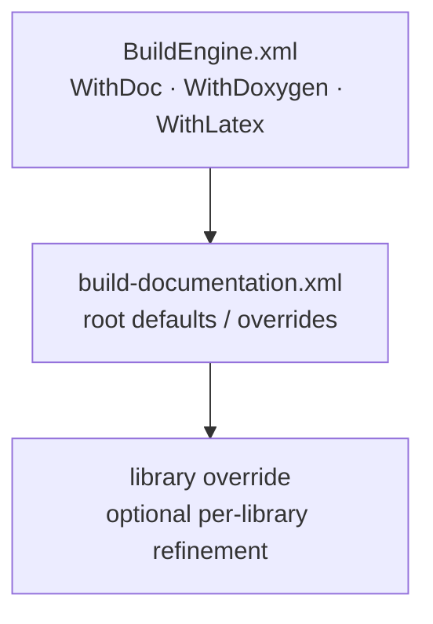
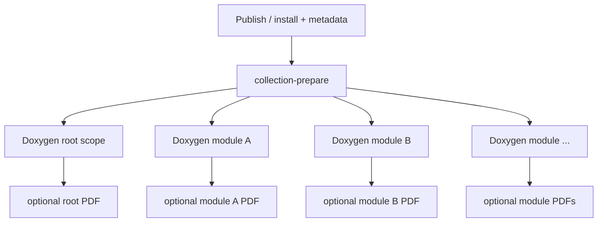
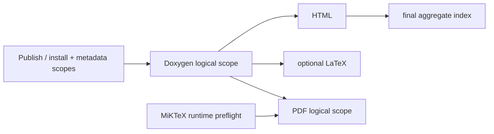

# BuildEngine Documentation Contract

[TOC|Content]

BuildEngine treats documentation as a reproducible build product. The documentation pipeline separates local base settings, synchronized project rules, Doxygen generation, PDF compilation, aggregate navigation, and read-only server presentation.

Central files:

- `BuildEngine.xml` – local base settings
- `admin/build-documentation.xml` – synchronized documentation contract
- `admin/schemas/build-documentation.xsd` – XML schema
- `admin/build-tools.xml` – Doxygen, Graphviz, MiKTeX, and browser resources

Related documents:

- [BuildEngine configuration](configuration.md)
- [Tool contract `build-tools.xml`](build-tools.md)
- [Tool overview](tools.md)
- [Library contract `build-libraries.xml`](build-libraries.md)
- [Integrated third-party libraries](libraries.md)

## Basic principle

Central API documentation follows this pipeline:



**Essential rule:** when LaTeX is required, the same Doxygen run produces HTML and LaTeX. There is no second Doxygen run for PDF.

MiKTeX is a separate downstream execution step. A single shared MiKTeX runtime preflight runs before any per-library PDF compiler job; after that prerequisite succeeds, independent library PDF jobs may execute in parallel. The global documentation index is not regenerated by every parallel library job. It is rebuilt once after the documentation work has settled.

## Configuration layers

The effective documentation configuration is resolved from several layers:



A library does not require its own `<library>` entry. Without an override, it inherits the root profile.

## `BuildEngine.xml`

Example:

```xml
<parameters
   WithDoc="true"
   WithDoxygen="true"
   WithLatex="true"
   ... />
```

### `WithDoc`

Enables BuildEngine-generated information documentation such as overview pages, project texts, license information, and SBOM links.

Default: `false`.

### `WithDoxygen`

Permits central Doxygen API documentation.

Default: `false`.

If `WithDoxygen="false"`, neither central Doxygen HTML nor Doxygen LaTeX/PDF is generated.

### `WithLatex`

`WithLatex` is the **local base setting** for LaTeX/PDF, not an absolute master switch.

Default: `true`.

Resolution order:

1. Start with `BuildEngine.xml/@WithLatex`.
2. Optional `buildDocumentation/@latex` overrides this default for the synchronized project.
3. Optional `<library latex="...">` overrides the value for exactly that library.

Example – PDF normally enabled, but disabled for one library:

```xml
<!-- BuildEngine.xml -->
WithLatex="true"
```

```xml
<!-- build-documentation.xml -->
<library id="example" latex="false"/>
```

Example – PDF normally disabled, but explicitly enabled for pugiXML:

```xml
<!-- BuildEngine.xml -->
WithLatex="false"
```

```xml
<!-- build-documentation.xml -->
<library id="pugixml" latex="true"/>
```

`WithDoxygen=false` cannot be overridden by `latex=true`, because the LaTeX tree is produced by Doxygen.

## `build-documentation.xml`

Basic form:

```xml
<buildDocumentation
   schemaVersion="1"
   doxygen="true"
   source="false"
   inlineSource="false"
   publicOnly="false">

   <option name="USE_MATHJAX" value="YES"/>
   <option name="MATHJAX_VERSION" value="MathJax_3"/>
   <option name="MATHJAX_FORMAT" value="SVG"/>
   <option name="MATHJAX_RELPATH" value="/js/mathjax/es5"/>

   <library id="boost" publicOnly="true" collection="true">
      ...
   </library>
</buildDocumentation>
```

The root `latex` attribute is optional. If it is absent, `WithLatex` from `BuildEngine.xml` is used as the default.

## Root and library attributes

| Attribute | Default / inheritance | Meaning |
| --- | --- | --- |
| `schemaVersion` | required, currently `1` | Contract version. |
| `doxygen` | root: `true` | Enables Doxygen for the profile. |
| `latex` | root: inherits `WithLatex` | Enables additional LaTeX output in the same Doxygen run. |
| `source` | root: `false` | Enables the Doxygen source browser. |
| `inlineSource` | root: `false` | Shows source inline; implies `source=true`. |
| `publicOnly` | root: `false` | Reduces the API view to public areas and adds standard exclusions. |
| `collection` | library only: `false` | Splits a published API collection into a root scope and one scope for every discovered first-level directory. |

Library attributes override the inherited value individually. `collection` is deliberately library-specific; collection membership is discovered from the published directory structure instead of from a manually maintained module list.

## `<define>`

`define` describes preprocessor macros for the Doxygen view only.

```xml
<define name="__cplusplus" value="202302L"/>
<define name="BOOST_NOEXCEPT" value="noexcept"/>
<define name="DOXYGEN_INVOKED"/>
```

Semantics:

- missing `value` → ordinary predefined macro; Doxygen treats it as defined,
- `value=""` → explicitly empty replacement,
- non-empty value → exact replacement,
- function-like macros are supported.

These definitions do **not** change the compiler, ABI, or library build. They are documentation knowledge only.

## `<option>`

`option` sets a Doxygen configuration value after the generic Doxyfile is generated and therefore deliberately overrides its default.

```xml
<option name="SHOW_INCLUDE_FILES" value="NO"/>
<option name="CALL_GRAPH" value="YES"/>
```

The name may contain only letters, digits, and `_`. Line breaks are not permitted in names or values.

Library-specific Doxygen options should be used only where a library actually differs from the shared profile.

## `<exclude>`

```xml
<exclude pattern="*/tests/*"/>
<exclude pattern="*/examples/*"/>
<exclude pattern="*/detail/*"/>
```

Exclusions filter published Doxygen inputs. When `publicOnly=true`, BuildEngine also adds typical internal areas such as `detail`, `impl`, `preprocessed`, `aux_`, and `cpp03`.

## Shared Doxyfile

For a normal library BuildEngine generates exactly one Doxyfile for the central API documentation scope.

When LaTeX is **not** active:

```text
GENERATE_HTML = YES
GENERATE_LATEX = NO
```

When LaTeX is active:

```text
GENERATE_HTML = YES
GENERATE_LATEX = YES
LATEX_OUTPUT = latex
USE_PDFLATEX = YES
PDF_HYPERLINKS = YES
LATEX_BATCHMODE = YES
PAPER_TYPE = a4
```

Doxygen is then run **once**, producing in that run:

```text
<DocumentationRoot>/<library>/<version>/html/
<DocumentationRoot>/<library>/<version>/latex/   # only when enabled
```

HTML and LaTeX therefore originate from exactly the same analysis and source state.

## Doxygen HTML

The shared profile produces, among other things:

- HTML search,
- tree view,
- source browser according to profile,
- class and collaboration graphs,
- include and included-by graphs,
- directory hierarchy,
- Graphviz SVG,
- central project/license/SBOM pages.

Call and caller graphs remain disabled by default because they can be very expensive for large third-party projects and are often of limited value. They can be enabled deliberately through `<option>`.

## Collection libraries

Some libraries are themselves collections of many first-level APIs. Boost is the current stress case. Treating the complete published include tree as one giant recursive Doxygen unit is both expensive and difficult to navigate, so `collection="true"` uses the published API structure itself as the module contract.

The collection planner discovers:

- files directly in the common published root,
- every first-level directory below that root,
- the files that belong to each discovered module,
- optional module-specific profile refinements from `<override module="...">`.

No positive module list is stored in XML. An override is valid only for a module that is actually discovered.

The execution graph is conceptually:



`collection-prepare` is itself a logical library state prerequisite. Every root/module Doxygen scope records that direct upstream state. This is important: preparing the collection is not merely an untracked technical helper, because changes in the discovered/generated collection inputs must form part of the dependency chain used by the downstream scopes.

The output layout is:

```text
<DocumentationRoot>/<library>/<version>/html/index.html
<DocumentationRoot>/<library>/<version>/html/<module>/index.html
<DocumentationRoot>/<library>/<version>/latex/root/refman.tex
<DocumentationRoot>/<library>/<version>/latex/<module>/refman.tex
<DocumentationRoot>/<library>/<version>/pdf/<library>-<version>.pdf
<DocumentationRoot>/<library>/<version>/pdf/<library>-<module>-<version>.pdf
```

The same rule applies to a collection as to a normal library: each Doxygen scope produces HTML and optional LaTeX in **one** Doxygen invocation. PDF compilation remains a downstream MiKTeX job.

## MathJax

Doxygen HTML uses the MathJax 3 distribution managed by BuildEngine:

```xml
<option name="USE_MATHJAX" value="YES"/>
<option name="MATHJAX_VERSION" value="MathJax_3"/>
<option name="MATHJAX_FORMAT" value="SVG"/>
<option name="MATHJAX_RELPATH" value="/js/mathjax/es5"/>
```

This keeps central documentation independent of an external CDN. BuildEngine Server serves `/js/mathjax/...` from the managed `web-mathjax` tool.

## Graphviz

Graphviz is part of the reproducible documentation toolchain and is provisioned explicitly rather than taken from undocumented machine state. The currently managed tools are listed in [tools.md](tools.md).

## MiKTeX and PDF

MiKTeX is defined in `build-tools.xml` as `required="when-used"`. It is required only if at least one library effectively has `latex=true`.

The managed MiKTeX installation is deliberately portable and isolated below `toolsRoot` rather than installed as the current Windows user's MiKTeX. The installer receives the managed root through `--portable=<ManagedRoot>` together with `--unattended`, `--no-registry`, `--no-additional-roots`, and the project paper-size setting. MiKTeX therefore owns its configuration, data, packages, and executable tree inside that portable root instead of using an existing user or machine installation.

The current managed root is:

```text
<toolsRoot>/miktex/25.12-portable
```

Isolation also applies to execution, not only installation. BuildEngine starts managed MiKTeX processes with a process-local environment whose `PATH` begins with the managed MiKTeX executable directory and contains only the explicitly admitted managed/system locations required by that process tree. Child processes such as `initexmf` and `pdftex` inherit the same isolated environment. BuildEngine does not modify the user's or machine's `PATH`, does not remove another MiKTeX installation, and does not require an existing MiKTeX installation to be changed or uninstalled.

MiKTeX still maintains mutable shared runtime data inside that portable tree. In particular, a first `pdflatex` use may need to create the shared `pdflatex.fmt` format file. Multiple first-use `texify` processes must not race while creating that common file.

BuildEngine therefore schedules exactly one shared job named:

```text
documentation:miktex-runtime
```

The job writes a minimal `preflight.tex` below the BuildEngine documentation work area and compiles it once with `texify`. Every per-library PDF job depends on this runtime preflight as well as on its own Doxygen job. This deliberately serializes only MiKTeX runtime initialization; after the preflight succeeds, independent library PDF jobs remain parallel.

The runtime preflight also makes a broken MiKTeX/pdflatex installation fail at one explicit prerequisite instead of producing a nondeterministic cascade across several library PDF jobs.

At that point Doxygen has generated each library's LaTeX tree. MiKTeX performs **no Doxygen invocation**; it only compiles `refman.tex`:

```text
texify --pdf --batch --max-iterations=5 --tex-option=--disable-installer refman.tex
```

Automatic package installation is disabled during PDF generation. A missing TeX package is therefore a reproducible tool-provisioning error rather than a hidden download during the build.

Normal libraries compile directly from their generated LaTeX tree. Collection PDFs first copy the stable Doxygen LaTeX input into an isolated per-scope work tree so the many PDF jobs do not modify one another's inputs. Transient MiKTeX files such as `.aux`, `.log`, `.toc`, `.idx`, `.ind`, `.ilg`, `.fls`, `.fdb_latexmk`, `refman.pdf`, and `*.synctex.gz` remain work products rather than source inputs.

The published PDF is written below:

```text
<DocumentationRoot>/<library>/<version>/pdf/<library>-<version>.pdf
```

A successful shared runtime preflight and successful PDFs for some libraries are deliberately distinguished from a per-library `texify` failure. Once the preflight has succeeded, a later PDF failure belongs to that document scope and must be diagnosed from its own MiKTeX log; it is not automatically evidence that the managed MiKTeX runtime as a whole is unusable.

## Logical documentation state

There is **no separate LaTeX-Doxygen state**. HTML and LaTeX belong to the same logical Doxygen scope because they are outputs of the same Doxygen invocation.

BuildEngine no longer treats individual technical Actions or output fingerprints as the persistent state authority. Persistent state belongs to a **logical library scope**. Technical Actions remain the execution, ordering, logging, and diagnostic units inside that scope.

For documentation this means, conceptually:



For a collection, `doxygen:collection-prepare` is an additional logical scope between publish/metadata and the root/module Doxygen scopes.

A completed logical state records:

```text
timestamp=<library timestamp>
upstream=<library>|<version>|<scope>|<upstream library timestamp>|<upstream completedAt>
upstream=...
completedAt=<completion timestamp of this scope>
state=completed
```

The state file is stored below:

```text
<ProductionRoot>/.buildengine/libraries/<library>/<version>/<safe-scope>.state
```

Colons and other non-file-name scope separators are normalized only for the physical file name; the logical scope itself remains the scope derived from the job ID, for example `build:Release`, `doxygen`, `doxygen:collection-prepare`, `doxygen:asio`, or `pdf`.

A logical scope is current only when:

1. its own state exists;
2. its stored library timestamp equals the current library contract timestamp;
3. the stored set of direct upstream **library** scopes matches the current DAG dependencies that carry library state;
4. every upstream reference still has the same upstream library timestamp;
5. every upstream reference still has the same upstream `completedAt` value.

If the state is absent, the own timestamp differs, an upstream state is absent, or an upstream timestamp/completion reference differs, the logical scope executes again.

This is intentionally a dependency chain rather than an output-file heuristic. A generated HTML tree or PDF does not create state merely because it exists, and a global index is never used as evidence that an individual library scope is current.

The shared `documentation:miktex-runtime` job is a non-library DAG prerequisite. It protects mutable MiKTeX runtime initialization but is not a per-library persistent state authority. Likewise, Doxygen and Graphviz tool preparation is managed through the tool contract rather than by introducing technical-action state files inside each documentation scope.

`--build` bypasses logical current-state reuse. `--make` evaluates the logical state chain. Legacy per-action marker files are migration evidence only; new persistent state is written at logical-scope granularity.

## Central documentation index

`documentation/index.html` is an aggregate view and is not evidence that one library's documentation is current.

The index is reconstructed cheaply from existing library documentation. At the start of a build, BuildEngine may refresh it from the documentation that already exists so the server has a useful navigation page during a long run.

Parallel library jobs do **not** regenerate the global index. A library documentation job may remove and recreate its own output tree while it runs; enumerating the global tree at the same time would make the aggregate content depend on timing. BuildEngine therefore performs one final index refresh only after the normal and deferred/collection documentation jobs have settled.

This separation has two important consequences:

- a missing or stale central index cannot invalidate expensive Doxygen scopes;
- the final index is built from a stable documentation tree rather than from a transient snapshot while parallel jobs are deleting and recreating library outputs.

The generated central index is English and provides compact navigation actions for library documentation, license information, and CycloneDX SBOMs.

## Project Markdown documentation

Project Markdown files are synchronized below:

```text
admin/server-docs/
```

The server reads them directly from this synchronized directory on every HTTP request. There is no copied Markdown tree and no Markdown cache that must be refreshed after repository synchronization.

Relative Markdown links are deliberately used:

```markdown
[Tools](tools.md)
[Tool contract](build-tools.md)
[Library contract](build-libraries.md)
[Integrated libraries](libraries.md)
```

For example, when `documentation.md` is displayed as `/manual/documentation.md`, the browser resolves `tools.md` to `/manual/tools.md`. The normal server fallback then renders that synchronized Markdown source live.

### Table of contents directive

The BuildEngine Markdown prereader supports a project-specific table-of-contents directive:

```markdown
[TOC|Content]
```

The text after `TOC|` is the visible TOC title and can be changed, for example:

```markdown
[TOC|Overview]
[TOC|Table of Contents]
```

The directive is evaluated only outside fenced code blocks. When present, the prereader:

1. creates a dedicated anchor immediately before the generated table of contents,
2. collects ATX headings (`#` through `######`) following the directive,
3. gives every collected heading a deterministic document-unique anchor,
4. creates a nested list that follows the heading hierarchy,
5. inserts a `Back to <TOC title>` link before every heading on the shallowest section level following the directive.

Our project documents place `[TOC|Content]` immediately after the document's initial `#` title. The document title therefore stays outside the TOC, while the `##` sections form its top level and receive `Back to Content` links.

Anchors are generated by the renderer rather than authored manually in Markdown. This keeps navigation stable within one document state, prevents duplicate heading text from colliding, and avoids enabling unsafe raw HTML in cmark-gfm merely for anchor generation.

## Current project Markdown files

The live project documentation consists of:

- `story.md` – project story and engineering motivation,
- `buildengine.md` – architecture and BuildEngine concept,
- `server.md` – HTTP/REST server,
- `configuration.md` – local configuration and CLI,
- `documentation.md` – this documentation contract,
- `build-tools.md` – XML tool contract,
- `build-libraries.md` – XML library contract,
- `libraries.md` – public inventory and integration findings for the currently managed third-party libraries,
- `tools.md` – overview of the tools actually used.

The public project documentation is maintained in English. Original titles of referenced works may additionally be shown in their original language where useful.

## Examples

### HTML and PDF enabled by default

```xml
<!-- BuildEngine.xml -->
WithDoxygen="true"
WithLatex="true"
```

```xml
<!-- build-documentation.xml -->
<buildDocumentation schemaVersion="1" doxygen="true">
   ...
</buildDocumentation>
```

Result: one Doxygen run per documentation scope generates HTML and LaTeX; the shared MiKTeX preflight initializes the PDF runtime once, then MiKTeX generates library PDFs.

### Boost as a discovered collection

```xml
<library id="boost" publicOnly="true" collection="true">
   <define name="__cplusplus" value="202302L"/>
   <override module="asio">
      <define name="GENERATING_DOCUMENTATION"/>
   </override>
</library>
```

Result: BuildEngine discovers the first-level directories from the published Boost API tree, creates one root Doxygen scope and one Doxygen scope for each discovered module, and applies `<override>` only where a discovered module needs a different profile. LaTeX/PDF follows the effective inherited `latex` setting; `collection="true"` does not disable PDF generation.

### PDF disabled for one library

```xml
<library id="example" latex="false"/>
```

Result: the central Doxygen path generates HTML only for that library; MiKTeX is not run for it.

### PDF only for a selected library despite a local default of `false`

```xml
<!-- BuildEngine.xml -->
WithDoxygen="true"
WithLatex="false"
```

```xml
<library id="pugixml" latex="true"/>
```

Result: pugiXML produces HTML + LaTeX in one Doxygen run and then a PDF; other libraries inherit `false` unless the root contract specifies otherwise.

## Maintenance rule

Markdown documentation is part of the project and is maintained together with code and XML contracts.

Therefore:

1. New XML parameters are documented in the corresponding Markdown reference.
2. New tools or version/role changes are reflected in [tools.md](tools.md).
3. Changes to `build-tools.xml` are reflected in [build-tools.md](build-tools.md).
4. Changes to the library contract are reflected in [build-libraries.md](build-libraries.md) and, whenever they affect inventory, dependencies, settings, patches, repairs, or integration behavior, in [libraries.md](libraries.md).
5. Deeper diagnostic and evidence changes for library integration are kept synchronized with the internal `docs/bcc64x-library-integration-findings.md` engineering record.
6. Changes to documentation generation, Markdown preprocessing, server presentation, or link behavior are reflected here and, where appropriate, in [server.md](server.md).
7. Public-facing project Markdown remains English unless a document explicitly serves another language audience.
