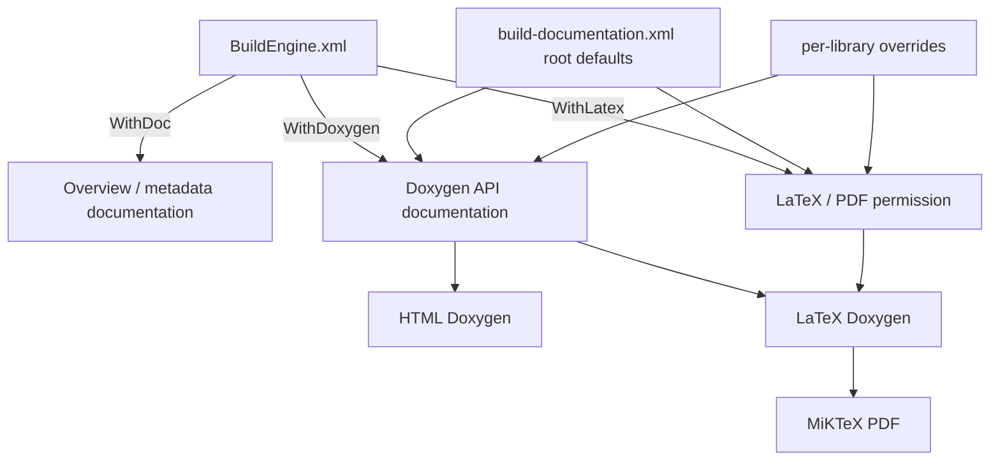
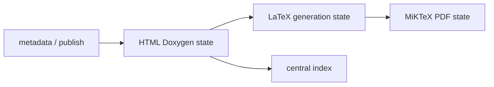

# BuildEngine Documentation Contract

BuildEngine treats documentation as a reproducible build product. The documentation model separates local machine policy from synchronized project policy and separates inexpensive presentation work from expensive API and PDF generation.

The central contract is stored in `admin/build-documentation.xml`. Its schema is `admin/schemas/build-documentation.xsd`. Local master switches are stored in `BuildEngine.xml`.

## Configuration layers

Documentation is controlled by two layers:

1. `BuildEngine.xml` decides which documentation capabilities the current machine is allowed to execute.
2. `admin/build-documentation.xml` defines the synchronized defaults and per-library overrides.

The effective setting is always the intersection of both layers. A synchronized library contract cannot enable a capability disabled by the local BuildEngine configuration.



## BuildEngine.xml master switches

The `<parameters>` element contains the machine-wide documentation switches.

```xml
<parameters
   WithDoc="true"
   WithDoxygen="true"
   WithLatex="true"
   ... />
```

### `WithDoc`

`WithDoc` enables BuildEngine-generated documentation such as library overview information, project documents, license information, SBOM material and related metadata pages.

Default: `false`.

### `WithDoxygen`

`WithDoxygen` permits central API documentation generated by Doxygen.

Default: `false`.

A library can still suppress Doxygen with `doxygen="false"` in `build-documentation.xml`.

### `WithLatex`

`WithLatex` is the machine-wide master switch for the LaTeX/PDF branch.

Default: `true`.

LaTeX/PDF generation additionally requires:

- `WithDoxygen="true"`,
- the effective library setting `doxygen="true"`, and
- the effective library setting `latex="true"`.

Setting `WithLatex="false"` does not disable HTML Doxygen. It suppresses only the LaTeX and PDF jobs and prevents MiKTeX from being provisioned solely for documentation.

## Central build-documentation.xml contract

The root element defines defaults inherited by every library.

```xml
<buildDocumentation
   schemaVersion="1"
   doxygen="true"
   latex="true"
   source="false"
   inlineSource="false"
   publicOnly="false">

   <option name="USE_MATHJAX" value="YES"/>
   <option name="MATHJAX_VERSION" value="MathJax_3"/>
   <option name="MATHJAX_FORMAT" value="SVG"/>
   <option name="MATHJAX_RELPATH" value="/js/mathjax/es5"/>

   ...
</buildDocumentation>
```

A library does not need its own `<library>` element. Library elements are overrides, not an allow-list.

## Root and library attributes

The following attributes are supported on `<buildDocumentation>` and, except `schemaVersion`, on `<library>` overrides.

| Attribute | Default | Meaning |
| --- | --- | --- |
| `schemaVersion` | required | Contract schema version. Currently `1`. |
| `doxygen` | `true` | Enables central Doxygen for the profile. |
| `latex` | `true` | Enables the LaTeX/PDF branch when the local master switches permit it. |
| `source` | `false` | Enables Doxygen source browser output. |
| `inlineSource` | `false` | Includes source bodies inline. This also implies `source=true`. |
| `publicOnly` | `false` | Restricts the generated API view and adds standard implementation-detail exclusions. |

### Inheritance

A library starts with the root profile and then applies its own attributes, definitions, Doxygen options and exclusions.

Example:

```xml
<buildDocumentation doxygen="true" latex="true" publicOnly="false" ...>
   <library id="boost" publicOnly="true" latex="false">
      ...
   </library>
</buildDocumentation>
```

Here all libraries inherit `latex=true`, while Boost keeps HTML Doxygen but suppresses LaTeX/PDF.

## `<define>`

`<define>` adds a macro to Doxygen preprocessing. These definitions affect only documentation parsing; they never modify compiler flags, the BCC64X build or the target ABI.

```xml
<define name="__clang__" value="1"/>
<define name="__cplusplus" value="202302L"/>
<define name="BOOST_NOEXCEPT" value="noexcept"/>
```

An omitted `value` means a normal predefined macro. Doxygen treats it like a defined macro with its normal truth value.

```xml
<define name="DOXYGEN_INVOKED"/>
```

An explicit empty value requests an empty replacement:

```xml
<define name="BOOST_SYMBOL_VISIBLE" value=""/>
```

Function-like macros are supported:

```xml
<define name="BOOST_NOEXCEPT_IF(T)" value="noexcept(T)"/>
```

If at least one function-like macro is configured, BuildEngine enables the Doxygen processing required for these definitions.

## `<option>`

`<option>` writes an explicit Doxygen configuration value after BuildEngine has generated the common Doxyfile. It therefore overrides the generic default.

```xml
<option name="SEARCH_INCLUDES" value="NO"/>
<option name="SHOW_INCLUDE_FILES" value="NO"/>
<option name="HIDE_FRIEND_COMPOUNDS" value="YES"/>
```

Use semantic BuildEngine attributes such as `doxygen`, `latex`, `source`, `inlineSource` and `publicOnly` when the setting controls BuildEngine behavior. Use `<option>` for genuine Doxygen configuration details.

For example, do not use a raw `GENERATE_LATEX` option to control the BuildEngine PDF pipeline. Use `latex="true|false"` so tool provisioning, job creation and incremental state all see the same decision.

## `<exclude>`

`<exclude>` removes paths from the Doxygen input set.

```xml
<exclude pattern="*/tests/*"/>
<exclude pattern="*/examples/*"/>
<exclude pattern="*/benchmark/*"/>
```

Patterns are matched case-insensitively against normalized paths relative to the published documentation root.

When `publicOnly="true"`, BuildEngine additionally excludes common implementation trees such as:

- `*/detail/*`
- `*/impl/*`
- `*/preprocessed/*`
- `*/aux_/*`
- `*/cpp03/*`

These generic exclusions can be supplemented by library-specific rules.

## Complete library example

```xml
<library id="example-lib"
         doxygen="true"
         latex="true"
         source="false"
         inlineSource="false"
         publicOnly="true">
   <define name="__clang__" value="1"/>
   <define name="__cplusplus" value="202302L"/>
   <define name="GENERATING_DOCUMENTATION"/>

   <option name="SEARCH_INCLUDES" value="NO"/>
   <option name="SHOW_INCLUDE_FILES" value="NO"/>

   <exclude pattern="*/tests/*"/>
   <exclude pattern="*/examples/*"/>
</library>
```

## HTML and MathJax

BuildEngine uses the managed MathJax package provided by `admin/build-tools.xml` rather than an external CDN at page-view time.

The central profile currently uses:

```xml
<option name="USE_MATHJAX" value="YES"/>
<option name="MATHJAX_VERSION" value="MathJax_3"/>
<option name="MATHJAX_FORMAT" value="SVG"/>
<option name="MATHJAX_RELPATH" value="/js/mathjax/es5"/>
```

The server maps `/js/mathjax/` to the managed `web-mathjax` tool. Formula rendering therefore uses the same controlled tool inventory as the rest of BuildEngine.

Doxygen HTML also uses Graphviz for class, collaboration, include, included-by, hierarchy and directory graphs. Graph output is SVG and interactive SVG is enabled.

## LaTeX generation

LaTeX generation is deliberately a separate BuildEngine job from HTML Doxygen.

For an enabled library BuildEngine creates a LaTeX-specific Doxyfile from the effective central Doxyfile and overrides the output mode:

```text
GENERATE_HTML = NO
GENERATE_LATEX = YES
LATEX_OUTPUT = latex
USE_PDFLATEX = YES
PDF_HYPERLINKS = YES
LATEX_BATCHMODE = YES
PAPER_TYPE = a4
```

The generated LaTeX tree is stored below:

```text
<DocumentationRoot>/<library>/<version>/latex/
```

The primary Doxygen document is:

```text
refman.tex
```

## MiKTeX PDF generation

BuildEngine uses managed MiKTeX 25.12 on Windows. MiKTeX is declared as `required="when-used"`; it is provisioned only when at least one library has an effective LaTeX profile.

The managed installation uses the official MiKTeX Basic Installer in unattended portable mode. The installation remains below the BuildEngine tools root and does not require a machine-wide MiKTeX installation.

PDF compilation uses the MiKTeX compiler driver `texify`:

```text
texify --pdf --batch --max-iterations=5 --tex-option=--disable-installer refman.tex
```

`texify` is used because it drives pdfLaTeX and the required index/reference passes until the document is resolved. Automatic package installation is explicitly disabled during the documentation build. A missing LaTeX package is therefore a reproducibility error to be fixed in the managed MiKTeX provisioning, not an invitation for a build job to change its tool installation silently.

The published PDF is written as:

```text
<DocumentationRoot>/<library>/<version>/pdf/<library>-<version>.pdf
```

## Incremental state

The documentation pipeline uses separate technical states because the cost and inputs of its stages differ.



### HTML Doxygen state

The existing central Doxygen state is driven by the library identity and timestamp, effective Doxygen profile, Doxygen and Graphviz versions, publish manifest, license information and SBOM input.

A change that does not affect those inputs must not rebuild API documentation.

### LaTeX generation state

The LaTeX state depends on the effective Doxygen configuration used as its source, the Doxygen version and the effective `latex` decision.

Changing `latex=false` to `latex=true` creates the LaTeX branch without making MiKTeX part of the HTML Doxygen fingerprint.

### PDF state

The PDF state depends on:

- the stable Doxygen-generated LaTeX source files, and
- the managed MiKTeX version.

MiKTeX output files such as `refman.pdf`, auxiliary files and logs are not part of the PDF input fingerprint. The PDF job must therefore become `current` after a successful run instead of invalidating itself with its own output.

A MiKTeX version change invalidates the PDF state but does not invalidate HTML Doxygen.

### Central documentation index

The central documentation index is an aggregate view. It is reconstructed cheaply from already generated library documentation before per-library current-state evaluation. Its absence must not make every expensive library Doxygen job stale.

## Common configurations

### HTML only on one machine

```xml
<parameters
   WithDoc="true"
   WithDoxygen="true"
   WithLatex="false"
   ... />
```

No MiKTeX tool is required for this run.

### HTML and PDF by default

```xml
<parameters
   WithDoc="true"
   WithDoxygen="true"
   WithLatex="true"
   ... />
```

```xml
<buildDocumentation
   schemaVersion="1"
   doxygen="true"
   latex="true"
   source="false"
   inlineSource="false"
   publicOnly="false">
   ...
</buildDocumentation>
```

### Disable PDF only for a large library

```xml
<library id="boost"
         publicOnly="true"
         latex="false">
   ...
</library>
```

Boost still receives HTML Doxygen; other libraries inherit the root `latex=true` default.

### Disable Doxygen entirely for one library

```xml
<library id="binary-only-component"
         doxygen="false"/>
```

No HTML Doxygen, LaTeX or PDF jobs are created for that library. BuildEngine overview/license/SBOM documentation can still be available when the central documentation pipeline is enabled.

## Design rule

Documentation configuration follows the same BuildEngine rule as library builds: knowledge belongs in declarative contracts, while C++ implements the generic mechanism.

A library-specific documentation workaround belongs in that library's `build-documentation.xml` profile. It should not become a hidden `if(library == ...)` branch in BuildEngine source code.
