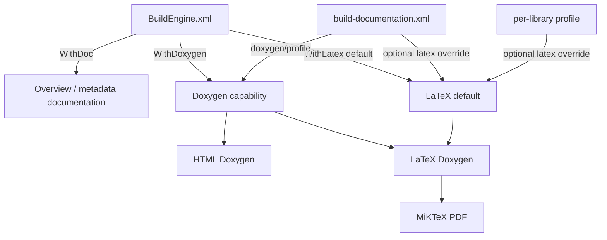
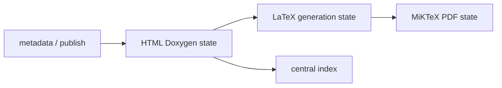

# BuildEngine Documentation Contract

BuildEngine treats documentation as a reproducible build product. The documentation model separates local machine defaults from synchronized project policy and separates inexpensive presentation work from expensive API and PDF generation.

The synchronized documentation contract is stored in `admin/build-documentation.xml`. Its schema is `admin/schemas/build-documentation.xsd`. Local defaults are stored in `BuildEngine.xml`.

## Configuration layers

Documentation is controlled by three levels:

1. `BuildEngine.xml` supplies local defaults and hard capability switches.
2. `admin/build-documentation.xml` can override documentation defaults for the synchronized project.
3. A `<library>` element can override the synchronized default for one library.

`WithDoxygen` is a hard capability switch: without central Doxygen there is no BuildEngine LaTeX source tree. `WithLatex`, in contrast, is deliberately an inheritable default. A root-level or library-level `latex` value can override it.



## BuildEngine.xml documentation settings

The `<parameters>` element contains the local documentation settings.

```xml
<parameters
   WithDoc="true"
   WithDoxygen="true"
   WithLatex="true"
   ... />
```

### `WithDoc`

`WithDoc` enables BuildEngine-generated information documentation such as library overview information, project documents, license information, SBOM material and related metadata pages.

Default: `false`.

### `WithDoxygen`

`WithDoxygen` permits central API documentation generated by Doxygen.

Default: `false`.

This is a hard prerequisite for the BuildEngine Doxygen pipeline. If it is `false`, neither HTML Doxygen nor the derived LaTeX/PDF branch is created.

A library can suppress Doxygen with `doxygen="false"` in `build-documentation.xml`, but `doxygen="true"` cannot bypass a local `WithDoxygen="false"`.

### `WithLatex`

`WithLatex` is the local default for the LaTeX/PDF branch.

Default: `true`.

Unlike `WithDoxygen`, it is intentionally inheritable rather than a hard master switch. Resolution is:

```text
BuildEngine.xml WithLatex
        ↓ default
build-documentation.xml latex (when present)
        ↓ default
library/@latex (when present)
        ↓
effective LaTeX/PDF decision
```

This makes both directions possible.

Local default on, one library off:

```xml
<parameters WithDoxygen="true" WithLatex="true" ... />
```

```xml
<library id="boost" latex="false" ...>
```

Local default off, one library explicitly on:

```xml
<parameters WithDoxygen="true" WithLatex="false" ... />
```

```xml
<library id="pugixml" latex="true" ...>
```

MiKTeX is provisioned only if at least one library resolves to effective `latex=true`.

## Central build-documentation.xml contract

A representative root is:

```xml
<buildDocumentation
   schemaVersion="1"
   doxygen="true"
   source="false"
   inlineSource="false"
   publicOnly="false">

   <option name="USE_MATHJAX" value="YES"/>
   <option name="MATHJAX_VERSION" value="MathJax_3"/>
   <option name="MATHJAX_FORMAT" value="SVG"/>
   <option name="MATHJAX_RELPATH" value="/js/mathjax/es5"/>

   ...
</buildDocumentation>
```

Because `latex` is omitted here, the root inherits `BuildEngine.xml/WithLatex`.

The synchronized contract can deliberately establish its own default:

```xml
<buildDocumentation
   schemaVersion="1"
   doxygen="true"
   latex="false"
   ...>
```

A library does not need its own `<library>` element. Library elements are overrides, not an allow-list.

## Root and library attributes

The following profile attributes are supported.

| Attribute | Root default | Library behavior | Meaning |
| --- | --- | --- | --- |
| `schemaVersion` | required | not applicable | Contract schema version. Currently `1`. |
| `doxygen` | `true` | inherits root | Enables central Doxygen for the profile, subject to local `WithDoxygen`. |
| `latex` | inherits `WithLatex` when omitted | inherits resolved root value | Enables the LaTeX/PDF branch for the library. |
| `source` | `false` | inherits root | Enables Doxygen source browser output. |
| `inlineSource` | `false` | inherits root | Includes source bodies inline and implies source browsing. |
| `publicOnly` | `false` | inherits root | Restricts the generated API view and adds standard implementation-detail exclusions. |

### Inheritance example

```xml
<buildDocumentation
   schemaVersion="1"
   doxygen="true"
   latex="true"
   publicOnly="false">

   <library id="boost"
            publicOnly="true"
            latex="false">
      ...
   </library>
</buildDocumentation>
```

All libraries inherit `latex=true`, while Boost keeps HTML Doxygen but suppresses LaTeX/PDF.

## `<define>`

`<define>` adds a macro to Doxygen preprocessing. These definitions affect only documentation parsing; they never modify compiler flags, the BCC64X build or the target ABI.

```xml
<define name="__clang__" value="1"/>
<define name="__cplusplus" value="202302L"/>
<define name="BOOST_NOEXCEPT" value="noexcept"/>
```

An omitted `value` means a normal predefined macro:

```xml
<define name="DOXYGEN_INVOKED"/>
```

An explicit empty value requests an empty replacement:

```xml
<define name="BOOST_SYMBOL_VISIBLE" value=""/>
```

Function-like macros are supported:

```xml
<define name="BOOST_NOEXCEPT_IF(T)" value="noexcept(T)"/>
```

If at least one function-like macro is configured, BuildEngine enables the corresponding Doxygen macro processing.

## `<option>`

`<option>` writes an explicit Doxygen configuration value after BuildEngine has generated the common Doxyfile. It therefore overrides the generic default.

```xml
<option name="SEARCH_INCLUDES" value="NO"/>
<option name="SHOW_INCLUDE_FILES" value="NO"/>
<option name="HIDE_FRIEND_COMPOUNDS" value="YES"/>
```

Use semantic BuildEngine attributes such as `doxygen`, `latex`, `source`, `inlineSource` and `publicOnly` when the setting controls BuildEngine behavior. Use `<option>` for genuine Doxygen configuration details.

Do not use a raw `GENERATE_LATEX` option to control the BuildEngine PDF pipeline. Use `latex="true|false"` so tool provisioning, job creation and incremental state all see the same decision.

## `<exclude>`

`<exclude>` removes paths from the Doxygen input set.

```xml
<exclude pattern="*/tests/*"/>
<exclude pattern="*/examples/*"/>
<exclude pattern="*/benchmark/*"/>
```

Patterns are matched case-insensitively against normalized paths relative to the published documentation root.

When `publicOnly="true"`, BuildEngine additionally excludes common implementation trees such as:

- `*/detail/*`
- `*/impl/*`
- `*/preprocessed/*`
- `*/aux_/*`
- `*/cpp03/*`

These generic exclusions can be supplemented by library-specific rules.

## Complete library example

```xml
<library id="example-lib"
         doxygen="true"
         latex="true"
         source="false"
         inlineSource="false"
         publicOnly="true">
   <define name="__clang__" value="1"/>
   <define name="__cplusplus" value="202302L"/>
   <define name="GENERATING_DOCUMENTATION"/>

   <option name="SEARCH_INCLUDES" value="NO"/>
   <option name="SHOW_INCLUDE_FILES" value="NO"/>

   <exclude pattern="*/tests/*"/>
   <exclude pattern="*/examples/*"/>
</library>
```

## Effective decision examples

Assume `WithDoxygen="true"`.

| `WithLatex` | Root `latex` | Library `latex` | Effective PDF |
| --- | --- | --- | --- |
| `true` | omitted | omitted | yes |
| `false` | omitted | omitted | no |
| `false` | omitted | `true` | yes |
| `true` | omitted | `false` | no |
| `true` | `false` | omitted | no |
| `true` | `false` | `true` | yes |
| `false` | `true` | omitted | yes |
| any | any | any, but effective `doxygen=false` | no |

## HTML and MathJax

BuildEngine uses the managed MathJax package provided by `admin/build-tools.xml` rather than an external CDN at page-view time.

The central profile currently uses:

```xml
<option name="USE_MATHJAX" value="YES"/>
<option name="MATHJAX_VERSION" value="MathJax_3"/>
<option name="MATHJAX_FORMAT" value="SVG"/>
<option name="MATHJAX_RELPATH" value="/js/mathjax/es5"/>
```

The server maps `/js/mathjax/` to the managed `web-mathjax` tool. Formula rendering therefore uses the same controlled tool inventory as the rest of BuildEngine.

Doxygen HTML also uses Graphviz for class, collaboration, include, included-by, hierarchy and directory graphs. Graph output is SVG and interactive SVG is enabled.

## LaTeX generation

LaTeX generation is deliberately a separate BuildEngine job from HTML Doxygen.

For an enabled library BuildEngine creates a LaTeX-specific Doxyfile from the effective central Doxyfile and overrides the output mode:

```text
GENERATE_HTML = NO
GENERATE_LATEX = YES
LATEX_OUTPUT = latex
USE_PDFLATEX = YES
PDF_HYPERLINKS = YES
LATEX_BATCHMODE = YES
PAPER_TYPE = a4
```

The generated LaTeX tree is stored below:

```text
<DocumentationRoot>/<library>/<version>/latex/
```

The primary Doxygen document is:

```text
refman.tex
```

## MiKTeX PDF generation

BuildEngine uses managed MiKTeX 25.12 on Windows. MiKTeX is declared as `required="when-used"`; it is provisioned only when at least one library resolves to effective `latex=true`.

The managed installation uses the official MiKTeX Basic Installer in unattended private mode. Registry integration is disabled and the MiKTeX install, configuration and data roots are all placed explicitly below `tools/miktex/25.12`. The BuildEngine PDF pipeline therefore does not depend on a machine-wide MiKTeX installation or user-profile MiKTeX state.

Conceptually the managed setup is equivalent to:

```text
basic-miktex-25.12-x64.exe
   --private
   --unattended
   --no-registry
   --paper-size=A4
   --user-install=<ManagedRoot>\texmfs\install
   --user-config=<ManagedRoot>\texmfs\config
   --user-data=<ManagedRoot>\texmfs\data
```

The expected managed entry point is:

```text
<ManagedRoot>\texmfs\install\miktex\bin\x64\texify.exe
```

PDF compilation uses the MiKTeX compiler driver `texify`:

```text
texify --pdf --batch --max-iterations=5 --tex-option=--disable-installer refman.tex
```

`texify` drives pdfLaTeX and the required index/reference passes until the document is resolved. Automatic package installation is explicitly disabled during the documentation build. A missing LaTeX package is therefore a reproducibility error to be fixed in managed MiKTeX provisioning, not an invitation for a build job to mutate its tool installation silently.

The published PDF is written as:

```text
<DocumentationRoot>/<library>/<version>/pdf/<library>-<version>.pdf
```

## Incremental state

The documentation pipeline uses separate technical states because the cost and inputs of its stages differ.



### HTML Doxygen state

The existing central Doxygen state is driven by the library identity and timestamp, effective Doxygen profile, Doxygen and Graphviz versions, publish manifest, license information and SBOM input.

The `latex` decision is deliberately not part of the HTML Doxygen fingerprint. Turning PDF generation on or off must not rebuild otherwise unchanged HTML API documentation.

### LaTeX generation state

The LaTeX state depends on the effective Doxygen configuration used as its source, the Doxygen version and the effective LaTeX decision.

Changing an effective LaTeX decision from false to true creates the LaTeX branch without making MiKTeX part of the HTML Doxygen fingerprint.

### PDF state

The PDF state depends on:

- the stable Doxygen-generated LaTeX source files, and
- the managed MiKTeX version.

MiKTeX output files such as `refman.pdf`, auxiliary files and logs are not part of the PDF input fingerprint. The PDF job therefore becomes `current` after a successful run instead of invalidating itself with its own output.

A MiKTeX version change invalidates the PDF state but does not invalidate HTML Doxygen or the Doxygen-generated LaTeX source when those inputs are otherwise unchanged.

### Central documentation index

The central documentation index is an aggregate view. It is reconstructed cheaply from already generated library documentation before per-library current-state evaluation. Its absence must not make every expensive library Doxygen job stale.

## Common configurations

### HTML and PDF by local default

```xml
<parameters
   WithDoc="true"
   WithDoxygen="true"
   WithLatex="true"
   ... />
```

If neither the root contract nor a library overrides `latex`, all Doxygen-enabled libraries receive PDF output.

### HTML by default, PDF for selected libraries

```xml
<parameters
   WithDoc="true"
   WithDoxygen="true"
   WithLatex="false"
   ... />
```

```xml
<library id="pugixml" latex="true"/>
<library id="curl" latex="true"/>
```

Only explicitly enabled libraries require MiKTeX and create PDFs.

### PDF by default, disable one large library

```xml
<parameters
   WithDoxygen="true"
   WithLatex="true"
   ... />
```

```xml
<library id="boost"
         publicOnly="true"
         latex="false">
   ...
</library>
```

Boost still receives HTML Doxygen; other libraries inherit the PDF default.

### Synchronized project default

The Admin contract can override the local default for the whole project:

```xml
<buildDocumentation
   schemaVersion="1"
   doxygen="true"
   latex="false"
   ...>
```

A library can still opt in:

```xml
<library id="pugixml" latex="true"/>
```

### Disable Doxygen entirely for one library

```xml
<library id="binary-only-component"
         doxygen="false"/>
```

No HTML Doxygen, LaTeX or PDF jobs are created for that library. BuildEngine overview/license/SBOM documentation can still be available when the information documentation pipeline is enabled.

## Design rule

Documentation configuration follows the same BuildEngine rule as library builds: knowledge belongs in declarative contracts, while C++ implements the generic mechanism.

A library-specific documentation workaround belongs in that library's `build-documentation.xml` profile. It should not become a hidden `if(library == ...)` branch in BuildEngine source code.
