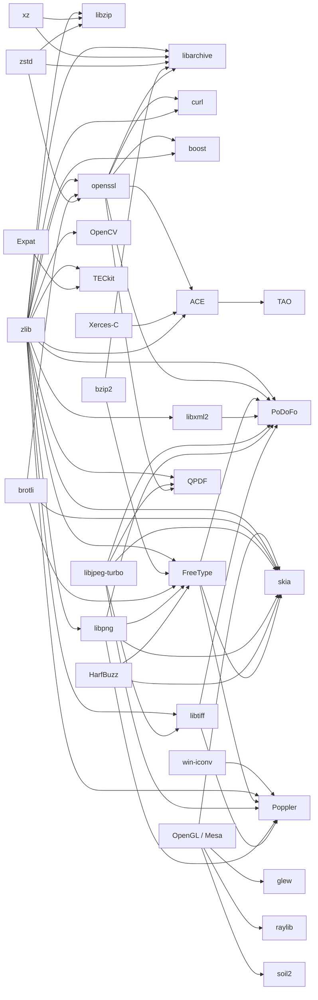

# Integrated Third-Party Libraries

[TOC|Content]

This page is the public engineering overview of the third-party libraries currently integrated into BuildEngine for the Win64 Modern BCC64X toolchain. The authoritative executable contract remains `admin/build-libraries.xml`; this page explains the dependency graph, integration shape, deliberate deviations from upstream defaults, version-bound patches, packaging repairs, and important verification choices.

The corresponding internal engineering findings are maintained in `docs/bcc64x-library-integration-findings.md`. Both documents must be updated when a library is added, removed, upgraded, patched, or materially reconfigured.

Each logical library also carries a concise one-line purpose description in its contract metadata. The description identifies what the upstream library is for; build-specific details remain in the integration notes so that product metadata and integration evidence do not become mixed.

## Integration rules

The current integration follows a few project-wide rules:

- BCC64X is the compiler path under investigation. A library is not silently moved to MSVC, clang-cl, MinGW, or another compiler to make it pass.
- Versions and dependencies are explicit BuildEngine contract data rather than accidental host discovery.
- Shared libraries are the normal product shape unless a library is intrinsically header-only or there is a deliberate, documented reason for a static package.
- Release and Debug use separate variant directories and are tested independently where the package contract requires both.
- Source repairs are version-bound and checked with `git apply --check` before application.
- Packaging repairs are preferred over source patches when the source itself is compatible but upstream install/export metadata is incomplete.
- Consumer smoke tests validate the installed package rather than only the build tree.
- BuildEngine dependencies remain visible in the DAG, package metadata, and SBOM. Bundled upstream components are tracked separately.
- A logical library boundary does not require an artificial physical output boundary when the upstream build system deliberately shares a producer tree. ACE and TAO are the current explicit example.

## License traffic light

The license traffic light is an engineering integration marker for proprietary product use:

- **🟢 Green** — permissive/public-domain style use; normally suitable for proprietary software when required notices, attribution and other ordinary license obligations are preserved.
- **🟡 Yellow** — product-specific review required; typical causes are weak copyleft, dual/multi licensing, mixed-license distributions, bundled components, or additional redistribution obligations.
- **🔴 Red** — do not plan as an in-process dependency of proprietary software; strong copyleft requires a different product/distribution architecture or another licensing path.

The marker does not replace the original upstream license text. See [Open-Source License Overview](licenses.md) for the general rules.

## Dependency overview



HarfBuzz is deliberately built without FreeType. FreeType is then built with HarfBuzz, keeping that part of the graph acyclic.

ACE and TAO are separate logical libraries in the dependency graph. This does **not** mean that their upstream output is physically separated. TAO is built on the already prepared ACE `ACE_wrappers` tree; `TAO_ROOT` is below `ACE_ROOT`, and ACE and TAO both write libraries and tools into the shared `ACE_wrappers\lib` and `ACE_wrappers\bin` directories. The logical `tao -> ace` edge therefore describes scheduling, state, metadata and SBOM ownership while preserving the upstream physical layout.

## Current inventory

| Library | Version | License | Category | Description | BuildEngine dependencies | Integration notes |
| --- | --- | --- | --- | --- | --- | --- |
| pugiXML | 1.16 | 🟢 Green | data | Lightweight C++ XML processing library with DOM-style parsing and XPath support. | — | Shared package, Release/Debug, installed package smoke. |
| zlib | 1.3.2 | 🟢 Green | compression | General-purpose DEFLATE compression library used as a foundational compression dependency. | — | Core compression dependency used by several packages. |
| Brotli | 1.2.0 | 🟢 Green | compression | Lossless compression library and codec optimized for web and general data compression. | — | Shared compression package; also consumed by OpenSSL, FreeType, and Skia. |
| Zstandard | 1.5.7 | 🟢 Green | compression | Fast lossless compression library offering a wide compression-speed trade-off. | — | Shared compression package used by libzip, libarchive, and OpenSSL. |
| XZ / liblzma | 5.8.3 | 🟡 Yellow | compression | LZMA/LZMA2 compression library and XZ container implementation. | — | Shared compression package used by libzip and libarchive. |
| libzip | 1.11.4 | 🟢 Green | archive | C library for reading, creating, and modifying ZIP archives. | zlib, XZ, Zstandard | Shared library plus zip tools; AES/XZ/Zstd functional checks; upstream documentation build is not part of the package build because it writes shared source-tree outputs. |
| libarchive | 3.8.9 | 🟡 Yellow | archive | Multi-format archive and compression library backing tar/cpio-style workflows. | zlib, XZ, Zstandard, bzip2, OpenSSL | Shared libarchive plus tar/cpio/cat/unzip; BZip2 enabled explicitly for in-process `.tar.bz2` extraction; BCC64X compatibility patch for legacy `__BORLANDC__` branches and Windows/Clang details. |
| OpenSSL | 3.5.8 | 🟢 Green | security | TLS/SSL and general-purpose cryptography toolkit and provider library. | zlib, Brotli, Zstandard | Native BCC64X Configure target, shared build, version-bound linker/Windows/PDB patches; no-asm baseline. |
| curl | 8.21.0 | 🟢 Green | network | Client-side URL transfer library with HTTP(S) and related protocol support. | OpenSSL, zlib | Shared libcurl baseline with OpenSSL + zlib; Schannel, Brotli, Zstd and several optional protocol dependencies deliberately disabled in the current proof. |
| Boost | 1.92.0 | 🟢 Green | foundation | Large collection of portable C++ libraries extending the standard library ecosystem. | OpenSSL, zlib | C++23 shared build from the official CMake tree; broad selected module set; MPI/Python excluded; BCC64X native-Clang preflight gates. |
| nlohmann-json | 3.12.0 | 🟢 Green | data | Header-only modern C++ JSON parser, serializer, and data model. | — | Header-only package. |
| ACE | 8.0.6 | 🟢 Green | middleware | Adaptive Communication Environment providing portable networking, concurrency, IPC, and OS abstraction. | OpenSSL, Xerces-C, zlib | Native BCC64X MPC/BMake base; owns the shared `ACE_wrappers` producer tree used later by TAO. |
| TAO | 4.0.6 | 🟢 Green | middleware | CORBA object request broker and middleware services built on top of ACE. | ACE | Logical TAO package continues inside ACE's physical `ACE_wrappers` tree; shared `bin`/`lib`, `tao_idl`, Naming, COS Event and RT Event services. |
| bzip2 | 1.0.8 | 🟢 Green | compression | Lossless block-sorting compression library implementing the bzip2 format. | — | BuildEngine CMake wrapper creates the shared Win64 package and package metadata. |
| GLEW | 2.3.1 | 🟡 Yellow | graphics | OpenGL extension loading library exposing modern OpenGL entry points. | OpenGL | Shared package built against the managed OpenGL package. |
| OpenGL / Mesa | 26.2.1 | 🟡 Yellow | graphics | Mesa software OpenGL implementation providing the managed Windows desktop OpenGL runtime. | — | Mesa/Meson softpipe WGL profile; OpenGL enabled, LLVM/Vulkan/GLES/EGL/GLX disabled; BCC64X-derived import libraries generated from built DLLs. |
| raylib | 6.0 | 🟢 Green | graphics | Small C game-programming library for graphics, input, audio, and windowing. | OpenGL | BuildEngine CMake wrapper, shared Release/Debug package. |
| SDL2 | 2.32.10 | 🟢 Green | graphics | Cross-platform low-level multimedia library for windows, input, audio, and graphics integration. | — | Shared-only package; test targets and Direct3D renderer paths disabled in the current Windows proof. |
| SQLite | 3.53.4 | 🟢 Green | database | Embedded transactional SQL database engine delivered as a self-contained library. | — | Amalgamation-based shared package with BuildEngine CMake wrapper. |
| Xerces-C | 3.3.0 | 🟢 Green | data | C++ XML parser and validation library implementing DOM/SAX and XML Schema support. | — | Shared Windows package using Winsock, Windows transcoder and in-memory message loader; upstream API-documentation target retained. |
| SOIL2 | 1.3.0 | 🟢 Green | graphics | Small OpenGL texture-loading library for common image formats. | OpenGL | BuildEngine CMake wrapper and managed OpenGL package. |
| VTK | 9.6.2 | 🟢 Green | graphics | Visualization Toolkit for scientific data structures, processing, and visualization pipelines. | — | Deliberately narrow shared profile: CommonCore, CommonDataModel and FiltersCore; large module groups and language wrappers disabled. |
| OpenCV | 5.0.0 | 🟡 Yellow | graphics | Computer vision and image-processing library with broad algorithm and matrix support. | zlib | Reduced package profile with a version-bound BCC64X patch making MLAS optional. |
| cmark-gfm | 0.29.0.gfm.13 | 🟢 Green | documentation | GitHub-flavored CommonMark parser and renderer used for BuildEngine documentation. | — | GitHub-flavored CommonMark library used by BuildEngine documentation rendering. |
| GoogleTest | 1.17.0 | 🟢 Green | testing | C++ unit-testing and mocking framework from the GoogleTest project. | — | Managed test-framework package with CMake package consumption. |
| Catch2 | 3.16.0 | 🟢 Green | testing | Modern C++ unit-testing framework with self-contained test registration and assertions. | — | Deliberate static test-framework package; BCC64X-specific compile definitions/code-page setting, no source patch. |
| BitmapPlusPlus | 1.1.1 | 🟢 Green | graphics | Header-only C++ bitmap utility for reading, writing, and manipulating BMP images. | — | Header-only; no artificial binary build; BuildEngine supplies missing package-config metadata and Release/Debug consumer smokes. |
| libjpeg-turbo | 3.2.0 | 🟡 Yellow | image | High-performance JPEG codec using the libjpeg API and TurboJPEG interface. | — | Shared library, TurboJPEG enabled, SIMD disabled for the current baseline. |
| libpng | 1.6.58 | 🟢 Green | image | Reference PNG image encoding and decoding library. | zlib | Shared package using managed zlib; static library and upstream tests disabled in the current contract. |
| HarfBuzz | 14.4.0 | 🟡 Yellow | text | OpenType text shaping engine converting Unicode text into positioned glyphs. | — | Shared core shaping + subset package; optional frameworks and FreeType disabled to keep the graph acyclic; package/export repairs applied at install time. |
| FreeType | 2.14.3 | 🟡 Yellow | text | Font rasterization engine for loading and rendering scalable and bitmap fonts. | zlib, bzip2, Brotli, libpng, HarfBuzz | Shared package with all declared dependencies explicitly required; HarfBuzz integration is part of the consumer proof. |
| libtiff | 4.7.2 | 🟢 Green | image | TIFF image file reading, writing, and image metadata library. | zlib, libjpeg-turbo | Shared package; tools/contrib/docs/tests disabled in the current contract. |
| Skia | 153 | 🟡 Yellow | graphics | 2D graphics engine for raster, vector, text, image, and GPU-backed rendering. | OpenGL, zlib, Brotli, libjpeg-turbo, libpng, HarfBuzz, FreeType | Broad Windows desktop component build at pinned source commit `2eed75b956045eb8603d3690a1e84bc582a2135d`; extensive BCC64X GN/system-library/component repairs and bundled-component SBOM evidence. |
| Graphite2 | 1.3.15 | 🟡 Yellow | text | Smart-font rendering engine for Graphite fonts and complex text shaping. | — | Upstream CMake with full Release/Debug tests; several exact-version test portability/reference/encoding patches, currently 91/91 tests in both variants. |
| Expat | 2.8.4 | 🟢 Green | data | Streaming XML parser used by TECkit/SFconv and other XML consumers. | — | Upstream CMake; exact-version patch corrects the upstream assumption that every non-MSVC test build requires Bash. |
| TECkit | 2.5.13 | 🟡 Yellow | text | Text encoding conversion toolkit, mapping compiler and conversion utilities. | zlib, Expat | Deliberate native CMake/Ninja/BCC64X adapter derived from upstream Makefile.am inventories; original Perl regression suite retained; no Autotools/MinGW-crossbuild runtime. |
| ICU4C | 78.3 | 🟡 Yellow | text | Unicode and globalization library for locale, normalization, collation and conversion. | — | VCXPROJ files are read only as source/resource inventory; BuildEngine owns CMake/Ninja/BCC64X. Current bootstrap builds stubdata, common and i18n without MSBuild/MSVC/NMAKE/MSYS. |
| win-iconv | 0.0.8 | 🟢 Green | text | Small Windows iconv implementation backed by Win32 character conversion APIs. | — | Added as the explicit Iconv dependency required by Poppler's C++ API. Public-domain upstream; modern-CMake compatibility patch for the tagged 0.0.8 source. **[nicht verifiziert]** |
| libxml2 | 2.15.3 | 🟢 Green | data | C XML toolkit with XPath, XML Schema, Relax NG, XInclude and serialization support. | zlib | New shared upstream CMake profile with tests/programs, schema/Relax NG/XPath/XInclude and zlib enabled; Python, ICU, modules and external iconv disabled for the first BCC64X proof. **[nicht verifiziert]** |
| QPDF | 12.4.1 | 🟢 Green | documentation | PDF structural inspection and transformation library for rewriting, encryption and validation workflows. | zlib, libjpeg-turbo, OpenSSL | New shared upstream CMake profile, static library disabled, OpenSSL required as the crypto provider, upstream tests and package consumer smoke retained. **[nicht verifiziert]** |
| PoDoFo | 1.1.1 | 🟡 Yellow | documentation | C++ PDF parsing, creation and modification library with form, annotation, signing and incremental-update APIs. | zlib, OpenSSL, FreeType, libxml2, libjpeg-turbo, libpng, libtiff | New shared upstream CMake profile; Win32 GDI font search enabled, AFDKO/examples/GPL tools disabled, upstream tests and package smoke retained. **[nicht verifiziert]** |
| Poppler | 26.09.0 | 🔴 Red | documentation | PDF parser and rendering foundation used in document-processing toolchains. | zlib, FreeType, libjpeg-turbo, libpng, libtiff | Upstream CMake with reduced Windows profile; local _AMD64_/NOMINMAX bridge; C++ API enabled with ENABLE_CPP=ON; upstream test-data repository is a separate future pinned participant. **[nicht verifiziert]** |

## PDF and XML processing stack

The document-processing branch now has four complementary layers:

- **libxml2 2.15.3** provides the XML parser, XPath, XML Schema and Relax NG foundation for extracted E-invoice payloads.
- **QPDF 12.4.1** provides low-level PDF object/structure inspection and deterministic rewrite capabilities.
- **PoDoFo 1.1.1** provides the higher-level C++ PDF modification layer, including forms, annotations, signing and incremental updates.
- **Poppler 26.09.0** provides PDF reading/rendering and its C++ API is enabled.

The current contracts are intentionally separate. No single PDF library is treated as a universal abstraction. The first BuildEngine goal is to prove each installed package independently with BCC64X, then use BuildEngine-Tests to determine the practical responsibility boundary through real E-invoice, form-discovery and fill/save/reopen scenarios.

The new libxml2, QPDF and PoDoFo paths are **[nicht verifiziert]** until a target-machine run passes. Poppler's newly enabled C++ API is likewise **[nicht verifiziert]**.

Licensing is also part of the architecture. QPDF is Apache-2.0. PoDoFo's library offers MPL-2.0 or LGPL-2.0-or-later, while its command-line tools are GPL and are therefore disabled in the first library-focused profile. Poppler is GPL and must not become an accidental mandatory proprietary in-process dependency without a deliberate distribution decision. See [Open-Source License Overview](licenses.md) and [PDF and E-Invoice Processing Roadmap](pdf-processing.md).

## Archive and compression stack

### zlib, Brotli, Zstandard, XZ and bzip2

These libraries form the reusable compression foundation. Their versions are explicit dependencies of downstream packages rather than libraries discovered from an arbitrary machine installation. This matters especially for OpenSSL, libzip, libarchive, FreeType and Skia, because package metadata and SBOM relationships must describe the exact producer that was used.

BZip2 1.0.8 is now also an explicit libarchive dependency. Release uses `bzip2.lib`, Debug uses `bzip2d.lib`. This is also the source for rebuilding BuildEngine's private libarchive runtime so `.tar.bz2`, `.tbz2` and `.tbz` can be handled in-process.

### libzip 1.11.4

libzip consumes the managed zlib, XZ and Zstandard packages. The package contains the shared library and the upstream command-line tools. BuildEngine runs functional checks for Zstandard, XZ and AES-256 archive operations.

Upstream installs some command-line tools to a literal `bin` location instead of respecting the configuration-specific BuildEngine bindir. BuildEngine keeps the upstream package metadata intact and additionally copies the actual tools into the variant-specific package layout.

The upstream documentation target is deliberately not part of the current build contract because it writes common generated files into the shared source tree and therefore conflicts with parallel Release/Debug builds. This is a build-system/output-layout constraint, not a reason to serialize the entire BuildEngine graph.

### libarchive 3.8.9

libarchive consumes zlib, XZ, Zstandard, bzip2 and OpenSSL and enables the native tar, cpio, cat and unzip tools. BZip2 is enabled explicitly and bound to the managed `bzip2 1.0.8` package rather than to an accidental host installation. CNG and Windows XMLLite are enabled; optional backends not represented by explicit BuildEngine dependencies are disabled.

The version-bound `bcc64x-modern-borland-compat.patch` separates modern Clang-based BCC64X behavior from legacy compiler branches guarded only by `__BORLANDC__`. It covers inline/integer/literal handling, Windows `lseek` and `mbstate_t` handling, open-mode signatures and related tests. It also incorporates the relevant upstream Windows/Clang `filter_fork_windows.c` correction and resolves a BCC64X `ftruncate` macro collision without weakening Debug `-Werror`.

## Security and network stack

### OpenSSL 3.5.8

OpenSSL uses a native BCC64X Configure platform named `BC-64X`. The tool contract supplies BCC64X, `llvm-ar`, `llvm-ranlib`, BCC64X windres and NASM. The current reproducible baseline is shared and uses `no-asm`; zlib, Brotli and Zstandard are explicit package dependencies.

The current version-bound repairs include:

- linker-response path normalization for BCC64X/LLD;
- normalization of external compression-library arguments written to response files;
- a QUIC/Windows header compatibility repair for the modern Clang-based Embarcadero compiler;
- a dedicated BCC64X OpenSSL platform using PDB rather than the legacy C++Builder TDS debug-sidecar model.

Brotli's BCC64X producer names its import libraries `libbrotli*.lib`, while OpenSSL's Windows integration expects unprefixed names. BuildEngine creates private consumer-side aliases inside the OpenSSL build tree; producer artifacts are not renamed.

### curl 8.21.0

The current curl contract intentionally re-establishes a narrow known baseline first: TLS through managed OpenSSL and compression through managed zlib. Schannel is disabled and Brotli/Zstd are currently not enabled for curl even though those packages exist independently. Optional c-ares, IDN2, libpsl, SSH and HTTP/3 dependency paths are also disabled.

CMake's Windows `FindOpenSSL` behavior is handled with explicit include/library search information for the variant-specific BuildEngine package. BuildEngine does not fall back to an unrelated OpenSSL installation on the host.

## Foundation and middleware

### Boost 1.92.0

Boost is built from the official CMake source distribution with C++23, shared libraries and a broad selected module closure. The current contract represents 148 selected source modules covering the verified logical library set; MPI- and Python-dependent ecosystems remain excluded.

OpenSSL and zlib are exact managed dependencies. The build includes early native-BCC64X/Boost.Config preflight compilations so a compiler-model regression fails before the expensive Boost graph is started. The optional Boost.Random `random_device` binary is disabled because the verified contract treats Boost.Random as header/interface use.

### ACE 8.0.6 and TAO 4.0.6

ACE and TAO are modeled as separate logical libraries because their dependency and product roles are different: ACE is the portable communication/concurrency foundation, while TAO is the CORBA implementation and service layer built on ACE. The direct BuildEngine edge is therefore `tao -> ace`; ACE itself depends on OpenSSL, Xerces-C and zlib. This also gives metadata and SBOM generation the correct direct/transitive relationship.

The logical split deliberately does **not** split the upstream producer tree. Both libraries come from the same ACE+TAO release and continue to use the same variant-specific `ACE_wrappers` tree. TAO builds with `ACE_ROOT` pointing at that existing ACE tree and `TAO_ROOT` at `ACE_ROOT\TAO`. In particular, TAO's generated libraries, DLLs and tools continue to appear in the same `ACE_wrappers\lib` and `ACE_wrappers\bin` directories used by ACE. BuildEngine must not invent a second physical TAO `bin` or `lib` tree merely because the scheduler has two logical library IDs.

The package view can still assign ownership deliberately: ACE publishes its base headers/runtime artifacts; TAO publishes TAO/orbsvcs headers, `tao_idl`, Naming, COS Event and RT Event services and the TAO-specific artifacts produced in the shared tree. The physical producer overlap is therefore explicit and intentional rather than hidden by filesystem discovery.

Both continue to use their native MPC/BMake path with BCC64X. The integration remains a direct BCC64X ecosystem proof; alternative compiler paths are not substituted for failed pieces.

## Graphics stack

### OpenGL / Mesa 26.2.1

The OpenGL package is produced from Mesa with Meson/Ninja and the BCC64X toolchain. The current profile targets Windows with Gallium softpipe/WGL and desktop OpenGL. GLES, EGL, GLX, GBM, Vulkan, LLVM and unrelated tools are disabled.

Import libraries are generated from the actual BCC64X-built DLL exports using `tdump` and `ld.lld`; they are not borrowed from another compiler installation. A small BuildEngine CMake package describes the resulting OpenGL package to consumers.

### GLEW, raylib and SOIL2

These packages consume the managed OpenGL package explicitly. Where upstream does not provide an installation shape suitable for BuildEngine, a small Admin-side CMake wrapper provides the build/install/package contract without changing the library's public source API.

### SDL2 2.32.10

SDL2 is a shared-only package in the current contract. The first BCC64X profile deliberately disables SDL tests and Direct3D renderer paths. Those are explicit current settings, not a general statement that those features can never be supported.

### VTK 9.6.2

The VTK proof is intentionally a small, controlled subset: `CommonCore`, `CommonDataModel` and `FiltersCore`. StandAlone/Rendering/Web/MPI groups and Python/Java wrappers are disabled. This establishes native library/package compatibility before expanding the very large optional VTK graph.

### OpenCV 5.0.0

OpenCV consumes managed zlib. The version-bound `bcc64x-optional-mlas.patch` makes the MLAS path optional for the BCC64X package profile rather than forcing an unrelated compiler/runtime dependency into the proof.

### BitmapPlusPlus 1.1.1

BitmapPlusPlus is header-only. Upstream defines an INTERFACE target but no install/package-config contract, so BuildEngine does not invent a binary build. It installs the original header and license and supplies only the missing CMake package discovery metadata. Release and Debug consumer smokes exercise real BMP write/read behavior.

## Image and text stack

### libjpeg-turbo 3.2.0

The package is shared, with TurboJPEG enabled and static output disabled. SIMD remains disabled for the current controlled baseline. Skia consumes this BuildEngine package rather than building another libjpeg-turbo copy.

### libpng 1.6.58

libpng is shared and consumes the exact zlib package. `PNG_TESTS` is currently disabled. The package is also an explicit input to FreeType and Skia.

For Skia's GN/BCC64X integration, the absolute import-library path must remain a raw linker flag rather than being converted into GN's normal `-l...` library form.

### HarfBuzz 14.4.0

HarfBuzz is built without FreeType and without optional Cairo, Graphite2, GLib, ICU, GObject, Uniscribe, GDI or DirectWrite integration. Core shaping and subset support are enabled; raster/vector/GPU/utilities are not part of the package.

Two upstream packaging gaps are repaired without patching the HarfBuzz source:

1. the generated CMake export can reference `Threads::Threads` without resolving the Threads dependency, so BuildEngine installs a small package wrapper around the original generated targets;
2. the CMake install path omits `hb-subset-depend.h` although the installed public subset header requires it, so BuildEngine copies that public header explicitly.

### FreeType 2.14.3

FreeType requires managed zlib, bzip2, Brotli, libpng and HarfBuzz. The direction HarfBuzz -> FreeType is deliberate: HarfBuzz itself is built without FreeType, then FreeType is built with HarfBuzz. The resulting package therefore has a complete but acyclic dependency graph.

Package smokes must resolve the transitive runtime DLL closure, not only direct dependencies. FreeType and its bzip2 path were one of the cases that made this requirement visible.

### libtiff 4.7.2

libtiff uses managed zlib and libjpeg-turbo. The package is shared; optional tools, contrib code, documentation and upstream tests are disabled in the current contract. Public headers and consumer use remain explicit package gates.

## Documentation and testing libraries

### cmark-gfm 0.29.0.gfm.13

cmark-gfm provides the CommonMark/GFM parsing layer used by BuildEngine's live Markdown documentation. It is managed like the other third-party packages rather than being taken from the host system.

### GoogleTest 1.17.0

GoogleTest is a managed testing dependency and is consumed through its installed CMake package.

### Catch2 3.16.0

Catch2 is deliberately static in this project because it is a test framework. Its current BCC64X integration requires two targeted settings rather than a source patch:

```text
-DCATCH_CONFIG_NO_POLYFILL_ISNAN
-fborland-exec-code-page=65001
```

The first avoids Catch2's legacy `__BORLANDC__` path that expects `std::_isnan()`. The second makes ordinary narrow string literals use UTF-8 for the upstream XML encoding test. The setting remains local to Catch2; it is not silently made a global BCC64X policy.

## Skia 153

Skia is the broadest integration in the current contract. The logical package version is `153`; the reproducible source pin is commit `2eed75b956045eb8603d3690a1e84bc582a2135d`.

BuildEngine supplies OpenGL, zlib, Brotli, libjpeg-turbo, libpng, HarfBuzz and FreeType as external packages. Those exact package versions therefore remain visible in the dependency graph and SBOM instead of being downloaded again inside Skia.

Other components remain intentionally bundled at Skia's pinned revisions, including ICU, WebP, libavif/libgav1, JPEG XL, Wuffs, DNG SDK, Expat, SPIR-V/Vulkan support components and the Vulkan/D3D memory allocators. Bundled components are recorded separately from BuildEngine package dependencies.

The Windows desktop profile includes CPU raster/skcms, DirectWrite/GDI, FreeType, ICU/HarfBuzz shaping, PNG/JPEG/WebP/Wuffs, AVIF/JPEG XL/DNG, SVG, PDF/XPS, Skottie, Ganesh, Graphite, OpenGL, Direct3D 12 and Vulkan. Web, mobile, Dawn/ANGLE, Rust codecs, FFmpeg/Lua and developer/fuzzer integrations are excluded from this package profile.

The version-bound BCC64X integration includes, among other repairs:

- GN toolchain support for BCC64X;
- propagation of raw system linker flags through GN target chains;
- Windows desktop/BCC64X compatibility changes;
- correction of the Debug SPIR-V validator condition;
- `SkArenaAlloc` export across component boundaries;
- zlib and other BuildEngine system-library routing;
- separate system integrations for Brotli, libjpeg-turbo, libpng, HarfBuzz and FreeType;
- targeted component/export handling rather than blanket `--export-all-symbols`.

A generic BCC64X UCRT runtime defect discovered while testing Skia is not hidden in a Skia source patch. BuildEngine creates the `bcc64x-ucrt-compat` archive from the installed Embarcadero runtime objects and places it before the normal runtime during linking. No Embarcadero object files are distributed in the repository.

## Text, Unicode and document-processing stack

### Graphite2 1.3.15

Graphite2 remains an upstream-CMake build. The important integration work is concentrated in the upstream test path rather than in a replacement build system. The current exact-version patch set covers language-tag/reference expectations, text-render advance diagnostics, Windows line endings, UTF-8 literals, managed FontTools discovery and the BCC64X Padauk3 reference case.

These patches are intentionally version-bound under `admin/patches/graphite2/1.3.15`. They are not described as generic Graphite2 fixes.

The resulting current evidence is strong: both Release and Debug completed the complete configured suite with 91/91 tests. This is a useful example where preserving the tests was more valuable than disabling inconvenient cases.

### Expat 2.8.4

Expat is classified as **data**, because its primary role is XML parsing. Its use by TECkit/SFconv is a dependency relationship and does not make Expat a text-processing library.

Expat uses its upstream CMake build, builds a shared parser package plus `xmlwf`, runs upstream CTest tests and installs its own CMake package metadata.

One upstream test-system assumption required correction: Expat treated every non-MSVC compiler as a POSIX-shell case and routed tests through `bash run.sh`. BCC64X is a native Windows Clang toolchain. The version-bound `native-windows-tests.patch` changes this decision to Windows-vs-non-Windows, so native Windows test executables run directly.

This is a build/test-system patch, not an Expat parser-source compatibility patch.

### TECkit 2.5.13

TECkit is a deliberate exception to the default preference for using the upstream build system directly.

The maintained upstream build contract is Autotools and the upstream Windows release script cross-builds with MinGW. Neither path is the evidence target of this project. The TECkit source itself has a small, explicit target inventory in its `Makefile.am` files, so BuildEngine-Admin provides a native CMake adapter that expresses the same core products for CMake/Ninja/BCC64X:

- `TECkit`;
- `TECkit_Compiler`;
- `teckit_compile`;
- `txtconv`;
- `sfconv`.

The adapter is therefore a **downstream build description**, not a claim that TECkit upstream provides CMake support.

zlib 1.3.2 and Expat 2.8.4 are normal BuildEngine package dependencies. The FSM releases TECkit Build only after both dependency Install states have completed; TECkit then consumes their installed package metadata from `InstallRoot`.

The unchanged upstream `test/dotests.pl` regression suite is retained and executed with managed Strawberry Perl. This preserves upstream behavioral evidence despite the different native build description.

### ICU4C 78.3

ICU demonstrates a different integration class. The Windows VCXPROJ files are not executed with MSBuild and do not select MSVC. They are used read-only as source/resource inventories by BuildEngine's ProjectImport layer.

The generated neutral CMake project is then built by Ninja/BCC64X. The current bootstrap deliberately covers:

```text
stubdata -> common -> i18n
```

This was chosen over introducing NMAKE, MSYS, `runConfigureICU`, `cygpath` or Visual Studio Build Tools into the BCC64X proof. The first bootstrap stage does not yet claim full ICU data-generator/test coverage; that boundary remains explicit.

### Poppler 26.09.0

Poppler returns to the ordinary upstream-CMake path but uses an intentionally constrained package profile. Managed zlib, FreeType, libjpeg-turbo, libpng and libtiff are exact package dependencies.

The Win32 backend uses Microsoft-style Windows SDK headers. BCC64X identifies the x64 target differently from the assumptions in those headers, so the current contract supplies a local `_AMD64_` bridge and `NOMINMAX` through Poppler-specific flags instead of changing the generic BCC64X toolchain.

Several optional frontends/backends and utilities are disabled in this proof. Upstream release tarballs also do not contain the separate `poppler/test-data` repository, so the upstream test-data integration is explicitly deferred until that repository is pinned as its own reproducible participant. Tests are not claimed as passed merely because the core package builds.

## Package repairs versus source patches

The distinction is intentional:

| Kind | Examples | Project handling |
| --- | --- | --- |
| Source/build-system compatibility | libarchive legacy Borland branches, OpenSSL response files, Skia GN/toolchain/component integration, OpenCV MLAS | Exact-version patch, checked before application. |
| Packaging/export repair | HarfBuzz CMake wrapper and missing public subset header, BitmapPlusPlus package config | Admin-side install/package metadata; upstream source remains unchanged. |
| Compiler-policy setting | Catch2 `NO_POLYFILL_ISNAN`, BCC64X execution code page | Local library build contract unless proven generic. |
| Generic toolchain/runtime defect | BCC64X UCRT compatibility archive | BuildEngine/tool layer, not a library source patch. |

## Maintenance contract

This page and `docs/bcc64x-library-integration-findings.md` are documentation outputs of the library integration work, not optional historical notes.

Every non-default integration decision must remain visible here or in the matching detailed findings section. The documentation classifies it as one of: upstream build unchanged, downstream build adapter, exact-version source/build-system patch, packaging/export repair, library-local compiler policy, or generic toolchain/runtime correction.

Whenever `admin/build-libraries.xml` changes materially, maintainers must update the applicable documentation in the same work unit:

- add/remove/upgrade a library -> update the inventory and dependency information here;
- add/change a library purpose description -> update `metadata/@description` and the inventory description together;
- add/remove a patch -> update the relevant integration notes and identify whether it is source, packaging, compiler-policy, or generic-toolchain work;
- change important feature/test/build settings -> update the library's note;
- change dependency edges -> update both the inventory and dependency overview;
- change an intentional shared producer layout such as ACE/TAO -> document both the logical ownership and the physical output relationship;
- record deeper diagnostic evidence -> update the internal findings document under `docs/` as well.

The XML contract remains authoritative when documentation and executable configuration ever disagree; such a disagreement is a documentation defect to be corrected, not a second source of truth.