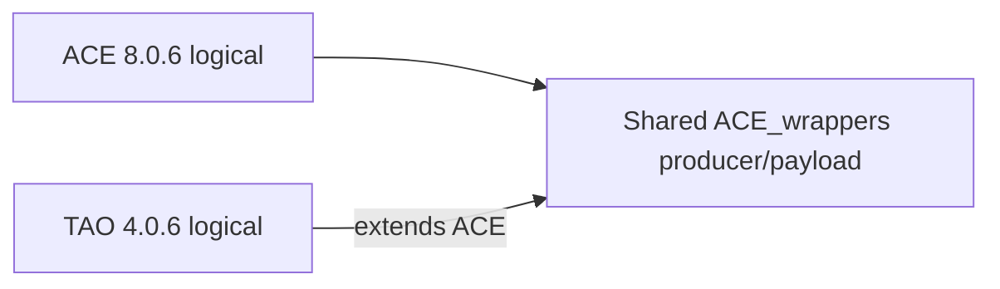
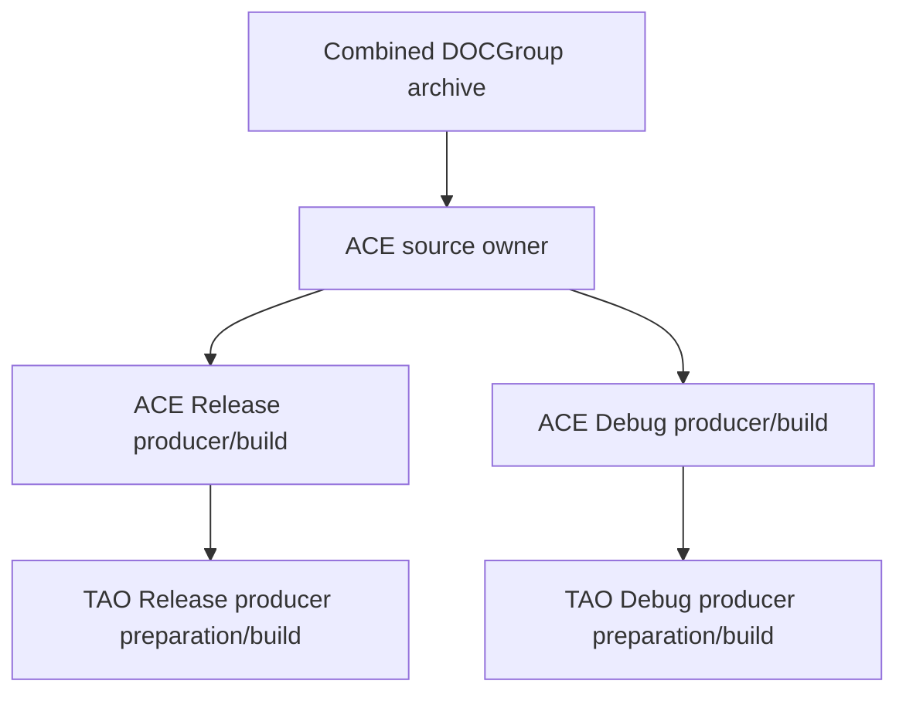
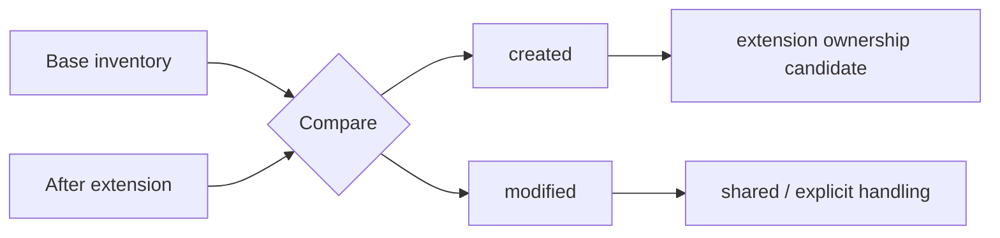
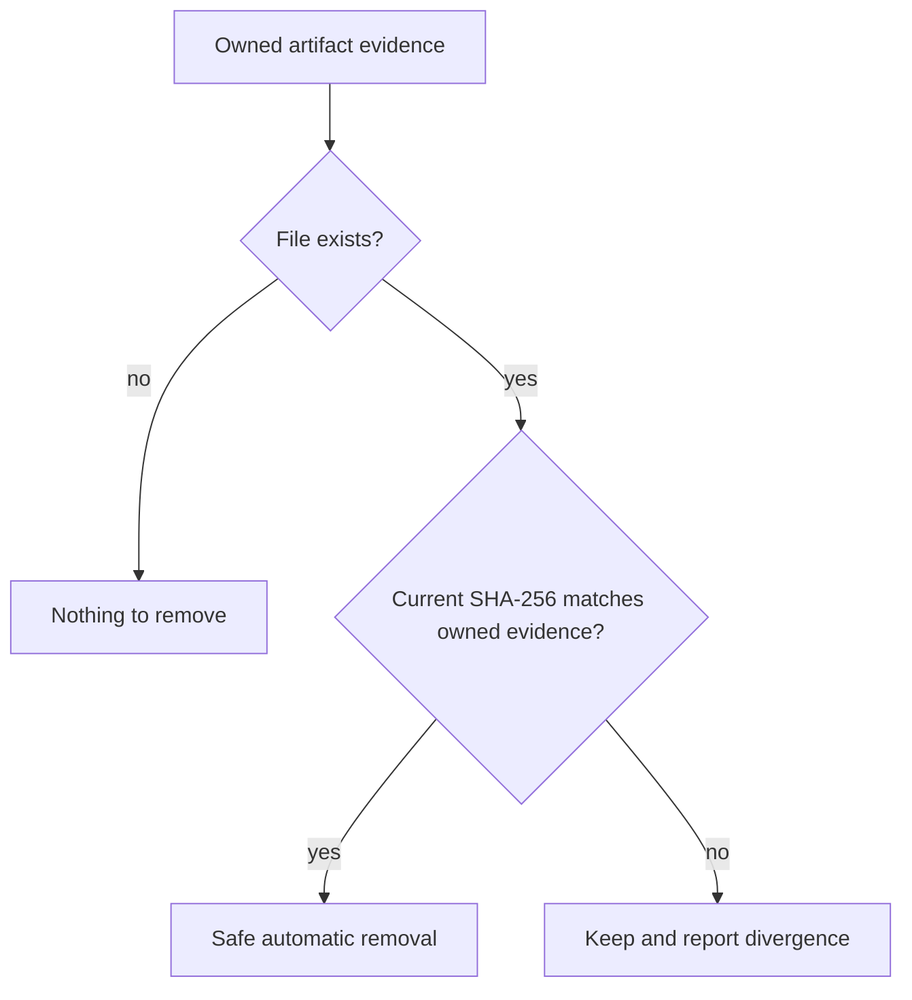

# Library Extensions

[TOC|Content]

**Status:** current extension contract as of 25 September 2026. Several Common/ownership implementation gaps are explicitly identified below and remain **not verified**.

A library extension is a logically independent library that deliberately continues inside the physical source, producer or installation layout of another logical BuildEngine library.

There are two extension kinds.

- `shared-source`: the extension reuses source, producer and optionally payload structures of its base. ACE 8.0.6 and TAO 4.0.6 are the reference case.
- `package`: the extension has its own source, producer and install package but is still semantically layered on a base library. libpq 18.6 and libpqxx 8.0.2 are the reference case.

## Core rule

Logical identity is independent of physical placement.



ACE and TAO may share source/producer/payload structures while retaining separate:

- logical state,
- metadata,
- SBOM,
- documentation,
- artifact/ownership evidence.

A physical directory is never itself the logical component identity.

## Normal dependency versus extension

| Property | Normal dependency | Extension |
| --- | --- | --- |
| Logical identity | independent | independent |
| Version | independent | independent |
| Persistent logical scopes | independent | independent |
| Metadata / SBOM | independent | independent |
| Source acquisition | normally independent | may be owned by base |
| Native producer | independent | may be shared with base |
| Physical payload | normally independent | may overlay base |
| Ownership | own inventory | base inventory + extension delta |

The extension edge already carries the direct base relationship and must not be duplicated as an ordinary dependency.

## XML contract

Conceptually:

```xml
<library id="extension-id" version="extension-version" ...>
   <extension type="shared-source"
              library="base-id"
              version="base-version"
              source="relative/source/subtree"
              producer="relative/producer/root"
              install=".">
      <shared path="bin"/>
      <shared path="lib"/>
   </extension>
   ...
</library>
```

Important rules:

The `type` attribute defaults to `shared-source` for backward compatibility with the ACE/TAO contract.

For `shared-source`:

- exact base ID/version;
- no extension cycle;
- relative/safe source/producer/install/shared paths;
- base owns acquisition when the archive is shared;
- extension does not download/extract a second copy;

For `package`:

- exact base ID/version;
- no extension cycle;
- own non-empty `source` contract including normal download/extract;
- own workspace, variant producer and package root;
- no inherited Source completion timestamp;
- the extension edge itself supplies the direct base dependency and must not be duplicated as an ordinary dependency.
- Release extends Release and Debug extends Debug;
- shared paths authorize physical overlap, not shared logical identity.

## libpq / libpqxx package-extension model

libpqxx is declared as:

```xml
<extension type="package" library="libpq" version="18.6"/>
```

Its source remains the independent libpqxx upstream archive, its build directories remain under `packages/libpqxx/8.0.2`, and its installation remains under `install/packages/libpqxx/8.0.2`. The extension relation contributes the direct dependency on libpq and its contract timestamp to libpqxx evidence, but does not redirect any physical path to libpq.

## ACE / TAO producer model

The DOCGroup archive is acquired and extracted once by ACE.

```text
ACE_ROOT = .../ACE_wrappers
TAO_ROOT = ACE_ROOT/TAO
```

ACE builds via `ACE.mwc`, which excludes TAO. TAO later builds via `TAO.mwc` in the already prepared shared producer.



TAO-specific source fixes that must affect copied variant producers are applied to the concrete TAO producer at the correct time; they are not raced against an already copied ACE workspace.

## Dependency/barrier semantics

Do not infer barriers from logical names such as `ready` when the physical operation only requires a narrower prerequisite.

In the current intended ACE/TAO graph, TAO compilation can proceed after the required ACE producer/install artifact evidence is available. A later ACE global consumer-publish failure does **not** by itself make TAO compilation invalid.

A stronger barrier is required only for operations that would mutate a shared physical payload while the base still needs to read that exact payload for another step.

This distinction prevents the extension graph from becoming unnecessarily serialized.

## Physical payload and logical metadata

Representative layout:

```text
install/packages/ace/8.0.6/
  include/
  bin/
  lib/
  .buildengine/extensions/tao/4.0.6/
```

TAO may therefore resolve to:

```text
Payload:
  install/packages/ace/8.0.6/

Metadata:
  install/packages/ace/8.0.6/.buildengine/extensions/tao/4.0.6/
```

The runtime/development payload can be shared while TAO retains its own SBOM/license/documentation identity.

## Artifact inventory and ownership

The target artifact contract records at least:

- relative path,
- size,
- SHA-256.

For an extension, compare the base inventory with the post-extension inventory:



Semantics:

- `created`: the extension introduced the file;
- `modified`: a previously existing base file changed;
- `modified` is not automatically exclusive extension ownership.

### Known current implementation gap

`BuildEngine-Common/src/ArtifactManifest.h` currently stores path and size but no SHA-256. A same-size binary content change is therefore not detected as `modified`.

Documentation that previously stated SHA-256 was already present described the intended contract, not the actual implementation.

## Publish

Publish must consume the same central artifact/ownership model.

It must not infer ownership merely because a file exists below the shared payload root.

Publish manifests are publication evidence, not an independent ownership authority.

### Current migration handling

Publish distinguishes active publisher manifests from retired logical publisher identities for the same publish root. A manifest whose library ID is no longer present in the current publish contract is treated as migration evidence rather than active collision authority. Its files can therefore be adopted by a current publisher without weakening the protection against genuinely unowned files.

After a current publish has taken over all still existing files recorded by a retired manifest, or those files no longer exist, the retired manifest is removed automatically. This specifically covers migrations such as the former combined `ace-tao.manifest` to the separate `ace.manifest` and `tao.manifest`.

The implementation is committed but remains **not verified** until the next BCC64X run has exercised the migration on an existing publish tree.

## Package export

Package export must also consume the same logical ownership/closure model.

### Known current implementation gap

`PackageExporter` currently recursively copies each component's physical `PackageRoot`. ACE and TAO can resolve to the same payload root, so this can duplicate or mislabel files inside an exported ZIP.

This must be corrected in Common rather than hidden by server-specific rules.

## Common repository interpretation

`LibraryCatalog` correctly models the logical extension relation and resolves payload/metadata separately.

However, the repository audit found remaining physical-directory assumptions:

- `LibraryExists()` still checks `install/packages/<library>`;
- `VersionExists()` still checks `install/packages/<library>/<version>`;
- extension `installed` currently follows physical payload existence too closely.

These functions must be aligned with the logical catalog before the Server API is fully extension-safe.

## Safe cleanup

The desired cleanup rule is:



This is a target capability. Because current ArtifactManifest does not yet store SHA-256, this cleanup rule is not yet fully implementable.

## State model

Logical state remains separate even when paths overlap.

```text
ace:source
ace:build:Release
ace:install
...

tao:build:Release
tao:install
...
```

The shared directory is not state authority. Artifact evidence is not state authority either.

## Documentation identity

ACE and TAO have separate documentation coordinates:

```text
documentation/ace/8.0.6/...
documentation/tao/4.0.6/...
```

Documentation follows logical API identity rather than assuming TAO owns a separate physical package directory.

## Validation rules

1. One optional extension declaration per library.
2. Exact base ID/version.
3. Safe relative paths.
4. No extension cycle.
5. No duplicate ordinary dependency on the base.
6. Shared source acquisition belongs to the base.
7. Extension download/extract of the same archive is forbidden.
8. Variants preserve identity.
9. Shared paths permit overlap but do not define ownership.
10. Shared targets are not wholesale cleaned by an extension.
11. Logical state/metadata/documentation remain independent.
12. Ownership distinguishes `created` and `modified`.
13. Publish, PackageExporter and future cleanup must consume one central ownership interpretation.

## Maintenance rule

When another library needs this model, extend the generic XML/Common contract. Do not add a library-name special case.

When semantics are shared by multiple applications, correct BuildEngine-Common first and let Server/Manager follow it.

## Verification status

The extension-aware Common/Server work and the corrections described above remain **not verified** until a later explicitly approved BCC64X/Common/Server test.
