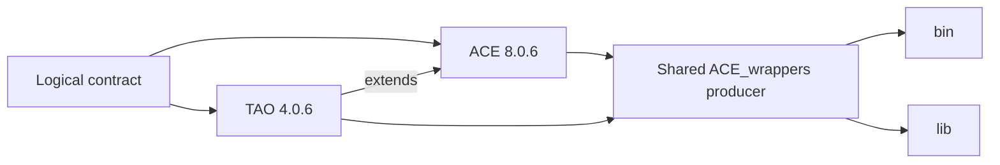
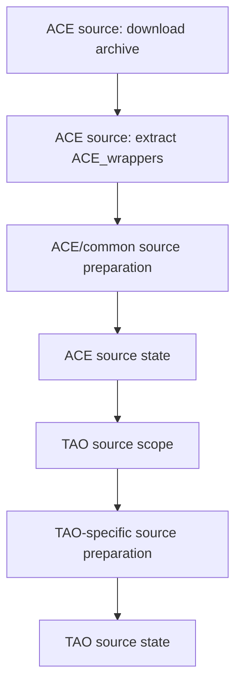
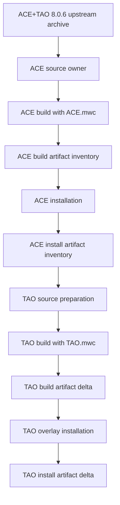
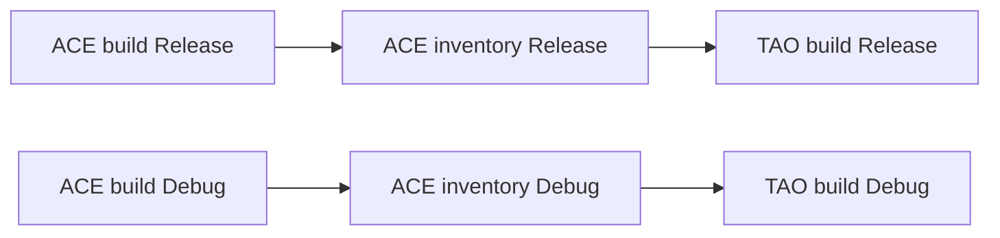
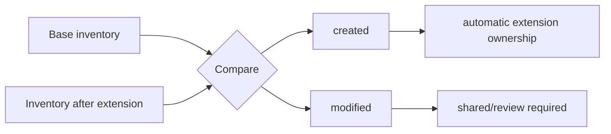
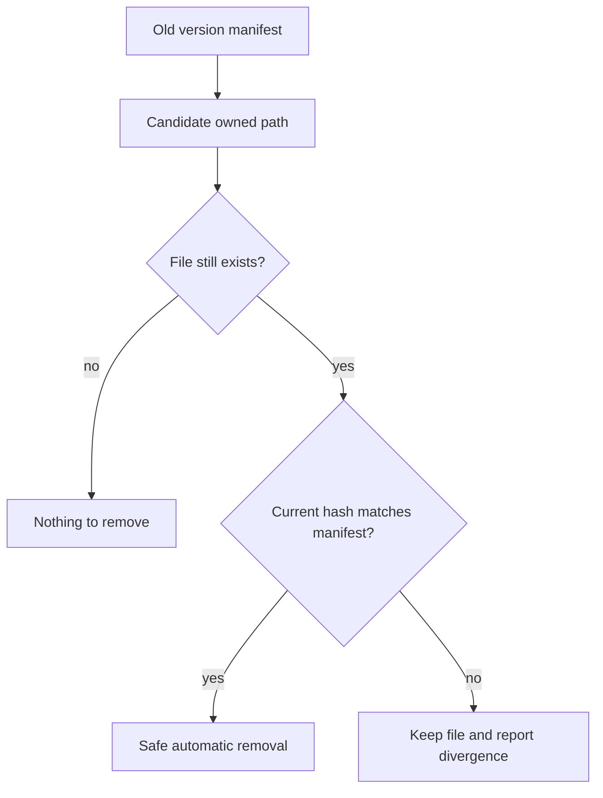
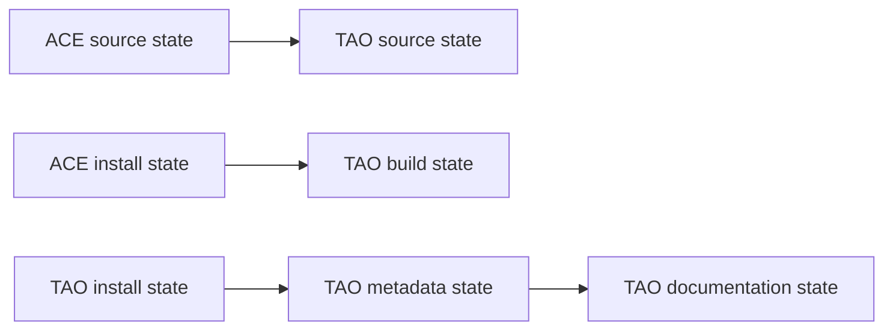
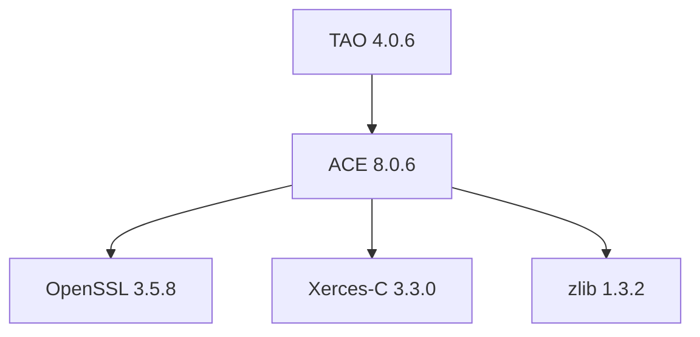
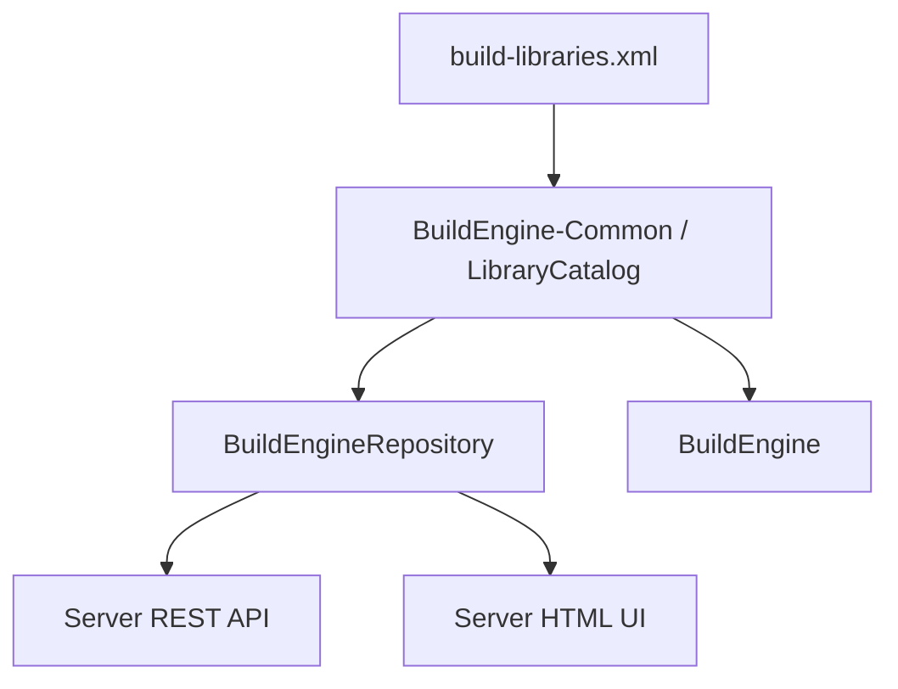
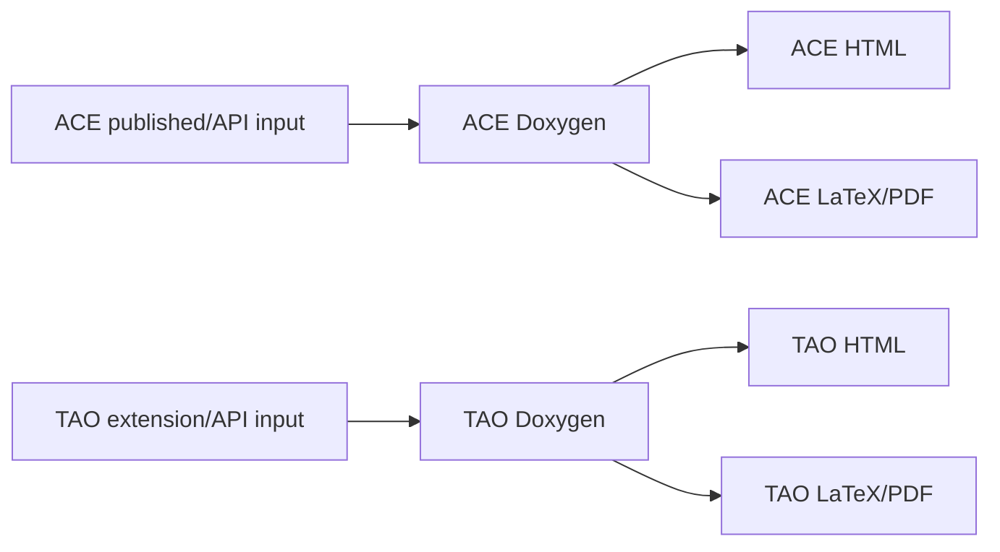

# Library Extensions

[TOC|Content]

This document defines the BuildEngine **library extension** model. A library extension is a logically independent library that deliberately continues inside the physical source, producer, and installation layout of another logical BuildEngine library.

The reference case is **ACE 8.0.6** and **TAO 4.0.6**. ACE can be consumed without TAO. TAO is independently versioned middleware built on ACE. The DOCGroup release nevertheless places TAO below `ACE_wrappers\TAO` and both components deliberately use the same `ACE_wrappers\bin` and `ACE_wrappers\lib` producer directories. BuildEngine preserves both truths: separate logical components and a shared physical producer.

## Design principles

The extension model follows these rules:

- logical component identity is independent of physical directory layout;
- the base library is an explicit graph dependency of the extension;
- one upstream archive is acquired and extracted only once when the base is the source owner;
- an extension may perform its own source **preparation** inside the already extracted base source tree;
- an extension must not download or extract a second copy of the base archive;
- Release extends Release and Debug extends Debug;
- a declared shared producer path authorizes physical overlap but does not merge logical ownership;
- base and extension keep separate state, metadata, SBOM, documentation, and artifact manifests;
- the Common/DLL repository model is the authoritative interpretation consumed by BuildEngine Server and other applications;
- artifact ownership is derived from inventory/delta evidence instead of directory-name assumptions alone.



## Normal dependency versus extension

| Property | Normal dependency | Library extension |
| --- | --- | --- |
| Logical identity | independent | independent |
| Version | independent | independent |
| Persistent scopes | independent | independent |
| Metadata / SBOM | independent | independent |
| Source acquisition | normally independent | can be owned by the base |
| Source preparation | own source tree | may operate inside base source tree |
| Variant producer | independent | may continue in base producer |
| `bin` / `lib` producer directories | independent | explicitly shareable |
| Installation | own package root | may overlay base payload |
| Graph relation | dependency | extension/base dependency |
| Transitive SBOM relation | yes | yes, through the base |

A library must not declare its extension base again as a normal `<dependency>`. The extension edge already carries that relationship.

## XML contract

Schema 15 adds an optional `<extension>` element. A normal library owns its `<source>` acquisition contract. An extension may omit `<source>` completely or may provide a preparation-only `<source>` block.

```xml
<library id="extension-id"
         version="extension-version"
         category="..."
         timestamp="...">
   <extension library="base-id"
              version="base-version"
              source="relative/source/subtree"
              producer="relative/producer/root"
              install=".">
      <shared path="bin"/>
      <shared path="lib"/>
   </extension>

   <metadata name="..."
             description="One-line purpose description"
             supplier="..."
             homepage="..."/>

   <source>
      <!-- Optional extension preparation only: copy / execute / target. -->
   </source>

   <build>
      ...
   </build>
</library>
```

### `extension/@library`

Logical ID of the base library. It must resolve to exactly one library in the same `build-libraries.xml` contract and must not refer to the extension itself.

### `extension/@version`

Exact base-library version required by the extension. BuildEngine does not silently substitute another version.

### `extension/@source`

Relative source subtree below the base source root:

```text
ExtensionSourceRoot = BaseSourceRoot / extension/@source
```

This is a path formula, not an architecture diagram. The path must be relative, must not contain `..`, and must exist after the base `source` scope completes.

### Extension source preparation

The base owns download and extraction. The extension may then make component-specific changes in the already extracted tree.

Permitted extension source actions are:

- `copy`;
- `execute`;
- `target`.

`download` and `extract` remain forbidden for an extension. This distinction is important for TAO: ACE owns the combined DOCGroup archive and source-wide compatibility patches, while the TAO-specific SSLIOP repair belongs to TAO's preparation scope.



### `extension/@producer`

Relative producer root below the variant-specific base build directory:

```text
ExtensionBuildRoot    = BuildRoot/packages/<base>/<base-version>/<Configuration>
ExtensionProducerRoot = ExtensionBuildRoot / extension/@producer
```

For ACE/TAO this resolves to the existing variant-specific `ACE_wrappers` tree. It does not create a second TAO producer.

### `extension/@install`

Relative overlay root below the base payload. `.` means the exact base package root:

```text
BaseInstallRoot      = InstallRoot/packages/<base>/<base-version>
ExtensionInstallRoot = BaseInstallRoot / extension/@install
```

TAO therefore has a logical package identity without requiring a fabricated physical `install\packages\tao\4.0.6` payload tree.

### `extension/shared/@path`

Declares producer subtrees intentionally shared by base and extension. ACE/TAO uses:

```xml
<shared path="bin"/>
<shared path="lib"/>
```

A shared path authorizes physical coexistence only. It does not imply that every file in that directory belongs to both logical components.

## Runtime variables

| Variable | Meaning |
| --- | --- |
| `{ExtensionLibraryId}` | base library ID |
| `{ExtensionLibraryVersion}` | base library version |
| `{ExtensionWorkspace}` | base workspace |
| `{ExtensionBaseSourceRoot}` | extracted base source root |
| `{ExtensionSourceRoot}` | base source root plus `extension/@source` |
| `{ExtensionBuildRoot}` | variant-specific base build directory |
| `{ExtensionProducerRoot}` | base build directory plus `extension/@producer` |
| `{ExtensionInstallRoot}` | physical payload root plus `extension/@install` |

The variables do not exist for normal libraries.

## ACE / TAO producer sequence

Upstream provides two workspace files that define the logical split directly: `ACE.mwc` explicitly excludes TAO, and `TAO.mwc` builds TAO. The BuildEngine contract therefore follows upstream instead of inferring ownership from file names.



The important scheduling property is that the extension build waits for the base install inventory. The base payload and its artifact baseline therefore exist before TAO extends the producer and overlays the installation.

## Variant preservation

Each extension variant uses the corresponding base variant.



No Release-to-Debug or Debug-to-Release edge is permitted.

## Artifact manifests

BuildEngine records relevant binary artifacts for every normal library and for extensions. The shared model lives in BuildEngine-Common so later consumers do not need a second interpretation.

Typical tracked extensions include:

- `.dll`;
- `.exe`;
- `.lib`;
- `.a`;
- `.so`;
- `.dylib`;
- `.pdb`;
- `.tds`;
- `.bpl`;
- `.dcp`.

A manifest entry records at least relative path, size, and SHA-256.

For a normal library the manifest is an inventory. For an extension the shared producer is compared with the base inventory.



`created` means that the extension introduced the file. `modified` means that the file already existed in the base inventory and changed while the extension was built. A modified base file must not automatically be treated as extension-owned.

Artifact jobs use `artifact:*` job IDs and are evidence/helper jobs. They do **not** introduce a second persistent state hierarchy. Persistent current-state authority remains on logical `library:*` scopes.

## Installation overlay

ACE is installed first. TAO then overlays its additions into the same physical payload. Shared targets must not be wholesale cleaned by the extension.

A representative resulting tree is:

```text
install/packages/ace/8.0.6/
  include/
    ace/
    tao/
    orbsvcs/
  bin/win64/Release/
  bin/win64/Debug/
  lib/win64/Release/
  lib/win64/Debug/
  tools/bin/win64/Release/
  tools/bin/win64/Debug/
  services/bin/win64/Release/
  services/bin/win64/Debug/
  .buildengine/extensions/tao/4.0.6/
```

The tree above is deliberately a filesystem example. It is not an execution diagram.

TAO logical metadata is stored below:

```text
install/packages/ace/8.0.6/.buildengine/extensions/tao/4.0.6/
```

This is where the TAO SBOM and license report can live even though its runtime and development payload physically overlays ACE.

## Safe future cleanup

The artifact inventory also provides the basis for later version cleanup in shared areas.



This prevents a version update from blindly deleting files that another component or a user has subsequently replaced.

## State model

Logical state remains separate even when physical paths overlap.

ACE owns scopes such as `source`, `build:Release`, `install:Release`, `install`, `metadata`, `doxygen`, and `ready`.

TAO owns corresponding scopes under its own logical ID. The extension edge is included in upstream state references, so a TAO scope becomes non-current if the relevant ACE contract timestamp or upstream `completedAt` changes.

The shared directory itself is never used as persistent state authority.



## Metadata and SBOM

ACE and TAO are full logical components.



ACE's SBOM therefore contains its real direct dependencies. TAO's graph contains ACE as its direct base dependency and reaches ACE's dependencies transitively. TAO must not repeat ACE as a normal `<dependency>`.

`metadata/@description` becomes the human-facing purpose description and can flow into CycloneDX `component.description`, generated documentation, Common's library catalog, and the server UI.

## Common/DLL and server interpretation

The physical package tree is not sufficient to discover logical libraries. Common is the authoritative repository interpretation.



Consequently the server's library, package, and security views enumerate the logical catalog and resolve each library's logical SBOM path. They do not define logical existence by scanning only `install/packages/<id>/<version>` directories. This is necessary for TAO, whose payload is physically below ACE.

## Documentation split

ACE and TAO generate separate documentation products:

```text
documentation/ace/8.0.6/...
documentation/tao/4.0.6/...
```

The active `build-documentation.xml` contains separate `ace` and `tao` profiles. ACE excludes the TAO subtree from its public documentation; TAO starts from its extension source subtree. Both inherit the central HTML/LaTeX policy.



A future Doxygen tag-file link from TAO to ACE remains compatible with this model but is not required by the base extension contract.

## Prepared ACE/TAO contract fragment

`admin/ace-tao.xml` contains the complete prepared replacement fragment. It intentionally remains separate because `admin/build-libraries.xml` is a large production contract and the block is to be copied deliberately.

To activate the fragment in `build-libraries.xml`:

1. replace the old `ace-tao` library block with the two `ace` and `tao` blocks from `ace-tao.xml`;
2. change root `schemaVersion` from `14` to `15`;
3. change `xsi:noNamespaceSchemaLocation` to `schemas/build-libraries-v15.xsd`;
4. validate the resulting XML before the first BuildEngine run;
5. remove the temporary `ace-tao.xml` after the replacement has been accepted.

The fragment keeps all previously required TAO services: Naming Service, COS Event Service, and RT Event Service.

## Validation rules

The extension runtime enforces or expects the following contract:

1. at most one `<extension>` per logical library;
2. exact base library ID and version;
3. relative and safe source/producer/install/shared paths;
4. no extension cycle;
5. no duplicate normal dependency on the extension base;
6. a normal library owns source acquisition;
7. an extension may omit `<source>` or use preparation-only source actions;
8. extension source preparation may use `copy`, `execute`, and `target`;
9. extension `download` and `extract` are rejected;
10. the resolved extension source subtree must exist after base source completion;
11. variants preserve identity;
12. shared paths authorize physical overlap but not logical ownership;
13. extension install overlays must not clean the complete shared target;
14. base and extension keep separate logical state and metadata;
15. artifact delta evidence distinguishes created and modified files.

## Maintenance rule

When another library later requires the same physical-sharing model, it must use this generic extension contract. Do not introduce a library-name special case in BuildEngine, Common, or Server. If a shared concept is needed by more than one application, extend BuildEngine-Common first and let applications follow that contract.
