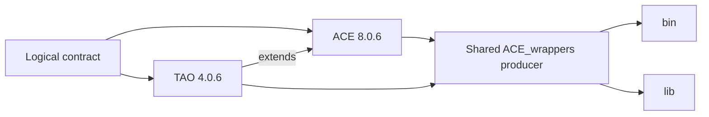
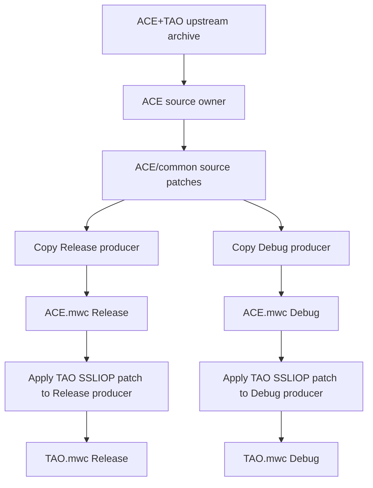
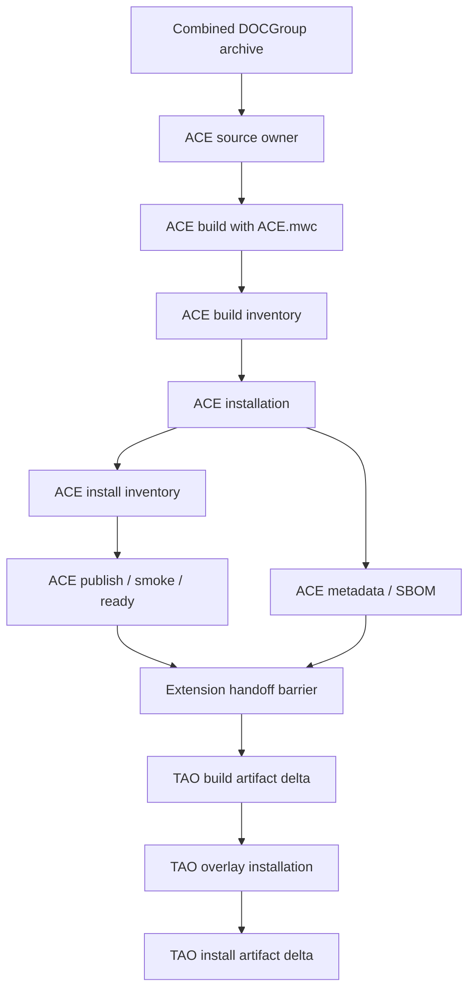
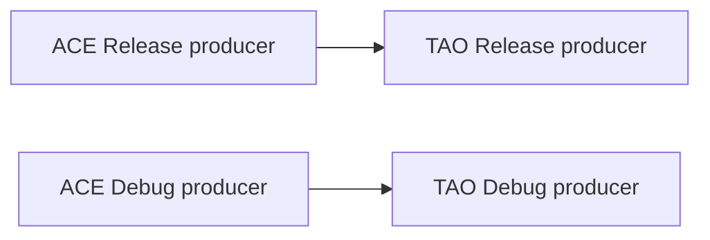
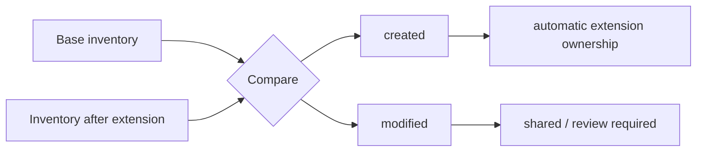
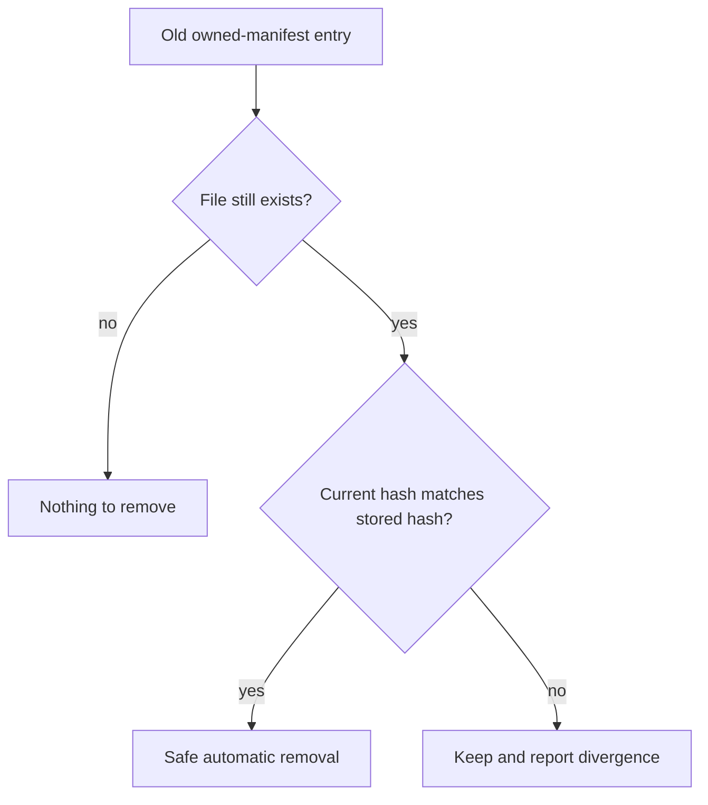
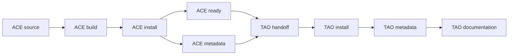
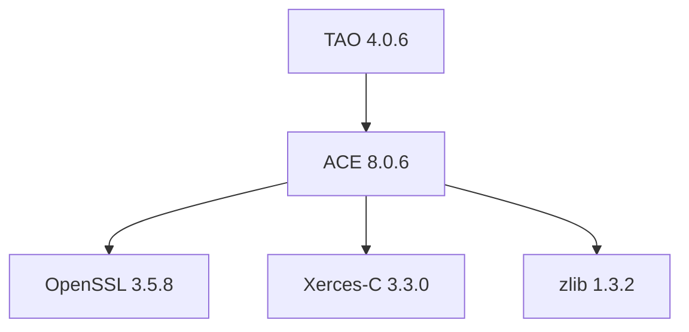
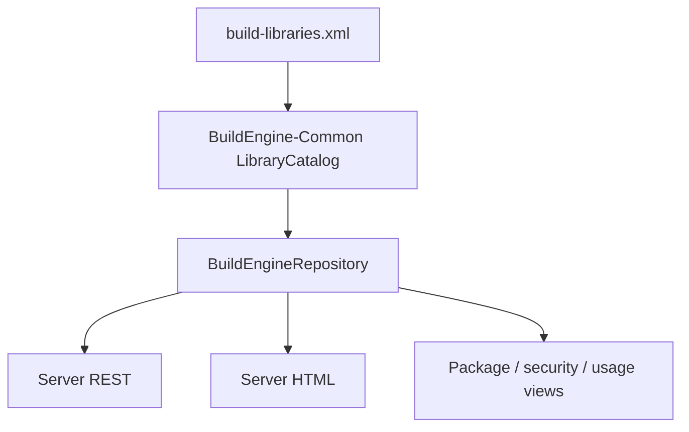
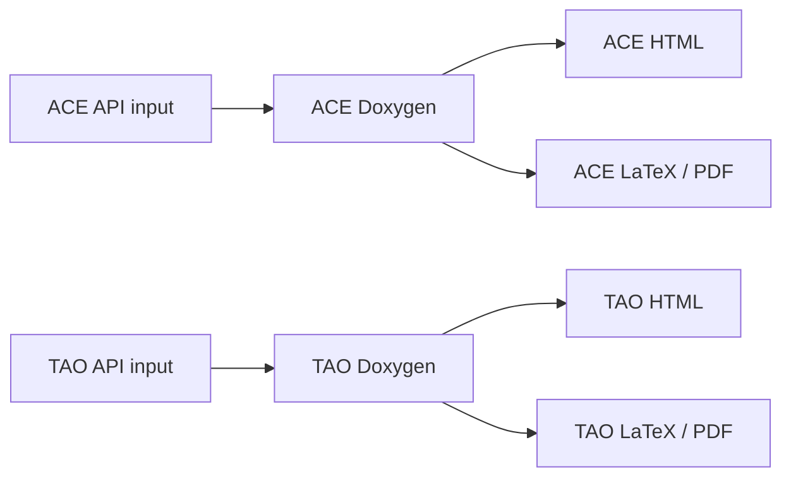

# Library Extensions

[TOC|Content]

This document defines the BuildEngine **library extension** model. A library extension is a logically independent library that deliberately continues inside the physical source, producer, and installation layout of another logical BuildEngine library.

The reference case is **ACE 8.0.6** and **TAO 4.0.6**. ACE can be consumed without TAO. TAO is independently versioned middleware built on ACE. The DOCGroup release nevertheless places TAO below `ACE_wrappers\TAO` and both components deliberately use the same `ACE_wrappers\bin` and `ACE_wrappers\lib` producer directories. BuildEngine preserves both truths: separate logical components and a shared physical producer.

## Design principles

- logical component identity is independent of physical directory layout;
- the base library is an explicit graph dependency of the extension;
- one upstream archive is acquired and extracted only once when the base is the source owner;
- an extension must not download or extract a second copy of that base archive;
- Release extends Release and Debug extends Debug;
- a declared shared producer path authorizes physical overlap but does not merge logical ownership;
- base and extension keep separate state, metadata, SBOM, documentation, and artifact manifests;
- Common/DLL is the authoritative shared interpretation used by Server and later applications;
- artifact ownership is derived from inventory/delta evidence instead of file-name heuristics.



## Normal dependency versus extension

| Property | Normal dependency | Library extension |
| --- | --- | --- |
| Logical identity | independent | independent |
| Version | independent | independent |
| Persistent scopes | independent | independent |
| Metadata / SBOM | independent | independent |
| Source acquisition | normally independent | can be owned by the base |
| Variant producer | independent | may continue in base producer |
| `bin` / `lib` producer directories | independent | explicitly shareable |
| Installation | own package root | may overlay base payload |
| Graph relation | dependency | extension/base dependency |
| Transitive SBOM relation | yes | yes, through the base |

The extension edge already carries the direct base relationship. The same base must not be declared again as a normal `<dependency>`.

## XML contract

Schema 15 adds an optional `<extension>` element:

```xml
<library id="extension-id"
         version="extension-version"
         category="..."
         timestamp="...">
   <extension library="base-id"
              version="base-version"
              source="relative/source/subtree"
              producer="relative/producer/root"
              install=".">
      <shared path="bin"/>
      <shared path="lib"/>
   </extension>

   <metadata name="..."
             description="One-line purpose description"
             supplier="..."/>

   <build>
      ...
   </build>
</library>
```

### `extension/@library`

Logical ID of the base library. It must resolve to exactly one library in the same contract and must not refer to the extension itself.

### `extension/@version`

Exact base version required by the extension. BuildEngine does not substitute another version.

### `extension/@source`

Relative extension source subtree below the extracted base source root:

```text
ExtensionSourceRoot = BaseSourceRoot / extension/@source
```

The path must be relative and safe. For TAO this is `TAO` below the ACE-owned `ACE_wrappers` source tree.

### `extension/@producer`

Relative producer root below the variant-specific base build directory:

```text
ExtensionBuildRoot    = BuildRoot/packages/<base>/<base-version>/<Configuration>
ExtensionProducerRoot = ExtensionBuildRoot / extension/@producer
```

For ACE/TAO this is the already existing variant-specific `ACE_wrappers` tree. BuildEngine does not fabricate a second native TAO producer.

### `extension/@install`

Relative overlay root below the base payload. `.` means the exact base package root:

```text
BaseInstallRoot      = InstallRoot/packages/<base>/<base-version>
ExtensionInstallRoot = BaseInstallRoot / extension/@install
```

TAO therefore has a logical package identity without requiring a fake `install\packages\tao\4.0.6` payload tree.

### `extension/shared/@path`

Declares producer subtrees that are intentionally shared. ACE/TAO declares:

```xml
<shared path="bin"/>
<shared path="lib"/>
```

This authorizes physical coexistence only. It does not say that every file belongs to both components.

## Runtime variables

| Variable | Meaning |
| --- | --- |
| `{ExtensionLibraryId}` | base library ID |
| `{ExtensionLibraryVersion}` | base library version |
| `{ExtensionWorkspace}` | base workspace |
| `{ExtensionBaseSourceRoot}` | extracted base source root |
| `{ExtensionSourceRoot}` | base source root plus `extension/@source` |
| `{ExtensionBuildRoot}` | variant-specific base build directory |
| `{ExtensionProducerRoot}` | base build directory plus `extension/@producer` |
| `{ExtensionInstallRoot}` | physical payload root plus `extension/@install` |

The variables exist only in an extension context.

## Source ownership and producer preparation

The base owns source acquisition. Schema/runtime can support preparation-only extension source actions, but such actions modify the **base workspace**, not a producer that may already have been copied from it. They must therefore only be used where that timing is semantically correct.

For ACE/TAO the TAO-specific SSLIOP repair is intentionally **not** performed as workspace source preparation. ACE first creates each Release/Debug `ACE_wrappers` producer from the ACE-owned source tree. TAO then applies its SSLIOP patch directly to that concrete variant producer immediately before generating `TAO.mwc`.



This guarantees that both producers receive the TAO-only repair and avoids a race between workspace preparation and the ACE producer copy.

An extension may not use `download` or `extract` to create a second copy of the base source tree.

## ACE / TAO producer sequence

Upstream defines the split directly: `ACE.mwc` explicitly excludes TAO, while `TAO.mwc` builds TAO. BuildEngine follows those upstream workspaces instead of inferring ownership from binary names.



TAO compilation can already occur in the shared producer, but the **artifact handoff** that releases TAO tests and installation waits for both `library:ace:ready` and `library:ace:metadata`. This is deliberate. ACE publication, smoke/ready processing, and metadata generation must finish reading the base-only physical payload before TAO overlays that payload.

The barrier is generic extension behavior. It contains no ACE-name special case.

## Variant preservation

Each extension variant uses the corresponding base variant.



No Release-to-Debug or Debug-to-Release edge is permitted.

## Artifact manifests

BuildEngine records relevant binary artifacts for normal libraries and extensions. The shared model lives in BuildEngine-Common.

Typical tracked files include:

- `.dll`;
- `.exe`;
- `.lib`;
- `.a`;
- `.so`;
- `.dylib`;
- `.pdb`;
- `.tds`;
- `.bpl`;
- `.dcp`.

Each entry records at least relative path, size, and SHA-256.

For a normal library the manifest is an inventory. For an extension the declared shared producer paths are compared with the base inventory.



`created` means the extension introduced the file. `modified` means a base artifact already existed and changed during extension work. A modified base file is not automatically extension-owned.

Artifact jobs use `artifact:*` IDs and remain helper/evidence jobs. Persistent current-state authority stays on logical `library:*` scopes.

## Installation overlay

ACE is installed first. TAO then overlays its additions into the same physical payload. Shared targets are never wholesale cleaned by the extension.

Representative filesystem layout:

```text
install/packages/ace/8.0.6/
  include/
    ace/
    tao/
    orbsvcs/
  bin/win64/Release/
  bin/win64/Debug/
  lib/win64/Release/
  lib/win64/Debug/
  tools/bin/win64/Release/
  tools/bin/win64/Debug/
  services/bin/win64/Release/
  services/bin/win64/Debug/
  .buildengine/extensions/tao/4.0.6/
```

The tree is a filesystem example, not an execution diagram.

TAO's logical metadata is stored below:

```text
install/packages/ace/8.0.6/.buildengine/extensions/tao/4.0.6/
```

The runtime/development payload can therefore be physically shared while the TAO SBOM and license evidence remain logically separate.

## Safe future cleanup

The artifact inventory is also the basis for later version cleanup in shared areas.



A new version must never blindly delete a file that another component or a user changed after the manifest was created.

## State model

Logical state remains separate even when physical paths overlap. ACE owns ACE scopes; TAO owns TAO scopes. The shared directory itself is never state authority.



The logical extension relationship supplies the base dependency for state/SBOM semantics; TAO must not duplicate ACE as a normal dependency.

## Metadata and SBOM



ACE's SBOM contains its actual direct dependencies. TAO's graph contains ACE as the direct base and reaches those dependencies transitively.

`metadata/@description` is the human-facing one-line purpose description. It feeds the common catalog and can feed CycloneDX `component.description` and server presentation.

## Common/DLL and server interpretation

The physical package tree is not the library catalog. Common is the authoritative repository interpretation.



Server package and security lists therefore enumerate logical catalog entries and resolve each logical SBOM path. TAO remains visible even though its payload is below ACE.

## Documentation split

ACE and TAO produce separate documentation coordinates:

```text
documentation/ace/8.0.6/...
documentation/tao/4.0.6/...
```

The active `build-documentation.xml` now has separate `ace` and `tao` profiles. ACE excludes the TAO subtree; TAO starts from its extension API/source area.



## Prepared ACE/TAO fragment

`admin/ace-tao.xml` contains the complete prepared replacement for the old combined `ace-tao` block.

To activate it:

1. replace the old `ace-tao` block with the `ace` and `tao` elements from `ace-tao.xml`;
2. set root `schemaVersion="15"`;
3. set `xsi:noNamespaceSchemaLocation="schemas/build-libraries-v15.xsd"`;
4. validate the resulting XML;
5. run the intended BCC64X build/test;
6. delete the temporary fragment after acceptance.

The fragment retains Naming Service, COS Event Service, and RT Event Service. TAO publication intentionally represents a **consumable closure** containing the ACE+TAO headers/runtime/import libraries required by a consumer; artifact manifests, not publication contents, are the ownership evidence.

## Validation rules

1. At most one `<extension>` per library.
2. Exact base ID/version.
3. Relative and safe source/producer/install/shared paths.
4. No extension cycle.
5. No duplicate normal dependency on the base.
6. Base owns source acquisition.
7. Extension `download`/`extract` is forbidden.
8. Variants preserve identity.
9. Shared paths authorize physical overlap but not logical ownership.
10. Shared install targets are not wholesale cleaned by the extension.
11. Base and extension keep separate logical state and metadata.
12. Artifact deltas distinguish `created` from `modified`.
13. Extension downstream work is not released until base `ready` and base `metadata` have completed.

## Maintenance rule

When another library needs the same physical-sharing model, use this generic contract. Do not introduce a library-name special case. If a concept is shared by multiple applications, extend BuildEngine-Common first and let applications follow the Common/DLL contract.
