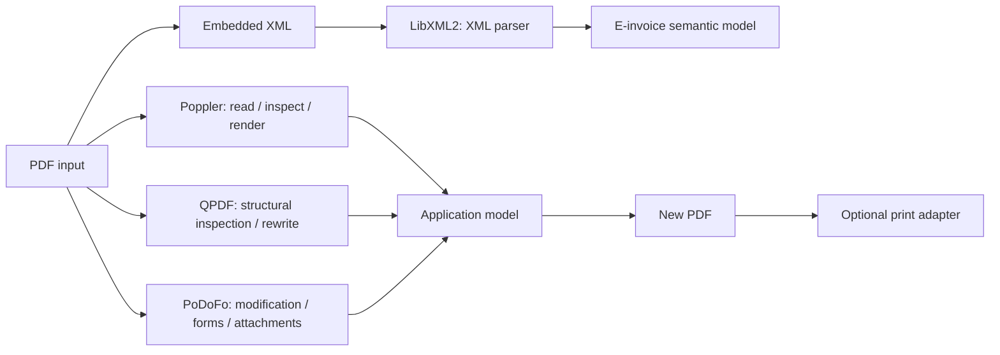

# PDF and E-Invoice Processing Roadmap

[TOC|Content]

**Status:** architectural direction as of 22 September 2026. Poppler 26.09.0 is already present in the BuildEngine contract and its C++ API is enabled. LibXML2, PoDoFo and QPDF are planned additions and are not yet integrated BuildEngine libraries.

## Objective

The PDF track should grow from a rendering/parsing capability into a reusable document-processing stack that can:

- read normal PDF documents;
- detect and extract embedded electronic-invoice payloads;
- parse and validate selected E-invoice XML formats;
- inspect interactive PDF forms;
- enumerate fields and their metadata;
- fill fields under explicit validation rules;
- write a new PDF result;
- optionally pass the completed document to a direct-print path.

Parsing, semantic invoice interpretation, PDF modification and printing stay separate responsibilities.

## Intended component roles



### Poppler

Role: PDF reading, page/document inspection, text/rendering-related capabilities and the enabled C++ API.

**Licensing note:** Poppler is GPL-licensed. A shipped proprietary in-process integration requires a deliberate product/legal architecture decision before deployment.

### QPDF

Planned role: low-level PDF structure, object inspection, transformations, validation/repair-oriented workflows and deterministic rewriting.

### PoDoFo

Planned role: higher-level PDF modification, AcroForm inspection/update, annotations and attachments where appropriate, and writing modified documents.

The exact PoDoFo/QPDF responsibility boundary must be proven with small real programs before both become mandatory runtime dependencies.

### LibXML2

Planned role: low-level XML parsing and schema-related mechanics for extracted invoice XML. Business meaning, invoice rules and profile validation remain a separate typed application layer.

## E-invoice processing

The first PDF-based target is PDF/A-3 with embedded invoice XML, especially ZUGFeRD / Factur-X.

```text
PDF
-> identify embedded/associated files
-> select invoice XML by metadata/profile
-> extract XML bytes
-> parse safely
-> identify invoice version/profile
-> validate syntax/schema/profile rules
-> project into a typed invoice model
```

XML-only invoice formats can reuse the same XML and semantic layer without going through PDF extraction.

The exact supported profiles, schemas and validation artefacts must be pinned as versioned product data before the feature is considered complete.

## PDF form inspection tool

The first dedicated form utility should be diagnostic. Given a PDF, it should enumerate:

- field name and fully qualified name;
- field type;
- current and default value;
- flags such as read-only and required;
- widget/page association;
- widget rectangle;
- choice values where applicable;
- appearance-related information needed to determine whether a filled value will render correctly.

That evidence comes before a generic filler.

The filling path should accept a typed mapping, validate it against the discovered form contract, modify a copy of the input document and reopen the result for verification.

## Printing

Direct printing remains downstream from PDF modification:

```text
inspect -> validate -> fill -> save -> reopen/verify -> print
```

Printer selection and Windows spooler policy do not belong inside the PDF libraries. Printing is an output adapter so the same completed PDF can instead be saved, archived, transmitted or tested.

## BuildEngine work items

1. Keep Poppler `ENABLE_CPP=ON` and verify the C++ headers/library consumer with BCC64X.
2. Add LibXML2 as a versioned library contract with tests, package, publish and smoke evidence.
3. Add QPDF with its exact dependency closure and a structural read/rewrite smoke.
4. Add PoDoFo with its exact dependency closure and a form-inspection/form-write smoke.
5. Add small comparison programs that establish the real responsibility boundary between Poppler, QPDF and PoDoFo.
6. Add representative E-invoice and form samples to `BuildEngine-Tests`, not to generic package smokes.
7. Add exact license evidence and normalized metadata for every new dependency.
8. Decide the product/distribution boundary for GPL Poppler before a proprietary deliverable relies on in-process linkage.
