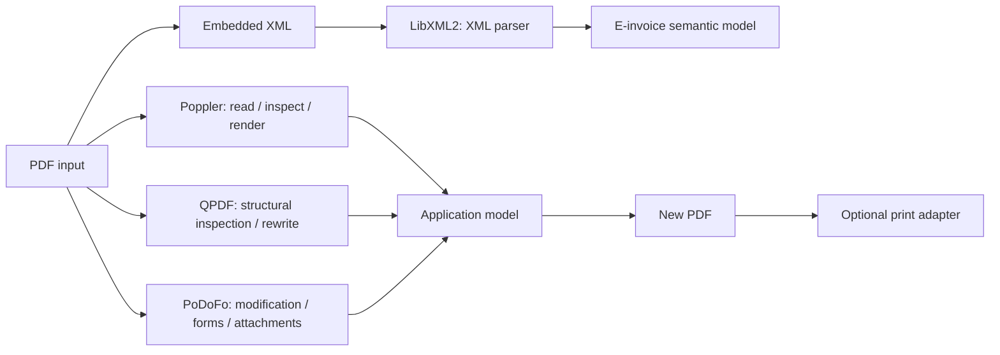

# PDF and E-Invoice Processing Roadmap

[TOC|Content]

**Status:** active architectural and BuildEngine integration direction as of 25 September 2026. Poppler 26.09.0, win-iconv 0.0.8, libxml2 2.15.3, QPDF 12.4.1 and PoDoFo 1.1.1 are declared in the Schema-16 BuildEngine stack. Poppler and win-iconv have target-machine package evidence. PoDoFo reached build/test/install/metadata/publish/doxygen PASS before the final BCC64X runtime-policy correction; the dynamic-runtime rerun and installed XMP DLL smoke are its remaining final evidence gate.

## License traffic light for this stack

- **🟢 Green — libxml2 2.15.3:** MIT; normal notice-preservation obligations.
- **🟢 Green — QPDF 12.4.1:** Apache-2.0; preserve license/NOTICE obligations and patent terms.
- **🟡 Yellow — PoDoFo 1.1.1:** MPL-2.0 or LGPL-2.0-or-later for the library; the concrete product must record the selected licensing path. GPL command-line tools remain outside the first library-focused package.
- **🟢 Green — win-iconv 0.0.8:** upstream places this implementation in the public domain. This is not GNU libiconv.
- **🔴 Red — Poppler 26.09.0:** GPL; do not plan as an in-process dependency of proprietary software without a different product/distribution architecture or another licensing path.

The traffic light is an engineering integration marker. The exact upstream license texts remain authoritative.

## Objective

The PDF track should grow from a rendering/parsing capability into a reusable document-processing stack that can:

- read normal PDF documents;
- detect and extract embedded electronic-invoice payloads;
- parse and validate selected E-invoice XML formats;
- inspect interactive PDF forms;
- enumerate fields and their metadata;
- fill fields under explicit validation rules;
- write a new PDF result;
- optionally pass the completed document to a direct-print path.

Parsing, semantic invoice interpretation, PDF modification and printing stay separate responsibilities.

## Intended component roles



### Poppler

Role: PDF reading, page/document inspection, text/rendering-related capabilities and the enabled C++ API.

**Licensing note:** Poppler is GPL-licensed. A shipped proprietary in-process integration requires a deliberate product/legal architecture decision before deployment.

### QPDF 12.4.1

Role: low-level PDF structure, object inspection, transformations, validation/repair-oriented workflows and deterministic rewriting. The current BuildEngine contract builds the shared library against managed zlib and libjpeg-turbo and requires QPDF's native crypto provider. OpenSSL is deliberately excluded from the QPDF runtime so the OpenSSL Brotli/Zstd feature closure cannot leak into qpdf.exe or the libtests. **Current contract evidence is still tracked per run.**

### PoDoFo 1.1.1

Role: higher-level PDF modification, AcroForm inspection/update, annotations and attachments where appropriate, and writing modified documents. The BuildEngine profile uses managed zlib, OpenSSL, FreeType, libxml2, JPEG, PNG and TIFF, uses the Win32 GDI font search path, and deliberately disables AFDKO plus the GPL command-line tools. The package exposed a generic BCC64X ABI/runtime rule: all EXEs, DLLs and modules must use the dynamic BCC64X runtime (`-tR`) because public C++ ownership can cross the DLL boundary.

The exact PoDoFo/QPDF responsibility boundary must be proven with small real programs before both become mandatory runtime dependencies.

### libxml2 2.15.3

Role: low-level XML parsing and schema-related mechanics for extracted invoice XML. The BuildEngine profile keeps XML Schema, Relax NG, XPath, XInclude, serialization and zlib support enabled while Python, ICU, dynamic modules and external iconv are disabled in the first BCC64X profile. A dedicated Relax NG recovery smoke has passed under BCC64X; business meaning, invoice rules and profile validation remain a separate typed application layer.

## E-invoice processing

The first PDF-based target is PDF/A-3 with embedded invoice XML, especially ZUGFeRD / Factur-X.

```text
PDF
-> identify embedded/associated files
-> select invoice XML by metadata/profile
-> extract XML bytes
-> parse safely
-> identify invoice version/profile
-> validate syntax/schema/profile rules
-> project into a typed invoice model
```

XML-only invoice formats can reuse the same XML and semantic layer without going through PDF extraction.

The exact supported profiles, schemas and validation artefacts must be pinned as versioned product data before the feature is considered complete.

## PDF form inspection tool

The first dedicated form utility should be diagnostic. Given a PDF, it should enumerate:

- field name and fully qualified name;
- field type;
- current and default value;
- flags such as read-only and required;
- widget/page association;
- widget rectangle;
- choice values where applicable;
- appearance-related information needed to determine whether a filled value will render correctly.

That evidence comes before a generic filler.

The filling path should accept a typed mapping, validate it against the discovered form contract, modify a copy of the input document and reopen the result for verification.

## Printing

Direct printing remains downstream from PDF modification:

```text
inspect -> validate -> fill -> save -> reopen/verify -> print
```

Printer selection and Windows spooler policy do not belong inside the PDF libraries. Printing is an output adapter so the same completed PDF can instead be saved, archived, transmitted or tested.

## BuildEngine work items

1. Extend the existing Poppler `ENABLE_CPP=ON` package evidence with representative C++ consumer scenarios.
2. Complete and record the final libxml2 2.15.3 upstream-test/package-smoke evidence for the current contract.
3. Complete and record the final QPDF 12.4.1 upstream-test/package-smoke evidence for the native-Windows test adapter.
4. Re-run PoDoFo 1.1.1 with the dynamic-only BCC64X runtime, all 220 upstream tests and the installed XMP DLL consumer smoke.
5. Add small comparison programs that establish the real responsibility boundary between Poppler, QPDF and PoDoFo.
6. Add representative E-invoice and form samples to `BuildEngine-Tests`, not to generic package smokes.
7. Extend the first PoDoFo smoke from construction to AcroForm discovery and a save/reopen round trip after the package itself passes.
8. Extend the QPDF smoke from object construction to structural read/rewrite validation after the package itself passes.
9. Record exact source archive SHA-256 values where upstream publishes stable digests.
10. Decide the product/distribution boundary for GPL Poppler before a proprietary deliverable relies on in-process linkage.
11. Record which PoDoFo license path, MPL-2.0 or LGPL-2.0-or-later, is selected for each distributable product.


## BCC64X runtime boundary

The document stack contains C++ APIs that transfer ownership and STL objects across DLL boundaries. BuildEngine therefore enforces the dynamic BCC64X runtime for all Windows EXEs, DLLs and modules:

```text
console EXE : -tC -tR
GUI EXE     : -tW -tR
DLL/MODULE  : -tD -tR
```

Static BCC64X runtime linkage is forbidden. This rule is independent of whether an individual third-party package itself is built as a shared or static library.
