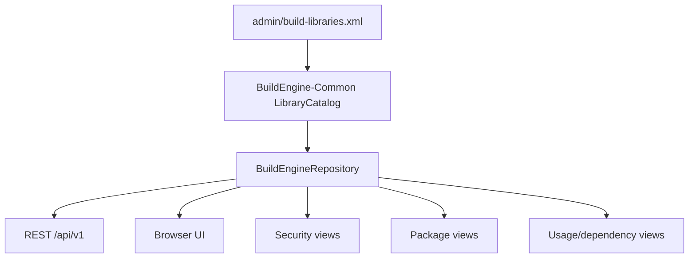
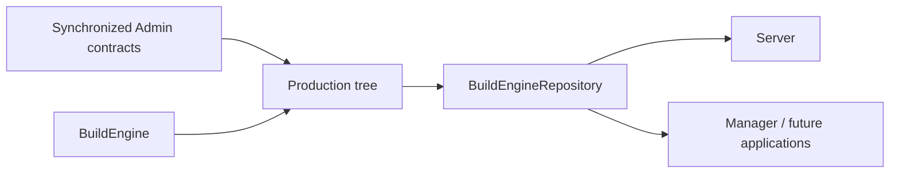
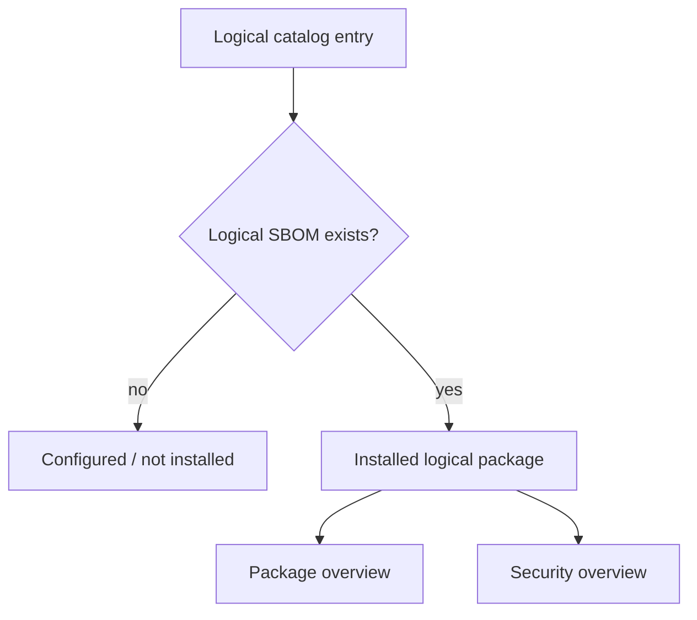
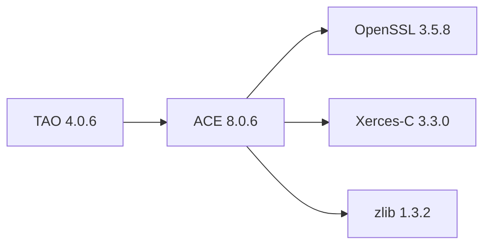
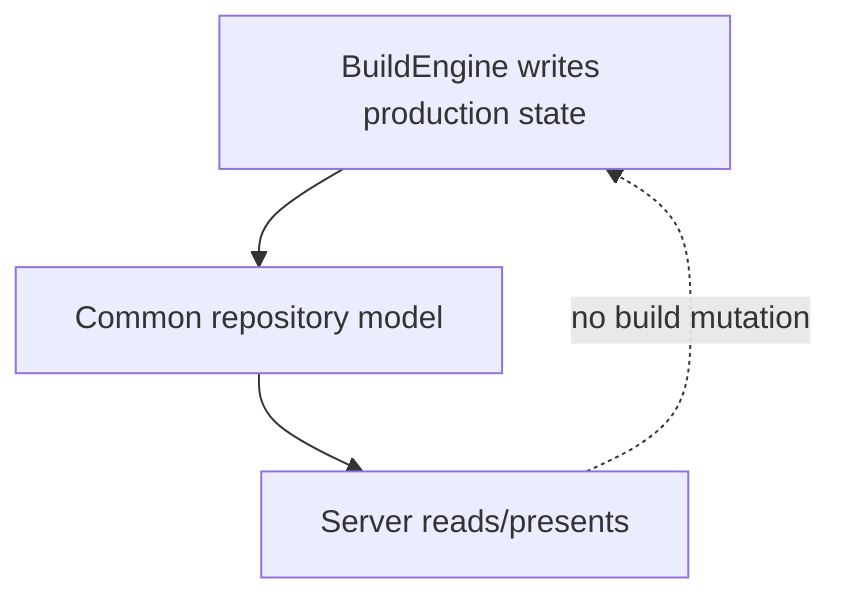

# BuildEngine Server

[TOC|Content]

BuildEngine Server is the read-only HTTP presentation and machine-interface layer for one BuildEngine production tree. It exposes the logical library catalog, installed package metadata, generated HTML/PDF documentation, CycloneDX SBOM data, dependency/usage information, security results, package export, project documentation, and a browser UI.

The server is **not** an independent state authority. Shared repository semantics live in BuildEngine-Common/DLL and the applications follow that contract.

Related documentation:

- [BuildEngine architecture](buildengine.md)
- [Library contract](build-libraries.md)
- [Library extensions](library-extensions.md)
- [Integrated libraries](libraries.md)
- [Documentation pipeline](documentation.md)
- [Configuration and CLI](configuration.md)

## Common/DLL is the leading repository view

A physical package directory is not sufficient to identify every logical library. Library extensions may intentionally share a payload with their base library. TAO is the reference case: it is a logical `tao 4.0.6` component while its physical payload overlays `install/packages/ace/8.0.6`.

The server therefore consumes `LibraryCatalog` and `BuildEngineRepository` from BuildEngine-Common. It does not construct a second interpretation by scanning package directories and guessing logical identities.



This gives all consumers the same extension-aware mapping of:

- logical library ID and version;
- display name;
- category;
- one-line description;
- extension/base relationship;
- physical payload root;
- logical metadata/SBOM root.

## One production tree

The server reads the same central production tree produced by BuildEngine. It does not maintain server-specific copies of libraries, package metadata, SBOMs, documentation, or security evidence.



The intended relationship is:

1. XML describes intended state;
2. BuildEngine produces and verifies artifacts/evidence;
3. Common interprets the repository;
4. applications present or consume that same interpretation.

## Server 0.2 library presentation

The dashboard and `/libraries/` page expose the library catalog in addition to summary tiles. The catalog includes:

| Column | Source |
| --- | --- |
| Name | `metadata/@name`, falling back to library ID |
| Version | `library/@version` |
| Category | `library/@category` |
| Description | `metadata/@description` |
| Extension relation | `<extension library="..." version="...">` where present |

The dashboard can therefore show ACE and TAO as separate logical entries even though TAO does not require a sibling `packages/tao/4.0.6` payload directory.

## Package and security enumeration

Package and security overview pages use the logical catalog and call the repository's logical SBOM resolver for each catalog entry.



This replaces the old physical-directory enumeration model. It is required for extensions because the logical metadata root can differ from the physical payload root.

For a normal library:

```text
Payload:  install/packages/zlib/1.3.2/
Metadata: install/packages/zlib/1.3.2/
```

For TAO:

```text
Payload:  install/packages/ace/8.0.6/
Metadata: install/packages/ace/8.0.6/.buildengine/extensions/tao/4.0.6/
```

These are filesystem examples, not execution diagrams.

## Transport and scope

The server currently uses HTTP for the intended protected-network deployment model. The safe defaults remain local:

```text
serverAddress="127.0.0.1"
serverName="localhost"
serverPort="8765"
```

The endpoint is configured centrally in `BuildEngine.xml`:

```xml
<parameters
   serverAddress="127.0.0.1"
   serverName="localhost"
   serverPort="8765"/>
```

`serverAddress` is the concrete local IP interface, `serverName` is the logical host identity accepted by the server, and `serverPort` is the TCP port. Wildcard listener addresses remain deliberately rejected; a deployment chooses an explicit interface.

Only HTTP `GET` is part of the current server contract. The browser UI and machine API share the same server process.

## Request flow

```mermaid
flowchart LR
    B[Browser / internal client] --> H[HTTP listener]
    H --> V{Interface and Host accepted?}
    V -- no --> X[Reject]
    V -- yes --> R{Route}
    R -->|Machine API| J[JSON]
    R -->|Dashboard/UI| P[HTML renderer]
    R -->|Markdown| M[cmark-gfm]
    M --> F[Markdown feature analysis]
    F --> P
    R -->|PDF| PDF[Published PDF]
    R -->|Generated docs| D[Static documentation]
    R -->|Managed assets| A[/js resources]
```

## Browser routes

| Route | Purpose |
| --- | --- |
| `/server/` | Dashboard with metrics and logical library catalog |
| `/status/` | Effective server/repository status |
| `/libraries/` | Logical libraries grouped by category plus catalog table |
| `/library/{library}/` | Versions of one logical library |
| `/library/{library}/{version}/` | Logical library/version detail |
| `/pdf/{library}/{version}` | Published PDF documentation |
| `/packages/` | Installed logical package overview |
| `/package/{library}/{version}/` | Package detail and export |
| `/security/` | Security overview |
| `/security/{library}/{version}/` | Security analysis detail |
| `/manual/story.md` | Project story |
| `/manual/buildengine.md` | BuildEngine architecture |
| `/manual/server.md` | This document |
| `/manual/configuration.md` | Configuration and CLI |
| `/manual/documentation.md` | Documentation pipeline |
| `/manual/build-tools.md` | Tool contract |
| `/manual/build-libraries.md` | Library contract |
| `/manual/library-extensions.md` | Extension/shared-producer contract |
| `/manual/libraries.md` | Integrated library inventory |
| `/index.html` | Generated central library documentation index |

## Machine API

New consumers should prefer `/api/v1/...`.

### Status

```http
GET /api/v1/status
```

Returns application/version information and effective repository roots/server identity.

### Logical library catalog

```http
GET /api/v1/libraries
```

The response is the logical catalog, not a raw directory listing. Entries include name, library ID, version, category, description, installation/SBOM/documentation status, and extension relationship where applicable.

Conceptual entry:

```json
{
   "library": "tao",
   "name": "TAO",
   "version": "4.0.6",
   "category": "middleware",
   "description": "CORBA object request broker and middleware services built on top of ACE.",
   "installed": true,
   "sbom": true,
   "documentation": true,
   "extension": {
      "library": "ace",
      "version": "8.0.6"
   }
}
```

### Library resources

```http
GET /api/v1/libraries/{library}
GET /api/v1/libraries/{library}/{version}
GET /api/v1/libraries/{library}/{version}/dependencies
GET /api/v1/libraries/{library}/{version}/findings
GET /api/v1/libraries/{library}/{version}/usage

GET /api/v1/library/{library}/{version}
GET /api/v1/sbom/{library}/{version}
GET /api/v1/risk/{library}/{version}
```

All routes resolve the logical coordinate through the Common repository model. This is especially important for TAO because `SbomPath("tao", "4.0.6")` resolves to its extension metadata area inside the ACE physical payload.

### Package export

```http
GET /api/v1/package/{library}/{version}/download
```

Package export operates on the logical repository description and dependency closure. It must not silently drop an extension merely because its payload is physically shared.

## Library detail and usage

The repository reads CycloneDX dependency graphs to calculate direct dependencies, closure, and reverse usage. Logical coordinates remain stable even where payload roots are shared.



The UI can therefore present TAO's direct ACE relation and ACE's transitive dependencies without claiming that TAO owns a separate physical producer.

## Security

Security data combines:

- logical component/package identity;
- CycloneDX SBOM component/dependency data;
- provider findings;
- approved local BuildEngine assessment data.

The security overview enumerates installed logical catalog entries. It no longer treats the physical `packages` directory as the library catalog.

## Documentation rendering

Project Markdown is rendered with cmark-gfm. The server supports the documentation feature stack already used by the project:

- fenced code blocks;
- tables;
- Mermaid diagrams;
- syntax highlighting;
- MathJax where requested;
- synchronized images;
- generated Doxygen HTML;
- published PDFs.

Architecture and process diagrams in the maintained Markdown documents should use Mermaid rather than ASCII drawings. Filesystem path/tree examples may remain text blocks where that representation is clearer.

## PDF delivery

Generated PDFs are served directly from the central documentation tree:

```text
/pdf/{library}/{version}
```

The response uses `application/pdf` and does not force attachment disposition, allowing browsers to display the document normally.

ACE and TAO are separate documentation coordinates:

```text
/pdf/ace/8.0.6
/pdf/tao/4.0.6
```

## Read-only boundary

The server is intentionally a read-only presentation/API process. Build execution, state transitions, source repair, installation, and artifact inventory belong to BuildEngine. The server consumes the resulting repository state through Common.



## Development rule

When repository semantics change, update the shared Common/DLL model first. Then adapt Server and any other applications to that contract. Do not solve a logical repository change by adding a server-only parser or filesystem heuristic.

All current server/Common code changes for the extension-aware catalog remain **not verified** until the intended BCC64X/C++Builder build and server run succeed.
