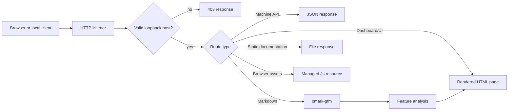
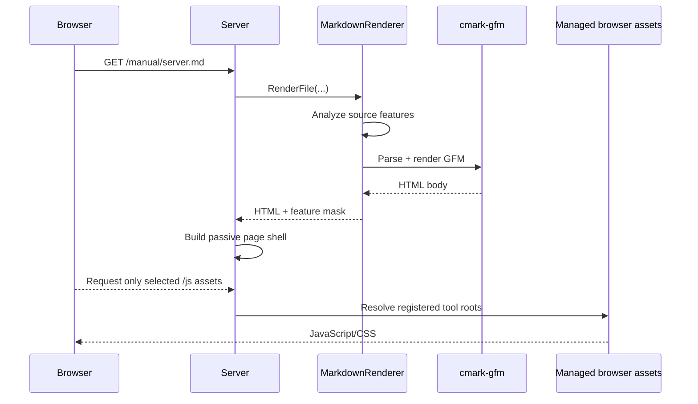

# BuildEngine Server

BuildEngine Server is the read-only HTTP presentation and machine-interface layer for a BuildEngine production tree. It exposes library/package metadata, generated documentation, SBOM data, dependency and usage information, security results, package export, and a small browser UI. It does not replace the BuildEngine scheduler or technical step-state model.

> This document is also an integration test for server-side Markdown rendering and browser-side syntax highlighting. It deliberately contains tables, task lists, links, JSON, HTTP, C++23, and Mermaid examples.

## Renderer acceptance checklist

- [x] Markdown headings, paragraphs, links, lists and tables
- [x] GitHub-flavored task lists
- [x] Syntax highlighting for HTTP
- [x] Syntax highlighting for JSON
- [x] Syntax highlighting for C++23
- [x] Mermaid rendering
- [x] No MathJax requirement on this page

The last point is deliberate: loading this document should not require the MathJax browser asset.

## Transport and scope

Version 1 binds to the IPv4 loopback interface only. The default endpoint is:

```text
http://127.0.0.1:8765/
```

Only HTTP `GET` requests are accepted by the current server implementation. The browser UI and REST-style JSON endpoints share the same local server.

## Browser routes

| Route | Purpose |
| --- | --- |
| `/server/` | Server dashboard and information area |
| `/status/` | Effective server status |
| `/libraries/` | Configured and installed library overview |
| `/library/{library}/` | Versions of one library |
| `/library/{library}/{version}/` | Library/version detail |
| `/packages/` | Installed package overview |
| `/package/{library}/{version}/` | Package detail and export link |
| `/security/` | Security overview |
| `/security/{library}/{version}/` | Security analysis detail |
| `/manual/buildengine.md` | BuildEngine architecture and renderer test document |
| `/manual/server.md` | This server and REST API document |
| `/manual/configuration.md` | Configuration and CLI reference |
| `/index.html` | Generated central library documentation index |

Static generated documentation is served from the BuildEngine documentation root after the explicit application routes have been evaluated.

## Request flow



## Machine API

The machine API accepts both `/api/...` and the versioned `/api/v1/...` form for the common library endpoints. New consumers should prefer the versioned form.

### Status

```http
GET /api/v1/status HTTP/1.1
Host: localhost:8765
Accept: application/json
```

Returns application/version information and the effective production/documentation roots.

### Libraries

```http
GET /api/v1/libraries
GET /api/v1/libraries/{library}
GET /api/v1/libraries/{library}/{version}
GET /api/v1/libraries/{library}/{version}/dependencies
GET /api/v1/libraries/{library}/{version}/findings
GET /api/v1/libraries/{library}/{version}/usage
```

The first endpoint lists installed package libraries. The following endpoints progressively expose versions, one concrete version, direct dependencies, security findings, and reverse usage information.

### Library, SBOM, and risk resources

The server also exposes direct versioned resource routes:

```http
GET /api/v1/library/{library}/{version}
GET /api/v1/sbom/{library}/{version}
GET /api/v1/risk/{library}/{version}
```

The SBOM response is the installed CycloneDX document. The risk endpoint combines provider findings with the server-side assessment model.

### Package export

```http
GET /api/v1/package/{library}/{version}/download
```

The package exporter creates the requested package archive from the installed BuildEngine package information and returns it as a download response.

## Example response

A status response has the following conceptual shape:

```json
{
  "application": "BuildEngineDocServer",
  "version": "...",
  "api": "...",
  "apiBase": "/api",
  "versionedApiBase": "/api/v1",
  "bind": "127.0.0.1",
  "port": 8765,
  "productionRoot": "D:/local/embarcadero/test_v3",
  "documentationRoot": "D:/local/embarcadero/test_v3/documentation",
  "transport": "HTTP over local loopback only"
}
```

Values shown with ellipses depend on the running server build.

## Request dispatch

The HTTP server evaluates machine routes first, then browser/static resources. The important separation is visible in simplified form below:

```cpp
if(WriteMachineApi(theSocket, theRequest, vecSegments)) {
   // JSON machine interface handled.
}
else if(/* /js/... managed browser asset */) {
   // Serve managed JavaScript/CSS resource.
}
else if(/* explicit browser route */) {
   // Render dashboard, libraries, packages or security page.
}
else {
   // Resolve a file below DocumentationRoot.
}
```

The actual implementation uses C++23 throughout the project and favors value semantics, `std::string_view`, `std::filesystem`, ranges, structured bindings, `std::optional`, and other modern facilities over older pointer-heavy interfaces where practical.

## Markdown rendering pipeline

Markdown is rendered only when a requested file has a Markdown extension. The renderer API is intentionally neutral: applications include a header that exposes strings, paths, a feature mask, and rendering functions, while cmark-gfm and its runtime loading remain private to the renderer implementation.



Before the final HTML page is assembled, the Markdown source is inspected for feature requirements:

- fenced source code with a language requests syntax highlighting;
- a fenced `mermaid` block requests Mermaid;
- supported mathematical delimiters request MathJax.

The page renderer then emits only the required `/js/...` resources. This reproduces the passive-renderer approach used by the earlier adecc documentation generator and makes the browser resource layer replaceable independently of Markdown parsing.

## Managed browser resources

Stable browser URLs are grouped below `/js`:

```text
/js/highlighting/...
/js/mermaid/...
/js/mathjax/...
```

The server maps these stable URLs to the currently registered managed tool roots. HTML pages therefore do not need to know the installed tool version or physical directory.

| Feature | Browser resource | Loaded when |
| --- | --- | --- |
| Highlight.js | `/js/highlighting/...` | A language-marked code fence exists |
| Mermaid | `/js/mermaid/...` | A `mermaid` fence exists |
| MathJax | `/js/mathjax/...` | Supported math delimiters are detected |

## Documentation synchronization

The three manually authored server documents are maintained in the synchronized Admin repository:

```text
admin/server-docs/buildengine.md
admin/server-docs/server.md
admin/server-docs/configuration.md
```

At server initialization they are copied into:

```text
<ProductionRoot>/documentation/manual/
```

The server validates the cmark-gfm runtime before publishing these pages. A missing renderer runtime therefore fails visibly instead of leaving apparently available Markdown routes that cannot actually be rendered.

## Security boundary

The current server is intentionally local-only.

- Host validation accepts loopback hosts.
- Documentation path traversal is rejected.
- Managed browser asset paths are constrained.
- Machine endpoints validate library coordinates through the repository layer.
- The server is read-only with respect to BuildEngine build state.
- External transport is a separate concern and should not be inferred from the local HTTP listener.

## Related documentation

- [BuildEngine architecture](/manual/buildengine.md)
- [Configuration and command line](/manual/configuration.md)
- [Generated library documentation index](/index.html)
