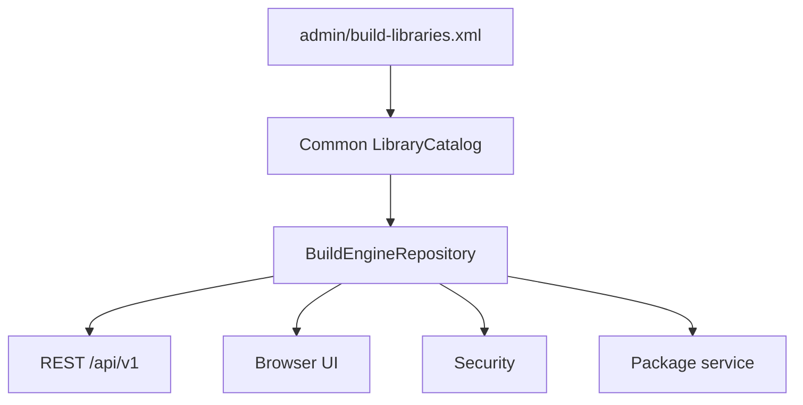
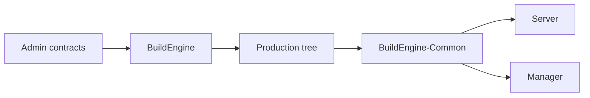
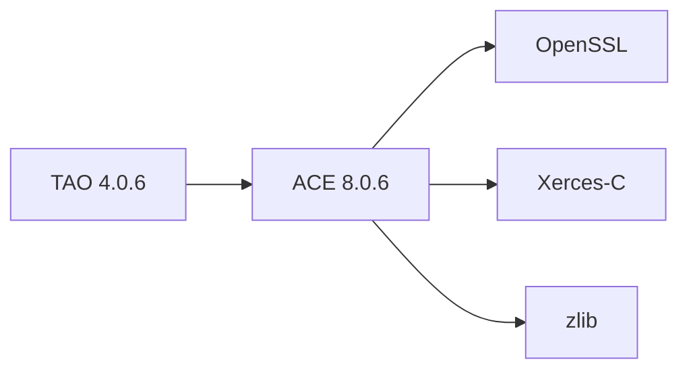

# BuildEngine Server

[TOC|Content]

**Status:** current architecture contract as of 15 September 2026. The server is Common-based, but several extension/package details are still open implementation issues and are explicitly identified below.

BuildEngine Server is the read-only HTTP presentation and machine-interface layer for one BuildEngine production tree. It exposes the logical library catalog, package metadata, generated documentation, CycloneDX data, dependency/usage information, security results, package export, project documentation and a browser UI.

The server is **not** an independent state or repository authority.

## Common/DLL is the leading repository view

A physical package directory is not sufficient to identify every logical library. Extensions may intentionally share a payload with their base library.

TAO is the reference case:

```text
logical library: tao 4.0.6
base:            ace 8.0.6
physical payload: install/packages/ace/8.0.6/
logical metadata: install/packages/ace/8.0.6/.buildengine/extensions/tao/4.0.6/
```

The server consumes `LibraryCatalog` and `BuildEngineRepository` from BuildEngine-Common.



Server-specific filesystem heuristics must not be added to compensate for a Common repository bug.

## One production tree

BuildEngine writes the production tree. Common interprets it. Server and Manager consume that interpretation.



The server does not maintain a second persistent copy of package, SBOM, documentation or security state.

## Current Common audit status

The logical catalog infrastructure is present, but the 15 September repository audit found several active implementation gaps.

### Logical route existence

`BuildEngineRepository::LibraryExists()` and `VersionExists()` currently still test physical package directories.

That is incorrect for an extension that has no sibling `install/packages/<extension>/<version>` tree. Therefore an extension can be present in `/api/v1/libraries` yet an individual route may currently return an incorrect `404`.

**Required fix:** make existence checks catalog-based in Common and distinguish configured/logically known from installed/metadata-available.

### Installed state

Catalog list functions currently infer `installed` from the physical payload directory. For an extension, the base payload may already exist before the extension has actually completed its logical installation.

**Required fix:** define extension-aware logical installed evidence without creating a new competing Current-State system.

### Artifact evidence

The intended artifact contract includes relative path, size and SHA-256. Current Common `ArtifactManifest` still stores only path and size.

This means same-size content changes are not detected yet.

### Package export

`PackageExporter` currently iterates each logical component's physical `PackageRoot` recursively. When ACE and TAO share the same physical payload, this can duplicate or mislabel content in the ZIP.

**Required fix:** package export must consume the same central ownership/closure interpretation as Publish and future cleanup.

Until these fixes are implemented and verified, server documentation must not claim that all extension routes or shared-payload exports are fully correct.

## Transport and scope

Safe defaults:

```text
serverAddress="127.0.0.1"
serverName="localhost"
serverPort="8765"
```

The endpoint is configured in `BuildEngine.xml`.

`common::HttpServer` rejects unspecified and multicast bind addresses. Wildcard addresses such as `0.0.0.0` or `::` are therefore not valid listener configuration.

Only HTTP `GET` is part of the current server contract. The intended deployment is localhost or a protected internal network.

## Browser routes

Important routes include:

| Route | Purpose |
| --- | --- |
| `/server/` | Dashboard |
| `/status/` | Effective status |
| `/libraries/` | Logical library catalog |
| `/library/{library}/{version}/` | Library/version detail |
| `/pdf/{library}/{version}` | PDF documentation |
| `/packages/` | Package overview |
| `/package/{library}/{version}/` | Package detail/export |
| `/security/` | Security overview |
| `/security/{library}/{version}/` | Security detail |
| `/manual/*.md` | Synchronized project/server documentation |
| `/index.html` | Generated central documentation index |

## Machine API

New consumers should prefer `/api/v1`.

```text
GET /api/v1/status
GET /api/v1/libraries
GET /api/v1/libraries/{library}
GET /api/v1/libraries/{library}/{version}
GET /api/v1/libraries/{library}/{version}/dependencies
GET /api/v1/libraries/{library}/{version}/findings
GET /api/v1/libraries/{library}/{version}/usage
GET /api/v1/sbom/{library}/{version}
GET /api/v1/risk/{library}/{version}
GET /api/v1/package/{library}/{version}/download
```

`GET /api/v1/libraries` is catalog-oriented and can list configured logical libraries even when their physical payload is shared.

The individual route-validation bug described above is an implementation gap, not a change in the logical API contract.

## Dependency and usage data

Direct dependencies, closure and reverse usage are derived from logical CycloneDX/component relationships. Physical directory proximity does not create a dependency.



## Security

Security views combine:

- logical component identity,
- CycloneDX data,
- provider findings,
- approved local BuildEngine assessments.

Security and package views must enumerate logical catalog entries rather than treating the physical `packages` directory as the catalog.

## Documentation rendering

The server renders/supplies:

- synchronized Markdown,
- Mermaid,
- syntax highlighting,
- MathJax where requested,
- generated Doxygen HTML,
- generated PDFs.

It does not decide Doxygen state or inputs. Documentation generation belongs to BuildEngine.

## Read-only boundary


Build execution, state transitions, installation and artifact inventory belong to BuildEngine. Shared interpretation belongs to Common.

## Development rule

When repository semantics change:

1. correct the Common model;
2. adapt shared services if necessary;
3. let Server/Manager follow the Common contract;
4. do not create application-local parsers or ownership heuristics.

## Verification status

The current Common/Server extension corrections are **not verified** until a later explicitly approved C++Builder/BCC64X build and server/API test is performed. No such run was started during this documentation cleanup.
