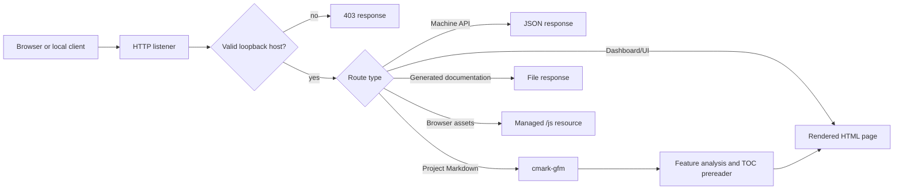
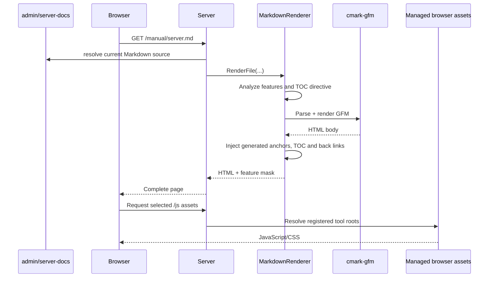

# BuildEngine Server

[TOC|Content]

BuildEngine Server is the read-only HTTP presentation and machine-interface layer for a BuildEngine production tree. It exposes library/package metadata, generated documentation, SBOM data, dependency and usage information, security results, package export, project documentation, and a browser UI. It does not replace the BuildEngine scheduler or technical step-state model.

Related project documentation:

- [BuildEngine architecture](buildengine.md)
- [Configuration and CLI](configuration.md)
- [Documentation contract](documentation.md)
- [Tool contract](build-tools.md)
- [Library contract](build-libraries.md)
- [Tool overview](tools.md)

## Transport and scope

Version 1 binds to the IPv4 loopback interface only. The default endpoint is:

```text
http://127.0.0.1:8765/
```

Only HTTP `GET` requests are accepted by the current server implementation. The browser UI and REST-style JSON endpoints share the same local server.

## Browser routes

| Route | Purpose |
| --- | --- |
| `/server/` | Server dashboard and information area |
| `/status/` | Effective server status |
| `/libraries/` | Configured and installed library overview |
| `/library/{library}/` | Versions of one library |
| `/library/{library}/{version}/` | Library/version detail |
| `/packages/` | Installed package overview |
| `/package/{library}/{version}/` | Package detail and export link |
| `/security/` | Security overview |
| `/security/{library}/{version}/` | Security analysis detail |
| `/manual/story.md` | Project story and engineering motivation |
| `/manual/buildengine.md` | BuildEngine architecture |
| `/manual/server.md` | This server and REST API document |
| `/manual/configuration.md` | Configuration and CLI reference |
| `/manual/documentation.md` | Documentation, Doxygen, LaTeX and PDF contract |
| `/manual/build-tools.md` | `build-tools.xml` contract reference |
| `/manual/build-libraries.md` | `build-libraries.xml` contract reference |
| `/manual/tools.md` | Current BuildEngine tool overview |
| `/index.html` | Generated central library documentation index |

Static generated documentation is served from the BuildEngine documentation root after the explicit application routes have been evaluated.

## Request flow



## Machine API

The machine API accepts both `/api/...` and the versioned `/api/v1/...` form for the common library endpoints. New consumers should prefer the versioned form.

### Status

```http
GET /api/v1/status HTTP/1.1
Host: localhost:8765
Accept: application/json
```

Returns application/version information and the effective production/documentation roots.

### Libraries

```http
GET /api/v1/libraries
GET /api/v1/libraries/{library}
GET /api/v1/libraries/{library}/{version}
GET /api/v1/libraries/{library}/{version}/dependencies
GET /api/v1/libraries/{library}/{version}/findings
GET /api/v1/libraries/{library}/{version}/usage
```

The first endpoint lists installed package libraries. The following endpoints progressively expose versions, one concrete version, direct dependencies, security findings, and reverse usage information.

### Library, SBOM, and risk resources

The server also exposes direct versioned resource routes:

```http
GET /api/v1/library/{library}/{version}
GET /api/v1/sbom/{library}/{version}
GET /api/v1/risk/{library}/{version}
```

The SBOM response is the installed CycloneDX document. The risk endpoint combines provider findings with the shared assessment model from BuildEngine-Common.

### Package export

```http
GET /api/v1/package/{library}/{version}/download
```

The package exporter creates the requested package archive from the installed BuildEngine package information and returns it as a download response.

## Example response

A status response has the following conceptual shape:

```json
{
  "application": "BuildEngineDocServer",
  "version": "...",
  "api": "...",
  "apiBase": "/api",
  "versionedApiBase": "/api/v1",
  "bind": "127.0.0.1",
  "port": 8765,
  "productionRoot": "D:/local/embarcadero/test_v3",
  "documentationRoot": "D:/local/embarcadero/test_v3/documentation",
  "transport": "HTTP over local loopback only"
}
```

Values shown with ellipses depend on the running server build.

## Request dispatch

The HTTP server evaluates machine routes first, then browser and documentation resources. The important separation is visible in simplified form below:

```cpp
if(WriteMachineApi(theSocket, theRequest, vecSegments)) {
   // JSON machine interface handled.
}
else if(/* /js/... managed browser asset */) {
   // Serve managed JavaScript/CSS resource.
}
else if(/* explicit browser route */) {
   // Render dashboard, libraries, packages or security page.
}
else {
   // Resolve project Markdown or generated documentation.
}
```

The implementation uses modern C++23 throughout the project and favors value semantics, `std::string_view`, `std::filesystem`, ranges, structured bindings, `std::optional`, and other modern facilities over older pointer-heavy interfaces where practical.

## Markdown rendering pipeline

Project documentation is maintained directly in the synchronized Admin repository below `admin/server-docs`. A request for `/manual/*.md` resolves to that synchronized source file and renders its current contents on demand. There is no second manually maintained Markdown copy below the generated documentation tree.



The Markdown source is inspected for browser capabilities required by the page. Language-marked source blocks enable syntax highlighting, Mermaid diagrams enable Mermaid, and supported mathematical delimiters enable MathJax. Only the required browser resources are emitted for each rendered page.

### Generated table of contents

The Markdown prereader recognizes a BuildEngine-specific directive outside fenced code blocks:

```markdown
[TOC|Content]
```

The text after `TOC|` is the visible title, so `[TOC|Overview]` and `[TOC|Table of Contents]` are valid as well.

The prereader assigns deterministic document-unique anchors to headings following the directive, renders a nested list according to the heading hierarchy, creates an anchor before the table of contents itself, and adds `Back to <title>` before each heading on the shallowest section level. Project documents place the directive immediately after their `#` document title, making `##` sections the top-level TOC entries.

The generated anchors are injected after cmark-gfm has rendered safe HTML. The feature therefore does not require enabling arbitrary raw HTML in Markdown source.

## Links between Markdown documents

Relative Markdown links are supported and are the preferred way to connect project documentation:

```markdown
[Tool overview](tools.md)
[Tool contract](build-tools.md)
[Library contract](build-libraries.md)
```

When the current document is served as `/manual/documentation.md`, the browser resolves `tools.md` to `/manual/tools.md`. The normal server fallback then resolves the corresponding file from `admin/server-docs` and renders it live.

This keeps project documentation relocatable inside the `/manual/` namespace and avoids hard-coded host names or ports.

## Managed browser resources

Stable browser URLs are grouped below `/js`:

```text
/js/highlighting/...
/js/mermaid/...
/js/mathjax/...
```

The server maps these stable URLs to the currently registered managed tool roots. HTML pages therefore do not need to know the installed tool version or physical directory.

| Feature | Browser resource | Loaded when |
| --- | --- | --- |
| Highlight.js | `/js/highlighting/...` | A language-marked code fence exists |
| Mermaid | `/js/mermaid/...` | A `mermaid` fence exists |
| MathJax | `/js/mathjax/...` | Supported math delimiters are detected |

## Project and generated documentation

The manually authored project documents are synchronized with the Admin repository:

```text
admin/server-docs/story.md
admin/server-docs/buildengine.md
admin/server-docs/server.md
admin/server-docs/configuration.md
admin/server-docs/documentation.md
admin/server-docs/build-tools.md
admin/server-docs/build-libraries.md
admin/server-docs/tools.md
```

They are read and rendered directly from that synchronized tree. All public-facing project Markdown in this live set is maintained in English; original-language titles may remain in parentheses when identifying referenced works.

Generated per-library documentation remains below the normal BuildEngine documentation root and is served by the same HTTP server. This gives the running server one entry point for both evolving project documentation and generated third-party library documentation without mixing their source locations.

The cmark-gfm runtime is validated when the server is initialized. A missing renderer runtime therefore fails visibly instead of leaving apparently available Markdown routes that cannot be rendered.

## Documentation maintenance rule

The project Markdown files are part of the implementation contract. Code, XML schema and Markdown documentation are maintained together.

Examples:

- a new `build-tools.xml` construct also updates [build-tools.md](build-tools.md),
- a new or changed tool also updates [tools.md](tools.md),
- a new `build-libraries.xml` construct also updates [build-libraries.md](build-libraries.md),
- documentation-pipeline changes also update [documentation.md](documentation.md),
- HTTP, rendering, TOC preprocessing, or link behavior changes also update this document.

Documentation is therefore not a release-afterthought; it is maintained as part of the same change that modifies the corresponding behavior.

## Shared service layer

The server deliberately does not duplicate repository, security, package, or rendering logic. These capabilities live in BuildEngine-Common and can be consumed by the console application and the VCL manager as well.

That separation makes the HTTP server a presentation surface rather than a second domain implementation. For example, the risk assessment exposed as HTML and JSON is the same assessment model available to the other BuildEngine front ends.

## Security boundary

The current server is intentionally local-only.

- Host validation accepts loopback hosts.
- Documentation path traversal is rejected.
- Managed browser asset paths are constrained.
- Machine endpoints validate library coordinates through the repository layer.
- The server is read-only with respect to BuildEngine build state.
- External transport is a separate concern and should not be inferred from the local HTTP listener.

## Related documentation

Use the relative links at the top of this page to navigate through the project documentation. Generated library documentation starts at `/index.html`.
