# C++ Back in the Future: BuildEngine and Staying Ahead of the Wave

[TOC|Content]

BuildEngine began as a technical experiment around a simple but important question: **is C++Builder 13, with the modern BCC64X toolchain, again able to participate as a normal member of the contemporary C++ ecosystem?**

The original seminar title was **"C++Builder 13, Back in the Future"**. That title described the immediate subject very well: a development environment with a long history had received a modern Clang/LLVM-based Win64 toolchain, and we wanted evidence for what that meant in practice rather than another marketing claim.

But the underlying question was always larger than one product. C++ itself is still regularly described as old, legacy, or something that should gradually disappear behind newer languages. That is one reason our general C++ streams now run under the title **"Rediscover C++: More Modern Than You Think | Live Coding & Talk"**.

The same line of thought also appears in the books **"Rethinking C++" ("C++ neu denken")** and **"Architecture That Lasts" ("Architektur, die bleibt")**. They are not detached side projects. They formulate in a more systematic way a lesson that became increasingly visible during the experiments: learning new C++ features is useful, but the more interesting question is how those features allow us to formulate software differently — and how architecture can remain stable while technology continues to evolve.

BuildEngine has grown far beyond the first compiler-evidence question. It now connects compiler integration, reproducible third-party builds, central component production, package creation, license evidence, SBOMs, vulnerability monitoring, risk assessment, documentation, native UI, REST services, package distribution, and a shared modern C++ architecture.

The common idea behind all of those steps is what we now call **staying ahead of the wave**.

The wave is not one particular technology. It is the moment when a new compiler, a new upstream release, a security advisory, a customer request, a regulatory obligation, or a changed dependency suddenly turns information that should already be known into urgent work.

The objective is therefore not merely to react faster. It is to prepare the technical path before the event occurs.

## 1. C++Builder 13, Back in the Future

For many years C++Builder carried a historical burden in the perception of the wider C++ community. Even though it remained productive for substantial Windows applications, it was often seen as a separate ecosystem: a tool associated with older Borland compilers, special library ports, proprietary build mechanics, and an environment that modern open-source C++ projects did not naturally target.

C++Builder 13 changed the technical basis of that discussion. BCC64X is based on modern Clang/LLVM technology, uses the contemporary Win64 toolchain, supports C++23, produces COFF64 objects, and links with LLD. That does not automatically make every existing C or C++ project build without adaptation. No compiler can make that claim. But it changes the right question.

The question is no longer whether C++Builder has a completely separate C++ language world. The useful question is:

> **How much of the ordinary upstream C and C++ ecosystem can we build and use directly with BCC64X, and what exactly prevents integration when something fails?**

That distinction became the first mission of the project.

At the same time, the wider C++ discussion matters. The words *old* and *legacy* are often attached to C++ as if age and technical state were the same thing. They are not. Modern C++23, ranges, concepts, value-oriented APIs, RAII, compile-time programming, modules of reusable infrastructure, modern Clang/LLVM tooling, contemporary package ecosystems, web interfaces, native GUIs, and highly parallel build orchestration have little in common with the image many people still associate with C++ from decades ago.

So the first story began with C++Builder, but it increasingly became another practical example of a broader statement:

> **C++ is old enough to have history, but that does not make modern C++ legacy technology.**

## 2. The evidence test

A few carefully chosen libraries would have been enough to demonstrate that BCC64X can compile modern C++. That was not enough for us.

A credible ecosystem test needs diversity. It has to cross different build systems, dependency models, API styles, language generations, code generators, Windows integration points, and runtime models.

The original evidence phase therefore concentrated almost exclusively on that question. In approximately **ten days we worked through twenty libraries**. The purpose was not yet to create a general CI product or a complete component-management platform. The purpose was evidence: find out how far BCC64X really reaches into the contemporary C and C++ ecosystem, and make the failures visible instead of explaining them away.

We worked through libraries from very different areas: parsing and data formats, compression and archives, TLS and networking, graphics and multimedia, testing, databases, computer vision, large C++ framework libraries, and distributed middleware. The growing set included projects such as pugiXML, zlib, libzip, libarchive, OpenSSL, curl, nlohmann/json, cmark-gfm, GoogleTest, SDL2, Skia, OpenCV, Boost, SQLite, raylib, and ACE/TAO.

The important result was not that every project "just compiled". In fact, the failures were often more useful than an immediate success.

They showed where the real boundaries were:

- historical compiler classification rather than missing C++ language capability;
- old CMake assumptions rather than invalid C++;
- Windows linker and import-library conventions;
- source branches written for old Borland or CodeGear compilers;
- dependency discovery;
- generated code;
- external SDK availability;
- build-system assumptions;
- or, sometimes, an actual source-level incompatibility.

The project deliberately does not hide such evidence behind another compiler. If BCC64X fails, silently replacing that path with MSVC would answer a different question. The integration proof only remains meaningful if BCC64X itself stays visible.

That proof has succeeded strongly enough to change the premise of the discussion: **C++Builder 13 can again be treated as a full member of the modern C++ family.** It can build and consume substantial contemporary open-source C and C++ software, including projects that exercise far more than a trivial compiler test.

### The tests became more extreme — and the question changed

Success did not end the experiment. It changed the experiment.

Once ordinary third-party integration had become credible, the tests could become more demanding. The question was no longer only whether BCC64X could translate a large existing code base. We increasingly wanted to know whether the environment could support the way we ourselves wanted to write **modern C++**.

That meant deliberately moving further into the language: Concepts and constraints, ranges, variadic templates, `constexpr`, stronger value types, RAII, policies, compile-time type relations, controlled conversions, modern standard-library facilities, and generic components whose contracts are expressed in the type system rather than only in comments or runtime checks.

The tests therefore became more extreme in two directions at once.

The external evidence became harder: larger libraries, stranger build systems, generated sources, deeper dependency graphs, more demanding integration cases.

At the same time the internal evidence became harder: can we actually write libraries and applications that rely on modern C++ as an architectural language, not merely on a compiler that accepts newer syntax?

That distinction became important. A compiler can support a feature syntactically without a development environment being ready for the way that feature changes design. Concepts are not interesting only because a template can be constrained. Ranges are not interesting only because iterator syntax becomes shorter. Policies are not interesting only because one implementation can be exchanged for another. Modern C++ becomes interesting when those mechanisms move meaning, constraints, ownership, lifetime, conversion rules, and valid combinations into forms that the compiler can help us verify.

This changed our own learning as well.

We had to learn new language facilities, of course. But learning a new feature and then continuing to design exactly as before misses part of the opportunity. The more important lesson was that some familiar problems can now be **thought about differently**.

Not *must* be thought about differently.

C++ is deliberately evolutionary. New language versions do not invalidate decades of experience, and modernity does not mean replacing every virtual function with a template, every loop with a range pipeline, or every runtime decision with compile-time machinery. Existing patterns can remain exactly right where they still express the responsibility well.

But new facilities enlarge the design space. They give us additional places in which rules can live and additional ways to make structure explicit. The useful question therefore changes from:

> **How does this new C++ feature work?**

into:

> **Which responsibility can this feature express more precisely, and what kind of architecture does that make possible?**

That is the transition from learning modern C++ to **rethinking C++**.

### "Rethinking C++" ("C++ neu denken")

This development is the central idea of the book **"Rethinking C++ — How C++23 Forms a New Architectural Model from Types, Concepts, and Ranges" ("C++ neu denken — Wie C++23 aus Typen, Concepts und Ranges ein neues Architekturmodell formt")**.

The book deliberately does not treat modern C++ as a catalogue of features. Its thesis is that modern C++ changes the place where architecture can be formulated. A business value can become a real type. A prerequisite can become a Concept. Repeated variation can become a Policy. Data movement can become a Range. A technical representation can be converted at a controlled boundary. Resource responsibility can be tied to lifetime through RAII.

A compact way to read that architecture is **Core → Transfer → Edge**.

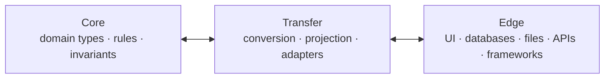

The **Core** carries domain meaning, stable types, rules, and invariants. The **Edge** contains technical reality: frameworks, database drivers, files, UI controls, protocols, and external formats. The **Transfer** between them must be explicit rather than accidental. Controlled conversion, projection and adapters define the transition instead of allowing framework types or transport formats to become the domain model by accident.

The same idea can be viewed from the movement of data: **Source → Transfer → Sink**.

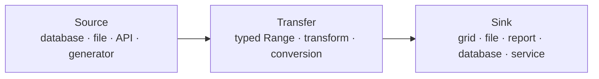

Source and Sink are roles, not framework base classes. A database query can be a Source, a file can be a Source or Sink, a grid can be a Sink, and a service can be either depending on direction. The Transfer stays explicit: typed values move through Ranges, transformations and controlled conversions rather than disappearing into a generic runtime container.

This is also where variadic templates become more than a language trick. They allow complete type sequences to become design objects. A database row, a tuple, a conversion path, a parameter set, a file record, or a grid row can be described from the same statically known type structure. Instead of falling back to untyped lists or runtime boxes, relationships between heterogeneous values can remain visible to the compiler.

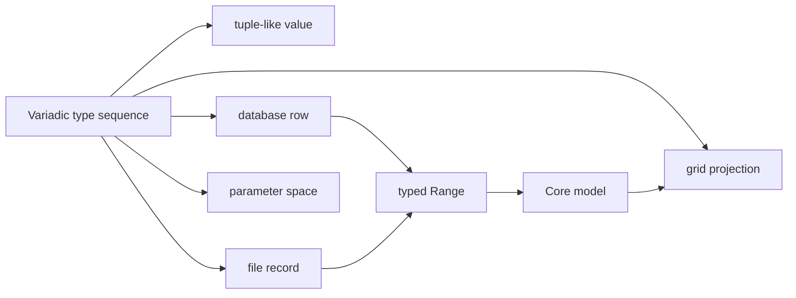

Ranges complement that type-level structure on the movement side. They describe **how values flow** from a Source through transformations to a Sink. A database query can remain a Source, a transformation can stay lazy, and a grid or file can remain a Sink. The architecture does not pretend that these worlds are identical; it gives them a common, typed language for transfer.

The compiler does not become the architect. Architecture remains a human responsibility. But the compiler can become a much stronger **partner in checking architecture** if we formulate assumptions in forms it can understand.

That perspective also explains why our increasingly demanding tests mattered beyond C++Builder itself. Every successful test of Concepts, ranges, generic type structures, compile-time relationships, value semantics, or library composition did more than add another check mark to a feature matrix. It increased the confidence that we could use the modern language to structure real systems in a different way.

### Efficiency became part of the argument

The evolution since C++11 strengthened another reason for using C++ in this role: **efficient abstraction became easier to express directly**.

C++ had always been designed around predictable costs, but C++11 changed important parts of the cost model. Move semantics and rvalue references made ownership transfer explicit and avoided many unnecessary copies. Variadic templates made generic heterogeneous structures possible without falling back to runtime indirection. `constexpr` and `type_traits` moved more work and validation into compile time. Lambdas made local behavior composable, and standardized concurrency gave threads, atomics, futures, and synchronization a portable standard vocabulary.

Later standards continued that direction. Concepts can reject invalid structures before runtime. Policies can select behavior without requiring virtual dispatch. `std::optional`, `std::variant`, and `std::expected` make alternatives and error states explicit. Ranges can compose transformations lazily and avoid premature materialization.

So "modern C++" is not merely more expressive. In many situations it makes it easier to write abstractions that preserve the traditional C++ expectation that costs remain visible and unnecessary runtime work can be avoided.

That matters for BuildEngine. Orchestration is not only configuration parsing. It includes dependency graphs, filesystem traversal, hashing, process management, concurrent queues, output processing, metadata, HTTP services, documentation generation, and native UI integration. Using one language that can express high-level structure while still giving direct control over lifetime, ownership, concurrency, and cost is a practical advantage rather than an ideological choice.

The book also makes an important qualification that belongs in this story: C++ develops **evolutionarily**. Existing knowledge remains valuable. New facilities do not automatically replace old concepts; they expand the space of possible designs. Modern C++ architecture therefore does not mean using every new feature everywhere. It means choosing the expression that best matches a responsibility — sometimes a simple value, sometimes a Concept, sometimes a Range, sometimes a Policy, sometimes a virtual base class, and sometimes a deliberate runtime decision.

That is also why experience is not the enemy of modernity. Experience becomes most useful when it is combined with a willingness to re-examine old habits and ask whether the language can now express the same intention more precisely.

The path from streams and experiments to reusable library components is part of the book itself. Many building blocks did not begin as a finished architecture. They grew through practical work, live coding, failure, correction, generalization, and explanation. The stream shows the open process; the book condenses it into a coherent architectural line.

### From "Rethinking C++" to "Architecture That Lasts"

But the C++ question leads naturally to a larger one.

If types, Concepts, ranges, policies, explicit processes, controlled boundaries, and reusable core structures help us preserve meaning in code, then the underlying architectural question is no longer specific to C++:

> **How can a system absorb change without losing its identity?**

That is the subject of **"Architecture That Lasts" ("Architektur, die bleibt")**.

The second book deliberately moves one level above individual language facilities. It is not a book about Microservices, containers, REST, cloud platforms, or one current framework. Those can all be useful implementation choices, but they are not architecture by themselves.

Its central distinction is that **stability is not stillness**. A system is not stable because nobody changes it. Stability proves itself when technologies, requirements, processes, interfaces, and representations change and the system can absorb those changes without losing the structures that carry meaning.

That leads to another principle that fits BuildEngine surprisingly well: technical packaging does not remove complexity. It only changes where that complexity appears. If the underlying structure is not understood, complexity migrates into conventions, scripts, metadata, naming rules, workarounds, manual procedures, or implicit knowledge.

This is precisely the problem we encountered in third-party builds and CI environments. The complexity of acquiring, configuring, building, testing, documenting, licensing, and publishing a component does not disappear because a pipeline uses YAML or because one more script wraps the build command. The architectural task is to understand that complexity, separate its responsibilities, and give each part a stable place.

In that sense, BuildEngine became a practical meeting point between the two books:

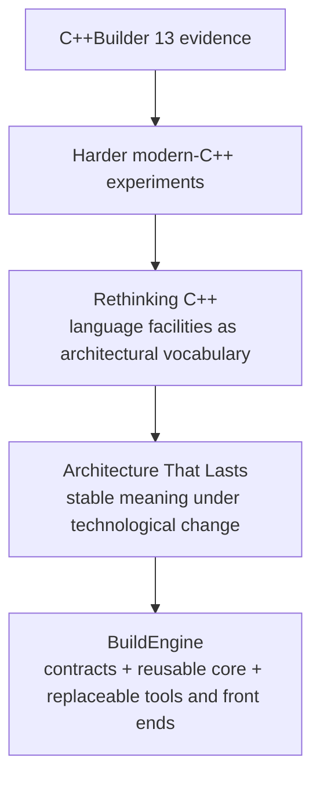

The books are therefore not a detour from the BuildEngine story. They describe the thinking that the experiments increasingly forced us to make explicit.

## 3. From evidence to centrally produced components

Once the evidence test worked, another question became more interesting than the original experiment:

> **Why should the result remain a collection of successful experiments instead of becoming the central, project-independent way in which important native components of an application landscape are produced and documented?**

That changed the target substantially.

Instead of building a dependency separately inside each application project, BuildEngine increasingly became responsible for producing reusable, versioned components centrally. A library should be acquired, verified, built, tested, installed, documented, packaged, and described once according to an explicit contract, then consumed by the applications that need it.

That also meant that the build prerequisites themselves had to become part of the reproducible environment.

BuildEngine therefore provisions required tools centrally. Where possible, those tools are **not installed system-wide and not registered globally**. They are downloaded or discovered, verified, kept inside the BuildEngine production tree, and referenced through internal tool variables such as `{Tool:cmake}`, `{Tool:ninja}`, or `{Tool:perl}`.

The same principle increasingly applies to infrastructure that would normally be delegated to external helper programs. Archive extraction is a good example. BuildEngine links a private libarchive runtime and now treats gzip, XZ and BZip2 as explicit in-process capabilities. A `.tar.bz2` file is therefore not accepted merely because some `bzip2.exe` happens to exist on the machine; the runtime must report the BZip2 filter as available in-process. That turns an accidental host prerequisite into a visible, testable part of the BuildEngine capability contract.

That approach has several advantages:

- the build does not depend on a developer remembering which global tools were installed;
- multiple versions can be managed deliberately;
- tools do not need to modify machine-wide registration merely to participate in a build;
- the effective tool path is part of the BuildEngine model;
- and a clean-room machine can reconstruct the environment from the contracts instead of from tribal knowledge.

The same principle applies to compiler-adjacent tools, documentation tools, code generators, browser resources, and other utilities. The environment should explain itself.

## 4. CI was not the invention

Continuous Integration is not new, and BuildEngine does not pretend to have invented it.

In fact, many of the problems that led to BuildEngine are familiar precisely because mature CI environments already exist everywhere.

During the evidence work I repeatedly encountered a characteristic pattern. A build pipeline often grows by following the development process step by step. One team owns source acquisition, another owns the compiler environment, DevOps specialists maintain CI jobs, individual projects add shell or PowerShell scripts, configuration is distributed across YAML files, and yet another process handles packaging, deployment, documentation, or security scanning.

None of those techniques is wrong by itself. The problem appears when **the knowledge required to reproduce one component is distributed across too many places and too many responsibilities**.

A single library may involve:

- a download script;
- a patch script;
- a YAML job definition;
- environment setup;
- a CMake invocation;
- a test command;
- an installation script;
- packaging rules;
- documentation steps;
- and a separate deployment or publishing process.

The next library may use a completely different build system.

Our current set includes ordinary CMake projects, Meson projects, Skia with GN/Ninja, and ACE/TAO with MPC workspace generation through `mwc.pl` before the generated BMake projects are built. Perl, Python, Make variants, code generators, resource compilers, and project-specific tooling all appear in the same landscape.

That diversity is normal in the C and C++ ecosystem. A CI system that assumes one universal upstream build tool therefore does not remove complexity; it merely moves the complexity into scripts around the CI definition.

And those scripts were one of the main reasons the **centralized tool model** became important to us.

## 5. Fewer contracts, one source of truth

Our answer was not to eliminate scripts at any cost. Some tools genuinely need them. The goal was to stop using scripts as the place where the architecture itself is hidden.

We wanted the essential knowledge to be expressed in a small number of declarative XML contracts:

- which tool is required and how it is obtained;
- which library version is used;
- where its source comes from;
- how that source is verified;
- which dependencies exist;
- which build parameters are required;
- which variants are built;
- which tests are executed;
- which files are installed and published;
- which license evidence belongs to the component;
- which documentation profile applies;
- and which logical state makes a result current.

The contracts therefore do more than drive execution. **They document the prerequisites and parameters of the build at the same time.**

XML is important here because it gives us a **human-readable, structured contract language**. The files are intended to be opened, read, reviewed, diffed, commented, discussed, and maintained by engineers. Elements and attributes can describe tools, versions, dependencies, actions, variants, parameters, tests, publication rules, and documentation without turning every library into new C++ control flow. XSD schemas make the vocabulary mechanically verifiable without giving up that readability.

This is deliberately **not** an argument that XML is the preferred format for machine-to-machine communication. BuildEngine uses XML where humans define and review durable technical contracts. Runtime communication and distributed interfaces have different requirements and may use very different mechanisms. The same project roster contains TAO/CORBA precisely because a typed distributed-object protocol solves a completely different problem from a human-maintained build contract. REST/JSON resources in the BuildEngine server are another example of a transport/presentation boundary with different priorities.

The distinction is intentional:

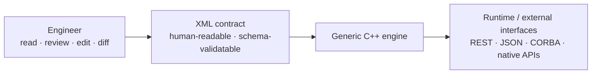

Within the vocabulary understood by the engine, changing a library version, adding a dependency, selecting another build variant, adjusting an upstream option, or defining another tool path becomes a data change rather than a new orchestration implementation.

The first implementation of that idea was naturally task-oriented. We generated technical jobs, connected them through a dependency DAG, and let a scheduler find runnable work. That was the right starting point: it gave us parallelism, explicit dependencies, and a concrete way to turn the XML contract into execution.

But as the project grew, the DAG started to carry too much meaning. Build, Test, Validation, Install, Metadata, Publish, Documentation, Ready, Release/Debug variants, extensions, dynamic documentation scopes and incremental state all had to be represented through combinations of jobs and edges. The technical graph was beginning to become a second model of the library itself.

The architecture therefore changed at its center.

## 6. The library became the state machine

Today the primary runtime object is no longer a global graph node. It is the **library**.

Every active `Library/Version` is represented by its own state machine:

```text
Source -> Build -> Test -> Validation -> Install -> Metadata -> Publish -> Documentation -> Ready
```

The XML contract is compiled into state and scope definitions. The state machine asks, at each state:

- are my direct library requirements satisfied?
- which of my logical scopes are already current?
- is this state a no-op for this library?
- which WorkItems must now be executed?

Only after those questions have been answered does technical work enter the worker infrastructure.

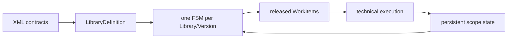

This is not an add-on around the old scheduler. It is the organizing model of the current BuildEngine.

### Dependencies become state relationships

A direct library dependency is no longer expanded into a second global web of phase-specific job edges.

Instead, for every state from Build onward, the general rule is:

> **A library may work on state S only after every direct dependency has successfully completed S.**

So:

```text
ACE Build requires OpenSSL > Build
TAO Build requires ACE > Build
```

Transitivity follows from the individual machines themselves. TAO does not need a hard-coded transitive OpenSSL rule; ACE already carries that responsibility.

This was an important simplification. The same generic relation works for ordinary dependencies and for the logical side of extensions. The physical details of an extension — shared source, producer and payload paths — remain explicit in the XML contract, while the state progression stays uniform.

### Parallelism moves inside the right boundary

Release and Debug are variants of one library state, not separate libraries.

When Build is reached, the state can release multiple independent WorkItems. The technical execution layer may run them concurrently, bounded by the worker count and by real local dependencies.

Local Action graphs still exist where they are useful. A generated file can precede a compile, two tests can follow it, and an install step can wait for both. But that graph is now deliberately **local to already approved work**.

```text
Library FSM:
   decides whether work is allowed

WorkItem / local Action graph:
   decides how that work is executed

ProcessScheduler / workers:
   execute the released jobs
```

That separation is one of the most important architectural results of the project.

### Persistent state is not the runtime state machine

The FSM is runtime control. It is not persisted.

Persistent state belongs to logical scopes:

```text
timestamp=<library timestamp>
upstream=<library>|<version>|<scope>|<upstream library timestamp>|<upstream completedAt>
completedAt=<this scope completion>
state=completed
```

Before stale work is actually submitted, the previous successful scope state is invalidated. A new state is committed only after the technical work and its required evidence succeed and the expected upstream scopes are still current.

That means a failed rebuild cannot leave an old success behind.

It also means fingerprints, output files, job IDs and technical step markers do not become a second definition of "current".

### The same model drives observation

The heartbeat now speaks primarily in terms of libraries and their reached FSM states rather than pretending that hundreds of technical jobs are the domain model.

The read-only `--check` path also uses the same LibraryDefinition, state requirements and state-machine/orchestrator semantics. It does not submit technical build jobs and does not mutate persistence, but it answers the same question as execution: **where can this library actually progress under the current contract and state?**

Documentation became a particularly useful stress test. Its `Documentation` state has hierarchical runtime substates for standard, collection and linked documentation. Dynamic Boost module scopes and ACE/TAO Doxygen tagfile relationships can therefore be expressed without inventing another global scheduler hierarchy.

### Why this matters to the C++ story

This redesign is also part of the modern-C++ experiment.

Boost.Statechart provides the state-machine mechanism. Strong types carry library coordinates and states. Ranges and standard algorithms express requirement checks and fixpoint scans. RAII governs processes and resources. Move semantics make WorkItems and completion data practical without unnecessary copying.

The value is not that C++ has an FSM library. The value is that the language and its ecosystem let us move from a technically convenient task graph to an architecture that more closely matches the domain we are trying to control.

The goal is still not "parallel at all costs". It is useful parallelism under a model whose meaning remains understandable.

## 7. Thirty days later: a different application

The evidence test took roughly ten days and covered twenty libraries.

The application that grew out of it took roughly **thirty further days of development** to reach the current level of functionality. At that point the BuildEngine contract directly manages **32 libraries**, while further components arrive through upstream dependency structures — **Skia alone currently brings another 18 dependencies into that picture**.

Those numbers are useful not as a benchmark against another CI product, but because they show how quickly the scope changed. The original objective was evidence for one compiler. The current system is managing a reproducible component landscape, its tools, dependencies, metadata, documentation, security information, packages, and several presentation surfaces.

That development speed was possible partly because BuildEngine did not start from an empty repository.

We reused and generalized building blocks that already existed in our work, including concepts such as:

- process creation and process-output handling;
- asynchronous output collection;
- `BlockedQueue`-style producer/consumer infrastructure;
- filesystem and hashing helpers;
- XML processing;
- Markdown rendering;
- and other reusable utility components.

That is itself part of the C++ story. Reuse does not only mean consuming external libraries. It also means building an internal vocabulary of dependable components from which the next application can be assembled faster.

## 8. From experiments to BuildEngine

A successful build on one development machine answers only one question: *did it work here once?*

For production use we need stronger questions answered:

- Which exact source release or commit was used?
- Was the source verified?
- Which compiler and tools were used?
- Which dependencies were selected?
- Which patches were applied, and why?
- Which Release and Debug variants were created?
- Which files were installed and published?
- Which tests and independent consumers succeeded?
- Which licenses apply?
- Can the same state be recreated on another machine?

BuildEngine grew out of that need.

Instead of turning every library into a new hard-coded C++ workflow, the project increasingly moved library-specific knowledge into declarative XML contracts. The engine provides generic infrastructure: repository synchronization, tool provisioning, source acquisition, Library-FSM orchestration, local technical execution, logical state handling, package installation, smoke tests, documentation, metadata, and later security analysis.

The third-party library becomes data wherever possible. The engine remains infrastructure.

That separation matters because the project is not trying to create a private replacement ecosystem. The preferred route remains:

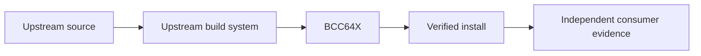

## 9. BuildEngine was public from the beginning

BuildEngine was not developed as an invisible internal utility and only presented after completion. I showed and discussed its development in my streams from the beginning.

That was intentional. The project itself was part of the demonstration.

It was not enough to say that C++Builder could build open-source libraries. I wanted to show the complete process of using them: acquiring them, building them, testing them, installing them, inspecting them, updating them, and using their results in real C++Builder programs.

This also meant that design weaknesses became visible in public. Console output, scheduler behaviour, dependency handling, build-state errors, patches, warnings, and failed assumptions were not hidden behind a polished final demo. They became part of the engineering story.

That openness influenced the next stage of the project.

## 10. The console discussion changed the demonstration

BuildEngine was initially and naturally a console application. For a build orchestration system that is a perfectly reasonable technical interface. Command-line programs compose well, are scriptable, and make automation straightforward.

After we extended security monitoring and risk assessment, however, the console presentation became richer. The application could show libraries, findings, security information, assessments, parameters, and more detailed state.

That led to an interesting discussion: if the purpose of the project was to demonstrate a modern C++ environment, did an increasingly parameter-heavy console program itself reinforce the stereotype that C++ software looked like something from yesterday?

Technically, I disagree with the idea that a command line is obsolete. But the criticism was useful because it exposed another opportunity for the project.

If the claim is that modern C++Builder belongs in today's C++ world, then we should demonstrate more than compiler and build-system compatibility. We should also demonstrate that the same modern C++ core can support comfortable native desktop software and contemporary service interfaces.

## 11. A deliberate VCL application

The graphical BuildEngine manager therefore has a specific role in the story.

I deliberately wanted to place **C++Builder and the VCL** here.

The VCL is one of C++Builder's distinctive strengths: native Windows applications can combine modern C++ logic with a mature productive UI framework. The manager is therefore not an apology for the console and not a replacement for automation. It is a second presentation surface over the same technical model.

The user can work with library selections, build variants, status, output, security information, and other BuildEngine functions through a conventional Windows application instead of reconstructing the state from command-line parameters.

This demonstrates an important point: modern C++ and productive native UI development are not competing ideas.

## 12. Why add a server to a C++ build tool?

The server began from another part of the same argument.

C++ is often less visible today because many developers work primarily in higher-level languages. That can create the impression that C and C++ have become peripheral technologies. In reality, large parts of the computing stack still depend on native C and C++ libraries beneath higher-level interfaces: TLS, compression, databases, graphics, media processing, language runtimes, operating-system interfaces, and many other foundational components.

Many of the libraries we were building with BCC64X are examples of exactly that layer.

The BuildEngine server therefore became another demonstration: **the same C++ code that builds those native components can also expose their state through contemporary web and REST interfaces.**

The server initially provided a local overview of the library repository and machine-readable result sets. It then grew naturally:

- library and version views;
- SBOM access;
- dependency and reverse-usage information;
- security findings and risk assessment;
- REST-style JSON resources;
- package creation and download;
- generated library documentation;
- and direct rendering of the project's Markdown documentation.

The result is no longer merely a status page. The server has become a read-only presentation and distribution layer for the BuildEngine production tree.

## 13. The tool contract also extends the server

An interesting consequence of the centralized tool model appeared when the server gained richer documentation capabilities.

The same mechanism that describes compilers, build tools, generators, and documentation tools can also describe **browser-side resources required by the BuildEngine environment**.

The tool contract now includes managed resources for:

- syntax highlighting;
- Mermaid diagrams;
- MathJax mathematical notation;
- Doxygen;
- Graphviz;
- and MiKTeX when PDF documentation is required.

The server does not need hard-coded knowledge of where those resources were manually installed. It resolves them through the same managed tool definitions used by the rest of BuildEngine.

That is a small example of why centralizing tool knowledge matters. Once the information exists structurally, a new subsystem can reuse it instead of inventing another configuration mechanism.

## 14. Documentation as part of the running system

The Markdown integration extended that idea again.

Documentation should not be a detached collection of files that happens to describe the system. The manually maintained BuildEngine documents live in the synchronized administration repository and are rendered **directly** by the running server. A changed Markdown file is therefore the changed documentation; there is no second copied manual tree that has to be refreshed.

This became especially convenient because **cmark-gfm was already in our library roster**. Instead of introducing a foreign documentation stack, we could use another component that BuildEngine was already capable of building, packaging, and consuming.

Markdown is parsed on request. Normal links between Markdown files work directly, so documents can form a connected manual instead of isolated pages. Optional browser capabilities such as syntax highlighting, Mermaid diagrams, and mathematical notation are loaded only where needed.

Generated library documentation remains available beside those project documents.

This gives the server a central documentation role:

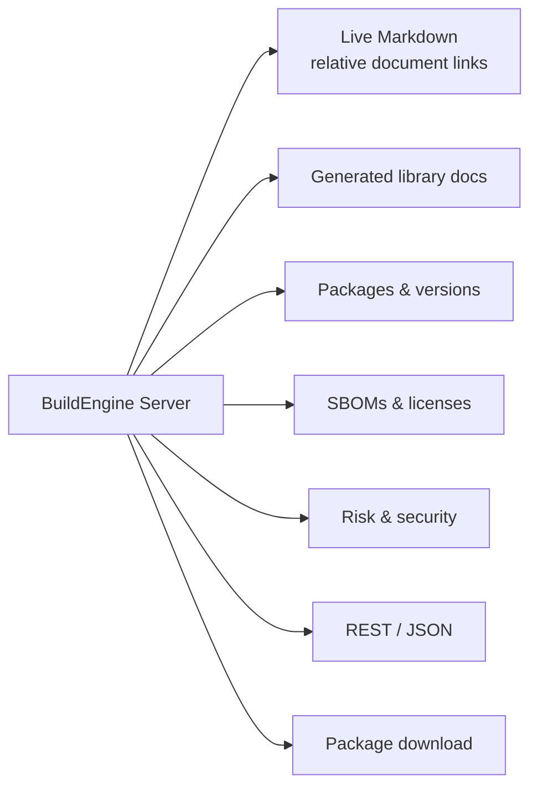

### Documentation became a production pipeline

The generated documentation itself went through the same evolution as the rest of BuildEngine.

At first, HTML API documentation is the obvious target: generate a Doxyfile, run Doxygen, publish the result. But once documentation is treated as part of the component evidence rather than as a convenience page, PDF becomes interesting as well — for offline review, archiving, controlled distribution, and simply because it tests another complete tool chain around the same source state.

The first naive model would be to run Doxygen once for HTML and a second time for LaTeX. That would be wasteful and, more importantly, it would allow two supposedly equivalent documentation forms to originate from two separate analyses.

The current model is stricter:

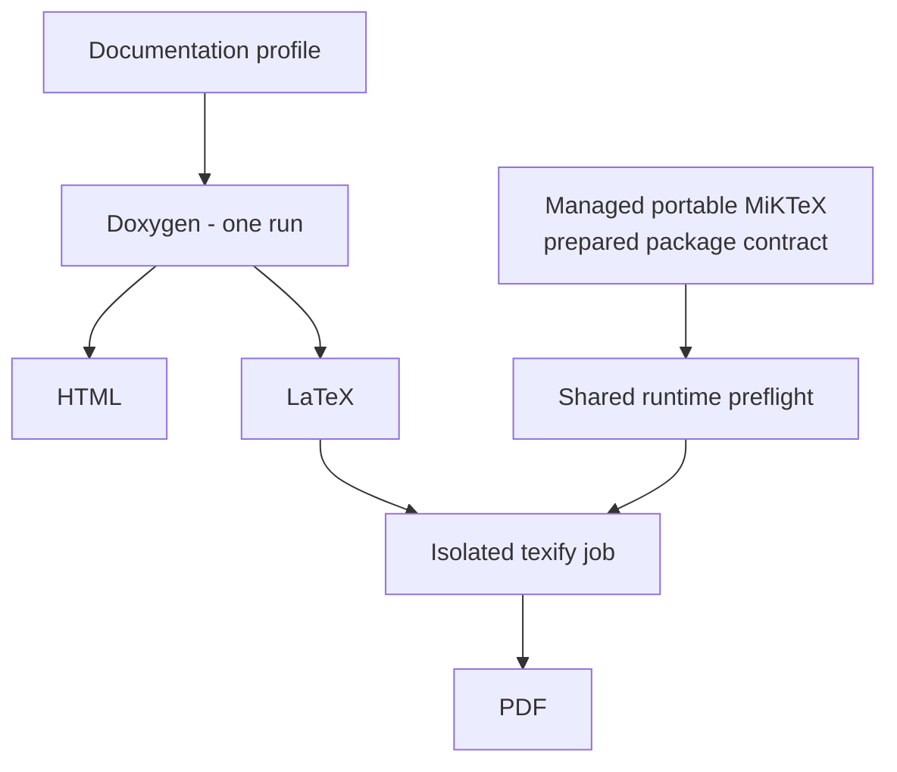

When LaTeX is enabled, **the same Doxygen invocation produces HTML and LaTeX**. MiKTeX never asks Doxygen to analyse the sources again. It only compiles the already generated LaTeX tree.

That sounds like a small optimisation, but it forced several architectural questions to become explicit.

MiKTeX is not treated as an invisible workstation installation. BuildEngine provisions a portable managed MiKTeX below its own tool root. Its preparation is described declaratively in `build-tools.xml`, including the package surface required by the pinned Doxygen 1.18.0 LaTeX templates. Library PDF jobs run with automatic package installation disabled. A missing package is therefore evidence that the preparation contract is incomplete, not an invitation for one parallel build worker to modify the machine behind our back.

MiKTeX also has mutable shared runtime state. The first `pdflatex` invocation may need to create its format files. Starting many first-use PDF jobs in parallel would therefore turn a deterministic documentation build into a race. BuildEngine now has one explicit shared MiKTeX runtime preflight; only after that succeeds may the independent PDF jobs run concurrently.

The completed large diagnostic run was important because it separated the layers empirically. The shared MiKTeX runtime initialized successfully and a substantial group of library PDFs was produced. Other libraries still failed later in their individual `texify` jobs. That is useful evidence: **a per-document LaTeX failure is not the same thing as a broken MiKTeX runtime**. The remaining PDF cases can now be diagnosed from their own logs instead of repeatedly redesigning the entire MiKTeX installation path.

Boost then made the documentation problem much larger again.

A monolithic recursive Doxygen run over the complete Boost include tree is not an attractive unit. BuildEngine therefore treats Boost as a **collection**. The published API structure is the contract: the common root and every first-level directory become independent documentation scopes. In the diagnostic run this produced one root scope plus 145 discovered modules — 146 Doxygen scopes without maintaining a second hand-written list of Boost libraries.

That scale immediately exposed another state-model issue. Every Boost module depended on a common `collection-prepare` step that generated the Doxygen inputs. The first implementation treated that preparation as a helper but not as persistent library state. The Doxygen work itself succeeded, but the downstream scopes could not commit their upstream state correctly. The lesson was architectural, not Boost-specific: **if a logical downstream scope depends on a preparation result, that preparation belongs in the logical state chain.**

A second lesson came from the central documentation index. Rebuilding the global index at the end of every parallel library documentation job looked harmless because the operation itself was cheap. It was not harmless. While one job enumerated the global documentation tree, another job could be deleting and recreating its own output directory. The observed index size therefore varied with timing.

The corrected model separates aggregation from production. Individual documentation jobs create only their own library output. The central index may be refreshed once from the existing tree before a long run, but its authoritative final refresh happens only after the parallel and deferred collection documentation work has settled.

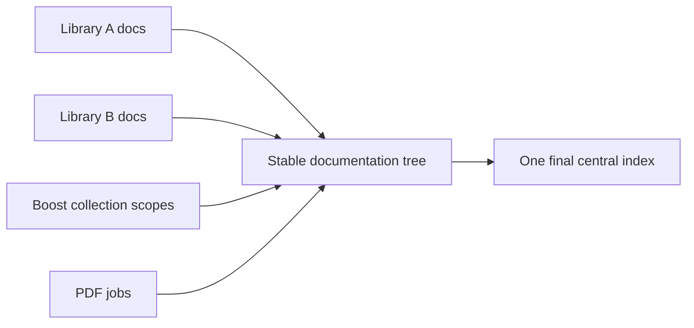

This was a large step for the project because documentation stopped being a decorative tail of the build. It became another reproducible product pipeline with explicit tools, dependency boundaries, state, concurrency rules, diagnostics, and publication layout.

And the documentation follows the same single-source principle as the build contracts: whenever a technical contract changes, the corresponding Markdown reference is changed with it.

## 15. One model, several front ends

Once console, VCL application, and web server all existed, another architectural consequence became unavoidable.

They must not each implement their own version of the truth.

Risk assessment is a good example. A vulnerability finding must not be interpreted one way in the console, another way in the manager, and a third way in the REST server. The same is true for repository access, package information, usage relationships, Markdown rendering, and other shared functions.

This led to the expansion of **BuildEngine-Common** as a shared DLL.

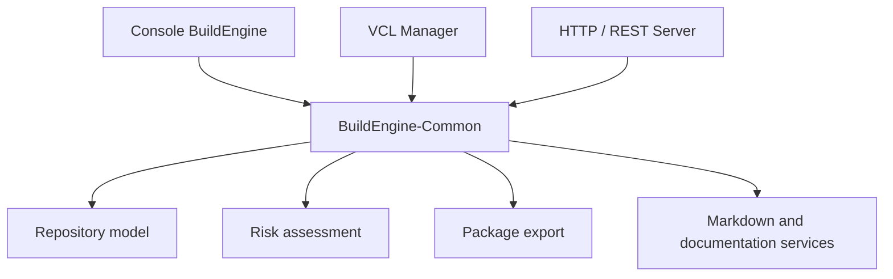

The presentation changes, but the interpretation does not.

That is a small architectural decision with a large practical effect. It allows the project to demonstrate different C++Builder application styles without fragmenting the underlying engineering model.

It is also a concrete example of the line developed in **"Architecture That Lasts" ("Architektur, die bleibt")**: the outer topology may change while the structure carrying meaning should remain coherent. Console, VCL manager, and HTTP server are different projections and technical forms. They should not become three independent domain models.

## 16. More than an SBOM: licenses and provenance

A Software Bill of Materials is an important part of this model because it answers the inventory question in a machine-readable form. But an SBOM alone is not the complete architecture of component responsibility.

From the beginning, another important requirement was to collect the **license information** associated with the components as well.

That means more than recording one SPDX identifier. BuildEngine collects the available upstream license evidence, package metadata, bundled-component information, dependency information, and generated summaries so that the component can be reviewed as a technical and legal unit instead of as an unexplained DLL.

A component name and version alone do not tell us:

- the exact source state;
- the build profile;
- enabled and disabled features;
- applied patches;
- compiler and runtime assumptions;
- dependency decisions;
- verification results;
- installation layout;
- license evidence;
- bundled third-party components;
- or the prepared replacement route.

For BuildEngine, the stronger source of truth is the versioned build and library metadata together with the technical evidence produced from it. SBOM, license overview, package metadata, and documentation are important **derived control and interchange artifacts**.

That direction of information flow matters:

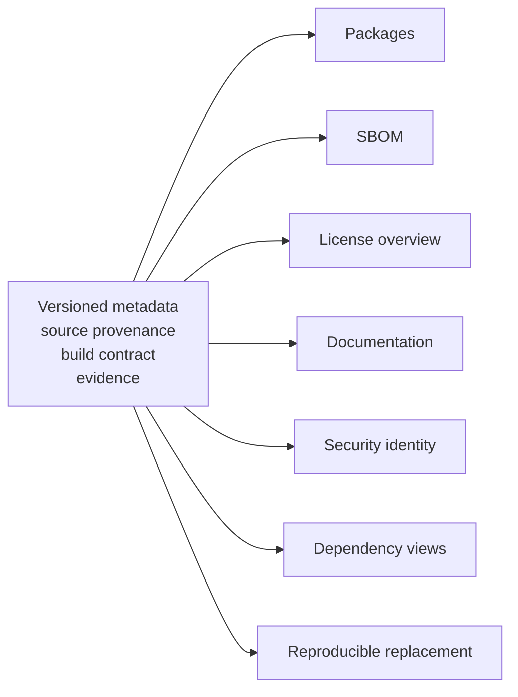

This reflects a principle I have followed since the 1990s: information that can be represented structurally should not be copied manually into multiple documents. The structure should become an active source from which dependent artifacts can be produced and checked.

## 17. The second story: staying ahead of the wave

While the integration proof was growing, another purpose of BuildEngine became increasingly important.

My first practical encounter with this topic did not begin with the Cyber Resilience Act. It came through **DORA-related discussions** around one of our long-lived financial-sector systems.

A regulatory assessment in the customer's environment led to extensive discussion about criticality, dependencies, responsibilities, and the technical evidence that could be produced. What struck me was not that security and operational resilience were unimportant. Quite the opposite. The frustrating part was how much highly qualified engineering time can be consumed when technical facts have to be reconstructed after the question has already become urgent.

Which third-party component is actually used? Which version? Where did it come from? Which runtime DLL is shipped? Which features were enabled? Which licenses apply? Who is responsible for updates? Can the new release still be built? What needs to be retested?

Those are engineering questions. They should not first be asked in a crisis meeting.

That experience became one of the reasons for the principle we now describe as **staying ahead of the wave**.

## 18. What is the wave?

The wave is the combination of events that can turn an unmanaged dependency into urgent work:

- a new CVE;
- active exploitation;
- a security advisory;
- a changed regulatory expectation;
- a customer question;
- an upstream release;
- an end-of-support decision;
- or a newly discovered dependency.

Staying ahead of it means that the organisation already knows enough to make a decision when the signal arrives.

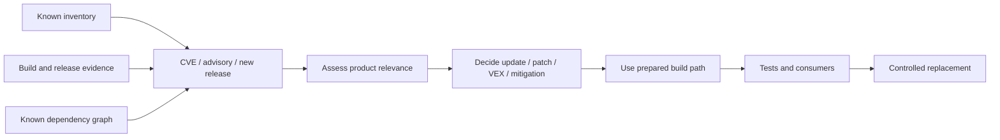

The difference is fundamental. A reactive organisation starts with discovery. A prepared organisation starts with assessment.

## 19. DORA, NIS2, and the Cyber Resilience Act

The regulatory environment makes this engineering direction more relevant, not less.

DORA brought the topic into our practical work through the financial-sector context. NIS2 places strong emphasis on cybersecurity risk management and supply-chain security for affected organisations. The Cyber Resilience Act goes further for products with digital elements by placing explicit lifecycle, vulnerability-handling, documentation, and third-party-component responsibilities on manufacturers.

The exact legal applicability must always be assessed for the concrete organisation and product. BuildEngine is not a legal-compliance engine.

But the technical lesson is independent of that legal classification:

> **Product responsibility is difficult to exercise if component knowledge and replacement capability have to be reconstructed only after a problem appears.**

A manufacturer or development organisation that already knows its software inventory, provenance, build conditions, dependencies, tests, licenses, and update path is in a fundamentally better position than one that has only a binary artifact and an old release note.

## 20. Scanners are controls, not the steering wheel

This is not an argument against vulnerability scanners, SBOM scanners, binary scanners, OSV, NVD, EUVD, or similar sources. They are essential controls.

They can reveal that:

- a new vulnerability has been published;
- a shipped artifact contains something unexpected;
- declared and actual component state differ;
- an upstream package now has a fix;
- or a dependency needs investigation.

But a scanner usually operates **after a component has already been selected, built, or shipped**. It can make the problem visible. It cannot by itself create the missing build contract, reconstruct provenance, recover an undocumented patch, or prove that an updated version still works in the product.

That is why I describe scanners as **rear-view mirrors, not the steering wheel**.

The preferable sequence is:

1. Know what is being integrated before integration.
2. Record version, provenance, dependencies, build profile, license information, and relevant configuration structurally.
3. Build and verify it reproducibly.
4. Keep the resulting package and evidence identifiable.
5. Use scanners and vulnerability databases as independent checks against that intended state.
6. When a signal appears, assess relevance and use an already prepared replacement path.

The scanner then answers a much better question than *"What do we actually have?"*

It can answer: **"Is what we deliberately manage still safe, and does the shipped reality still match our declared state?"**

## 21. From vulnerability finding to decision

The security monitor is evolving in exactly that direction.

A useful monitor should not stop at `AFFECTED`. It should help structure the next engineering decision:

```mermaid
flowchart LR
   Current["Current version"] --> Finding["Findings"]
   Finding --> Relevance["Affected feature / build relevance"]
   Relevance --> Fix["Fixed release or upstream fix"]
   Fix --> Candidate["Candidate availability"]
   Candidate --> Compare["Candidate vulnerability comparison"]
   Compare --> Rebuild["Rebuild path"]
   Rebuild --> Test["Tests & consumer evidence"]
   Test --> Decision["Package / release decision"]
```

This is also where VEX becomes important. A database match is not automatically proof that the concrete product is exploitable. Build configuration, selected backend, compiled features, runtime dependencies, and actual code paths matter.

The objective is therefore neither to suppress findings nor to turn every CVE into an emergency. It is to make the assessment explicit and evidence-based.

## 22. Speed is created by preparation

Regulation, security review, and supply-chain management are often described as forces that make software development slower.

I think that conclusion confuses documentation after the event with engineering preparation before the event.

If a new library version requires days of research because nobody knows how the old one was built, security work is slow.

If version, source, patches, dependencies, build parameters, package layout, tests, consumers, licenses, and tools are already known, an update is not a new research project. It is another execution of a controlled process.

That is the same engineering attitude behind an answer I gave decades ago when asked about the difference between our highly productive IDV group and the traditional EDV organisation:

> **"While the others are still thinking about and discussing a problem, we have already solved it."**

The sentence was deliberately provocative. The real principle was never to skip analysis. It was to build structures in which a sound decision can be implemented and verified quickly.

That is what **staying ahead of the wave** means in BuildEngine.

## 23. One project, several connected proofs

Looking back, BuildEngine now provides several connected proofs.

The first is technical and directly about C++Builder:

> **C++Builder 13 and BCC64X are again capable of participating credibly in the modern C and C++ ecosystem.**

The breadth of successfully built and consumed open-source libraries demonstrates that this is not a claim based on one carefully prepared example. C++Builder can work with contemporary upstream code, modern build systems, C++23 consumers, large dependency graphs, networking, graphics, TLS, databases, and middleware.

That is the practical meaning of **C++Builder 13, Back in the Future**: not nostalgia for an old tool, but a modern toolchain reconnecting with the wider C++ family.

The second proof is about C++ itself:

> **A modern C++ application can be the generalized orchestration layer for build, metadata, documentation, server, and native UI functionality rather than merely the code being compiled by CI.**

The increasingly demanding tests added another lesson: modern C++ is not only a longer feature list. Concepts, ranges, templates, policies, RAII, value types, and controlled conversions give us a richer architectural vocabulary. That is the line condensed in **"Rethinking C++" ("C++ neu denken")**: we do not have to discard what we know, but we should be willing to reconsider where responsibilities can now be expressed more precisely.

The Core → Transfer → Edge model makes that practical. The Core owns meaning and invariants. The Edge accepts changing technical reality. Transfer is where conversion, projection and typed data movement are made explicit. Ranges and variadic templates are important because they let both **movement** and **heterogeneous structure** remain part of the type-aware architecture instead of disappearing into generic runtime containers.

The language evolution since C++11 adds the efficiency argument: modern C++ can express ownership transfer, compile-time structure, concurrency and lazy data movement while avoiding many unnecessary copies, allocations and runtime indirections. That makes C++ particularly suitable for a tool such as BuildEngine, where orchestration, infrastructure and presentation layers meet.

And that leads to the broader architectural proof expressed in **"Architecture That Lasts" ("Architektur, die bleibt")**: a system is not modern because its outer technology is new. It is sustainable when its underlying structure can absorb change without losing identity.

The third proof is organisational:

> **Knowing how to build a dependency is part of knowing how to own it.**

BuildEngine turns component integration into a repeatable technical chain: source, provenance, tools, build, tests, package, SBOM, licenses, documentation, security identity, risk view, and replacement path become connected rather than separate after-the-fact activities.

And the CI lesson is deliberately modest:

> **The innovation is not Continuous Integration. The useful experiment is concentrating fragmented CI knowledge into a small declarative model and letting one generalized C++ implementation execute that model efficiently.**

XML is a decisive part of that concentration. It keeps the changing knowledge flexible, inspectable and **human-readable** while the generalized engine remains stable. Instead of hard-coding every library, BuildEngine turns much of the ecosystem-specific variation into validated data. That choice is about maintainable engineering contracts, not about prescribing XML for machine-to-machine communication.

## 24. The project is still evolving

None of this makes the project finished.

The library set continues to grow. Security monitoring and assessment will become richer. Package and server functions will evolve. The VCL manager will expose more of the same common model. Documentation will continue to change as the implementation changes.

That is intentional.

The goal is not a frozen showcase. The goal is a working system that continues to test the central ideas under real change:

- modern C++Builder as part of the wider C++ ecosystem;
- modern C++ as something more capable than the common "legacy" stereotype suggests;
- learning new C++ features and then asking what they change in our way of designing software;
- Core, Transfer, and Edge as a way to separate stable meaning from technical reality;
- Source, Transfer, and Sink as explicit roles for typed data movement;
- Ranges as a language for typed data movement and variadic templates as a language for heterogeneous type structures;
- the efficiency gains and stronger cost model enabled by modern C++ since C++11;
- evolutionary development rather than compulsory reinvention — keep what still carries, rethink what can now be expressed better;
- architecture as stable meaning under change rather than as the fashion of the current deployment topology;
- upstream-first third-party integration;
- central, project-independent production of reusable native components;
- portable managed tools instead of undocumented machine installation state;
- flexible, human-readable, schema-validatable XML contracts instead of library-specific orchestration code;
- transport and machine-to-machine protocols chosen independently for their own requirements;
- a small number of declarative contracts instead of CI knowledge spread across scripts and responsibilities;
- one technical source of truth from which build, state, metadata, licenses, SBOM, and documentation can be derived;
- logical persistent state that follows the actual dependency graph instead of duplicating it in per-Action fingerprints;
- maximum useful parallelism while preserving dependency correctness;
- one Doxygen analysis per documentation scope producing HTML and optional LaTeX together;
- portable, explicitly prepared MiKTeX and isolated downstream PDF compilation rather than hidden workstation state;
- collection documentation discovered from published structure instead of maintained as a second module list;
- aggregate documentation generated from a stable tree rather than from timing-dependent parallel snapshots;
- shared C++ domain logic across console, native UI, and web interfaces;
- live Markdown documentation with links and managed rendering capabilities;
- SBOM and scanners as strong controls;
- and a prepared technical replacement path before the next wave arrives.

The original evidence test asked whether C++Builder 13 could come back into the modern C++ ecosystem.

The harder tests then raised a second question: if the language and toolchain can do all of this, **should we continue to formulate our systems as if they could not?**

That is where "Back in the Future" meets **"Rethinking C++"**.

And once we ask how those new forms can remain coherent across years of technical change, the question becomes the one behind **"Architecture That Lasts"**.

The project that grew from those questions now asks something broader:

> **What happens when we stop treating C++ as the legacy part of the system and instead use modern C++ to organize the system itself — while preserving the structures that should outlive the next tool, framework, or interface?**

**C++Builder 13 is back in the future. C++ may be more modern than you think. We can learn new features without discarding our experience, rethink the structures they make possible, and build architecture that remains coherent when the next wave arrives.**
