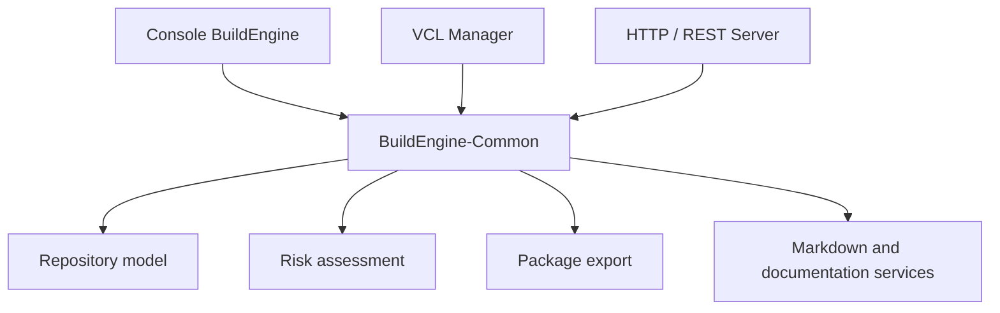
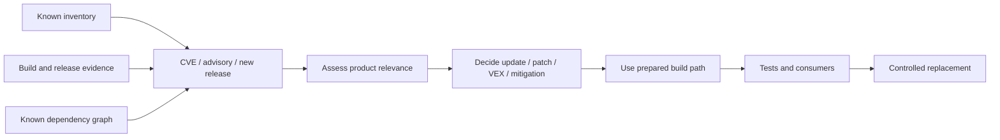

# C++ Back in the Future: BuildEngine and Staying Ahead of the Wave

BuildEngine began as a technical experiment around a simple but important question: **is C++Builder 13, with the modern BCC64X toolchain, again able to participate as a normal member of the contemporary C++ ecosystem?**

The project has grown far beyond that first question. It now connects compiler integration, reproducible third-party builds, package production, SBOMs, vulnerability monitoring, risk assessment, documentation, native UI, REST services, package distribution, and a shared C++ architecture.

The common idea behind all of those steps is what we now call **staying ahead of the wave**.

The wave is not one particular technology. It is the moment when a new compiler, a new upstream release, a security advisory, a customer request, a regulatory obligation, or a changed dependency suddenly turns information that should already be known into urgent work.

The objective is therefore not merely to react faster. It is to prepare the technical path before the event occurs.

## 1. C++ Back in the Future

The starting point predates BuildEngine itself. In our seminars and live sessions we used the phrase **C++ Back in the Future** to describe what we saw in C++Builder 13.

For many years C++Builder carried a historical burden in the perception of the wider C++ community. Even though it remained productive for substantial Windows applications, it was often seen as a separate ecosystem: a tool associated with older Borland compilers, special library ports, proprietary build mechanics, and an environment that modern open-source C++ projects did not naturally target.

C++Builder 13 changed the technical basis of that discussion. BCC64X is based on modern Clang/LLVM technology, uses the contemporary Win64 toolchain, supports C++23, produces COFF64 objects, and links with LLD. That does not automatically make every existing C or C++ project build without adaptation. No compiler can make that claim. But it changes the right question.

The question is no longer whether C++Builder has a completely separate C++ language world. The useful question is:

> **How much of the ordinary upstream C and C++ ecosystem can we build and use directly with BCC64X, and what exactly prevents integration when something fails?**

That distinction became the first mission of the project.

## 2. The integration proof

A few carefully chosen libraries would have been enough to demonstrate that BCC64X can compile modern C++. That was not enough for us.

A credible ecosystem test needs diversity. It has to cross different build systems, dependency models, API styles, language generations, code generators, Windows integration points, and runtime models.

We therefore worked through libraries from very different areas: parsing and data formats, compression and archives, TLS and networking, graphics and multimedia, testing, databases, computer vision, large C++ framework libraries, and distributed middleware. The growing set included projects such as pugiXML, zlib, libzip, libarchive, OpenSSL, curl, nlohmann/json, cmark-gfm, GoogleTest, SDL2, Skia, OpenCV, Boost, SQLite, raylib, and ACE/TAO.

The important result was not that every project "just compiled". In fact, the failures were often more useful than an immediate success.

They showed where the real boundaries were:

- historical compiler classification rather than missing C++ language capability;
- old CMake assumptions rather than invalid C++;
- Windows linker and import-library conventions;
- source branches written for old Borland or CodeGear compilers;
- dependency discovery;
- generated code;
- external SDK availability;
- build-system assumptions;
- or, sometimes, an actual source-level incompatibility.

The project deliberately does not hide such evidence behind another compiler. If BCC64X fails, silently replacing that path with MSVC would answer a different question. The integration proof only remains meaningful if BCC64X itself stays visible.

That proof has succeeded strongly enough to change the premise of the discussion: **C++Builder 13 can again be treated as a full member of the modern C++ family.** It can build and consume substantial contemporary open-source C and C++ software, including projects that exercise far more than a trivial compiler test.

## 3. From experiments to BuildEngine

At first, individual integrations naturally produce commands, scripts, local assumptions, and one-off fixes. That is useful during exploration, but it is not a sustainable result.

A successful build on one development machine answers only one question: *did it work here once?*

For production use we need stronger questions answered:

- Which exact source release or commit was used?
- Was the source verified?
- Which compiler and tools were used?
- Which dependencies were selected?
- Which patches were applied, and why?
- Which Release and Debug variants were created?
- Which files were installed and published?
- Which tests and independent consumers succeeded?
- Can the same state be recreated on another machine?

BuildEngine grew out of that need.

Instead of turning every library into a new hard-coded C++ workflow, the project increasingly moved knowledge into declarative XML contracts. The engine provides generic execution: repository synchronization, tool provisioning, source acquisition, dependency graphs, scheduler execution, state handling, package installation, smoke tests, documentation, metadata, and later security analysis.

The third-party library becomes data wherever possible. The engine remains infrastructure.

That separation matters because the project is not trying to create a private replacement ecosystem. The preferred route remains:

```text
upstream source
   -> upstream build system
   -> BCC64X
   -> verified install
   -> independent consumer evidence
```

## 4. BuildEngine was public from the beginning

BuildEngine was not developed as an invisible internal utility and only presented after completion. I showed and discussed its development in my streams from the beginning.

That was intentional. The project itself was part of the demonstration.

It was not enough to say that C++Builder could build open-source libraries. I wanted to show the complete process of using them: acquiring them, building them, testing them, installing them, inspecting them, updating them, and using their results in real C++Builder programs.

This also meant that design weaknesses became visible in public. Console output, scheduler behaviour, dependency handling, build-state errors, patches, warnings, and failed assumptions were not hidden behind a polished final demo. They became part of the engineering story.

That openness influenced the next stage of the project.

## 5. The console discussion changed the demonstration

BuildEngine was initially and naturally a console application. For a build orchestration system that is a perfectly reasonable technical interface. Command-line programs compose well, are scriptable, and make automation straightforward.

After we extended security monitoring and risk assessment, however, the console presentation became richer. The application could show libraries, findings, security information, assessments, parameters, and more detailed state.

That led to an interesting discussion: if the purpose of the project was to demonstrate a modern C++ environment, did an increasingly parameter-heavy console program itself reinforce the stereotype that C++ software looked like something from yesterday?

Technically, I disagree with the idea that a command line is obsolete. But the criticism was useful because it exposed another opportunity for the project.

If the claim is that modern C++Builder belongs in today's C++ world, then we should demonstrate more than compiler and build-system compatibility. We should also demonstrate that the same modern C++ core can support comfortable native desktop software and contemporary service interfaces.

## 6. A deliberate VCL application

The graphical BuildEngine manager therefore has a specific role in the story.

I deliberately wanted to place **C++Builder and the VCL** here.

The VCL is one of C++Builder's distinctive strengths: native Windows applications can combine modern C++ logic with a mature productive UI framework. The manager is therefore not an apology for the console and not a replacement for automation. It is a second presentation surface over the same technical model.

The user can work with library selections, build variants, status, output, security information, and other BuildEngine functions through a conventional Windows application instead of reconstructing the state from command-line parameters.

This demonstrates an important point: modern C++ and productive native UI development are not competing ideas.

## 7. Why add a server to a C++ build tool?

The server began from another part of the same argument.

C++ is often less visible today because many developers work primarily in higher-level languages. That can create the impression that C and C++ have become peripheral technologies. In reality, large parts of the computing stack still depend on native C and C++ libraries beneath higher-level interfaces: TLS, compression, databases, graphics, media processing, language runtimes, operating-system interfaces, and many other foundational components.

Many of the libraries we were building with BCC64X are examples of exactly that layer.

The BuildEngine server therefore became another demonstration: **the same C++ code that builds those native components can also expose their state through contemporary web and REST interfaces.**

The server initially provided a local overview of the library repository and machine-readable result sets. It then grew naturally:

- library and version views;
- SBOM access;
- dependency and reverse-usage information;
- security findings and risk assessment;
- REST-style JSON resources;
- package creation and download;
- generated library documentation;
- and direct rendering of the project's Markdown documentation.

The result is no longer merely a status page. The server has become a read-only presentation and distribution layer for the BuildEngine production tree.

## 8. Documentation as part of the running system

The Markdown integration extended that idea again.

Documentation should not be a detached collection of files that happens to describe the system. The manually maintained BuildEngine documents live in the synchronized administration repository and are rendered directly by the running server. Markdown is parsed on request, while optional browser capabilities such as syntax highlighting, Mermaid diagrams, and mathematical notation are loaded only where needed.

Generated library documentation remains available beside those project documents.

This gives the server a central documentation role:

```text
BuildEngine Server
   |
   +-- project documentation
   +-- generated library documentation
   +-- package and version information
   +-- SBOMs
   +-- risk/security views
   +-- REST/JSON resources
   `-- package download
```

Documentation, evidence, software inventory, and distributable artifacts are therefore presented from the same production state instead of living in unrelated places.

## 9. One model, several front ends

Once console, VCL application, and web server all existed, another architectural consequence became unavoidable.

They must not each implement their own version of the truth.

Risk assessment is a good example. A vulnerability finding must not be interpreted one way in the console, another way in the manager, and a third way in the REST server. The same is true for repository access, package information, usage relationships, Markdown rendering, and other shared functions.

This led to the expansion of **BuildEngine-Common** as a shared DLL.



The presentation changes, but the interpretation does not.

That is a small architectural decision with a large practical effect. It allows the project to demonstrate different C++Builder application styles without fragmenting the underlying engineering model.

## 10. The second story: staying ahead of the wave

While the integration proof was growing, another purpose of BuildEngine became increasingly important.

My first practical encounter with this topic did not begin with the Cyber Resilience Act. It came through **DORA-related discussions** around one of our long-lived financial-sector systems.

A regulatory assessment in the customer's environment led to extensive discussion about criticality, dependencies, responsibilities, and the technical evidence that could be produced. What struck me was not that security and operational resilience were unimportant. Quite the opposite. The frustrating part was how much highly qualified engineering time can be consumed when technical facts have to be reconstructed after the question has already become urgent.

Which third-party component is actually used? Which version? Where did it come from? Which runtime DLL is shipped? Which features were enabled? Who is responsible for updates? Can the new release still be built? What needs to be retested?

Those are engineering questions. They should not first be asked in a crisis meeting.

That experience became one of the reasons for the principle we now describe as **staying ahead of the wave**.

## 11. What is the wave?

The wave is the combination of events that can turn an unmanaged dependency into urgent work:

- a new CVE;
- active exploitation;
- a security advisory;
- a changed regulatory expectation;
- a customer question;
- an upstream release;
- an end-of-support decision;
- or a newly discovered dependency.

Staying ahead of it means that the organisation already knows enough to make a decision when the signal arrives.



The difference is fundamental. A reactive organisation starts with discovery. A prepared organisation starts with assessment.

## 12. SBOM: essential, but not the architecture

A Software Bill of Materials is an important part of this model because it answers the inventory question in a machine-readable form. But the SBOM is not the complete architecture of software-supply-chain management.

A component name and version alone do not tell us:

- the exact source state;
- the build profile;
- enabled and disabled features;
- applied patches;
- compiler and runtime assumptions;
- dependency decisions;
- verification results;
- installation layout;
- or the prepared replacement route.

For BuildEngine, the stronger source of truth is the versioned build and library metadata together with the technical evidence produced from it. The SBOM is an important **derived control and interchange artifact**.

That direction of information flow matters:

```text
versioned metadata + source provenance + build contract + evidence
                         |
                         +--> packages
                         +--> SBOM
                         +--> documentation
                         +--> security identity
                         +--> dependency views
                         `--> reproducible replacement
```

This reflects a principle I have followed since the 1990s: information that can be represented structurally should not be copied manually into multiple documents. The structure should become an active source from which dependent artifacts can be produced and checked.

## 13. DORA, NIS2, and the Cyber Resilience Act

The regulatory environment makes this engineering direction more relevant, not less.

DORA brought the topic into our practical work through the financial-sector context. NIS2 places strong emphasis on cybersecurity risk management and supply-chain security for affected organisations. The Cyber Resilience Act goes further for products with digital elements by placing explicit lifecycle, vulnerability-handling, documentation, and third-party-component responsibilities on manufacturers.

The exact legal applicability must always be assessed for the concrete organisation and product. BuildEngine is not a legal-compliance engine.

But the technical lesson is independent of that legal classification:

> **Product responsibility is difficult to exercise if component knowledge and replacement capability have to be reconstructed only after a problem appears.**

A manufacturer or development organisation that already knows its software inventory, provenance, build conditions, dependencies, tests, and update path is in a fundamentally better position than one that has only a binary artifact and an old release note.

## 14. Scanners are controls, not the steering wheel

This is not an argument against vulnerability scanners, SBOM scanners, binary scanners, OSV, NVD, EUVD, or similar sources. They are essential controls.

They can reveal that:

- a new vulnerability has been published;
- a shipped artifact contains something unexpected;
- declared and actual component state differ;
- an upstream package now has a fix;
- or a dependency needs investigation.

But a scanner usually operates **after a component has already been selected, built, or shipped**. It can make the problem visible. It cannot by itself create the missing build contract, reconstruct provenance, recover an undocumented patch, or prove that an updated version still works in the product.

That is why I describe scanners as **rear-view mirrors, not the steering wheel**.

The preferable sequence is:

1. Know what is being integrated before integration.
2. Record version, provenance, dependencies, build profile, license information, and relevant configuration structurally.
3. Build and verify it reproducibly.
4. Keep the resulting package and evidence identifiable.
5. Use scanners and vulnerability databases as independent checks against that intended state.
6. When a signal appears, assess relevance and use an already prepared replacement path.

The scanner then answers a much better question than *"What do we actually have?"*

It can answer: **"Is what we deliberately manage still safe, and does the shipped reality still match our declared state?"**

## 15. From vulnerability finding to decision

The security monitor is evolving in exactly that direction.

A useful monitor should not stop at `AFFECTED`. It should help structure the next engineering decision:

```text
current version
   -> findings
   -> affected feature / build relevance
   -> fixed release or upstream fix
   -> candidate availability
   -> candidate vulnerability comparison
   -> rebuild path
   -> tests and consumer evidence
   -> package / release decision
```

This is also where VEX becomes important. A database match is not automatically proof that the concrete product is exploitable. Build configuration, selected backend, compiled features, runtime dependencies, and actual code paths matter.

The objective is therefore neither to suppress findings nor to turn every CVE into an emergency. It is to make the assessment explicit and evidence-based.

## 16. Speed is created by preparation

Regulation, security review, and supply-chain management are often described as forces that make software development slower.

I think that conclusion confuses documentation after the event with engineering preparation before the event.

If a new library version requires days of research because nobody knows how the old one was built, security work is slow.

If version, source, patches, dependencies, build parameters, package layout, tests, and consumers are already known, an update is not a new research project. It is another execution of a controlled process.

That is the same engineering attitude behind an answer I gave decades ago when asked about the difference between our highly productive IDV group and the traditional EDV organisation:

> **"While the others are still thinking about and discussing a problem, we have already solved it."**

The sentence was deliberately provocative. The real principle was never to skip analysis. It was to build structures in which a sound decision can be implemented and verified quickly.

That is what **staying ahead of the wave** means in BuildEngine.

## 17. One project, two proofs

Looking back, BuildEngine now provides two connected proofs.

The first is technical and directly about C++Builder:

> **C++Builder 13 and BCC64X are again capable of participating credibly in the modern C and C++ ecosystem.**

The breadth of successfully built and consumed open-source libraries demonstrates that this is not a claim based on one carefully prepared example. C++Builder can work with contemporary upstream code, modern build systems, C++23 consumers, large dependency graphs, networking, graphics, TLS, databases, and middleware.

That is the practical meaning of **C++ Back in the Future**: not nostalgia for an old tool, but a modern toolchain reconnecting with the wider C++ family.

The second proof is organisational:

> **Knowing how to build a dependency is part of knowing how to own it.**

BuildEngine turns component integration into a repeatable technical state: source, provenance, build, tests, package, SBOM, documentation, security identity, risk view, and replacement path become connected rather than separate after-the-fact activities.

## 18. The project is still evolving

None of this makes the project finished.

The library set continues to grow. Security monitoring and assessment will become richer. Package and server functions will evolve. The VCL manager will expose more of the same common model. Documentation will continue to change as the implementation changes.

That is intentional.

The goal is not a frozen showcase. The goal is a working system that continues to test the central ideas under real change:

- modern C++Builder as part of the wider C++ ecosystem;
- upstream-first third-party integration;
- reproducible evidence instead of one-off success;
- shared C++ domain logic across console, native UI, and web interfaces;
- metadata before manual reconstruction;
- SBOM and scanners as strong controls;
- and a prepared technical replacement path before the next wave arrives.

**C++ is back in the future. The next step is to stay ahead of it.**
