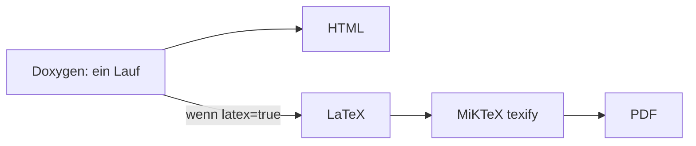

# BuildEngine-Werkzeugübersicht

Diese Seite beschreibt die aktuell von BuildEngine verwendeten Werkzeuge und ihre Rolle. Die deklarative Quelle ist `admin/build-tools.xml`; Details des XML-Vertrags stehen in [build-tools.md](build-tools.md).

Die Liste trennt bewusst zwischen **BuildEngine-Werkzeugen**, **C++Builder/BCC64X-Werkzeugen**, **Dokumentationswerkzeugen** und **Browser-Ressourcen**. Ein Eintrag hier ersetzt nicht den technischen Vertrag in `build-tools.xml`.

## Allgemeine Build- und Quellwerkzeuge

| Tool-ID | Version | Bereitstellung | Rolle |
| --- | --- | --- | --- |
| `git` | 2.55.0.3 / Runtime 2.55.0.windows.3 | managed | Repository-Synchronisation, Source-/Patch-bezogene Git-Operationen und Admin-Repository. |
| `cmake` | 4.1.1 | discover | CMake-Konfiguration, Build und Installation für CMake-basierte Projekte. |
| `ninja` | 1.13.2 | managed | Paralleler Buildtreiber für CMake/Meson und andere Ninja-Projekte. |
| `perl` | 5.42.2.1 / Runtime 5.42.2 | managed | Perl-basierte Configure-/Buildsysteme, u. a. OpenSSL-/ACE-/TAO-nahe Workflows. |
| `python` | 3.14.7 | managed | Python-basierte Buildtools und Launcher, z. B. Meson. |
| `meson` | 1.12.0 | managed, via Python | Meson-basierte Projekte. |
| `winflexbison` | 2.5.24 | managed | Flex/Bison-kompatible Generatoren für Windows. Version 2.5.25 wird wegen der bekannten parallelen Temp-Datei-Race nicht verwendet. |
| `pkg-config` | 0.28-1 / Runtime 0.28 | managed | pkg-config-kompatible Paket-/Compilerflag-Auflösung für Projekte, die diese Schnittstelle erwarten. |
| `nasm` | 3.02 | managed | NASM-Assembler für Bibliotheken, die x86-64-Assemblerquellen verwenden. |

## C++Builder-/BCC64X-Werkzeuge

Diese Einträge gehören zum eigentlichen C++Builder-13/BCC64X-Zielpfad. Sie sind keine austauschbaren Alternativen zu MSVC.

| Tool-ID | Version | Bereitstellung | Rolle |
| --- | --- | --- | --- |
| `bcc64x` | 20.1.7 | BDS | C/C++-Compiler des C++Builder-13-Toolchains. |
| `embarcadero-make` | 5.43 | BDS | Embarcadero Make für Projekte/Generatoren, die diesen Treiber benötigen. |
| `llvm-ar` | 20.1.7 | BDS | LLVM-Archiver aus dem BCC64X-Toolchain. |
| `llvm-ranlib` | 20.1.7 | BDS | Indexierung statischer Archive. |
| `ld-lld` | 20.1.7 | BDS | LLVM-Linker-Komponente des Toolchains. |
| `bcc64x-windres` | 20.1.7 | BDS | Ressourcenwerkzeug im BCC64X-Pfad. |
| `tdump` | RAD Studio 13 | discover/BDS | Untersuchung von PE-/Objekt-/Importinformationen während Diagnose und Validierung. |
| `windows-rc` | Windows SDK | discover | Microsoft Windows Resource Compiler `rc.exe` für RC/RES-Erzeugung, sofern ein Projekt ihn benötigt. |
| `bcc64x-ucrt-compat` | 20.1.7-compat1 | generated | Von BuildEngine erzeugtes kleines Kompatibilitätsarchiv aus ausgewählten UCRT-Objekten für BCC64X-Kompatibilitätsfälle. |
| `llvm-cov` | 20.1.7 | managed | LLVM Coverage-Auswertung. Das Paket dient der Tool-Funktion; es ändert nicht den BCC64X-Compilerpfad. |

## Dokumentationswerkzeuge

| Tool-ID | Version | Bereitstellung | Rolle |
| --- | --- | --- | --- |
| `doxygen` | 1.18.0 | managed | API-Dokumentation. Erzeugt HTML und bei effektivem `latex=true` **im selben Lauf zusätzlich LaTeX**. |
| `graphviz` | 15.1.1 | managed | Doxygen-Diagramme: Klassen-, Include-, Collaboration-, Hierarchie- und Verzeichnisgraphen. |
| `miktex` | 25.12 | managed, `when-used` | Kompiliert den von Doxygen erzeugten LaTeX-Baum mit `texify` zu PDF. Es gibt dafür keinen zweiten Doxygen-Lauf. |

Der Dokumentationsfluss lautet:

Details zu `WithDoxygen`, `WithLatex`, Library-Overrides und den technischen States stehen in [documentation.md](documentation.md).

## Browser- und Markdown-Ressourcen

Diese Werkzeuge werden vom BuildEngine Server lokal bereitgestellt; externe CDNs sind für die Darstellung nicht notwendig.

| Tool-ID | Version | Rolle |
| --- | --- | --- |
| `web-mermaid` | 11.17.2 | Mermaid-Diagramme in Markdown-/Serverseiten. |
| `web-highlight` | 11.12.0 | Syntax-Highlighting für Codeblöcke. |
| `web-mathjax` | 3.2.2 | MathJax-3-Ausgabe für Formeln, einschließlich Doxygen-HTML über den stabilen `/js/mathjax/...`-Pfad. |

Markdown selbst wird serverseitig durch die installierte `cmark-gfm`-Library gerendert. `cmark-gfm` ist eine verwaltete Library aus `build-libraries.xml` und deshalb kein `<tool>`-Eintrag in `build-tools.xml`.

## Systemwerkzeuge und interne Infrastruktur

Neben den expliziten Tool-IDs nutzt BuildEngine an einzelnen Stellen vorhandene Systemkomponenten:

- **Windows PowerShell**: für deklarativ konfigurierte Installations-/Extraktionsskripte einiger Managed Tools.
- **libarchive**: als in BuildEngine eingebundene Bibliothek für Archivextraktion; kein separates externes Kommandozeilentool.
- **Windows SDK**: Quelle für `rc.exe`, über `windows-rc` deklarativ entdeckt.

Solche Abhängigkeiten sollen, soweit sie für Reproduzierbarkeit relevant sind, über den Vertrag oder die BuildEngine-Binärabhängigkeiten nachvollziehbar bleiben.

## Tool-Bereitstellungsarten

| Art | Bedeutung |
| --- | --- |
| `managed` | BuildEngine lädt, prüft und installiert/extrahiert das Werkzeug unter `toolsRoot`. |
| `generated` | BuildEngine erzeugt den Tool-Eintrag aus bereits verfügbaren Quellen. |
| `bds` | Werkzeug ist Bestandteil der C++Builder-/RAD-Studio-Installation. |
| `discover` | Werkzeug wird an deklarativ bekannten Pfaden bzw. optional über PATH gesucht. |

## `always` und `when-used`

Die meisten Grundwerkzeuge sind `required="always"`.

`miktex` ist dagegen bewusst `required="when-used"`: es wird nur provisioniert, wenn die effektive Dokumentationskonfiguration mindestens einer Library PDF-Ausgabe verlangt.

Das verhindert unnötige Toolinstallation auf Maschinen, die nur HTML-Dokumentation bauen.

## Pflegegrundsatz

Bei jeder Änderung von `admin/build-tools.xml` wird diese Seite mitgepflegt:

- neue Tool-ID → hier aufnehmen,
- Tool entfernen → hier entfernen,
- Versionswechsel → Version aktualisieren,
- Rollen-/Bereitstellungsänderung → Beschreibung aktualisieren,
- neue Tool-Kategorie → Struktur dieser Seite entsprechend erweitern.

Die XML-Semantik selbst wird parallel in [build-tools.md](build-tools.md) gepflegt.
