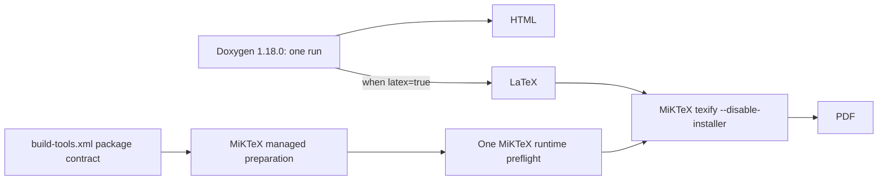

# BuildEngine Tool Overview

[TOC|Content]

This page describes the tools currently used by BuildEngine and their roles. The declarative source is `admin/build-tools.xml`; details of the XML contract are documented in [build-tools.md](build-tools.md).

The list deliberately separates **general BuildEngine tools**, **C++Builder/BCC64X tools**, **documentation tools**, and **browser resources**. An entry on this page does not replace the technical contract in `build-tools.xml`.

## General build and source tools

| Tool ID | Version | Provisioning | Role |
| --- | --- | --- | --- |
| `git` | 2.55.0.3 / Runtime 2.55.0.windows.3 | managed | Repository synchronization, source-/patch-related Git operations, and Admin repository handling. |
| `cmake` | 4.1.1 | discover | CMake configuration, build, and installation for CMake-based projects. |
| `ninja` | 1.13.2 | managed | Parallel build driver for CMake/Meson and other Ninja projects. |
| `perl` | 5.42.2.1 / Runtime 5.42.2 | managed | Perl-based configure/build systems, including OpenSSL- and ACE/TAO-related workflows. |
| `python` | 3.14.7 | managed | Python-based build tools and launchers, for example Meson. |
| `meson` | 1.12.0 | managed, via Python | Meson-based projects. |
| `winflexbison` | 2.5.24 | managed | Flex/Bison-compatible generators for Windows. Version 2.5.25 is intentionally not used because of the known parallel temporary-file race. |
| `pkg-config` | 0.28-1 / Runtime 0.28 | managed | pkg-config-compatible package/compiler-flag resolution for projects that expect this interface. |
| `nasm` | 3.02 | managed | NASM assembler for libraries using x86-64 assembly sources. |

## C++Builder / BCC64X tools

These entries belong to the actual C++Builder 13 / BCC64X target path. They are not interchangeable alternatives to MSVC.

| Tool ID | Version | Provisioning | Role |
| --- | --- | --- | --- |
| `bcc64x` | 20.1.7 | BDS | C/C++ compiler of the C++Builder 13 toolchain. |
| `embarcadero-make` | 5.43 | BDS | Embarcadero Make for projects/generators that require this driver. |
| `llvm-ar` | 20.1.7 | BDS | LLVM archiver from the BCC64X toolchain. |
| `llvm-ranlib` | 20.1.7 | BDS | Static-archive indexing. |
| `ld-lld` | 20.1.7 | BDS | LLVM linker component of the toolchain. |
| `bcc64x-windres` | 20.1.7 | BDS | Resource tool in the BCC64X path. |
| `tdump` | RAD Studio 13 | discover/BDS | Inspection of PE/object/import information during diagnosis and validation. |
| `windows-rc` | Windows SDK | discover | Microsoft Windows Resource Compiler `rc.exe` for RC/RES generation when required by a project. |
| `bcc64x-ucrt-compat` | 20.1.7-compat1 | generated | Small compatibility archive generated by BuildEngine from selected UCRT objects for BCC64X compatibility cases. |
| `llvm-cov` | 20.1.7 | managed | LLVM coverage evaluation. This package supplies the tool function; it does not change the BCC64X compiler path. |

## Documentation tools

| Tool ID | Version | Provisioning | Role |
| --- | --- | --- | --- |
| `doxygen` | 1.18.0 | managed | API documentation. Produces HTML and, when `latex=true` is effective, **additional LaTeX in the same run**. |
| `graphviz` | 15.1.1 | managed | Doxygen diagrams: class, include, collaboration, hierarchy, and directory graphs. |
| `miktex` | 25.12 | managed portable, `when-used` | Isolated portable MiKTeX below `toolsRoot`; its managed preparation installs and verifies the explicit Doxygen 1.18.0 LaTeX package contract before PDF compilation. |

The documentation flow is:

MiKTeX uses the managed root `miktex\25.12-portable`. Portable mode and `--no-additional-roots` prevent BuildEngine from inheriting an unrelated MiKTeX installation from the Windows user profile. Managed preparation runs in the same isolated process environment, updates the MiKTeX package database, records that an update check was performed, installs the package set required by the pinned Doxygen 1.18.0 LaTeX templates, verifies the declared packages, and refreshes the MiKTeX FNDB.

The preparation contract is idempotent. BuildEngine writes a marker below the managed MiKTeX root containing the resolved preparation contract. If the marker and contract are unchanged, the package preparation is not repeated. Changing the Doxygen-bound package list or preparation commands invalidates the marker contract and performs preparation again.

The package set is intentionally prepared before the library PDF jobs. Those jobs continue to run with `--disable-installer`; a missing TeX package is therefore a visible provisioning-contract failure rather than an implicit download during a parallel build. One shared runtime preflight initializes mutable format state such as `pdflatex.fmt` before independent library PDF jobs are allowed to run in parallel.

The currently declared package surface represents the default Doxygen 1.18.0 PDFLaTeX path used by this project. Language-specific Doxygen translator packages are not implicitly added unless the documentation contract starts using such a language and the package contract is extended accordingly.

Details about `WithDoxygen`, `WithLatex`, library overrides, provisioning, and technical states are documented in [documentation.md](documentation.md) and [build-tools.md](build-tools.md).

## Browser and Markdown resources

These resources are served locally by BuildEngine Server; external CDNs are not required for presentation.

| Tool ID | Version | Role |
| --- | --- | --- |
| `web-mermaid` | 11.17.2 | Mermaid diagrams in Markdown/server pages. |
| `web-highlight` | 11.12.0 | Syntax highlighting for code blocks. |
| `web-mathjax` | 3.2.2 | MathJax 3 output for formulas, including Doxygen HTML through the stable `/js/mathjax/...` path. |

Markdown itself is rendered server-side by the installed `cmark-gfm` library. `cmark-gfm` is a managed library from `build-libraries.xml` and therefore is not a `<tool>` entry in `build-tools.xml`.

## System tools and internal infrastructure

In addition to explicit tool IDs, BuildEngine uses existing system components in selected places:

- **Windows PowerShell**: for declaratively configured installation/extraction scripts of some managed tools.
- **libarchive**: linked into BuildEngine for archive extraction; it is not a separate external command-line tool.
- **Windows SDK**: source of `rc.exe`, discovered declaratively through `windows-rc`.

Dependencies that matter for reproducibility should remain visible through the contracts or through BuildEngine binary dependencies.

## Tool provisioning modes

| Mode | Meaning |
| --- | --- |
| `managed` | BuildEngine downloads, verifies, installs/extracts, and where declared prepares the tool below `toolsRoot`. |
| `generated` | BuildEngine creates the tool entry from already available sources. |
| `bds` | The tool is part of the C++Builder/RAD Studio installation. |
| `discover` | The tool is searched at declaratively known paths and optionally through `PATH`. |

## `always` and `when-used`

Most foundation tools are `required="always"`.

`miktex` is deliberately `required="when-used"`: it is provisioned and prepared only when the effective documentation configuration of at least one library requires PDF output.

This avoids unnecessary tool installation and package preparation on machines that build HTML documentation only.

## Maintenance rule

Every change to `admin/build-tools.xml` is reflected on this page:

- new tool ID → add it here,
- removed tool → remove it here,
- version change → update the version,
- changed role/provisioning/preparation → update the description,
- new tool category → extend this page accordingly.

The XML semantics are maintained in parallel in [build-tools.md](build-tools.md).
